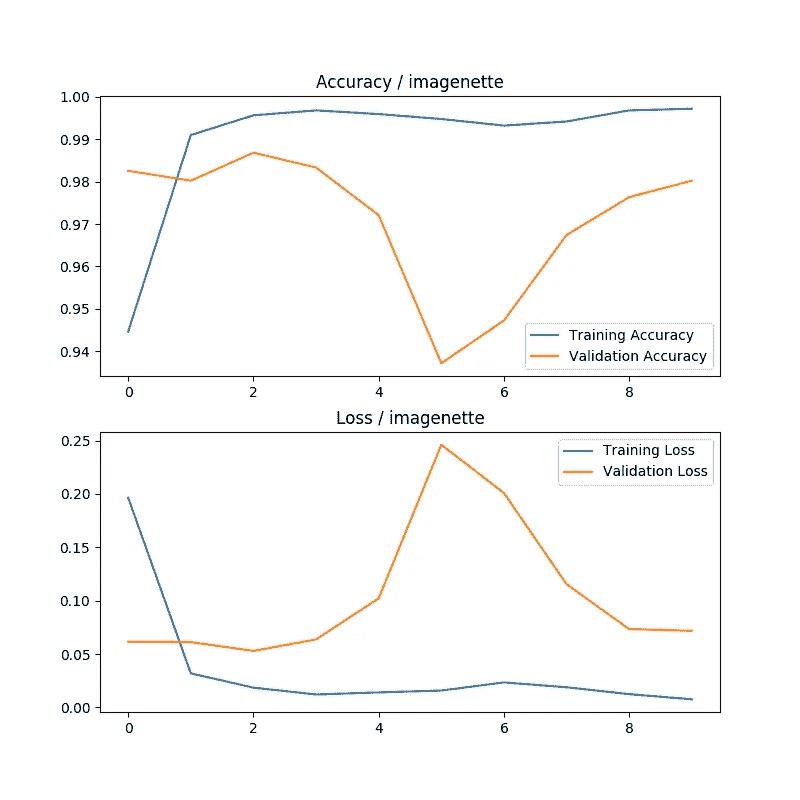
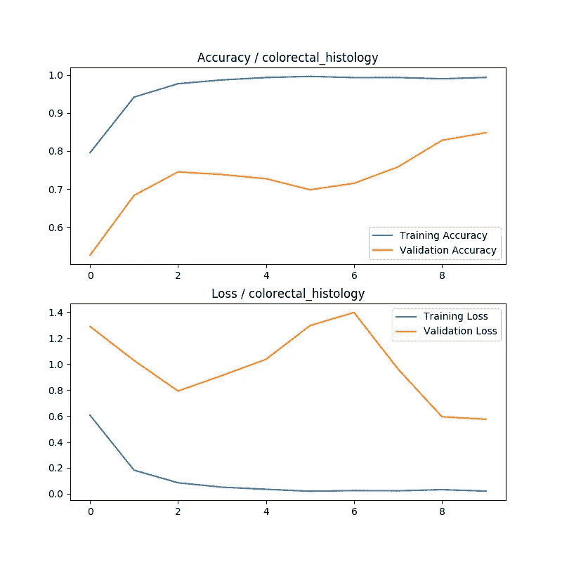
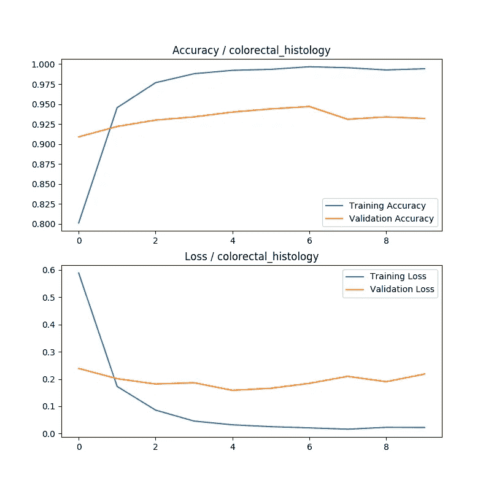
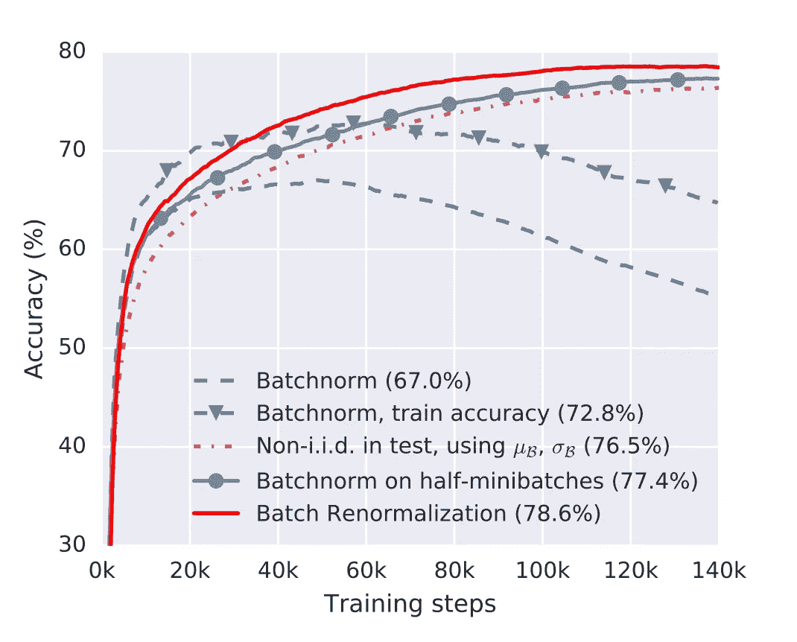

# 迁移学习的批处理方式

> 原文：<https://pub.towardsai.net/batchnorm-for-transfer-learning-df17d2897db6?source=collection_archive---------0----------------------->

## 让您的网络在 TensorFlow 2+中更快地学习

资料来源:Pexels

仍然有很多模型使用批量标准化图层。如果你想在这样的模型上进行迁移学习，你会遇到很多问题。微调 AlexNet 或 VGG 要容易得多，因为它们不包含批处理规范层。许多开发人员都很好奇为什么更现代的 CNN 架构不能像旧的架构一样运行良好。

我跑了好几次批定额层的问题。我以为是模型优化出了问题。然后我就找到了 Datumbox 关于 Keras 中[批次定额](https://blog.datumbox.com/the-batch-normalization-layer-of-keras-is-broken/)层坏掉的文章。问题是当层被冻结时，它在训练期间继续使用小批量统计。作者请求的拉动未被[合并](https://github.com/keras-team/keras/pull/9965)。然而，新的 TensorFlow 2 应该[在处理批处理规范层时表现得更好一点](https://github.com/tensorflow/tensorflow/blob/eda53c63dab8b364872ede8e423e4fed5d1686f7/tensorflow/python/keras/layers/normalization_v2.py#L26-L65)。有些人仍然对 TF2 的 *tf.keras.applications* 有[的问题](https://github.com/keras-team/keras/pull/9965#issuecomment-549126009)，需要向模型重新注入新的批量规范层。

其他人还在[疑惑](https://forums.fast.ai/t/transfer-learning-in-fast-ai-how-does-the-magic-work/55620/20)为什么他们的 TensorFlow 模型在微调他们的模型时比 PyTorch 差。默认的伽玛参数导致了 TF2 的一个常见问题。PyTorch 中的默认 gamma 参数是 0.9。但是在 TensorFlow 中是 **0.99** 。

**如果您在预训练的 imagenet 模型上进行迁移学习，并且:**，此数字不是最佳值

*   您的数据集来自不同于“Imagenet”的域
*   您的数据集只有几千幅图像
*   您使用的是小批量

**TF2 和 PyTorch 之间的另一个区别是当冻结/解冻预训练主干模型时，框架是如何表现的。**

# 冻结层时出现批次异常

如果你正在冻结预训练的主干模型，那么我推荐你看看 Keras 创建者 Franç ois Chollet 的这个 [**colab**](https://colab.research.google.com/drive/17vHSAj7no7RMdJ18MJomTf8twqw1suYC#scrollTo=-TwK3BeMO5FF) 页面。

设置 base_model(inputs，training=False)将使批范数层在训练期间停止更新不可训练的参数，这在冻结和解冻期间是至关重要的。**请注意，此设置不会冻结您的 base_model** 中的可训练重量。如果要冻结基础模型的可训练权重，则设置 base _ model.trainable = False。但是不要忘记首先调用 base_model(inputs，training=False ),因为 BatchNormalization 层包含不可训练的参数，即使 base _ model.trainable = False，这些参数仍在变化。只要看看 [colab](https://colab.research.google.com/drive/17vHSAj7no7RMdJ18MJomTf8twqw1suYC) 文件，就更有意义了！

# 让我们用动量做实验

让我们看看当你在模型中进行迁移学习时，动量参数是什么意思。我们将挑选两个数据集用于我们的实验" [**imagenette**](https://www.tensorflow.org/datasets/catalog/imagenette) "和" [**结肠直肠 _ 组织学**](https://www.tensorflow.org/datasets/catalog/colorectal_histology) **"**我们在这个实验中的模型是未冻结的，这意味着所有层/权重都是可训练的。

第一个数据集“ **imagenette，**”具有类似于 Imagenet 的图像。这就是为什么该模型可以很容易地拟合，因为它是在 Imagenet 上预先训练的。图像的 BatchNorm 统计类似于原始数据集。我们可以在下图中看到。这只是一个简单的例子，表明模型可以轻松实现几乎 100 %的准确性，因此忽略过度拟合:

如果我们将尝试拟合“**结肠直肠 _ 组织学，**”图看起来是这样的。

让我们应用此修复将批规范的参数从 0.99 更改为 0.9，这样层将学习得更快一些。我们将创建 BatchNorm 层，并将其注入到模型中。

用固定的 0.9 动量参数重新注入批规范层。

现在这种模式的学习看起来好多了:

# 小批量

一些项目和团队使用批量重整化[ [源](https://arxiv.org/pdf/1702.03275.pdf)层，而不是批量规格化。这项技术看起来非常有希望用于大型网络(对象检测等)，因为你不能使用大批量，因为你无法在 GPU 卡上安装更大的批量。**批量重正化**层实现为张量流批量规格化层中的参数'**重正化**'。该论文的作者用第一个 5000 步来拟合模型，其中参数 rmax = 1，dmax = 0(经典的批处理规范化)。经过这些初始步骤后，它们逐渐增加到 rmax =3 和 dmax = 5。你可以在 TensorFlow 2+中通过编写自己的**回调**来做到这一点。如果你想知道这种技术是如何工作的，那就去读原文吧。还有其他有前途的规范化技术，看起来比经典的 BatchNorm 更好，如**组规范化** [ [源](https://arxiv.org/pdf/1803.08494.pdf)。GroupNorm 在 TF Addons 库中实现。

批次重正化:减少批次标准化模型中的小批次依赖性[ [来源](https://arxiv.org/pdf/1702.03275.pdf)

# 综上

如果您的模型包含批处理规范化层，请注意它会在培训期间或在生产环境中部署时给您带来许多问题。要了解更多关于最佳实践的信息，我推荐一个很棒的 [fast.ai](https://www.fast.ai/) 课程和论坛。另见我们的[上一篇关于预处理层的文章](https://medium.com/@michallukac/preprocessing-layer-in-cnn-models-for-tf2-d471e61ddc2e)，它可以节省你很多时间。

从 Imagenet 上的预训练模型开始有时(例如，大多数医疗保健图片)不是最佳的，不同的[预训练](https://www.fast.ai/2020/01/13/self_supervised/)技术非常有意义。

米哈尔