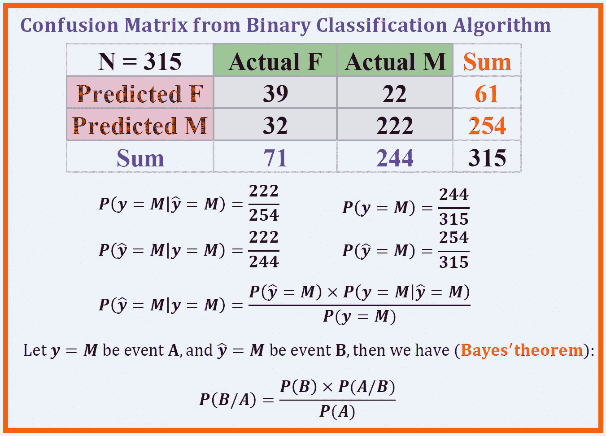
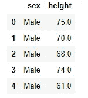
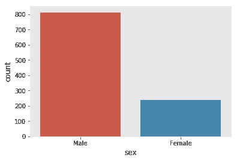
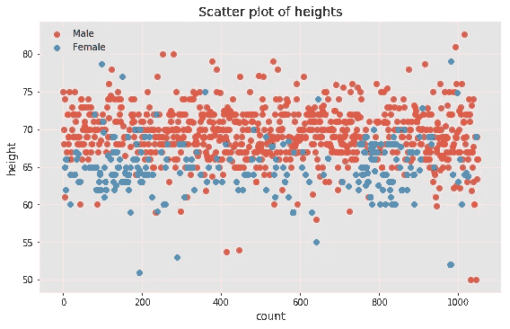
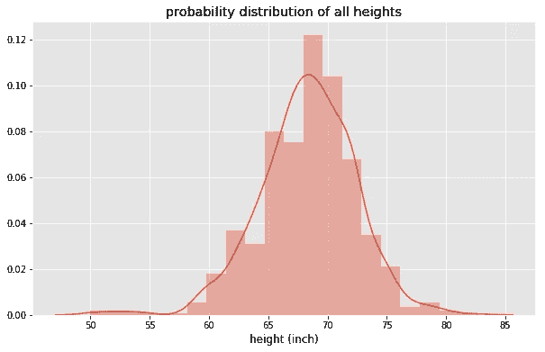
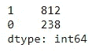
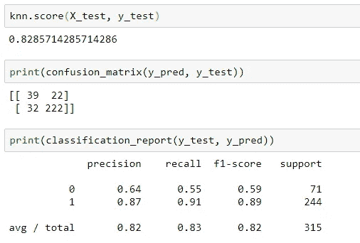

# 解释贝叶斯定理

> 原文：<https://pub.towardsai.net/bayes-theorem-explained-66ebf8285fcc?source=collection_archive---------0----------------------->



Benjamin O. Tayo 的图片。

## 数据科学

## 贝叶斯定理对于解释二元分类算法的结果至关重要，是有抱负的数据科学家必须知道的

# 一.导言

[贝叶斯定理](https://en.wikipedia.org/wiki/Bayes'_theorem)在二分类问题中起着重要的作用。它用于解释二进制分类算法的输出。在本文中，我们将使用 [***高度***](https://github.com/bot13956/Bayes_theorem) 数据集来演示贝叶斯定理。该数据集包含 1050 个个体(男性和女性)样本的身高。我们将建立一个机器学习模型来预测一个人的性别(男性或女性)，基于他们的身高。使用 male (M)作为测试的正值，将演示贝叶斯定理(如上图所示)。图中数量***P(y = M | y _ hat = M)***是预测值为男性(M)则实际值也为男性的条件概率。这也被称为***【PPV】***或 ***正精度*** ，假设男性(M)为正类，女性(F)为负类。同样，量***P(y _ hat = M | y = M)***是条件概率，如果实际值是男性，那么预测值也是男性。这也被称为****回忆*** 或 ***灵敏度*** 。我们将说明贝叶斯定理仅仅是****回忆*** 之间的关系。**

**虽然我们将集中在正类(M)上，但是对于负类(F)也可以建立类似的关系。在这种情况下， ***P(y = F| y_hat = F)*** 是条件概率，如果预测值是女性(F)，那么实际值也是女性。这也称为 ***阴性*** ***预测值(NPV)*** 或 ***阴性精度*** 为阴性测试。同样，量***P(y _ hat = F | y = F)***是条件概率，如果实际值是女性，那么预测值也是女性。这也被称为 ***阴性召回*或*特异性*** 为阴性检测 ***。*****

# **二。数据集的来源**

**[***高度***](https://github.com/bot13956/Bayes_theorem) 数据集包含在 R 的 dslabs 包中，并在 R Studio 中使用以下代码获得:**

```
**install.packages('dslabs')library(dslabs)write.csv(heights, "heights.csv", row.names = F)**
```

# **三。使用 Sklearn 的监督学习**

## **III A .导入必要的库**

```
**import numpy as npimport pandas as pdimport matplotlib.pyplot as pltimport seaborn as snsfrom sklearn import datasetsfrom sklearn.model_selection import train_test_splitfrom sklearn.neighbors import KNeighborsClassifierfrom sklearn.metrics import confusion_matrixfrom sklearn.metrics import classification_reportplt.style.use("ggplot")%matplotlib inline**
```

## **探索性数据分析**

```
**df=pd.read_csv("heights.csv")df.head()**
```

****

****表 1。数据集的头。****

```
**plt.figure()sns.countplot(x="sex", data=df)plt.show**
```

****

****图一。数据集的分布。N=1050: 812(男性)和 238(女性)身高。这表明我们有一个非常不平衡的数据集，男性身高占 77%，女性身高占 23%。****

```
**df2 = dfdf2['count'] = range(df.shape[0])sns.lmplot( x="count", y="height", data=df2, hue='sex', 
                  legend=False, fit_reg=False, aspect=1.6)plt.legend(loc='upper left')plt.title('Scatter plot of heights')plt.ylabel('height (inch)')plt.show()**
```

****

****图二。高度数据集的散点图。我们观察到数据集是不平衡的(77%是男性类，23%是女性类)。****

```
**plt.figure(figsize=(10,6))sns.distplot(df['height'],bins=20)plt.title('probability distribution of all heights')plt.xlabel('height (inch)')plt.show()**
```

****

****图三。所有身高的概率分布(男女)。****

```
**plt.figure(figsize=(10,6))sns.distplot(df[df.sex=='Male']['height'],bins=None, hist=False, label = 'Male')plt.title('probability distribution of Male and Female heights')sns.distplot(df[df.sex=='Female']['height'],bins=None, hist = False, label = 'Female')plt.legend()plt.xlabel('height (inch)')plt.show()**
```

****

****图 4。男女身高的概率分布。****

## **三. c .模型建立和评估**

**为简单起见，我们将使用 KNN 分类器。**

```
**from sklearn.preprocessing import LabelEncoderclass_le = LabelEncoder()y = class_le.fit_transform(df['sex'].values)pd.value_counts(y)**
```

****

****表二。显示 1 是男性(M)类，0 是女性(F)类。****

```
**X = df['height']X_train, X_test, y_train, y_test = train_test_split(X, y,   
                          test_size=0.3, random_state=0, stratify=y)X_train = X_train.values.reshape(X_train.shape[0],1)X_test = X_test.values.reshape(X_test.shape[0],1)knn = KNeighborsClassifier(n_neighbors=5)knn.fit(X_train, y_train)y_pred = knn.predict(X_test)**
```

****

****图 5。准确性评分和分类报告。****

## **贝叶斯定理**

**使用计算出的混淆矩阵可以建立贝叶斯定理，如下图所示:**

****

****图 6:使用二元分类算法的结果演示贝叶斯定理。****

## ****评论和意见:****

**在**图 6** 中，概率 **P(A/B) = 222/254 = 0.87** 称为 ***PPV*** 或 ***精度*** 。就是预测为男性身高的身高实际上是(真实的)男性身高的概率。概率 **P(B/A) = 222/244 = 0.91** 称为 ***召回*** 。它只是给出了 244 个实际男性身高中被我们的分类算法正确预测的百分比。我们看到贝叶斯定理简单来说就是 ***回忆*** 和 ***精度*** 之间的关系。**

**我们还观察到(从**图 5** )使用***【KNN . score(X _ test，y_test)*** 计算的模型的总体*精度为 **0.83** ，低于我们的 ***PPV*** 和 ***召回*** 值。分类报告(**见上图 5**)还显示，阴性类(雌性)的***【NPV】***为 **0.64** 。***

**这是意料之中的，因为与女性身高相比，该模型更倾向于预测男性身高。这是由于不平衡的数据集(数据集的 77%由男性阶层构成)。所以模型在预测男性身高方面做的很好(***【0.87 精度*** )，在预测女性身高方面做的不好( ***0.64 精度*** )。因此，总体精度( ***0.83*** )在这种情况下不是一个好的度量。相反，重要的是使用 ***PPV*** 用于正值(雄性)，使用 ***NPV*** 用于阴性测试(雌性)，因为数据集是不平衡的。**

# **四。总结和结论**

**总之，我们已经讨论了贝叶斯定理在解释二元分类算法的结果中的作用。贝叶斯定理是统计学中最重要的定理之一，因此有抱负的数据科学家完全理解该定理及其含义是值得的。本文的数据集和 Jupyter 笔记本可以从下面的链接下载:**

**[https://github.com/bot13956/Bayes_theorem](https://github.com/bot13956/Bayes_theorem)**

# **参考**

1.  **[贝叶斯定理维基百科页面](https://en.wikipedia.org/wiki/Bayes'_theorem)。**
2.  **https://github.com/bot13956/Bayes_theorem[。](https://github.com/bot13956/Bayes_theorem)**