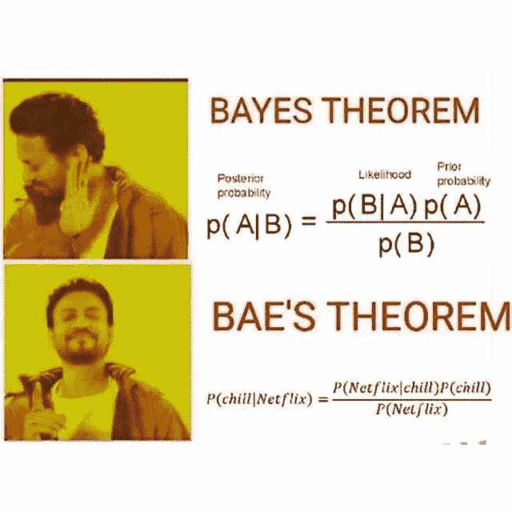
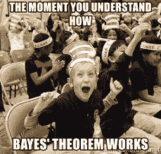

# 贝叶斯定理

> 原文：<https://pub.towardsai.net/bayes-theorem-for-bae-9451507b2884?source=collection_archive---------0----------------------->

## 概率与统计简介| [走向人工智能](https://towardsai.net)

## 向某人介绍概率论和统计学，但不要吓跑他们

[来源](https://picgarden.net/hashtag-instamath/)

贝叶斯定理让许多人困惑和沮丧，但并不像许多人说的那样糟糕。它被写成:

P(A|B) = P(B|A)*P(A)/P(B)，

其中 P(A)表示事件 A 发生的概率，P(A|B)表示给定事件 B 发生的情况下，事件 A 发生的概率(换句话说，知道 B 发生，A 也会发生的概率)。

虽然上图中给出的“Bae 定理”公式很傻，没有数学意义，并且接近 NSFW，但它*确实*有助于说明问题陈述是什么(这让很多人感到困惑，因为直觉上它似乎有点倒退)。鉴于网飞正在发生，人们会想知道“寒冷”的概率，而不是相反。诚然，等式的右边完全是胡说八道，但左边实际上是一个很好的记忆方法，特别是考虑到许多学生在学习数学时走神的部分原因是由于枯燥无味的演示。

这个定理本质上说:事件 A 给定事件 B 的概率等于 B 给定事件 A 的概率乘以事件 A 的概率除以 B 的概率。如果不一点一点地分解，这看起来非常复杂。解释(并了解其用途)的最佳方式是看一个例子(我直接从[大会](https://generalassemb.ly/)主持的 DSI 项目的实验室作业中获得):

*你在一家提供个人退休账户(IRA)的金融服务公司工作。为了锁定高潜在客户，您需要了解有孩子的人是否更有可能投资个人退休帐户。*

*到目前为止，您已经找到:*

*   30%的美国人有个人退休帐户。
*   一半的美国人有孩子。
*   有个人退休帐户的人中有三分之二有孩子。

根据这些信息，有孩子的人拥有个人退休帐户的概率有多大？

你可能(也可能没有)注意到，这个问题的框架就像贝耶定理等式的左边:给定事件 B(有孩子)，事件 A(有 IRA)的概率。请注意，一个“事件”不一定是一个活跃的事实；有时它只是代表拥有一种品质。如果我们将这个问题框定为符合贝叶斯定理的等式，并在右侧填入适当的值，我们会得到如下结果:

P(IRA | Child)= P(Child | IRA)* P(IRA)/P(Child)。

然后回到问题的设置:

30%的美国人都有个人退休帐户，这相当于说拥有个人退休帐户的概率是 30%，或者 P(IRA) = 0.3

*一半美国人有孩子*等于说有孩子的概率是 1/2，或者 P(孩子)= 0.5

*有个人退休账户的人中有三分之二有孩子*这就等于说，假设这个人有个人退休账户，那么他有孩子的概率是 2/3，或者 P(Child|IRA) = 0.666

因此，最终，在某种程度上先进的逻辑解释之后，事情的数学结局是相当简单的代数插件 n' chug:

p(IRA | Child)=(0.666 * 0.3)/0.5 = 0.4

因此，有孩子的人有 40%的可能性有个人退休帐户。

你跟上了吗？恭喜你！你现在理解了统计学中的一个概念，这个概念让大多数数据科学家感到困惑。对于那些天生不喜欢数学的人来说，数学可能是一种令人生畏和不愉快的经历，但是当你揭开它的神秘面纱并将其分解成各个组成部分时，大多数人甚至可以掌握高级概念。