# Python 熊猫中从零开始的贝叶斯分类算法

> 原文：<https://pub.towardsai.net/bayesian-classification-algorithm-from-scratch-in-python-pandas-f573c3376088?source=collection_archive---------1----------------------->


[JESHOOTS.COM](https://unsplash.com/@jeshoots?utm_source=unsplash&utm_medium=referral&utm_content=creditCopyText)在 [Unsplash](https://unsplash.com/s/photos/mathematics?utm_source=unsplash&utm_medium=referral&utm_content=creditCopyText) 上拍照

# 目录:

理解贝叶斯分类器的工作原理

二。预处理您的数据

*   使用训练数据计算数据集中每个要素朝向目标变量类的条件概率。
*   使用训练数据计算先验概率

三。应用于您的测试数据

*   给定行上的属性值，使用先验概率乘以类的条件概率来计算类得分
*   使用最高分数预测班级

四。计算结果

## I .了解贝叶斯分类器的工作原理

[朴素贝叶斯，解释得很清楚！！！— YouTube](https://www.youtube.com/watch?v=O2L2Uv9pdDA&t=550s)

请观看上述视频并订阅 Josh Stramer 的 Statquest 频道，以便了解贝叶斯分类背后的统计数据。这也将在我下面的代码中解释。

这篇文章不是关于文本分类的。事实上，本文中构建的分类器将处理连续变量。

## 二。预处理您的数据

对于我的工作，我使用谷歌协作来编码。但是，您可以使用任何您选择的 Python Ide 或 Jupyter 笔记本。

首先，我导入熊猫，然后在我的代码中加入 iris CSV:

```
import pandas as pddf = pd.read_csv(r'/content/iris.csv')
```

接下来，我将把数据分成两个数据帧。您在下面看到的是，80%的总行数将被

```
#seperate train test)df_train = df.sample(frac=0.8, random_state=1)df_test=df.drop(df_train.index)df.head()
```

df.head 将允许您查看 iris 数据的前五行以及列:

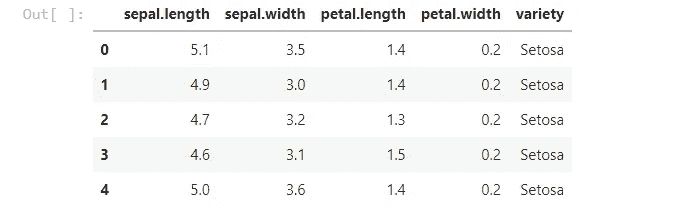

如您所见，iris 数据集包含四列:

1 —萼片长度

2-萼片宽度

3-花瓣长度

4-花瓣宽度

注意，所有这些都是连续的数值变量。它们在本质上不是绝对的，比如单词。

让我们继续将这些离散化成桶。对于该算法，我们将使用四个桶:

```
*#set 4 buckets for each column in train set*
df_train['quantile_SL_Disc'] **=** pd**.**qcut(df['sepal.length'], q**=**4,labels**=None**, precision**=**2)
df_train['quantile_SW_Disc'] **=** pd**.**qcut(df['sepal.width'], q**=**4,labels**=None**,precision**=**2)
df_train['quantile_PL_Disc'] **=** pd**.**qcut(df['petal.length'], q**=**4,labels**=None**,precision**=**2)
df_train['quantile_PW_Disc2'] **=** pd**.**qcut(df['petal.width'], q**=**4,labels**=None**,precision**=**2)
```

让我们分解上面的一行代码，看看发生了什么:

```
df_train['quantile_SL_Disc'] **=** pd**.**qcut(df['sepal.length'], q**=**4,labels**=None**, precision**=**2)
```

这是怎么回事？嗯，在等号的左侧，我在训练数据帧中创建了一个名为“quantile_SL_Disc”的列。

> 分位数 _SL_Disc 是离散化分位数萼片长度的缩写。

在右边，我们通过使用 pd.qcut(开始应用方法 qcut。

qcut 是 pandas 中的一种方法，允许您通过传递参数 q 来设置桶的数量。您可以键入标签名称，还可以设置桶边框中的小数精度。

> 在这种情况下，我设置 q=4，因此它会给我四个桶，在第 25、50、75 个百分比截止。

如上所示(再一次在下图中)，我对所有四列都这样做了:

**注意:我必须对其中一列使用 quantile_PW_Disc2，因为我稍后必须对该列进行少量的数据清理。**

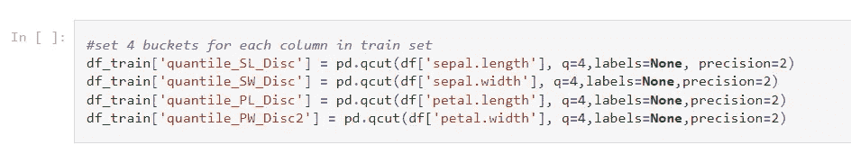

这是它看起来的样子。正如您在 quantile_PW_Disc2 中看到的，我们看到一个. 090000…的数字，它大于我们选择的两个精度。这是一个 bug，这就是为什么我在最后用 2 来命名这个列，这样我可以清理它。

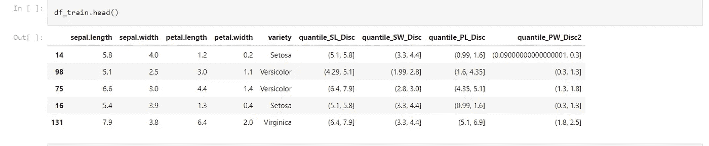

现在，我们有了上面的内容，让我们使用正则表达式将 qcut 范围分为低部分和高部分，用于所有四个 qcut:

```
*#split the quantile low high into two parts* 
df_train[['SL_low','SL_high']] **=** df_train['quantile_SL_Disc']**.**astype(str)**.**str**.**split(',',expand**=True**)
df_train[['SW_low','SW_high']] **=** df_train['quantile_SW_Disc']**.**astype(str)**.**str**.**split(',',expand**=True**)
df_train[['PL_low','PL_high']] **=** df_train['quantile_PL_Disc']**.**astype(str)**.**str**.**split(',',expand**=True**)
df_train[['PW_low','PW_high']] **=** df_train['quantile_PW_Disc2']**.**astype(str)**.**str**.**split(',',expand**=True**)
```

好了，让我们创建一个 PW_low_2 列，正则表达式去掉除小数点后前两位以外的所有数字。

```
df_train['PW_low_2']**=**df_train['PW_low']**.**str[:5]
```

现在让我们将低位和高位一起放回 quantile_PW_Disc:

```
df_train['quantile_PW_Disc']**=**df_train['PW_low_2']**+**df_train['PW_high']
```

让我们通过键入以下命令来看看这将是什么样子:

```
df_train**.**head()
```

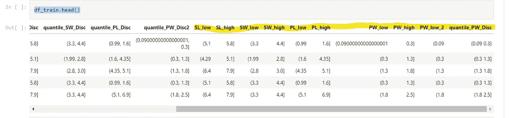

正如你所看到的，我们把柱子分成了高低两部分。

现在我们需要更多的正则表达式来去掉括号:

```
df_train['SL_low']**=**df_train['SL_low']**.**str**.**replace('(','')
df_train['SL_high']**=**df_train['SL_high']**.**str**.**replace(']','')
df_train['SW_low']**=**df_train['SW_low']**.**str**.**replace('(','')
df_train['SW_high']**=**df_train['SW_high']**.**str**.**replace(']','')
df_train['PL_low']**=**df_train['PL_low']**.**str**.**replace('(','')
df_train['PL_high']**=**df_train['PL_high']**.**str**.**replace(']','')
df_train['PW_low_2']**=**df_train['PW_low_2']**.**str**.**replace('(','')
df_train['PW_high']**=**df_train['PW_high']**.**str**.**replace(']','')
df_train**.**head()
```

df_train.head()将打印出下面的内容，并给出我们需要的内容。

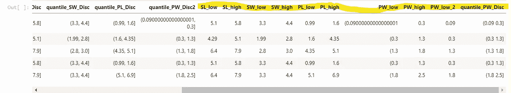

现在，我们可以分组来得到概率。这些概率是我们的第一个猜测:

```
*#group by low high and count for each flower*
*#setosa probability*
df_setosa **=** df_train[df_train['variety']**.**isin(['Setosa'])]
df_setosaSL **=** df_setosa**.**groupby(['quantile_SL_Disc'])**.**size()**.**reset_index(name**=**'count')
df_setosaSW **=** df_setosa**.**groupby(['quantile_SW_Disc'])**.**size()**.**reset_index(name**=**'count')
df_setosaPL **=** df_setosa**.**groupby(['quantile_PL_Disc'])**.**size()**.**reset_index(name**=**'count')
df_setosaPW **=** df_setosa**.**groupby(['quantile_PW_Disc'])**.**size()**.**reset_index(name**=**'count')

*#probability of setosa given that it has that sepal length quantile group i.e p(that quantile group | setosa)*
df_setosaSL['probability_setosa_sepal_length'] **=** df_setosaSL['count']**/**df_setosaSL['count']**.**sum()
df_setosaSW['probability_setosa_sepal_width'] **=** df_setosaSW['count']**/**df_setosaSW['count']**.**sum()
df_setosaPL['probability_setosa_petal_length'] **=** df_setosaPL['count']**/**df_setosaPL['count']**.**sum()
df_setosaPW['probability_setosa_petal_width'] **=** df_setosaPW['count']**/**df_setosaPW['count']**.**sum() 
```

让我们仔细检查其中一个:

```
df_setosaPW**.**head()
```

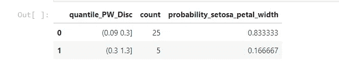

> 正如你所看到的，这告诉我们当花瓣宽度在 0.09 和 0.3 之间时，一朵花被衬托的概率是 0.83 或 83%。

在条件概率术语中，这被写成 P(Setosa |花瓣宽度在. 09 和. 3 之间)= .83。

让我们为 virginica 做同样的事情:

```
*#group by low high and count for each flower*
*#virginica probability*
df_virginica **=** df_train[df_train['variety']**.**isin(['Virginica'])]
df_virginicaSL **=** df_virginica**.**groupby(['quantile_SL_Disc'])**.**size()**.**reset_index(name**=**'count')
df_virginicaSW **=** df_virginica**.**groupby(['quantile_SW_Disc'])**.**size()**.**reset_index(name**=**'count')
df_virginicaPL **=** df_virginica**.**groupby(['quantile_PL_Disc'])**.**size()**.**reset_index(name**=**'count')
df_virginicaPW **=** df_virginica**.**groupby(['quantile_PW_Disc'])**.**size()**.**reset_index(name**=**'count')

*#probability of virginica given that it has that sepal length quantile group i.e p(that quantile group | setosa)*
df_virginicaSL['probability_virginica_sepal_length'] **=** df_virginicaSL['count']**/**df_virginicaSL['count']**.**sum()
df_virginicaSW['probability_virginica_sepal_width'] **=** df_virginicaSW['count']**/**df_virginicaSW['count']**.**sum()
df_virginicaPL['probability_virginica_petal_length'] **=** df_virginicaPL['count']**/**df_virginicaPL['count']**.**sum()
df_virginicaPW['probability_virginica_petal_width'] **=** df_virginicaPW['count']**/**df_virginicaPW['count']**.**sum()

df_virginicaPW**.**head()
```

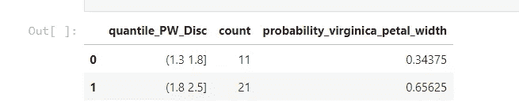

现在，我们可以为云芝做这件事:

```
*#group by low high and count for each flower*
*#Versicolor probability*
df_Versicolor **=** df_train[df_train['variety']**.**isin(['Versicolor'])]
df_VersicolorSL **=** df_Versicolor**.**groupby(['quantile_SL_Disc'])**.**size()**.**reset_index(name**=**'count')
df_VersicolorSW **=** df_Versicolor**.**groupby(['quantile_SW_Disc'])**.**size()**.**reset_index(name**=**'count')
df_VersicolorPL **=** df_Versicolor**.**groupby(['quantile_PL_Disc'])**.**size()**.**reset_index(name**=**'count')
df_VersicolorPW **=** df_Versicolor**.**groupby(['quantile_PW_Disc'])**.**size()**.**reset_index(name**=**'count')

*#probability of Versicolor given that it has that sepal length quantile group i.e p(that quantile group | setosa)*
df_VersicolorSL['probability_Versicolor_sepal_length'] **=** df_VersicolorSL['count']**/**df_VersicolorSL['count']**.**sum()
df_VersicolorSW['probability_Versicolor_sepal_width'] **=** df_VersicolorSW['count']**/**df_VersicolorSW['count']**.**sum()
df_VersicolorPL['probability_Versicolor_petal_length'] **=** df_VersicolorPL['count']**/**df_VersicolorPL['count']**.**sum()
df_VersicolorPW['probability_Versicolor_petal_width'] **=** df_VersicolorPW['count']**/**df_VersicolorPW['count']**.**sum()

df_VersicolorPW**.**head()
```

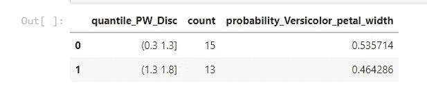

现在，我们还需要训练集中的先验概率。这是我们对贝叶斯分类器将开始的每朵花的猜测:

为此，首先，我们可以统计每个类在训练集中的出现次数。

```
*# probability of each class - prior probability in training*

df_prior**=**pd**.**DataFrame(df_train**.**groupby(['variety'])**.**size()**.**reset_index(name**=**'count'))df_prior**.**head()
```


接下来，我们可以使用这个计数来计算每个类的百分比:

```
df_prior['prior']**=**df_prior['count']**/**df_prior['count']**.**sum()df_prior**.**head()
```

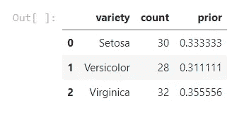

这是我们的先验概率。例如，P(Setosa) = .333333。

现在，我们将转置这个数据集，使它看起来像下面。我们转置数据的原因是为了将这些概率包含在我们要分类的测试数据的行中。

```
df_priorT**.**columns **=** df_priorT**.**iloc[0] 

df_priorprob**=**df_priorT**.**drop(['count','variety'], inplace **=** **True**)

df_priorT**.**head()
```

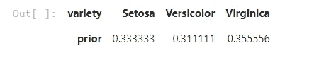

三。应用于您的测试数据

现在，我们需要将我们的先验概率数据推送到测试数据集的每一行。为此，我们可以做一个交叉连接。交叉连接基本上返回一个表，其中包含两个表之间的所有行组合。在这种情况下，由于我们的先验概率数据有 1 行，结果将返回测试数据中的行数。

```
*#cross join the prior probability of training with test*
df_test['key'] **=** 0
df_priorT['key'] **=** 0

df_test**=**df_test**.**merge(df_priorT, on**=**'key', how**=**'outer')
len(df_test)
```

输出如下图所示**。正如您所看到的，我们在前几列中有测试数据，然后我们有三列，在这三列上我们有来自我们的训练数据的先验概率。**

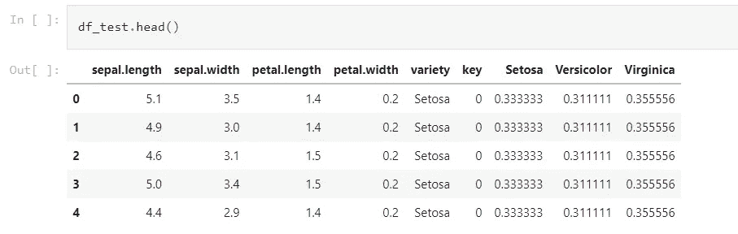

**现在，我们要削减我们的测试数据特征。但是，这一次，我们不会做 qcut，我们会做 cut。cut 允许我们指定箱的截止值，这一次，我们将使用 qcut 从上面的训练数据集中给我们的截止值。这样做的原因是，当涉及到测试集中的特征时，我们可以从训练数据中识别哪个箱匹配哪个行。**

```
 df_test['SL_bins'] **=** pd**.**cut(x**=**df_test['sepal.length'], bins**=**[4.29, 5.1, 5.8, 6.4, 7.9])
df_test['SW_bins'] **=** pd**.**cut(x**=**df_test['sepal.width'], bins**=**[1.99, 2.8, 3.0, 3.3, 4.4])
df_test['PL_bins'] **=** pd**.**cut(x**=**df_test['petal.length'], bins**=**[0.99, 1.6, 4.35, 5.1, 6.9])
df_test['PW_bins'] **=** pd**.**cut(x**=**df_test['petal.width'], bins**=**[0.09, 0.3, 1.3, 1.8, 2.5])
```

结果集现在将如下所示:

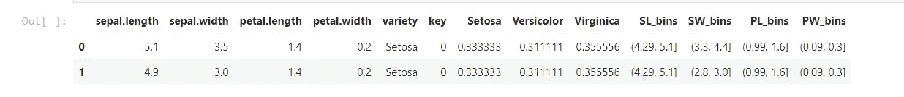

现在，我们将在测试帧上进行重复连接，以获得一个条件概率，即假设一个流的特征属于一个特定的桶，那么这个流就是一个特定的类。例如 P(刚毛|萼片长度 bin 为 4.29 至 5.1)等。

为此，代码将如下所示。每个连接都基于作为主键的存储桶。**我们正在加入的是我们对概率表的测试集，这些概率表来自本文第二部分的训练集。**

```
df_test1**=**df_test**.**merge(df_setosaSL[['quantile_SL_Disc','probability_setosa_sepal_length']], left_on**=**'SL_bins',right_on**=**'quantile_SL_Disc', how**=**'left')**.**drop(columns **=** ['quantile_SL_Disc'])
df_test2**=**df_test1**.**merge(df_virginicaSL[['quantile_SL_Disc','probability_virginica_sepal_length']], left_on**=**'SL_bins',right_on**=**'quantile_SL_Disc', how**=**'left')**.**drop(columns **=** ['quantile_SL_Disc'])
df_test3**=**df_test2**.**merge(df_VersicolorSL[['quantile_SL_Disc','probability_Versicolor_sepal_length']], left_on**=**'SL_bins',right_on**=**'quantile_SL_Disc', how**=**'left')**.**drop(columns **=** ['quantile_SL_Disc'])
df_test4**=**df_test3**.**merge(df_setosaSW[['quantile_SW_Disc','probability_setosa_sepal_width']], left_on**=**'SW_bins',right_on**=**'quantile_SW_Disc', how**=**'left')**.**drop(columns **=** ['quantile_SW_Disc'])
df_test5**=**df_test4**.**merge(df_virginicaSW[['quantile_SW_Disc','probability_virginica_sepal_width']], left_on**=**'SW_bins',right_on**=**'quantile_SW_Disc', how**=**'left')**.**drop(columns **=** ['quantile_SW_Disc'])
df_test6**=**df_test5**.**merge(df_VersicolorSW[['quantile_SW_Disc','probability_Versicolor_sepal_width']], left_on**=**'SW_bins',right_on**=**'quantile_SW_Disc', how**=**'left')**.**drop(columns **=** ['quantile_SW_Disc'])
df_test7**=**df_test6**.**merge(df_setosaPL[['quantile_PL_Disc','probability_setosa_petal_length']], left_on**=**'PL_bins',right_on**=**'quantile_PL_Disc', how**=**'left')**.**drop(columns **=** ['quantile_PL_Disc'])
df_test8**=**df_test7**.**merge(df_virginicaPL[['quantile_PL_Disc','probability_virginica_petal_length']], left_on**=**'PL_bins',right_on**=**'quantile_PL_Disc', how**=**'left')**.**drop(columns **=** ['quantile_PL_Disc'])
df_test9**=**df_test8**.**merge(df_VersicolorPL[['quantile_PL_Disc','probability_Versicolor_petal_length']], left_on**=**'PL_bins',right_on**=**'quantile_PL_Disc', how**=**'left')**.**drop(columns **=** ['quantile_PL_Disc'])
df_test10**=**df_test9**.**merge(df_setosaPW[['quantile_PW_Disc','probability_setosa_petal_width']], left_on**=**'PW_bins',right_on**=**'quantile_PW_Disc', how**=**'left')**.**drop(columns **=** ['quantile_PW_Disc'])
df_test11**=**df_test10**.**merge(df_virginicaPW[['quantile_PW_Disc','probability_virginica_petal_width']], left_on**=**'PW_bins',right_on**=**'quantile_PW_Disc', how**=**'left')**.**drop(columns **=** ['quantile_PW_Disc'])
*# #df_test11.head()*
df_test12**=**df_test11**.**merge(df_VersicolorPW[['quantile_PW_Disc','probability_Versicolor_petal_width']], left_on**=**'PW_bins',right_on**=**'quantile_PW_Disc', how**=**'left')**.**drop(columns **=** ['quantile_PW_Disc'])
*# #df_test12.head()*
df_test12**.**head() 
```

接下来，我们有一些 nans。这样做的原因是，如果一个桶中有 0 朵花，上面的 qcut 不会创建桶。所以我们需要用 1 来填充我们的 nans。

```
**import** numpy **as** np
df_test12**=**df_test12**.**replace(np**.**nan, 1)
```

我们用 1 填充 NANs 的原因是这样的。记住贝叶斯分类器是这样工作的:

> **P(来自训练集的第一次猜测)* P(类|特征 1 在特定桶中)* P(类|特征 2 在特定桶中)* P(类|特征 3 在特定桶中)* P(类|特征 4 在特定桶中)**

这是我们在每个类的每一行上计算的。得分最高的将是预测的班级。这就是为什么我们不能有 0 的条件概率，所以我们使用 1，如果这个组不存在，所以我们乘以 1，保持我们的分数不变。

让我们来计算分数:

```
*#calculate score of setosa for each row*
*#prior probability of setosa in training set * probability_setosa_sepal_length_x (this second term is the probability of setosa given the sepal length is in that bucket)*
df_test12['Setosa_score'] **=** df_test12['Setosa'] ***** df_test12['probability_setosa_sepal_length']*****df_test12['probability_setosa_sepal_width']*****df_test12['probability_setosa_petal_width']*****df_test12['probability_setosa_petal_length']

*#calculate score of virginica for each row*
*#prior probability of virginica in training set * probability_virginica_sepal_length_x (this second term is the probability of virginica given the sepal length is in that bucket)*
df_test12['Virginica_score'] **=** df_test12['Virginica'] ***** df_test12['probability_virginica_sepal_length']*****df_test12['probability_virginica_sepal_width']*****df_test12['probability_virginica_petal_width']*****df_test12['probability_virginica_petal_length']

*#calculate score of virginica for each row*
*#prior probability of setosa in training set * probability_setosa_sepal_length_x (this second term is the probability of setosa given the sepal length is in that bucket)*
df_test12['Versicolor_score'] **=** df_test12['Versicolor'] ***** df_test12['probability_Versicolor_sepal_length']*****df_test12['probability_Versicolor_sepal_width']*****df_test12['probability_Versicolor_petal_width']*****df_test12['probability_Versicolor_petal_length']
```


现在，我们需要添加一个预测列，其类文本与 max score 的列名相匹配。例如，如果 Setosa_score 列是最大值，它将在该列中打印出 setosa_score。

```
df_test12['Setosa_score'] **=** df_test12['Setosa_score']**.**astype(float)
df_test12['Virginica_score'] **=** df_test12['Virginica_score']**.**astype(float)
df_test12['Versicolor_score'] **=** df_test12['Versicolor_score']**.**astype(float)

df_test12['predicted'] **=** df_test12[['Setosa_score','Virginica_score','Versicolor_score']]**.**idxmax(axis**=**'columns')
```

我们接下来会看到这一点:

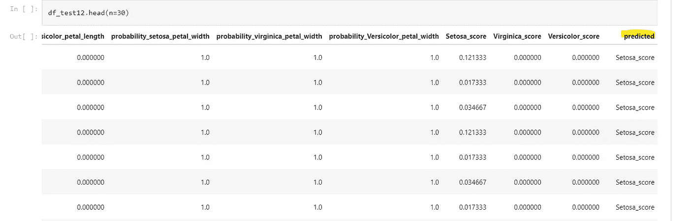

现在，我们需要分离预测列，以便只保留花名。分离之后，我将数据帧推送到一个 CSV。

```
*#df_test12[['Predicted','seperatestuff']] = df_test12['predicted'].astype(str).str.split('_',expand=True)*
df_test12['predicted'] **=** df_test12['predicted']**.**astype(str)**.**str**.**split('_')**.**str[0]
df_test12**.**head()
df_test12**.**to_csv('/content/testanswers.csv', index **=** **False**)
```

结果:

对于测试数据集中的 30 行，我们看到准确率为 87%:

真 26 87%假 4 13%