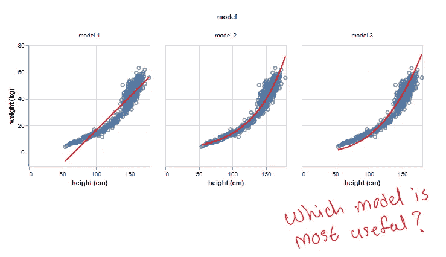
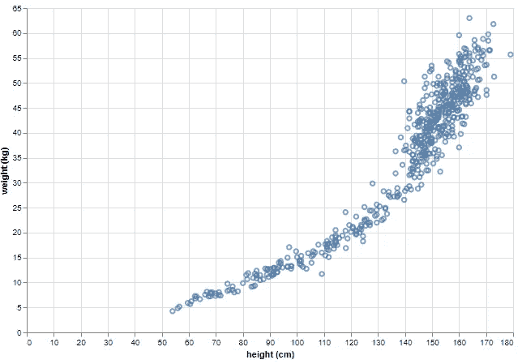
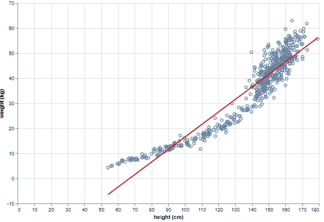
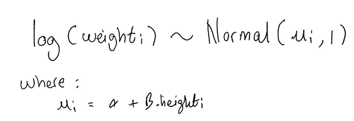
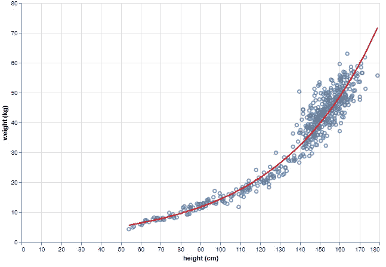
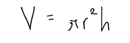
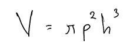
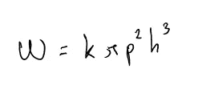
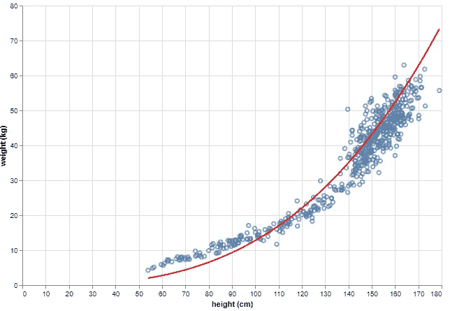

# 贝叶斯推理简介

> 原文：<https://pub.towardsai.net/bayesian-inference-beyond-estimating-statistical-models-4b2f78c7f090?source=collection_archive---------1----------------------->

## [数据科学](https://towardsai.net/p/category/data-science)、[概率](https://towardsai.net/p/category/probability)、[统计](https://towardsai.net/p/category/statistics)

## 第 7 部分:超越线性模型和广义线性模型

# 介绍

让我们把模型的世界分成两种类型:统计的和科学的。这两类模型都旨在理解目标变量(即 y)和一组特征(即 **x.** )之间的关系。前者旨在基于数据找到统计上合理的关系，而后者具有能够描述因果关系的特性。

本系列中的所有示例都使用了统计模型(例如 GLMs)来说明贝叶斯推理中的一个概念。然而，贝叶斯推理同样适用于建立科学模型。

本文将展示如何结合贝叶斯推理来构建科学模型，以及这样做的好处。

本文内容基于[1]中的第 16 章。

在这个[笔记本](https://github.com/hsm207/statrethinking-julia/blob/master/book/16_Madness/fit_scientific_model.ipynb)中可以找到重现本文中描述的结果的代码。

# 问题

为了保持数学简单，让我们假设我们想要建立一个模型来预测给定身高的人的体重。

# 资料组

我们将使用 Howell1 数据集中记录的身高和体重值，您可以在这里找到。

数据看起来是这样的:

图 Howell1 数据集

# 建模

## 统计模型

如果我们假设体重和身高之间存在线性关系，则模型看起来是这样的:

图 2:线性模型的平均预测

当然，仅根据图 1，我们不应该期望简单的线性回归是一个很好的拟合。事实上，它预测一些身高值的负体重也是愚蠢的。

数据有一条曲线，所以我们可以做一个转换，比如添加一个二次项来获得更好的拟合。但是让我们用一个对数变换。

具体来说，让我们假设:

图 3:假设体重的对数是身高的线性函数

请注意，α和β是我们需要指定先验分布的模型参数。但由于他们有一个大的数据集，获得正确的先验以获得良好的拟合并不太重要。

这是结果:

图 4:给定图 3 中的假设，模型的平均预测

现在合身多了。

## 科学模型

身高怎么会是体重的原因？

好吧，让我们从简单的开始，看看我们能走多远。

假设人体形状可以近似为一个圆柱体，那么高度 h 和体积 V 之间的关系为:

r 是圆柱体的半径。假设它是高度的一部分是合理的，所以 r = ph。因此，我们得到:

密度 k 是重量 W 和体积 V 的函数，即 k = W/V [2]，由此得出:

图 5:人类身高和体重之间关系的近似模型

由于 W 以千克为单位，h 以厘米为单位，所以 k 的单位是千克/厘米。

图 5 中的模型只有两个参数，k，人体的密度(kg/cm ),以及人体的半径(其宽度的一半)与高度的比值 p。

图 5 中的模型当然不是线性或广义线性模型，但是使用贝叶斯推理将其拟合到数据遵循完全相同的过程，即:

1.  定义模型参数的先验分布
2.  定义后验分布(在给定数据的情况下观察参数的概率)
3.  对参数进行推断

有关这些步骤如何工作的演练，请参考[3]。

[3]使用网格近似作为算法在步骤 3 中进行推断。这对于简单的模型很有效。

对于这个例子，我们将使用 MCMC 作为推理算法。具体来说，我们将使用 Turing.jl。有关代码，请参考随附的笔记本。

那么，我们该如何设定 k 和 p 的先验呢？

对于 p，我们知道它是一个比值，所以它肯定在 0 和 1 之间。此外，它必须小于 0.5(设 h = 2r，代入 r = ph)，因为我们知道人类不能拥有相等的高度和宽度。因此，平均值约为 0.1-0.2 的贝塔分布似乎是合理的。

对 k 来说，就是查一个人体的密度，知道一定是正数。根据维基百科的说法，似乎一个人的密度大约是 2 克/毫升，所以用这个平均值给它分配一个指数分布似乎是合理的。

当然，在实践中，我们应该检查这些先验给出的预测的分布，以验证它们的合理性，但这不是本文的重点，所以我们将跳过这一步。

图 5 给出了以下结果:

图 6:图 5 中模型的平均预测

这很合适，但是图 4 中的模型看起来更好。

# 科学与统计模型

让我们比较一下图 4(统计模型)和图 6(科学模型)中的模型。

图 4 给出了一个更好的拟合，但是哪个更容易解释呢？我们可以说身高 1 厘米的变化会导致体重对数的β变化，但这听起来有些尴尬。此外，我们如何理解截距α？在 0 厘米的高度谈论体重是没有意义的。

相比之下，图 6 中模型的参数对应于我们在物理世界中可以观察到的量。除了可解释之外，它让我们很容易得出合理的先验。

科学模型的另一个有用的特性是，它的误差可以洞察数据，并指导建立更好的模型。例如，有趣的是，当身高小于 70 厘米时，该模型系统地低估了体重。这可能是该组中的人具有不同生理机能并需要不同模型参数来正确建模的标志。

# 其他示例

[1]讨论了其他三个例子，在这些例子中，科学模型相对于统计模型给出了更丰富的结果。

在我看来，最有趣的例子是将人口动态视为一个时间序列问题，并使用自回归模型预测其演变，而不是使用 Lotka-Volterra 模型。

对我来说，关键的一点是，尽管科学模型经常做出简化的假设，但它们足以概括我们试图理解的现象的复杂性。对于这些情况，可解释性的收益可能超过拟合度的损失。

当然，如果我们只关心预测性能，那么全押在统计模型上是一种有效的方法。

# 结论

本文展示了如何使用贝叶斯推理来估计科学模型，即编码因果关系的模型。它也触及了科学模型相对于统计模型的优点。

我希望这对你有用。

# 参考

[1]统计学再思考:贝叶斯课程与实例，R 和 Stan，第 2 版。麦克尔瑞斯。2020

[2] [重量-体积关系](https://aboutbuildingengineering.blogspot.com/2012/09/weightvolume-relationships.html)。土木和建筑工程。最后访问时间是 2020 年 10 月 14 日。

[3] [贝叶斯推理介绍第 1 部分:网格逼近如何工作](https://medium.com/towards-artificial-intelligence/bayesian-inference-how-grid-approximation-works-e2c79a516c49)。___.2020