# 贝叶斯推理简介

> 原文：<https://pub.towardsai.net/bayesian-inference-estimating-model-overfit-risk-24e1e068822a?source=collection_archive---------1----------------------->

## 数据科学

## 第 4 部分:如何估计模型的过度拟合风险

# 介绍

在本文中，我将展示广泛适用的信息标准(WAIC)如何量化一个模型能够推广到看不见的数据的程度。

重现结果和数字的代码可在[本](https://github.com/hsm207/statrethinking-julia/blob/master/book/07_Information_Theory/model_evaluation-explained.ipynb)笔记本中找到。

# 动机

假设您有一个如下所示的训练和测试集:

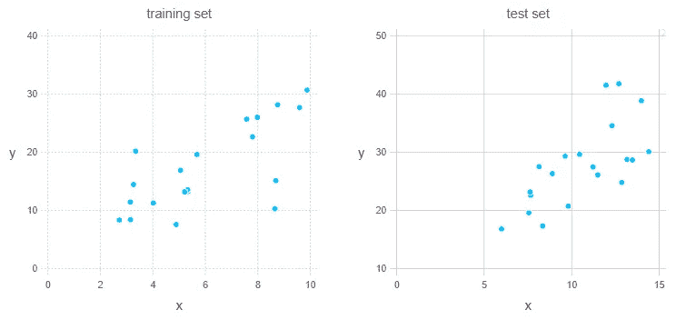

图 1:模拟训练和测试集

目标是用 x 预测 y，你提出了两个模型，如下所示:

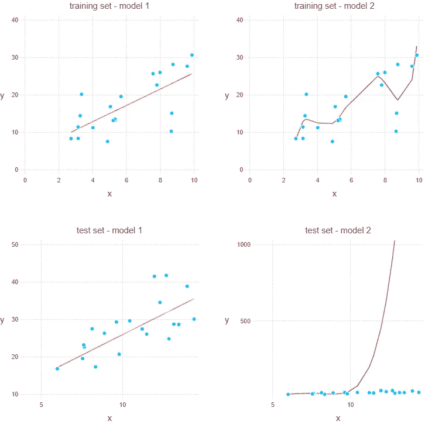

图 2:基于图 1 中模拟数据的两个模型

你认为哪个模型会对看不见的数据做出更好的预测？很明显，这是模型 1，因为模型 2 在测试集上的表现清楚地表明它已经过度适应了训练集。

但是在现实世界中，数据可能非常稀缺，以至于您没有足够的数据来构建一个像样的测试集。在本例中，您可以绘制模型在训练集上的性能，如图 2 所示，并得出结论:模型 1 可能比模型 2 更好，因为模型 2 适合训练集中的大量噪声。

在现实世界中，您可能希望将 y 建模为几个 x 的函数，如 x₁、x₂等。所以不可能做出如图 2 所示的图。我们将看到 WAIC 指标如何应对这一挑战。

# 资料组

本文的其余部分将使用以下数据集来训练两个线性模型:

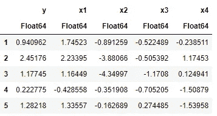

图 3:虚拟数据集

x 是随机产生的，而 y 定义为:

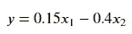

其中加入了一些随机噪声。

我们将生成一个训练集和测试集，每个包含 20 个观察值。

# 模型

我们将使用贝叶斯方法构建两个线性模型。有关该方法的更多详细信息，请参考[1]。

这两个模型的主要区别在于，模型 1 将 y 建模为 x1 和 x2 的函数，而模型 2 将 y 建模为 x1、x2、x3 和 x4 的函数。

因此，模型 2 将有过度适应训练集的趋势。

我们的目标是避免在没有查看任一模型在测试集上的性能的情况下选择模型 2。

# 如何衡量准确度

由于我们正在处理一个预测任务，RMSE 是一个很好的选择来衡量我们的模型的准确性。但是，有一个更好的准确性度量标准，它考虑了模型预测中固有的不确定性。

该指标称为对数逐点预测密度(lppd ),定义如下:

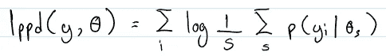

图 lppd 的定义

图 4 显示，给定观测值 y 的向量和由θ参数化的模型，lppd 是所有采样参数的平均密度的每个观测值的对数之和。

下一节将对正在发生的事情进行直观的解释。

# lppd 如何测量精度

回想一下[1],贝叶斯方法建立模型的结果是给定数据的模型参数的联合分布，即 xs。我们称这种联合分布为后验分布。

为了在给定 x 的情况下进行实际预测，我们从后验分布中采样参数，并将它们插入到描述 y 的模型中，例如，y～n(β₁x，1)其中β₁是采样参数。

例如，考虑下图:

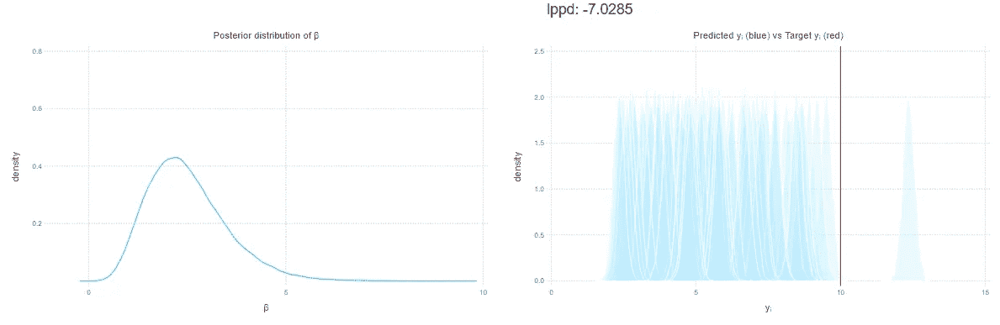

图 5:坏模型的 Lppd

图 5 显示了一个模型，它试图预测给定 x = 5 时 y = 10。y 被建模为正态分布，平均值为βx，标准偏差为 0.2。

图 5 中的左图显示了参数β的可能后验分布。这个后验分布的平均值为 2.5。

图 5 中的右图显示了基于每个采样β构建的正态分布。正如所料，大多数正态分布将集中在 y = 5 处，这意味着 y = 10 处的大多数正态分布的密度将接近 0。这就是为什么这个观察的 lppd 评分很低(-7.0)。

将图 5 与下图进行对比:

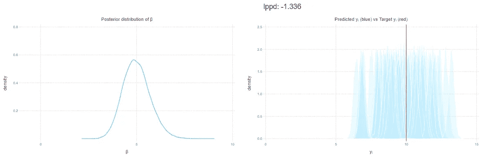

图 6:更好模型的 lppd

图 5 和图 6 之间的唯一区别是图 6 中的后验分布的平均值为 5.0，这解释了为什么从该后验分布构建的正态分布与 y = 10 有更多的重叠，因此 lppd 得分更高(-1.3)。

本节的关键是:

*   lppd 对模型后验分布中的采样参数将产生质量接近实际值的预测分布的程度进行评分。
*   较高的 lppd 分数意味着较高的准确性

# 使用 lppd

以下是模型 1 和模型 2 的 lppd 值:

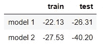

图 7:模型 1 和模型 2 的 lppd 值

正如所料，模型 1 在训练集和测试集上具有相似的 lppd 值，而模型 2 在测试集上的准确性比训练集差得多。

现在，假设我们没有一个测试集来计算每个模型的 lppd。我们可以选择模型 1 而不是模型 2，因为前者的 lppd 比后者高吗？不，因为这种差异可能只是由于随机的机会。

# 仅使用训练集估计过度拟合风险

事实证明，可以修改训练集上的 lppd 来估计测试集上的 lppd。我们只需对其应用惩罚项，计算方法是根据后验分布的采样参数，对每个观测值的对数密度的方差求和:

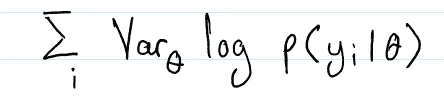

图 8:罚款期限

直观地说，这个惩罚项惩罚的是非常准确但只是在极少数情况下或者到处都在做预测的模型。这意味着大部分采样参数产生的模型不准确，进而意味着模型对其参数敏感，这是过拟合的标志！

下图将有助于阐明这一点:

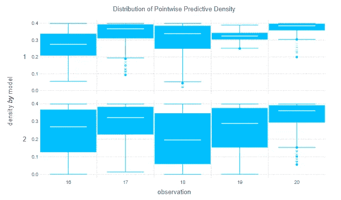

图 9:训练集中所选点的预测密度分布

图 8 显示了用于计算观测值 16 至 20 的 lppd 的密度分布。很明显，相对于模型 1，模型 2 的预测更加分散。因此，我们应该期待模型 2 有一个更高的惩罚条款。实际上，模型 1 的惩罚项是 1.13，而模型 2 是 19.30。

综上所述，测试集的估计 lppd 由下式给出:

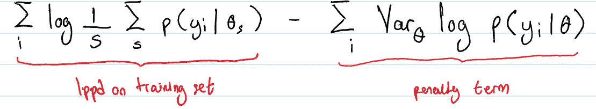

图 10:如何在测试集上估计 lppd

图 10 中的公式也被称为 WAIC。还有另一种将它乘以-2 的变体，但是在本文中我们将坚持这个版本。

# 使用 WAIC

以下是 WAIC 与 lppd 在测试集上的对比:

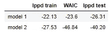

图 11:在测试集上比较 WAIC 和 lppd

WAIC 和 lppd 序列之间的关系与两种模型的 lppd 测试和 lppd 序列之间的关系相同。因此，基于 WAIC 的模型选择与基于模型在测试集上的准确性的决定是一样的。

在某种程度上，看不见的数据遵循与训练集相同的数据生成过程，我们更有信心模型 1 将概括得更好，因为它的 WAIC 值与它在训练集上的 lppd 相似。

# WAIC 的稳健性

我们是不是很幸运，因为我们有一个训练样本，它的 WAIC 值恰好接近测试集上的 lppd？

为了找出答案，我们可以随机生成一对训练集和测试集，每组 20 个观察值(使用相同的数据生成过程)，然后计算每对的 lppd 和 WAIC 值。这是用模型 1 进行 10 次模拟的结果:

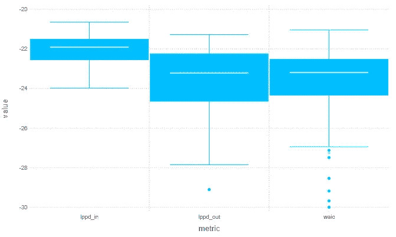

图 12:模型 1 的 lppd 和 WAIC 分布

我们看到，WAIC 的分布与 lppd 在测试集上的分布非常接近，即使在只有 20 个观测值的样本量上也是如此。

一般来说，WAIC 提供了样本外 lppd 的近似，它收敛于大样本中的留一交叉验证近似[2]。我还没想明白为什么会这样。好奇的读者可能希望参考[3]和[4]以获得更多的见解。

# 结论

本文展示了在缺乏独立测试集的情况下，WAIC 度量如何指导模型选择。与进行交叉验证相比，在计算上实现起来要便宜得多。

如果你知道为什么 WAIC 使用留一交叉验证法收敛于样本外 lppd，请在评论中告诉我。

# 参考

[1] [贝叶斯推理介绍第三部分:线性模型如何工作](https://medium.com/towards-artificial-intelligence/bayesian-inference-how-linear-models-work-6ceb120adc84)。___.2020.

[2]用 R 和 Stan 中的例子进行统计再思考。麦克尔瑞斯。2020

[【3】一种广泛适用的贝叶斯信息准则](http://www.jmlr.org/papers/volume14/watanabe13a/watanabe13a.pdf)。渡边。2013

[4] [贝叶斯交叉验证的渐近等价性和奇异学习理论中广泛适用的信息准则](http://www.jmlr.org/papers/volume11/watanabe10a/watanabe10a.pdf)。渡边。2010