# 贝叶斯推理简介

> 原文：<https://pub.towardsai.net/bayesian-inference-how-grid-approximation-works-e2c79a516c49?source=collection_archive---------0----------------------->

## 第 1 部分:网格近似的工作原理

# 介绍

网格近似法是一种用于估计概率分布后验的技术。在本文中，我将详细解释这种方法是如何工作的。沿着这条路，你将熟悉一些在贝叶斯推理文献中常见的技术术语。

再现结果和数字的代码可在本[笔记本](https://github.com/hsm207/statrethinking-julia/blob/master/book/04_Linear_Models/modelling_height-grid_approximation.ipynb)中获得。

我假设读者对统计学有相当于统计学 101 课程的基本理解。

# 问题陈述

假设你需要生成一些代表人类身高的随机数。然后，这些数字可以用作一些其他建模任务的输入，例如，用随机的不可玩角色填充视频游戏环境。

你希望这些数字尽可能真实，所以必须有数据支持。所以，作为起点，你假设身高遵循正态分布。现在剩下的就是计算这个分布的均值和标准差。

你不知道人类身高的确切平均值和标准差是多少，但你确实对它们有一些信念。让我们假设你认为人类身高的标准差可以在 0 厘米到 50 厘米之间的任何地方变化。至于人类的平均身高，你认为它的变化最好用平均值为 178 厘米、标准差为 20 厘米的正态分布来表征。让我们把你对人类身高平均值和标准差分布的信念分别称为人类身高平均值和标准差的**先验分布**。

给定先验分布，您可以通过首先对先验分布的平均值和标准偏差进行采样，然后将其输入由采样的平均值和标准偏差参数化的正态分布，来生成随机的人类身高。以下是这一过程的图示:

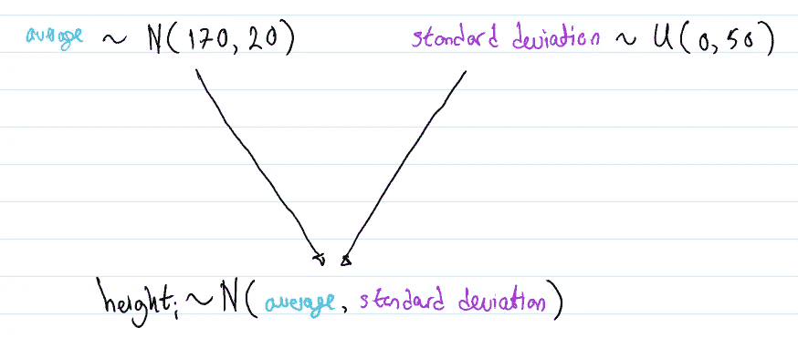

图 1:如何根据你先前的信念生成一个随机的人类身高

如果您重复图 1 中描述的过程数千次，会发生以下情况:

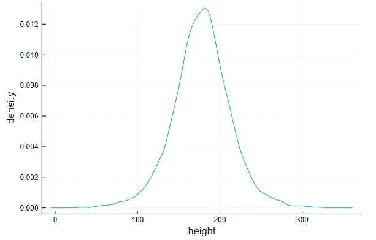

图 2:基于你先前的信念的人类身高分布

所以你有一个人类身高的分布，大致遵循一个钟形曲线，典型的身高在 100 厘米到 250 厘米之间。但是你的数据讲述了一个非常不同的故事:

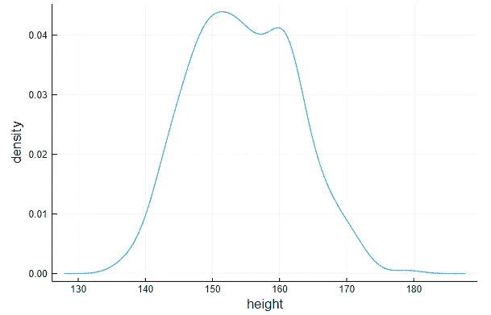

图 3:基于真实数据的人类身高分布

您需要更新您对人类身高的平均和标准偏差分布的信念，即您的**先验分布**，这样它将生成类似于图 3 **的人类身高。**

你将如何更新先前的分布？试错？

# 如何更新你先前的信念

贝叶斯定理是在给定额外信息的情况下更新先验分布的一种原则性方法。以下公式描述了该定理:

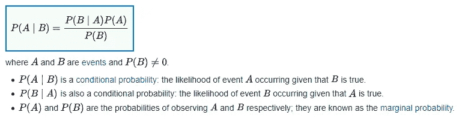

图 4:贝叶斯定理的定义。来源:[1]

更具体地说，图 4 中的公式就是这样转化为我们的例子的:

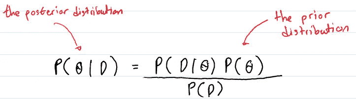

图 5:将贝叶斯定理应用到我们的例子中

其中:

*   θ = [μ，σ]，一个向量，包含从我们的**先验分布**中采样的值，即平均样本高度和标准偏差
*   D =包含真实数据的集合，即真实的人的身高

我们把已经用观测数据 D 更新的θ，P(θ)的**先验分布**称为θ， P(θ|D)的**后验分布。**

根据图 5，要在观察到 D 后获得θ实例的更新概率，我们只需:

1.  根据我们的先验计算θ的概率 P(θ)
2.  给定θ，计算数据的概率 D，即，如果我们假设 D 是从我们的先验分布 P(D|θ)生成的，则观察到 D 中所有数据点的概率。我们称这个值为给定θ的数据的**可能性。**
3.  计算数据的概率 P(D)。
4.  将(1)乘以(2)，然后除以(3)。

我们如何在实践中应用这个公式呢？特别是，我们如何计算 P(D)的值？

# 一些实际考虑

在操作贝叶斯定理之前，我们需要注意几件事情。提醒一下，下面是公式:

图 6:图 5 中的贝叶斯定理

首先，注意分母 P(D)是一个常数。从技术上讲，它被称为**归一化常数**，用于确保所有可能的θ值的 P **(** θ|D)之和为 1。与其多次做这种除法，不如忽略它更有效，所以公式现在变成:

图 6:忽略归一化常数的贝叶斯定理

图 6 表示，θ的后验分布与给定θ的数据的**可能性和θ的**先验分布**的乘积**成比例**。我们现在将注意力集中在计算这个乘积上，并将它的结果称为θ的相对权重。注意:这个乘积也被称为**似然函数**，并且仅仅是θ的函数。**

接下来，我们来思考如何计算 P(θ)。根据上一节的定义，我们得到 P(θ) = P(μ，σ)，即 P(θ)是观测μ和σ的**联合分布**。为简单起见，我们将假设μ和σ相互独立。因此，我们有:

图 7:来自图 6 的贝叶斯定理，并假设独立的先验

最后，注意我们取三个概率值的乘积。这可能导致算术下溢，其中由于硬件限制，非常小的概率的乘积是 0，而不是更小的概率。关于这种现象的更多细节，请参考[2]。解决方案是使用概率对数，因此我们现在有:

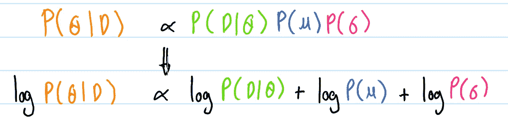

图 8:取图 7 的日志。提示:log(XY) = log(x) + log(y)

在使用对数似然函数观察 D 之后，我们现在准备应用网格近似技术来计算 a θ的相对权重的对数。

# 网格近似的工作原理

使用网格近似求解 P(θ|D)是一个 3 步过程:

1.  构建网格
2.  将似然函数应用于网格中的单元格
3.  来自更新网格的示例

## 构建网格

P(θ)意味着我们必须计算μ和σ的每个可能组合的概率。这是不实际的，因为μ和σ的取值范围是无限的。相反，我们要做的是在我们认为合理的范围内离散化μ和σ，并计算这些范围内的概率。

例如，我们可以在 140 和 160 之间生成 200 个不同的μ值，在 4 和 9 之间生成 200 个不同的σ值。这是 2D 网格的样子:

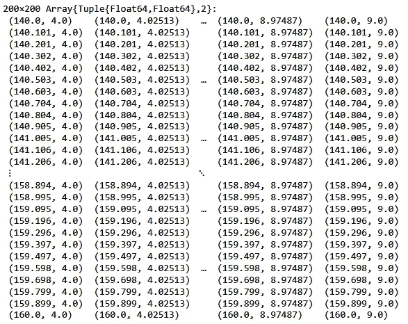

图 9:θ的离散化版本

## 将似然函数应用于网格中的单元格

下一步是使用每个单元格中的值作为输入，将对数似然**函数**应用于网格中的每个单元格。这给了我们一个θ实例的相对权重的对数。

注意，应用对数似然**函数**的结果总是负数，因为 0 和 1 之间的数的对数是负数。这使得θ实例的相对权重的对数很难解释。

取 e 并将其提升到相对权重的对数将在数学上返回相对权重，但是由于算术下溢，结果很可能是 0。

此问题的解决方法是从每个对数似然值中减去我们计算的最大值总对数似然值，并使用该值来提高 e。这种操作的效果是，它通过最大相对权重来重新调整相对权重，如下图所示:

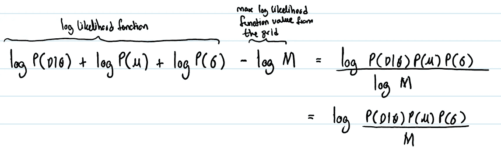

图 10:计算θ实例的相对权重

## 来自更新网格的示例

上一步的结果是我们知道了网格中每个单元格的相对权重。这意味着我们的工作完成了，因为在这个网格**中随机选取与其相对权重**成比例的细胞与从 P(θ|D)中取样是一样的！

这是我们观察到 D 后新的 P(θ)的样子:

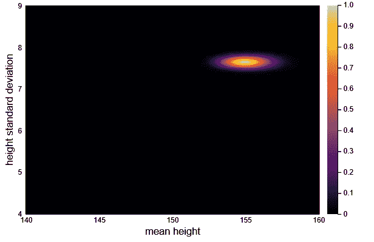

图 11:θ，P(θ|D)的后验分布

为了完整起见，这里是μ和σ的更新分布(我们称之为**边际后验分布**，而不仅仅是边际分布，因为它们已经更新以反映 D):

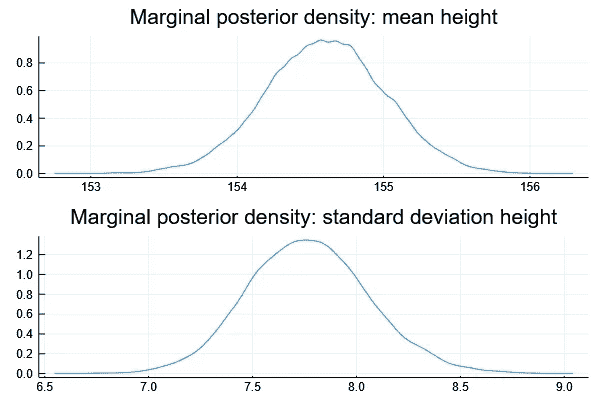

图 12:边际后验分布

# 结果

现在，我们可以通过重复图 1 所示的过程来生成真实的高度，但需要从 P(θ|D)中采样(平均值、标准差)对。结果如下所示:

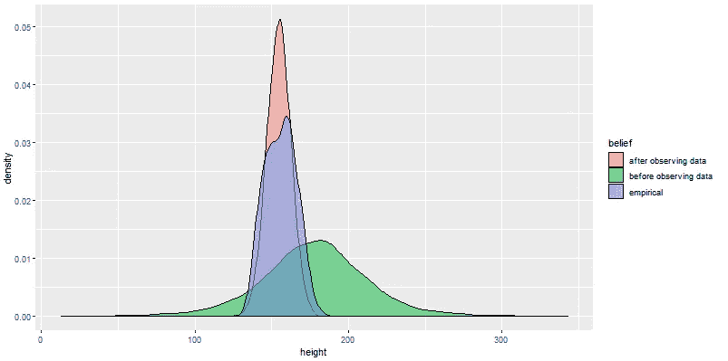

图 13:由先验和后验分布生成的高度与真实数据的比较

在图 13 中，“经验性的”指的是基于你收集的数据的身高分布。“观测数据前”和“观测数据后”分别指从我们的**先验分布**，P(θ)和**后验分布**，P(θ|D】中采样产生的高度。请注意，从后验分布生成的高度与真实数据的拟合度要比从先验分布生成的高度好得多。

# 结论

我发现网格近似技术真的很有趣:我们开始打算计算 P(θ|D ),但是出于实际考虑，我们不得不做出一些妥协并计算其他东西。但是通过一些巧妙的操作，这个东西变成了 P(θ|D)！

如果你有任何问题或反馈，请在评论中告诉我。希望这篇文章对你有用。

# 参考

[*巴耶定理*](https://en.wikipedia.org/wiki/Bayes%27_theorem) 。维基百科。最后访问时间:2020 年 2 月 1 日

[2] [*算术下溢*](https://en.wikipedia.org/wiki/Arithmetic_underflow) 。维基百科。最后访问时间:2020 年 2 月 1 日