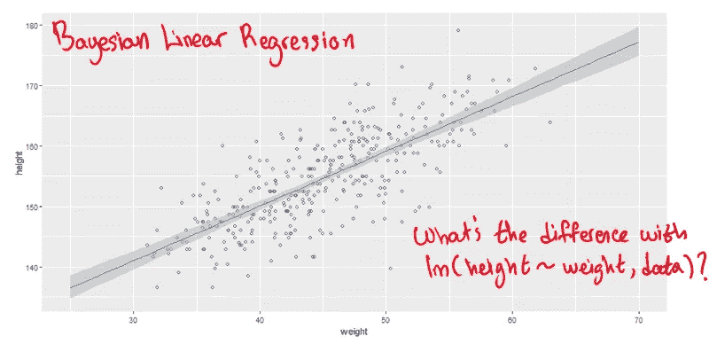
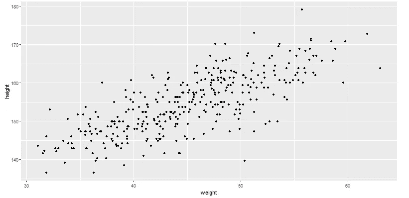
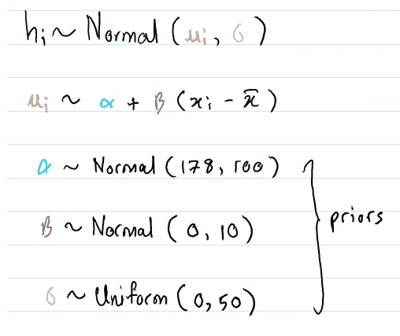
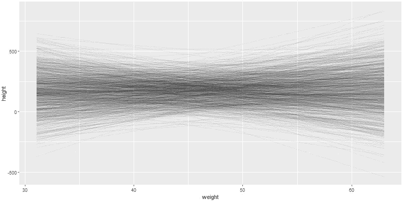
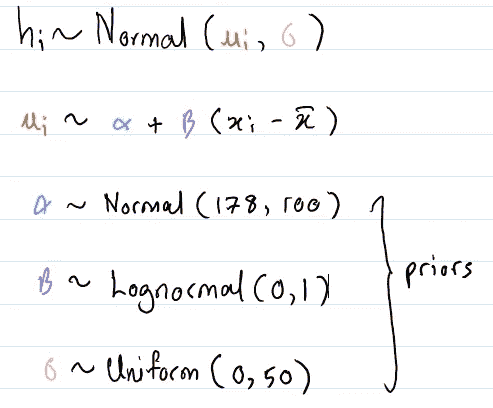
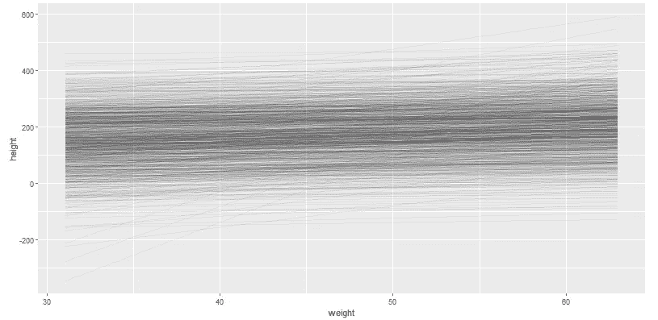
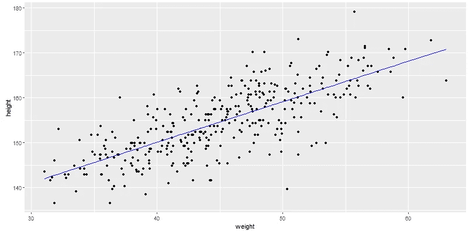
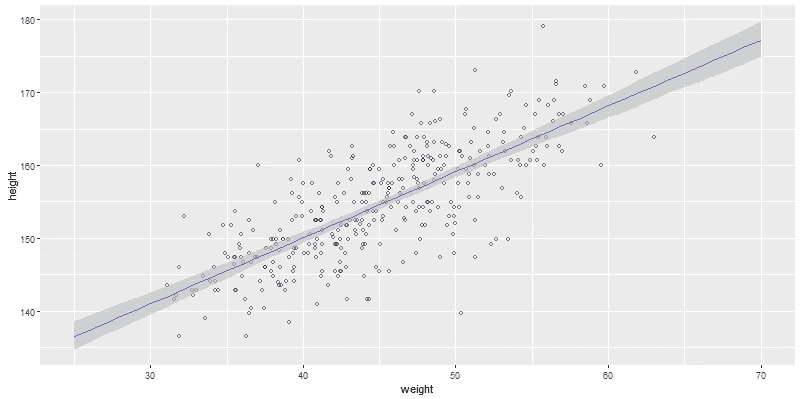
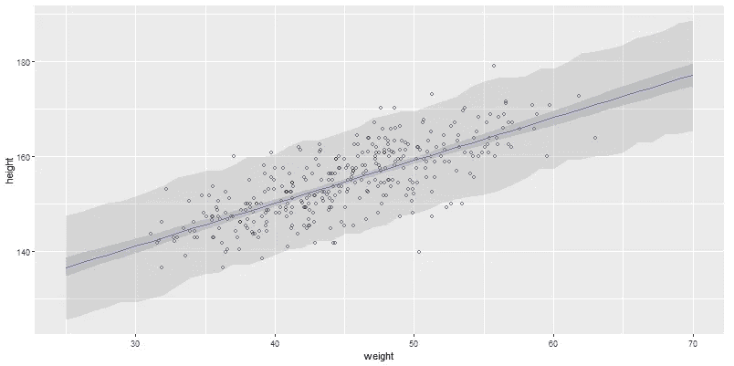
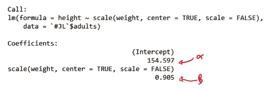

# 贝叶斯推理简介

> 原文：<https://pub.towardsai.net/bayesian-inference-how-linear-models-work-6ceb120adc84?source=collection_archive---------1----------------------->

## 第 3 部分:线性模型如何工作

# **简介**

在本文中，我将解释构建线性模型的贝叶斯方法。本章内容基于[1]第四章。

我假设读者熟悉贝叶斯推理文献中的常用术语。否则，[2]很好地介绍了您将在本文其余部分遇到的技术术语背后的含义。

复制本文中的结果和数字的代码可以在这个[笔记本](https://github.com/hsm207/statrethinking-julia/blob/master/book/04_Linear_Models/modelling_height-linear_regression.ipynb)中找到。

# 问题陈述

假设给你一个数据集，它将人的身高和体重联系起来，如下所示:

图 1:我们想要建立线性回归模型的数据集

我们的目标是拟合一条线，预测给定体重下的平均身高。使用 R，这相当于用公式`height ~ weight` 调用`lm()`函数，它使用 QR 分解方法解决了一个线性最小二乘问题。

做这件事的贝叶斯方法是什么？

# 贝叶斯线性模型

## 概观

构建线性模型的贝叶斯方法包括以下步骤:

1.  根据概率分布定义你的假设
2.  根据你观察到的数据更新你的假设
3.  从更新的概率分布中取样进行推断

让我们详细看看每一步。

## 建立有先验的假设

让我们假设身高遵循均值为μ、标准差为σ的正态分布。

我们还假设平均身高μ和体重 x 之间存在线性关系，也就是说:

图 2:平均身高和体重的关系

图 2 表示，体重为 x kg 的人的预测平均身高是人口平均身高α，加上相对于平均人口的体重差，再加上一个名为β的因子进行调整。这里，术语群体指的是我们的数据集。

这意味着我们的模型由以下参数描述:α，β，σ。我们不知道这些参数应该取什么值，但是我们对它们可能取的值有一定的信心。

假设我们对参数有以下信念:

图 3:我们关于身高和体重之间关系的先验知识

这些前科意味着什么？

为了找到答案，我们可以根据图 3 中描述的分布对参数α和β进行随机采样，并绘制每个体重数据点的预测平均身高。以下是我们得到的结果:

图 4:根据我们在图 3 中的先验，预测的平均身高的分布

图 4 中的每条线代表一条线，描述了给定α和β值时平均身高和体重之间的关系。

很明显，即使没有观察到真实的身高数据，我们的先验也是不现实的，原因如下:

*   它预测一些重量的负高度
*   它经常预测极端的高度
*   它预测了身高和体重之间的负相关

我们从常识中知道，前面提到的几点不可能是真的。

我们能调整我们的前科，让它们暗示一些合理的东西吗？

让我们试试下面的先验知识:

图 5:新的先验

我们所做的唯一改变是让β遵循对数正态分布，这与身高和体重之间存在正相关的信念是一致的。这些新的前科意味着:

图 6:根据我们在图 5 中的先验，预测的平均身高的分布

这比图 5 好得多。平均身高和体重之间的负相关关系消失了，极端预测也不那么频繁了。在本文的其余部分之前，让我们坚持这一点。

注意:我们可以尝试进一步调整我们的先验，直到它更接近现实，但在这种情况下这是不必要的，因为我们的模型很简单，我们有很多数据。选择正确的先验知识至关重要的情况将在以后的文章中讨论。

## 更新先验知识

该步骤包括查看实际高度和重量，并更新我们的参数(即α、β、σ)的先验分布，以便从采样α、β生成的最可能的线是与数据一致的线。

回想一下，更新后的先验分布也称为后验分布。

本文将使用二次近似法来估计α，β，σ的后验分布。关于该方法如何工作的详细描述，请参考[3]。

运行这个算法告诉我们，α和β的平均值分别是 154.597 和 0.903。这意味着平均身高和体重之间的关系是:

图 7:根据二次近似法得出的平均身高和体重之间的关系

从视觉上看，图 7 中的等式是这样的:

图 8:图 7 中等式的可视化表示

图 8 中的蓝线是图 7 中等式的直观表示。这看起来像是通过将线性回归模型拟合到数据集而得到的东西，不是吗？关于构建线性模型的贝叶斯方法和非贝叶斯方法之间的区别，请参考附录部分。

## 后验分布抽样

回想一下，二次近似法将产生一个向量，其中包含模型中每个参数的均值估计和这些参数的协方差矩阵。二次近似法也假设后验分布是高斯分布。

因此，我们有足够的信息从我们的后验样本生成样本:我们只需要构建一个多元正态分布，并插入使用二次近似方法估计的均值向量和协方差矩阵。

我们可以使用后验分布的样本参数来推断我们的线性模型。下一节将描述几个例子。

# 结果

我们可以使用后验样本来理解我们预测中的不确定性。

例如，使用后验样本复制图 6 给出:

图 9:根据我们的后验分布预测平均身高的分布

图 9 中的点是实际数据。蓝线与图 8 中的线相同，线周围的阴影区域代表 97%的最高后验密度区间(HPDI)。在本例中，它是包含 97%概率质量的预测平均值的范围。质量非常高的非常窄的区间表示不确定性低。

与图 6 相比，图 9 在平均身高和体重之间只有正相关，没有极端的预测。这是意料之中的，因为二次近似法更新了我们的先验知识，使之与我们的数据一致。此外，请注意，在数据较少的地区存在更多不确定性，如体重低于 35 公斤和高于 60 公斤的较宽 HPDI 所示。

我们还可以使用后验样本来量化模型预测的实际身高(不仅仅是平均身高)的不确定性。这样做的计算类似于用于量化平均身高预测中的不确定性的计算。感兴趣的读者可以参考本文附带的笔记本。

下图叠加了平均高度预测和实际高度预测的不确定性(两个区间宽度都设置为 97%):

图 10:根据我们的后验分布，预测平均高度(深灰色)和实际高度(浅灰色)的分布

请注意，对于给定的体重，预测实际身高比预测平均身高有更多的不确定性。这是有道理的。数据显示，体重相似的人身高差异可达+/- 10 厘米。

有趣的是，有几个实际高度超出了模型的不确定性范围。这可以是离群值的一个很好的指标，在一定程度上，我们相信我们在模型中建立的假设。

# 结论

本系列的前几篇文章描述了构建模型生成数据的贝叶斯方法。这是第一篇描述构建预测模型的贝叶斯方法的文章。事实证明，这两种方法有很多共同点，即:

1.  定义您的模型/数据生成过程并确定参数
2.  为参数定义一个先验分布
3.  根据观察到的数据更新先前的分布
4.  从后验分布中抽取样本，对模型进行推断/生成数据

希望这篇文章对你有用。如果你有任何问题或反馈，请在评论中告诉我。

# 参考

[1]用 R 和 Stan 中的例子进行统计再思考。麦克特雷思。2015.

[2] [贝叶斯推理介绍第 1 部分:网格近似如何工作](https://medium.com/towards-artificial-intelligence/bayesian-inference-how-grid-approximation-works-e2c79a516c49)。___.2020.

[3] [贝叶斯推理介绍第二部分:二次逼近如何工作](https://medium.com/analytics-vidhya/bayesian-inference-how-quadratic-approximation-works-40cc70e79fb0)。___.2020.

# 附录

## 贝叶斯与非贝叶斯线性模型

使用 R 的`lm()`函数获得α和β的平均估计值，给出:

图 A1:使用 R 的 lm()函数估计α和β

结果几乎是一样的！

正如在问题陈述部分提到的，`lm()`它通过用线性最小二乘问题来表达这个问题来找到这些估计。相反，二次近似方法用最大后验概率(MAP)问题来表达这个问题。

这两种估算方法之间的关系是什么？

首先，MAP 和最大似然估计(MLE)之间存在联系。有关详细信息，请参考[3]。

第二，在某些情况下，线性最小二乘法给出了与最大似然估计相同的估计。在[这个关于交叉验证的](https://stats.stackexchange.com/questions/143705/maximum-likelihood-method-vs-least-squares-method)问题中有一个关于这个观察的很好的讨论。

最后，从解决方案的角度来看，MAP 和 MLE 对于大样本量给出了相同的答案。[Cross 上的这个](https://stats.stackexchange.com/questions/95898/mle-vs-map-estimation-when-to-use-which)问题验证了一个关于它的非常有趣的讨论。