# 贝叶斯推理简介

> 原文：<https://pub.towardsai.net/bayesian-inference-how-missing-values-causes-biased-estimates-31d31c4aaf25?source=collection_archive---------0----------------------->

## [数据科学](https://towardsai.net/p/category/data-science)

## 第 6 部分:当缺失数据导致有偏差的估计时

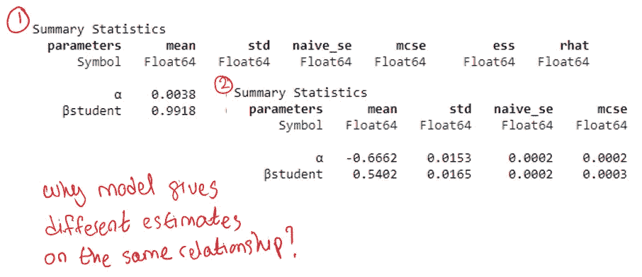

# 介绍

在本文中，我将通过在缺失值机制不同的 4 个场景中处理一个公共数据集，展示缺失值如何导致有偏差的估计。本文内容基于[1]中的第 15 章。

重现本文结果的代码可以在这个[笔记本](https://github.com/hsm207/statrethinking-julia/blob/master/book/15_Missing_Data/missing.ipynb)中找到。

我假设读者熟悉构建广义线性模型(glm)和使用有向无环图(Dag)来说明因果关系。

# 资料组

假设我们要研究学生勤奋程度和作业质量的影响。让我们想象一下，我们能够以某种方式分配一个实数来衡量学生的勤奋程度，家庭作业的质量以 10 分制来衡量，从 0 到 10。

换句话说，我们的数据集看起来像这样:

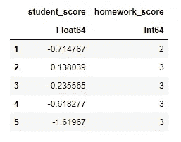

图 1:样本合成数据集

学生的学生成绩只是从标准正态分布中抽取的随机变量。

学生的家庭作业分数是学生分数的函数。具体来说，就是:

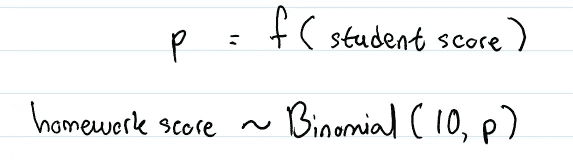

图 2:学生成绩和作业成绩之间的关系

其中 f(x)即链接函数是逻辑函数。

基于图 2 中的数据生成过程，我们可以对问题建模如下:

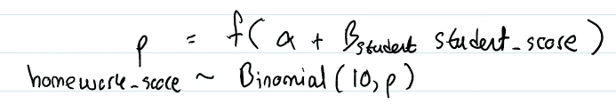

图 3:对图 2 中的数据生成过程建模

其中α是截距，βstudent 是学生分数的系数。设置正确，推理步骤会给出α = 0，βstudent = 1。

我们的数据集由 10，000 个观察值组成。

# 缺失值场景

让我们假设每个学生都有一只狗，这只狗将代表缺失的价值机制。具体来说，一个学生会写作业，然后狗可能会吃也可能不会吃，这取决于各种因素。

如果作业被吃了，那么从我们的角度来说，学生的作业是缺失的。否则，我们将观察学生的作业，并能够相应地评分。

## 场景一:狗狗随意吃作业

以下 DAG 描述了这种情况:

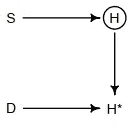

图 4:场景 1 的 DAG。来源:[1]

其中:

*   学生成绩
*   h:家庭作业分数
*   H*:观察到的家庭作业分数
*   那只狗

图 4 的要点是 D 吃不吃作业完全不依赖于 H 和 s。

如果我们假设有 50:50 的几率狗会吃掉一份作业，那么我们将有大约 5000 个完整的观察值(H*，观察到的作业分数，另一半会缺失)。

如果我们基于 H 的值执行推断步骤，即我们假设狗没有吃任何作业，我们得到:

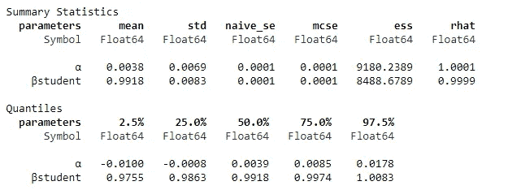

图 5:场景 1 中对 H 的推断结果

正如所料，我们可以恢复α和β学生的真实参数值(分别为 0.0038 和 0.9918)。

如果我们基于 5000 个完整的观察值执行推断步骤，即我们回归 S 上 H*的非缺失值，我们得到:

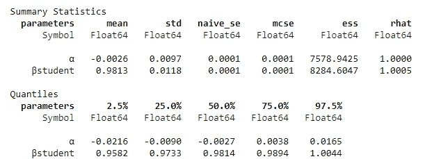

图 6:场景 1 中删除缺失值时的推断结果

我们仍然可以恢复真实的参数值！图 6 和图 5 的区别在于前者比后者有更多的不确定性。这是可以预料的，因为前者用 5000 个观察值进行推断步骤，而后者使用 10000 个观察值。

在这种情况下，缺失值可以被视为一种烦恼，我们可以通过简单地收集更多的数据来克服它。我们不需要诉诸估算价值。

## 场景二:狗吃高分学生作业

假设 S 影响 D，即:

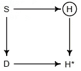

图 7:场景 2 的 DAG。来源:[1]

让我们想象一下，一只狗吃了高于平均水平的学生做的作业，即学生分数大于 0 的学生。

在这种情况下，我们最终也会有 5，000 个完整案例。对该子集执行推理步骤给出:

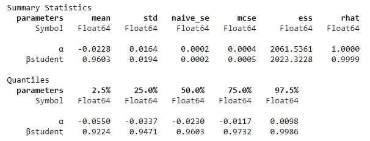

图 8:场景 2 中删除缺失值时的推断结果

我们可以恢复真实的参数，就像我们在场景 1 中所做的那样。然而，场景 2 不像场景 1 那样良性。

在场景 2 的这个特定示例中，我们假设不管 S 的值如何，S 和 H 之间的关系都是相同的。如果我们修改了这个示例，使其在 S > 0 时具有不同的关系，那么我们得到的结果是非常误导的，并且再多的探索性数据分析也无法检测到这一点，因为对于 S > 0 的学生，H*将具有缺失值！

这个场景表明，考虑丢失值产生的机制是很重要的。

## 场景 3:影响作业分数和 Dog 的中间变量

假设有一个中间且未观察到的变量 X 影响 S 和 D:

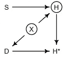

图 9:场景 3 的 DAG。来源:[1]

例如，设 X 为学生家中的噪音水平，则:

1.  如果家里的噪音水平很高，学生的作业就会很糟糕
2.  如果家里的噪音水平很高，狗就会吃作业

在这种情况下，让我们将 X 建模为一个遵循标准正态分布的随机变量。学生分数和家庭作业分数之间的关系变成:

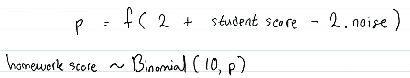

图 10:场景 3 中学生分数和家庭作业分数之间的关系

这意味着我们有:

*   α = 2
*   β学生= 1
*   β噪声= -2

让我们稍微偏离一下话题，假设没有丢失值，并且噪声水平是可观察到的，即在 S 和 x 上回归 H，结果如下:

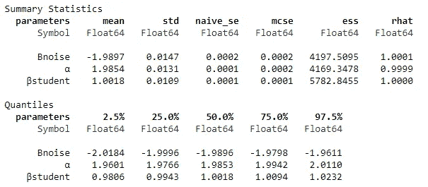

图 11:场景 3 的推断结果，假设有可观察到的噪声并且没有丢失值

不出所料，我们可以恢复真实参数。

如果我们假设没有丢失值，但噪声不可观测，会发生以下情况:

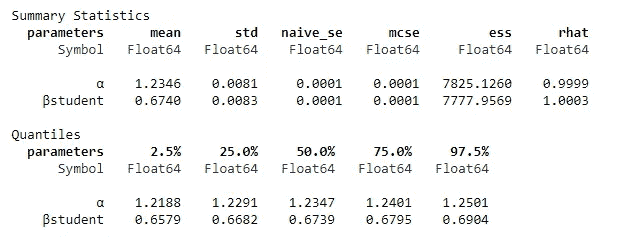

图 12:场景 3 的推断结果，假设不可观察的噪声和没有丢失的值

我们无法恢复 S 的真实参数值，尽管图 9 中的 DAG 清楚地显示没有从 H 到 S 的后门！

怎么回事？这是 GLMs 的一个局限性，在[1]的第 10.2.3 节中有详细讨论。随附的笔记本显示，如果我们将问题重新表述为简单的线性模型，即不具有链接函数的线性模型，无论噪声水平的可观测性如何，我们仍然可以恢复真实参数。

总之，回到最初的场景。如果推理即使在没有丢失值的情况下也表现不佳，那么在有丢失值的情况下肯定也会表现不佳，对吗？

让我们假设，如果噪音水平大于 1，那么狗将吃掉作业，导致作业分数的值缺失。这给出了一个只有 15.80 %缺失值的数据集。对完整的观察值进行推理步骤给出:

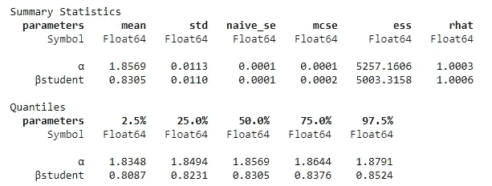

图 13:假设不可观察的噪声和缺失值，对场景 3 结果的推断

我们无法恢复 S 的真实参数值，但至少与图 12 中的结果相比偏差较小(0.8305 比 0.6740)。但是，这只是生成缺失值的函数的产物，而不是 DAG 的属性。请看随附的笔记本，其中缺失值函数的结果是估计值 0.6387。

这种情况的要点是，混淆变量并不是有偏见的估计的唯一原因。车型的选择，例如 GLM vs LM，也会起到一定的作用。

## 场景 4:作业影响狗

假设 H 以某种方式影响了 D:

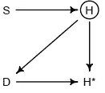

图 14:场景 4 的 DAG。来源:[1]

比如作业分数低于 5 分，那么狗就要吃了。这给出了约 44%的缺失值的观察值。

显然，如果我们在 S 上回归 H，那么我们将能够恢复βstudent 的真实参数值。详见随附的笔记本。

如果我们试图在 S 上回归 H*，那么我们会遇到一个问题，因为有一条通向 H*的后门路径，即 S → H → D → H*。

我们要么想出一种方法来阻止狗吃学生的作业，即采取更好的测量方法，要么将缺失值机制纳入推理步骤，假设我们对此有所了解。后者将是未来文章的主题。

# 经验教训

本文关于处理缺失值的关键要点是，我们应该起草一个我们认为代表数据生成过程的 DAG。

基于 DAG，我们可以确定处理丢失值的最佳操作。例如，如果缺失值机制类似于场景 1，那么如果我们希望获得更好的估计，我们可以安全地忽略它们或者收集更多的数据。没有必要应用任何花哨的插补方法。

我们还应该基于我们创建的 DAG 来模拟数据，以查看我们提出的建模方法将如何表现。这将让我们深入了解我们方法的任何局限性，就像场景 3 中一样。

# 结论

本文展示了不同的缺失值机制如何需要不同的策略，以及为什么总是默认删除缺失值的观察结果会在某些情况下导致糟糕的估计。

我希望你已经发现这是有用的。

# 参考

[1]统计学再思考:贝叶斯课程与实例，R 和 Stan，第 2 版。麦克尔瑞斯。2020