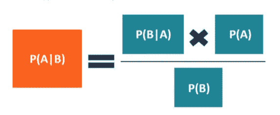
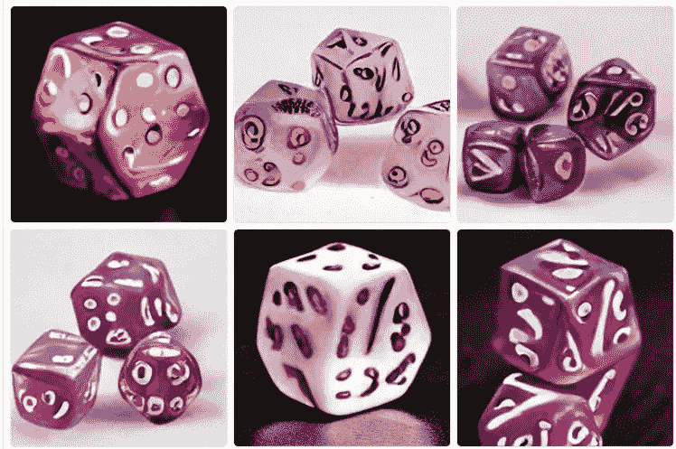

# 贝叶斯推理:机器学习的 5 个最佳模型和 10 个最佳实践

> 原文：<https://pub.towardsai.net/bayesian-inference-the-best-5-models-and-10-best-practices-for-machine-learning-11238a43929e?source=collection_archive---------0----------------------->

## 将贝叶斯推理应用于机器学习问题的优势、5 大模型和 10 大最佳实践

来自 Pixabay

贝叶斯推理是一种流行的机器学习技术，它允许算法基于先验信念进行预测[1]。在贝叶斯推理中，预测值的后验分布(从观察数据中得出)根据新的证据进行更新。我将探索贝叶斯推理的各种好处，并概述如何将其用于机器学习。此外，我将回顾贝叶斯推理的一些常见应用，并讨论使用这种技术时面临的一些挑战。

贝叶斯推理是一种机器学习的概率方法，它提供对特定事件概率的估计。贝叶斯推理特别适合于基础分布(或模型)未知或复杂的情况。贝叶斯方法的推理通常由学习者和采样器联合执行[2]，这允许对潜在模型参数的空间[11]的有效探索。

在某些任务(如图像识别和自然语言处理)的预测性能方面，贝叶斯方法已被证明比传统的概率模型更准确。此外，贝叶斯方法通常更适合有许多环境变量可以影响结果的情况。

贝叶斯推断有几种变体，各有优缺点。例如，当基础概率分布的结构是已知的(即，当模型是有效的)时，分层贝叶斯[3]推理是优选的，尽管这种变体在分析高维数据集时有困难。另一方面，当模型是非线性的(即，具有许多自由参数)时，变分贝叶斯推断[4]可以更精确。但是，这种变体的计算可能更耗时。

来自 Pexels 的约书亚·米兰达

# **什么是贝叶斯推理**

贝叶斯推理是一种统计方法，用于理解预测问题中固有的不确定性。贝叶斯推理算法可以被视为马尔可夫链蒙特卡罗算法，它使用先验概率分布来优化似然函数。

贝叶斯推理的基础是先验概率和后验概率的概念。

—先验概率是在考虑任何证据之前事件发生的概率。

—后验概率是在考虑了所有可用证据后，事件发生的概率。

例如，如果我们想知道明天下雨的概率，我们的先验概率将基于我们对本地区天气模式的了解。在我们检查了天气预报并发现有 70%的降水机会后，我们的后验概率将被更新以反映这一新信息。

在贝叶斯推理中，我们根据新的证据使用这些概率来更新我们的信念。这种更新是使用贝叶斯定理完成的，该定理指出:

来自[6]

或者，

P(A|B) = P(B|A) * P(A) / P(B) [5]

**其中 A 和 B 是事件，P(A|B)是给定 B 的条件概率，P(B|A)是给定 A 的 B 的条件概率**

在给定一些证据的情况下，应用贝叶斯定理，我们可以计算不同事件发生的后验概率。例如，假设我们有两个事件:A(明天会下雨)和 B(明天会出太阳)。我们可以使用贝叶斯定理来计算每个事件发生的后验概率，假设我们知道今天的天气情况:

P(A | sunny)= P(sunny | A)* P(A)/P(sunny)

P(B | sunny)= P(sunny | B)* P(B)/P(sunny)

晴天是我们的证据(今天的天气状况)。

从这些等式中，我们可以看到，如果事件 A 比事件 B 更有可能导致晴天，那么假设今天的天气条件是晴天，A 发生的后验概率将高于 B 发生的后验概率。相反，如果事件 B 比事件 A 更有可能导致晴天，那么假设今天的天气条件是晴天，则事件 B 发生的后验概率将高于事件 A 发生的后验概率。

实现贝叶斯推理的一种方式是通过马尔可夫链蒙特卡罗(MCMC) [9]，这是一种在数值上近似后验概率的方法。MCMC 的工作原理是从后验分布中产生一系列随机样本。然后，该序列可用于估计后验分布的各种特征，如均值和方差。

来自 Pexels 的 Adam Fejes

# **贝叶斯推理的优势**

自 18 世纪以来[10]，统计学家一直使用贝叶斯推理来更新他们对周围世界状况的信念，给出新的证据。贝叶斯推理当时被视为一种推理方法，它从关于某个量或假设的某种先验信念开始，然后根据新证据给出的可能性，使用新证据来修改这种信念。

贝叶斯推理比其他推理方法有很多优点。首先，它非常灵活，可以应用于任何存在不确定性的情况。第二，它允许量化不确定性，这在许多领域都很重要，如医学和工程。第三，它有一个坚实的理论基础，这个理论基础是由一些数学和统计学领域最伟大的头脑在几个世纪里发展起来的。

第四，也许是最重要的，贝叶斯推理允许我们在做决定时考虑我们自己先前的信念。这一点很重要，因为我们先前的信念通常包含不应该被忽视的有价值的信息。例如，以我的朋友为例，他是一个糟糕的司机，我之前认为他是道路上的危险分子是基于我对他的驾驶习惯的观察。当决定是否让他开我的车时，这种先入为主的信念是应该考虑的有价值的信息。

## **更多技术:**

一些包括处理高度不确定性的能力[8]，它的相对简单的实现，以及它在调整算法参数时提供的灵活性。例如，它不仅可以提供参数的均值估计，还可以提供参数的方差估计，甚至在基本分布未知或复杂时也可以使用。另外:

1.贝叶斯推理可以考虑关于参数的先验信息，这在某些情况下非常有用。

2.贝叶斯分析由于其捕捉不确定性的能力，通常比其他方法产生更现实的结果。

3.由于使用了子采样技术，贝叶斯方法通常比其他方法计算效率更高。

4.贝叶斯分析是灵活的，可以很容易地适应不同类型的数据和不同类型的问题。

5.贝叶斯方法通常比其他方法提供更好的预测，因为它们能够解释线性和非线性关系。

因此，贝叶斯推理可以(1)处理连续和离散数据类型；(2)提供不确定性的估计；(3)进行预测；以及(4)用于在面对新证据时更新信念。

作者

# **机器学习的 5 大贝叶斯推理模型**

1.朴素贝叶斯

2.逻辑回归

3.线性判别分析

4.支持向量机

5.决策树

除此之外，一些常用于机器学习的贝叶斯推理模型包括高斯过程、马尔可夫链蒙特卡罗方法和变分法。

# **将贝叶斯推理应用于机器学习问题的最佳实践**

使用这些模型可以:

1.估计给定结果的概率。

2.鉴于新的证据，更新信念。

3.对未来事件做出预测。

4.理解不确定性对预测的影响。

5.适应数据随时间的变化。

还有，

1.仔细定义模型结构和先验。

2.为训练和测试选择合适的数据集。

3.选择与模型结构一致的距离度量。

4.执行充分的采样以准确估计模型参数。

5.使用模型平均或其他方法说明模型的不确定性。

来自 Pexels 的 Karolina Grabowska

如果您有任何编辑/修改建议或关于进一步扩展此主题的建议，请考虑与我分享您的想法。

# **另外，请考虑订阅我的每周简讯:**

 [## 周日报告#1

### 设计思维与 AI 的共生关系设计思维能向 AI 揭示什么，AI 又能如何拥抱…

pventures.substack.com](https://pventures.substack.com/) 

*参考文献。*

*1。关于自我(和他人)的贝叶斯推论:综述。(未注明)。意识和认知，25，67–76。*[*https://doi.org/10.1016/j.concog.2014.01.009*](https://doi.org/10.1016/j.concog.2014.01.009)

*2。Geweke，J. (1989 年)。蒙特卡罗积分在计量经济模型中的贝叶斯推断。计量经济学，57(6)，1317-1339。*[*https://doi.org/10.2307/1913710*](https://doi.org/10.2307/1913710)

*3。戈什，J. K .，德兰帕迪，m .，&# 38；北达科他州萨曼塔。贝叶斯分析导论。检索到 2022 年 7 月 19 日，来自*[【https://link.springer.com/book/10.1007/978-0-387-35433-0】T21](https://link.springer.com/book/10.1007/978-0-387-35433-0)

*4。佩斯利，j .，布莱，d .，&# 38；约旦，M. (2012 年 6 月 27 日)。随机搜索的变分贝叶斯推理。ArXiv.Org。*[*https://arxiv.org/abs/1206.6430*](https://arxiv.org/abs/1206.6430)

*5。伯恩鲍姆博士(1983 年)。贝叶斯推理中的基本速率:cab 问题的信号检测分析。美国心理学杂志，96(1)，85–94。*[*https://doi.org/10.2307/1422211*](https://doi.org/10.2307/1422211)

*6。公司金融研究所。(2020 年 5 月 24 日)。贝叶斯定理。公司金融研究所。*[*https://corporatefinanciinstitute . com/resources/knowledge/other/Bayes-theory/*](https://corporatefinanceinstitute.com/resources/knowledge/other/bayes-theorem/)

7 .*。统计分析中的贝叶斯推断。(未注明)。检索 2022 年 7 月 19 日，来自 https://books.google.com/books?hl=en*[T3&# 38；lr =&# 38；id = t8 askeyk 1k 4 c&# 38；oi = fnd&# 38；pg = PR11&# 38；dq =贝叶斯+推理+a _ priori&# 38；ots = jvn 3 MX FSN 1&# 38；SIG = 8 clyogq 62 bv 2 xbcaonj 8s _ 1r _ iI # v = one page&# 38；q =贝叶斯% 20 推论% 20a _ 先验&# 38；f =假](https://books.google.com/books?hl=en&#38;lr=&#38;id=T8Askeyk1k4C&#38;oi=fnd&#38;pg=PR11&#38;dq=bayesian+inference+a_priori&#38;ots=jVN3mXfSN1&#38;sig=8cLYOgQ62bv2xbcaOnj8S_1r_iI#v=onepage&#38;q=bayesian%20inference%20a_priori&#38;f=false)

*8。法林博士，&# 38；斯特兰德堡-佩什金(2015 年)。使用贝叶斯推理估计社会网络数据的不确定性和可靠性。皇家学会开放科学，2(9)，150367。*[*https://doi.org/10.1098/rsos.150367*](https://doi.org/10.1098/rsos.150367)

*9。马尔可夫链蒙特卡罗。(未注明)。检索于 2022 年 7 月 19 日，来自*[*https://books.google.com/books?hl=en&# 38；lr =&# 38；id = x01 zdwaaqbaj&# 38；oi = fnd&# 38；pg = PP1&# 38；dq =贝叶斯+推理+马尔可夫+链+蒙特卡罗+(MCMC)&# 38；ots = ecFHhpXXri&# 38；SIG = hcx 8 q 9 NDF 65 Yb 701 x-5 ryuspotu # v = one page&# 38；q = bayesian %推论% 20 Markov % 20 chain % 20 Monte % 20 Carlo % 20(MCMC)&# 38；f=false*](https://books.google.com/books?hl=en&#38;lr=&#38;id=X01ZDwAAQBAJ&#38;oi=fnd&#38;pg=PP1&#38;dq=bayesian+inference+Markov+chain+Monte+Carlo+(MCMC)&#38;ots=ecFHhpXXri&#38;sig=hcx8q9NDF65yb701X-5RyuSpoTU#v=onepage&#38;q=bayesian%20inference%20Markov%20chain%20Monte%20Carlo%20(MCMC)&#38;f=false)

*10。安德鲁·吉尔曼。贝叶斯统计的发展。*[*http://www . stat . Columbia . edu/~ gel man/research/published/Bayes _ history . pdf*](http://www.stat.columbia.edu/~gelman/research/published/bayes_history.pdf)

11。串行、并行和相互作用的数值预测。[*https://link . springer . com/content/pdf/10.3758/s 13428-012-0202-4 . pdf*](https://link.springer.com/content/pdf/10.3758/s13428-012-0202-4.pdf)