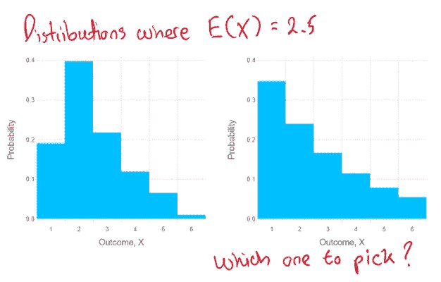
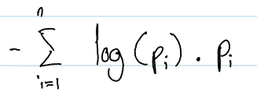
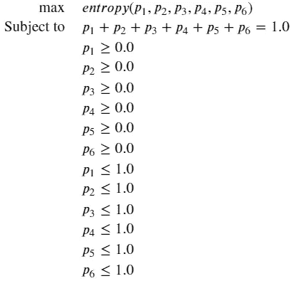
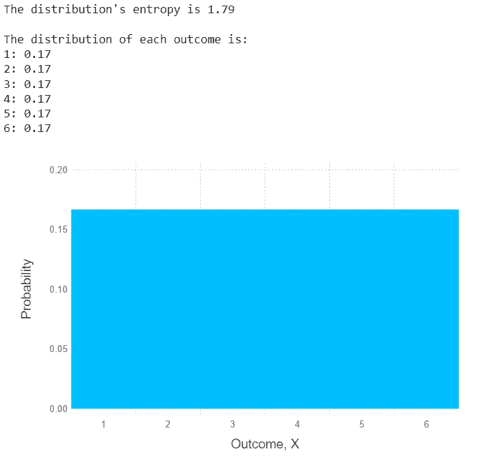
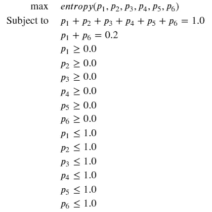
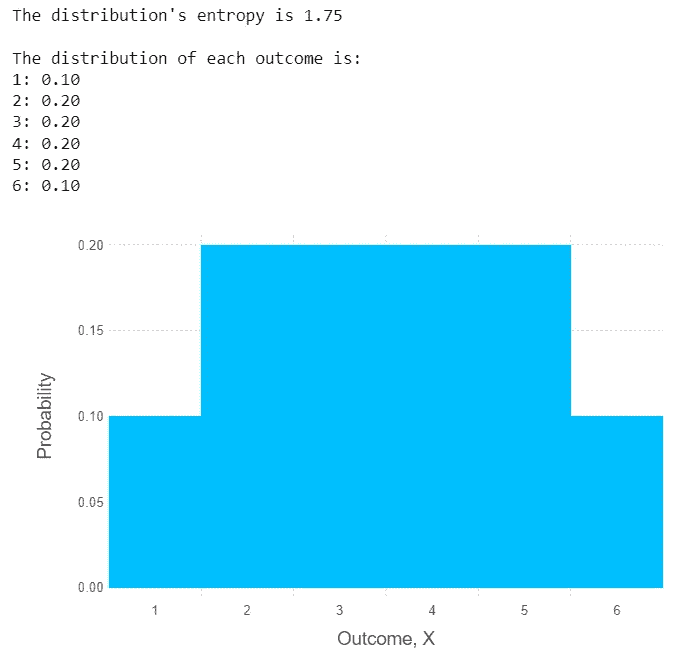
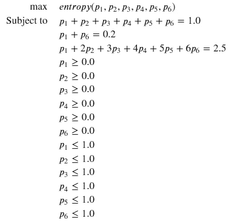
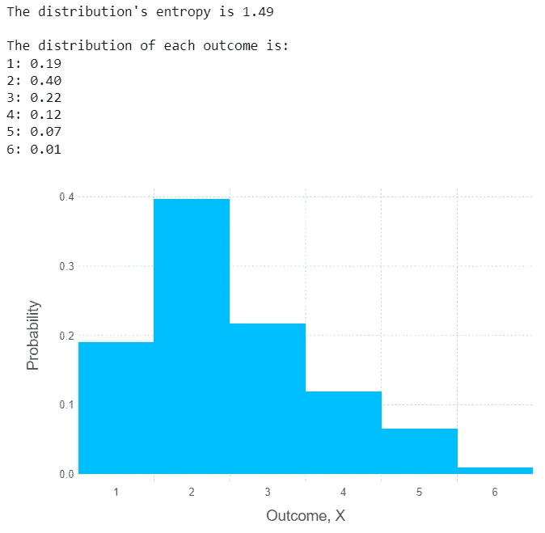
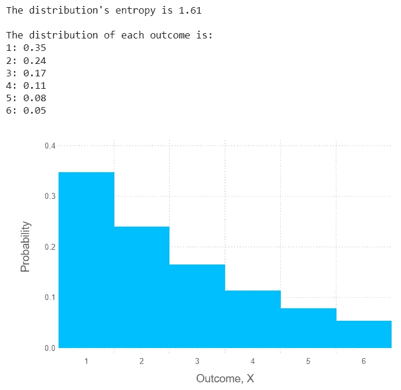

# 贝叶斯推理简介

> 原文：<https://pub.towardsai.net/bayesian-inference-the-maximum-entropy-principle-69c7494e6550?source=collection_archive---------1----------------------->

## [数据科学](https://towardsai.net/p/category/data-science)，[统计](https://towardsai.net/p/category/statistics)

## 第五部分:最大熵原理概述

# 介绍

在这篇文章中，我将解释什么是最大熵原理，如何应用它，以及为什么它在贝叶斯推理的上下文中是有用的。

复制结果和数字的代码可以在这个[笔记本](https://github.com/hsm207/statrethinking-julia/blob/master/book/10_MaxEnt_And_GLM/maxent.ipynb)中找到。

# 概观

最大熵原理是一种创建概率分布的方法，它与给定的一组假设最一致，仅此而已。文章的其余部分将解释这意味着什么。

# 熵

首先，我们需要一种方法来测量概率分布的不确定性。我们将使用熵来衡量这种不确定性，其定义如下:

图 1:熵的定义

其中，pᵢ是第 I 个事件发生的概率。

从图 1 可以清楚地看出，熵只是分布中每个事件的概率对数的加权平均值的负值。

了解熵的一个有用特性是，当概率分布均匀时，熵最大[1]。这具有直观的意义，因为如果所有事件都有同等的可能性发生，那么不确定性是最高的，因为这等同于说任何事情都可能发生。

# 一种寻找最佳概率分布的方法

在本节中，我们将讨论如何对 6 面骰子的滚动进行建模。

## 没有约束的分布

假设我们对骰子一无所知。因此，模拟投掷的合理方法是假设所有结果的可能性相等，即均匀的概率分布。

一个更技术性的解决方案是将此视为一个优化问题，目标是在给定一些约束的情况下最大化不确定性。换句话说，目标函数是概率分布的熵，我们希望选择掷出 1，2，…，6 的概率，使得熵最大化，并且概率总和为 1。

优化问题的公式如下:

图 2:寻找公平的六面骰子的最大熵分布

结果如下:

图 3:解决图 2 中优化问题的结果

正如所料，概率分布在掷骰结果的范围内是一致的，即 1，2，… 6。

## 带约束的分布

假设我们想让这卷六面骰子显示出某些特性。例如，我们希望掷出 1 或 6 的概率为 0.20。我们如何才能做到这一点？

我们可以给 p₁和 p₆分配任意数量的概率，只要它们都在 0 和 1 之间，并且它们的和等于 0.20。同样，剩余的概率(0.8)可以在概率法则的约束下以我们喜欢的任何方式分配给其他结果。这是非常主观的，所以让我们使用上一节中的方法来寻找满足这些新约束的“最佳”概率分布。

下面是优化问题的公式:

图 4:在掷出 1 或 6 的几率为 0.20 的情况下，找出掷出 6 面骰子的最大熵分布

解决方案是:

图 5:解决图 4 中优化问题的结果

在这种情况下，解决方案是将掷出 1 或 6 的概率平均分配给 p₁和 p₆，剩下的概率也等于其他结果。

请注意，图 5 中的熵低于图 3 中的熵。这是因为，给定前者的概率分布，你可以预期掷出 2、3、4 或 5 的频率比后者高，这意味着不确定性较低。然而，你不可能得到一个不确定性比图 5 更高的概率分布，它仍然服从给定的约束。

让我们给概率分布再加一个约束:掷骰子的期望值必须是 2.5。优化问题就变成了:

图 6:与图 4 相同，但是对期望值有限制

解决方案是:

图 7:解决图 6 中优化问题的结果

# 为什么要最大化熵

下面是另一个概率分布，其期望值为 2.5(有关构造细节，请参考笔记本):

图 8:E(X)= 2.5 的另一个分布

假设您只对创建一个期望值为 2.5 的概率分布感兴趣，并且您通过反复试验设法得到了图 8 和图 7 中的概率分布。你应该选哪一个？

人们可以认为图 7 是“不正确的”,因为它反映了另一个假设，即掷出 1 和 6 的概率是 0.20。相比之下，图 8 只构建了对期望值的约束。

如果我们选择图 7，我们从分析中得出的任何结论都会隐含一个假设，即滚动 a 1 和 a 6 的概率是 0.20。这是不可取的，因为能够列出进入我们模型的所有假设有助于理解它的合理性以及它何时会崩溃。

这显示了最大熵原理的价值:我们可以建立概率分布，明确地只考虑我们的假设。其他的都是随机的。

# 示例应用

在贝叶斯推理中，当选择先验时，可以应用这个原则。

例如，可以证明，如果我们愿意假设一个参数的方差是有限的，那么“最好”解释这个假设的概率分布就是正态分布。有关更多详细信息，请参考[2]中的第 10 章第 10.1.1 节。

# 结论

本文给出了最大熵原理的概述，重点是如何使用它以及它对贝叶斯推理的有用性。为了理解该原理的内部工作原理，我建议浏览[3]中的资料。

# 参考

[1] [为什么概率分布均匀时熵最大？](https://stats.stackexchange.com/questions/66108/why-is-entropy-maximised-when-the-probability-distribution-is-uniform)交叉验证。最后访问时间:2020 年 7 月 19 日

[2]用 R 和 Stan 中的例子进行统计再思考。麦克尔瑞斯。2020

[3] [MaxEnt 和指数模型](https://www.cs.cmu.edu/~aberger/maxent.html)。最后访问时间:2020 年 7 月 19 日