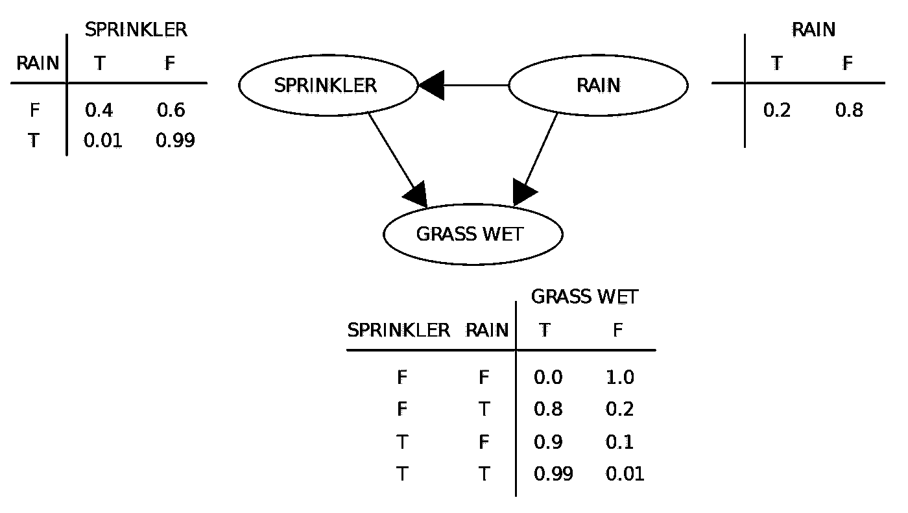
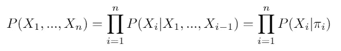
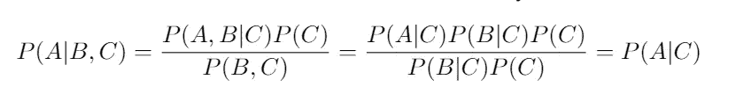
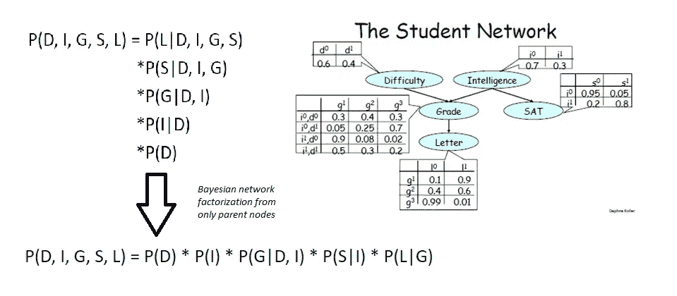
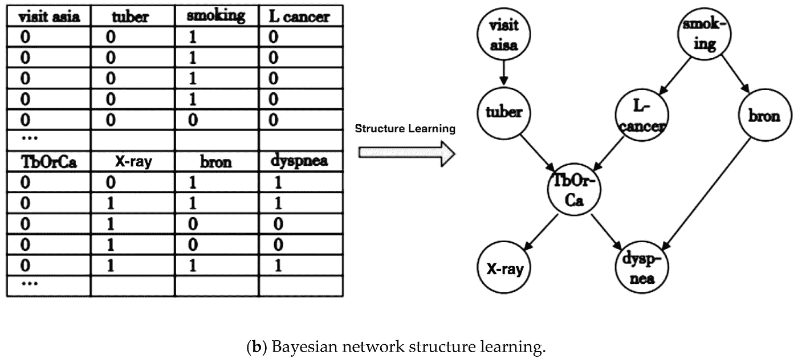

# 贝叶斯网络:如何让计算机推断因果关系

> 原文：<https://pub.towardsai.net/bayesian-networks-how-to-make-computers-infer-cause-and-effect-c64287332ec6?source=collection_archive---------1----------------------->

## 计算机能像人类一样推理因果关系吗？

在机器学习领域，对于如何预测感兴趣的输出，有几个阵营。一种可以被视为对产生特定数据点的潜在因果机制和相互关系不可知的模型，我认为这是(纯)判别模型，例如逻辑回归、决策树等。例如，为了确定输入 x 属于哪个类，使用训练集来反向拟合判定边界，该训练集简单地最大化该集合的标记训练点的间隔。另一种被称为生成模型，至少努力对底层数据生成过程进行建模——以观察变量和目标变量的联合概率分布的形式。这些允许我们表达其他变量之间的依赖关系，进而实际生成我们自己的样本数据。

在不太武断的情况下，我认为后一种方法会导致更可靠、更概括和更有用的预测。尤其是因为它考虑到了可解释性，以及它模仿人类如何做出预测的更复杂的心理模型的方式。我发现一种特别有趣的生成模型是贝叶斯网络，在本文中，我将解释它是什么，以及为什么它在改变我们处理机器学习的方式方面具有巨大的潜力。

**什么是贝叶斯网络？**

1.  一个概率图形模型——又名。使用贝叶斯推理计算的变量之间的条件概率分布的图形表示
2.  一种有向无环图(DAG)，G = ( V，E)，其中 V 中的 n 个节点中的每一个都表示感兴趣的随机变量，有向边 E 以条件概率依赖的形式编码信息或因果影响。

贝叶斯网络的一个实际例子。对于每个节点，有一个条件概率表，它根据父节点计算条件。例如，下面的表格通过说明在给定父变量所有可能状态组合的情况下草被弄湿的概率，充分代表了 P(草湿|洒水器，雨)。然后，可以通过将三个条件概率分布中的每一个相乘来计算该网络的联合概率。(来源:[https://commons . wikimedia . org/wiki/File:simplebayesnet . SVG #/media/File:simplebayesnet . SVG](https://commons.wikimedia.org/wiki/File:SimpleBayesNet.svg#/media/File:SimpleBayesNet.svg))

**贝叶斯网络有什么特别之处？**

甚至没有提到因果推理的可能性，贝叶斯网络是一个有用的和优雅的概率分布的表示，原因有很多。

基本上，它们允许我们有效地表示联合概率函数。给定 n 个离散变量的分布 P，X1，X2，… Xn，我们已经知道概率演算的链式法则允许我们将这个联合概率分布分解成它的条件分布的乘积。然而，使用贝叶斯网络，我们可以进一步简化这一点。如下式所示，我们可以分解该联合，使得每个节点 Xi 的条件分布仅是其“父”节点πi 的函数。这里，我们将父节点πi 定义为 Xi 的最小前任集，这使得 Xi 独立于其所有其他前任。

等式 1:联合概率可以分解为其条件概率的乘积(链式法则)。并且利用局部马尔可夫性质的假设，这可以进一步分解为仅其父节点πi 的条件的乘法

看上面的例子网络，P(洒水器|雨，湿草)= P(洒水器|雨)就是因为这个性质。由此我们也可以说，联合概率 P(洒水车，雨，湿草)= P(雨)*P(洒水车|雨)*P(湿草|雨，洒水车)。这本质上是如何阅读贝叶斯网络。

为什么 Xi 可以独立于除其父节点之外的所有其他节点？在实践中，这是我们从数据中观察和确定的，然后建立为任何贝叶斯网络的定义假设。这被称为局部马尔可夫特性**。**

*局部马尔可夫性质* =每个节点有条件地独立于所有给定其父节点的非后代节点。

**但是变量“条件独立”意味着什么呢？**

鉴于条件独立性是贝叶斯网络不可或缺的一部分，也是其推导因果关系的最终主张，我认为花点时间来定义这一点并对其真正含义建立一些直觉是很重要的。

给定 C，称 A 条件独立于 B 当且仅当:
P(A，B|C) = P(A|C) P(B|C)

即，在离散术语中，给定事件 C 发生，事件 A 和事件 B 都发生的概率等于给定事件 C 发生，A 发生的概率和给定事件 C 发生，B 发生的概率。不是很直观…

另一个等价的——可能更有用的——定义是使用贝叶斯法则推导出来的:

也就是说，*一旦 C 的结果已知，学习 B 的结果将* ***不会影响我们对 A 的结果*的信念** *。*

回到上面的局部马尔可夫属性的定义，一旦观察到一个节点的父节点的值/结果，该节点就独立于所有其他的前任节点(不是它的子节点的节点)。这就好比我们上面说的——P(洒水器|雨，湿草)= P(洒水器|雨)——洒水器是有条件独立于湿草的，给定了雨。假设下雨了，知道草地是湿的不会改变我们对洒水器是否开着的信念。在这背后有一些解释的理由，因为我们知道下雨使洒水装置不太可能打开，正如概率表所示——可能的情况是，如果看到刚刚下雨，无论谁打开洒水装置，都不太可能这样做。由于雨水也会导致湿草，知道草是湿的并不一定会告诉我们任何关于洒水器是否打开的信息，特别是因为这种因果关系有方向性。希望通过这个例子，你可以开始看到条件独立性、信息/信念流和因果关系是如何联系在一起的…

演示贝叶斯网络如何允许简化联合概率分布，以便每个条件概率只取决于其父节点。从而减少了条件概率表的维数以及所需的计算。(来源:[https://slideplayer.com/slide/8587182/](https://slideplayer.com/slide/8587182/))

我们在等式 1 中看到的因式分解对我们很有用，原因有很多。首先是因为它显著减少了计算联合概率分布所需的参数数量。如果我们取 n 个二元变量(与连续值相反，其结果为真或假)，非简化联合分布将需要 O(2^n 的复杂度，而在每个节点最多有 k 个父节点的贝叶斯网络中，这将只是 O(n*2^k).例如，有 20 个变量，每个节点最多有 4 个父节点，这就是计算超过 100 万个概率和仅仅 320 个概率之间的差别。这使得对事件发生的不同组合的概率的评估，即概率推断，实际上是易处理的。

尽管这在计算上很奇妙，但我相信真正的意义来自于这种因式分解如何让我们构建不同变量之间因果关系的表示。此外，它如何给我们一个数学框架来通过数据学习这些复杂的关系！

**贝叶斯网络作为一种推断因果关系的方式**

如果我们思考人类是如何学会对世界进行推理的，我们每天都会收集大量关于我们周围发生的各种事件的数据，在我们的大脑中建立这些事件的条件概率的潜意识。在湿草的例子中，如果我们没有被教导关于世界的任何其他东西，我们将只能通过注意到下雨时有湿草的更高频率的实例来学习雨导致草变湿。我们会在湿草和雨之间建立一种*关联*…然而，通过对数据的暂时观察(没有及时看到一个接一个的事件发生),我们不一定会将它解释为是雨*导致了*湿草——也就是说，我们怎么知道它实际上不是相反的(听起来很疯狂),或者我们怎么知道没有其他变量混淆了原因？也许有一些现象，云导致水从草中的植物细胞中渗漏出来，因为下雨时天气变得多云，我们误以为是雨而不是云弄湿了草？这当然很傻，但我在这里试图说明的一点是，我们对一件事*导致另一件事*的解释依赖于有一些其他的参考变量来观察和联系。

与贝叶斯网络类似，拥有一个条件变量对于确定两个节点之间任何箭头的方向至关重要——否则我们如何在没有条件的情况下从数据中学习条件独立性关系？正如我们之前提到的，因果关系与条件独立性的概念有着内在的联系…假设条件变量的值是固定的，如果变量 A 的状态影响了我们对变量 B 的状态的信念，那么这就为我们相信因果关系提供了基础！现在，我们如何准确定义和形式化因果关系的哲学被证明是非常复杂的，也是另一篇未来文章的主题……但本质上，我们通过无数次观察不同因素略有变化的情况和事件来了解世界，以建立一个什么导致什么的本能画面，这可以通过计算实现吗！

结构学习是获取真实世界数据集(在这个例子中是离散数据)并且能够通过算法学习贝叶斯网络结构的过程。(来源:[https://www . research gate . net/figure/Asia-network-and-Bayesian-network-structure-learning _ fig 2 _ 336045197](https://www.researchgate.net/figure/Asia-network-and-Bayesian-network-structure-learning_fig2_336045197))

我发现贝叶斯网络最强大的地方是这种从日常现实世界数据中学习因果结构的形式化和能力——被称为**结构学习**。使用诸如基于*约束的*(使用数据执行变量之间的条件独立性测试)或基于*得分的*学习(优化贝叶斯/信息论得分函数)之类的算法，我们可以学习服从局部马尔可夫属性的最优网络，拟合检测到的条件独立性关系。例如，使用我们拥有的数据和不同状态下数据点的频率，我们可以通过检查 P(A|B，C) = P(A|C)来检测 3 个节点之间的边。然后，通过了解每个数据点的不同变量的状态，以及每个节点可能依赖的父节点，我们可以计算给定图表的数据的条件概率表——称为**参数学习**。

这是令人信服的，因为我们不仅可以解释因果链，这可能教会我们一些我们还不知道的东西，我们还可以计算新数据点处于特定状态组合的概率，也就是联合概率。这将使我们的人工智能能够预测比我们当前的机器学习方法更微妙和更全面的世界状态的结果，考虑和表达多个因素如何相互关联，从而以更具解释力、更像人类的方式这样做。

**参考资料/延伸阅读:**

*   生成性与歧视性—[http://audentia-gestion.fr/MICROSOFT/Bishop-Valencia-07.pdf](http://audentia-gestion.fr/MICROSOFT/Bishop-Valencia-07.pdf)
*   图形模型讲座幻灯片—[http://www . stats . ox . AC . uk/~ steffen/teaching/grad/graphical models . pdf](http://www.stats.ox.ac.uk/~steffen/teaching/grad/graphicalmodels.pdf)
*   朱迪亚·珀尔的因果关系—[http://bayes.cs.ucla.edu/BOOK-2K/](http://bayes.cs.ucla.edu/BOOK-2K/)