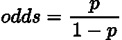
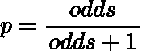
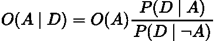
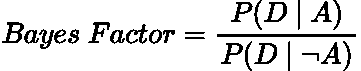
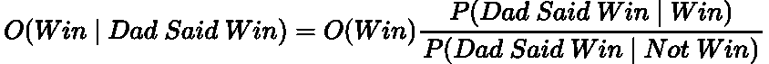
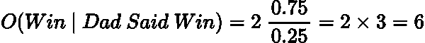
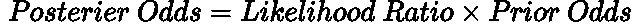

# 贝叶斯概率

> 原文：<https://pub.towardsai.net/bayesian-odds-8ae20601bdae?source=collection_archive---------2----------------------->

## 如何使用贝叶斯定理快速计算一个事件的概率

基南·康斯坦斯在 [Unsplash](https://unsplash.com?utm_source=medium&utm_medium=referral) 上的照片

# 介绍

在我们的贝叶斯之旅中，到目前为止，我们已经导出了贝叶斯定理，并回顾了当新数据出现时，如何用它来更新你的信念。你可以在这里看看那些文章(强烈推荐！):

 [## 条件概率和贝叶斯定理浅释

### 条件概率和贝叶斯定理的简单直观的解释。

pub.towardsai.net](/conditional-probability-and-bayes-theorem-simply-explained-788a6361f333)  [## 贝叶斯更新简单解释

### 用贝叶斯定理更新信念的直观解释

towardsdatascience.com](https://towardsdatascience.com/bayesian-updating-simply-explained-c2ed3e563588) 

在本帖中，我们将通过 [**几率**](https://www.888sport.com/blog/sport-betting-guide/odds-on-vs-odds-against) 用贝叶斯定理来计算和更新你的信念。

# 可能性

赔率是博彩公司在赌博中常用的一种表示概率的替代形式。

[赔率的公式定义为](https://en.wikipedia.org/wiki/Odds):

作者用 LaTeX 制作的方程。

其中 ***p*** 为事件发生的概率。例如，明天下雨的概率是 ***80%*** ，因此明天下雨的几率是*([十进制符号](https://www.aceodds.com/bet-calculator/odds-converter.html))或 ***4 比 1*** 。*

*我们可以使用以下公式从赔率转换回概率:*

**

*作者用 LaTeX 制作的方程。*

*所以用明天下雨的几率是 ***4.0 (4 比 1)*** ，那么概率就是 ***4/5 = 0.8*** ，所以 ***80%。****

# *英国博彩赔率*

*这些概率是统计学家的，是正式的定义。然而，在英国，博彩赔率的表示略有不同。*

*比如根据[帕迪力](https://news.paddypower.com/football/2022/06/16/who-will-win-premier-league-title-next-season-paddy-power-odds-2022-23/)，纽卡有 ***100/1*** 的赔率赢得下赛季英超冠军。现在，这显然不代表纽卡夺冠的可能性是 ***100*** 倍(对不起纽卡球迷)。实际上是相反的意思。纽卡斯尔有 ***~1%*** 的联赛夺冠几率。因此，一个 ***1 个*** 的赌注会用这些赔率回报 ***100 个*** 。*

*这些被称为 [**英国赔率**](https://www.investopedia.com/articles/investing/042115/betting-basics-fractional-decimal-american-moneyline-odds.asp) 。*

*在我们的例子中，我们将使用统计学家的版本/符号，因为在我看来，它更直观，在数学上更好！*

# *概率中的贝叶斯定理*

*我们可以用在某些情况下有用的奇数形式来表达贝叶斯定理。*

## *重温贝叶斯定理*

**

*作者在 LaTeX 中生成的方程。*

*   ****P(H):假设的*** 概率，这是****。*****
*   ******P(D | H):***[**似然**](https://en.wikipedia.org/wiki/Likelihood_function) **，**这个是给定我们当前的假设，我们的数据为真的概率。***
*   ******P(H|D):*** 概率给定数据当前假设是正确的。这是[的**后路**的](https://en.wikipedia.org/wiki/Posterior_probability)。***
*   ******P(D):*** *任何假设的数据的*概率。这是****，是可能性和先验的乘积之和:*******

**********

*****作者在 LaTeX 中生成的方程。*****

*****为了更深入地理解这个定理，请参考我在上面链接的以前的文章。*****

## *****赔率形式*****

*****贝叶斯定理可以用赔率重写为 T1:*****

**********

*****作者在 LaTeX 中生成的方程。*****

*   ********O(A|D)*** :事件发生几率 ***A*** 给定数据， ***D*** 。*****
*   ********O(A)*** :事件的一般赔率 ***A.********
*   ********P(D|A)*** :数据的可能性， ***D*** ，给定事件 ***A.********
*   ********P(D |*A*)***:数据的可能性， ***D*** ，给定 ***非事件 A.********

*****两种可能性的比值称为 [***贝叶斯因子***](https://en.wikipedia.org/wiki/Bayes_factor)***:********

**********

*****作者在 LaTeX 中生成的方程。*****

*****让我们通过一个例子来使这些公式更加具体。*****

# *****例子*****

*****让我们回到足球的类比。*****

*****纽卡斯尔队正在和布莱顿队比赛，我们假设他们赢这场比赛的几率是 2.0 (2 比 1) 。*****

*****不幸的是，你不能观看比赛，所以在全职时间你打电话给你的父亲，问他纽卡斯尔是否赢得了比赛。*****

*****你的父亲是桑德兰的支持者，他说纽卡斯尔赢了。但是，由于他是桑德兰球迷，有能力惹你，所以他有*75%的机会告诉你真相。******

> ******纽卡斯尔赢了这场比赛的可能性有多大？******

******我们可以用贝叶斯定理的赔率版本来回答这个问题。******

******使用我们之前展示的公式，我们在数学上有:******

************

******作者在 LaTeX 中生成的方程。******

******输入赔率和概率:******

************

******作者在 LaTeX 中生成的方程。******

******所以纽卡赢的赔率是 ***6 (6 比 1)*** ，也就是 ***~86%。*********

******另一个更快的计算方法是，赢的几率乘以你爸爸告诉你真相的几率 ***(2 x 3 = 6)*** 。******

************

******作者在 LaTeX 中生成的方程。******

# ******结论******

******在本文中，我们已经看到了如何使用赔率来表达贝叶斯定理，并通过一个简单的例子。贝叶斯赔率公式，在某些情况下，使得计算贝叶斯概率更快更容易。******

******此外，小心英国的赔率，因为他们很容易被误解！******

# ******和我联系！******

*   ******要在媒体上阅读无限的故事，请务必在此注册！T3*💜*******
*   ******[*当我在这里发布注册邮件通知时，可以获得更新！*](/subscribe/@egorhowell) 😀******
*   ******[*领英*](https://www.linkedin.com/in/egor-howell-092a721b3/) 👔******
*   ******[*推特*](https://twitter.com/EgorHowell) 🖊******
*   ******[*github*](https://github.com/egorhowell)*🖥*******
*   *********🏅*********

> *******(所有表情符号由 [OpenMoji](https://openmoji.org/) 设计——开源表情符号和图标项目。许可证: [CC BY-SA 4.0](https://creativecommons.org/licenses/by-sa/4.0/#)*******