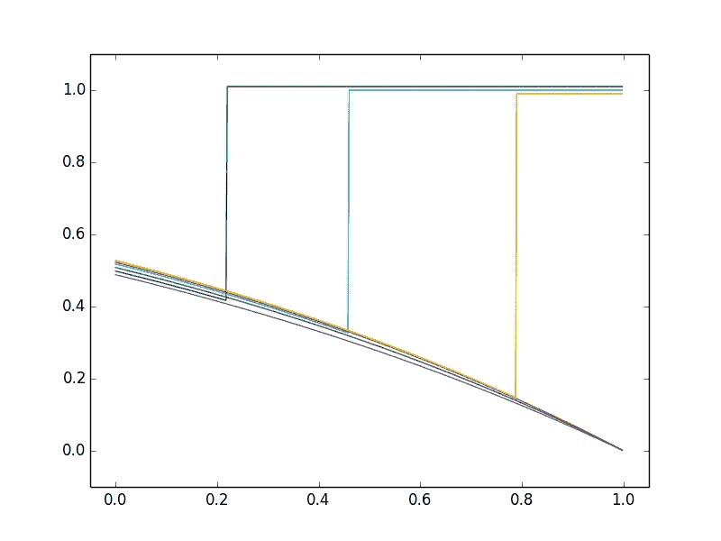
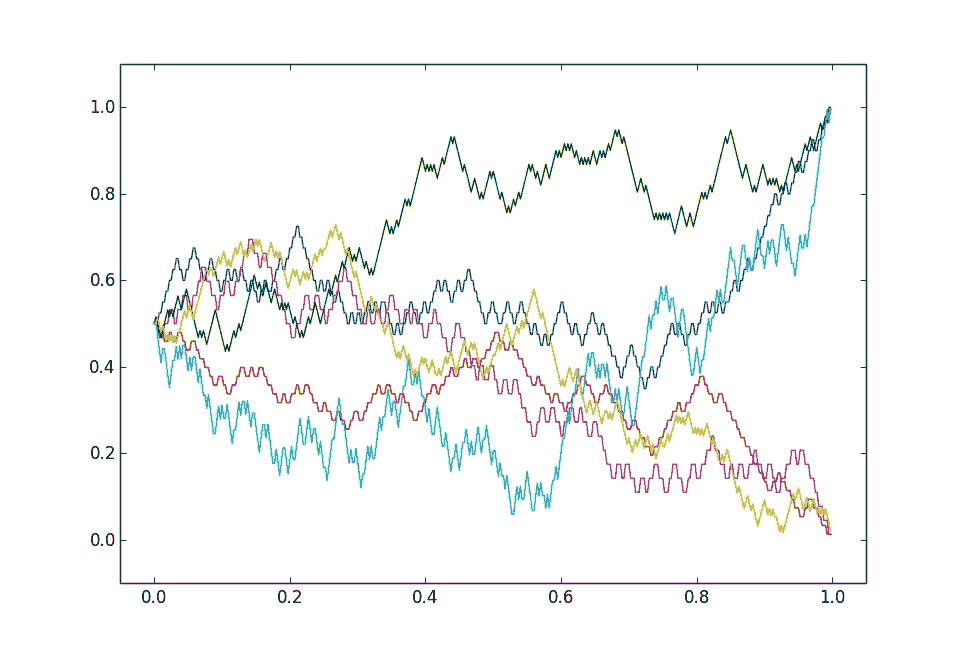
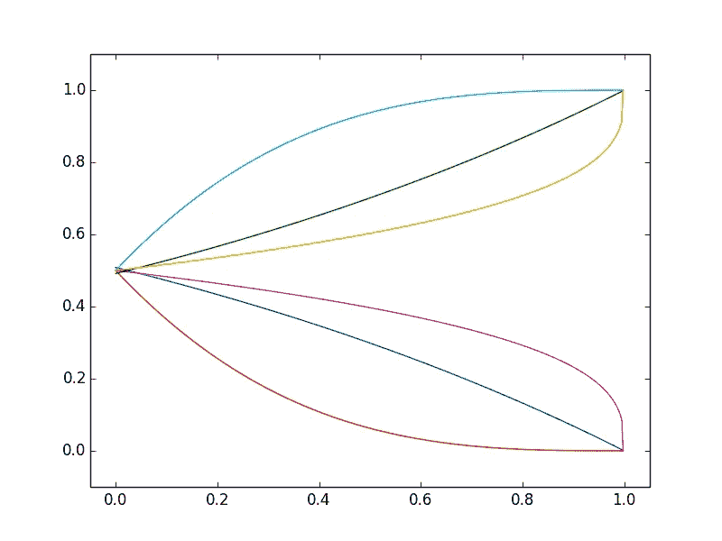

# 贝叶斯更新和“图像变得更清晰”的类比

> 原文：<https://pub.towardsai.net/bayesian-updating-and-the-picture-becomes-clearer-analogy-f5703b0cb820?source=collection_archive---------1----------------------->

## [概率](https://towardsai.net/p/category/probability)

贝叶斯更新是数据科学中的一个关键概念，即当新信息可用时修改估计值。很明显(在真实世界现象的精确概率模型中),修正后的估计值通常会更好。“更好”的一个简单而正确的数学公式是，修正只能降低估计的均方误差。

但是有一个微妙之处，在教科书中很少指出，那就是**实际**误差虽然经常减小，但通常不会在每个“新信息”步骤的**处减小。也就是说，“画面总是变得更清晰”的比喻是误导。**

我将在估算特定事件在特定日期之前发生的概率的背景下讨论这一点。假设一位专家首先评估的概率是 50%，然后是 60%，然后是 70%。很自然地，我们会察觉到一种趋势，并假设这种可能性很可能会增加到 80%，而不是减少到 60%。对于许多类型的数据——经济的或社会的——这样的趋势确实经常发生。但是概率不是那样的！

下面的三个数字表明了可能性和不可能性。每个图显示了 6 种典型的“实现”，即给定事件的概率可能随时间变化的方式。我们将初始概率取为 50%，并使其中 3 个实现在 1 处结束(事件发生)，其他 3 个在 0 处结束(事件未发生)。

第一个数字说明了在给定的截止日期之前，一个大地震是否会在一个给定的地方发生(提前很久，所以当前的概率是 0.5)。假设地震仍然不可预测，该图显示了截止日期前概率如何随时间变化的可能图表。在这里，一个人的直觉是正确的:只要地震没有发生，概率就会下降，但如果地震发生了，概率就会跳到 1。

第二张图说明了一个情境，在这个情境中，新信息只会对一个人的评估概率产生微小的变化。在这种情况下，变化必须在方向上变化(上下)，这导致了第二个图中的“锯齿状”曲线。这让人想起股市价格，这不是巧合。根据经典的“理性”理论，股票价格反映了对未来贴现利润的持续估计，这在数学上符合这一背景，至少在短期内是如此。

后者本身就是数学概率的一个显著见解。**股票价格特有的锯齿状并不局限于股票或金融领域，而是对未来事件可能性的缓慢变化评估的一个普遍特征。**

前两个数字显示了可能发生的情况——它们是极端情况，其他情况可能同时包含小的连续变化和大的跳跃。下面的第三个数字表明了“画面变得更清晰”的类比所暗示的东西——概率应该只随着接近最终结果而改变。**这不可能定期发生**(注意在第一张图中的一些实现中会发生)。

为什么不呢？基本上，因为断言

(a)现在的可能性是 60%

(b)概率将增加到 70%

是矛盾的；(b)将意味着概率已经是 70%。

## 笔记

从数学上来说，这是 T2 鞅理论的一部分。这是一篇关于[错误趋势效应信念](https://www.duo.uio.no/bitstream/handle/10852/71088/1/Risk%2BResearch_Hohle_Teigen%2BPostprint.pdf)的心理学技术论文。