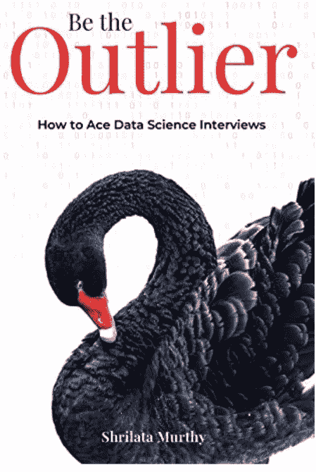
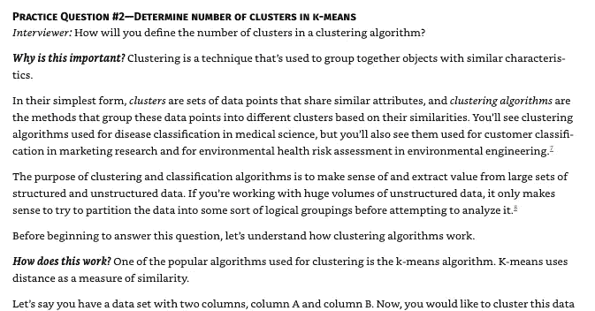
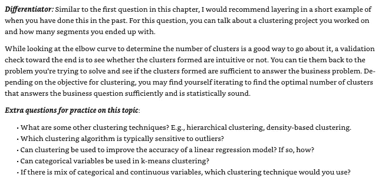

# 成为局外人——如何在数据科学面试中胜出

> 原文：<https://pub.towardsai.net/be-the-outlier-how-to-ace-data-science-interviews-9ba0f66122bf?source=collection_archive---------0----------------------->

## [职业](https://towardsai.net/p/category/careers)，[数据科学](https://towardsai.net/p/category/data-science)

## 我看的第一本数据科学书的全面回顾。

使用 Canva 设计

> “一次工作面试不仅是对你知识的测试，也是对你在适当时候运用知识的能力的测试”——匿名

我们大多数人都到了这样一个地步，我们不知道如何准备和工作面试需要什么技能。我们看到许多书籍/网站/文章都有吸引人的标题，如“500 个数据科学问题”、“亚马逊数据科学家采访准备”等。其中一些确实有很好的问题，但他们缺乏的是一个完整的包，有些错过了当前的市场趋势。

最近，我偶然发现一本书有另一个吸引人的书名，读了一遍后，我决定买下它。2020 年 8 月出版。

## 书的封面。

让我们开始复习吧。这本书分为四个部分。

# 简介—第 1 部分

这本书以**的*解释*什么是**数据科学*这个术语是如何产生的*以及**对当今世界的**影响开始。它以典型的数据科学角色，通过解释市场在寻找什么来继续前进。当我继续阅读的时候，我明白作者已经投入了大量的精力与来自苹果、脸书等不同公司的人接触，以概述所需的技能。所有不同角色的简要说明(即数据科学家、机器学习工程师等..)和每个角色所需的技能都有很好的概述。

**这本书如何与众不同** —“数据科学”一词背后的历史得到了清晰的解释，并根据当今的市场和趋势对每个角色的要求给出了清晰的解释。

# 破解技术面试——最精彩的部分。

这一部分由各种问题组成，涵盖建模、机器学习、概率、统计、SQL 和案例研究等领域。有趣的是，每个问题都被分成了几个部分。
1)问题
2)为什么这很重要？(这里详细解释概念。)
3)这个问题你怎么能不一样的回答，做局外人！与每个主题相关的更多练习题。

**以下图片为样本，不包含完整答案。**

所有的问题都不是以一系列常见问题的形式，而是以一个面试官和一个候选人之间的一般对话的形式，在我看来，与其他可用的书籍相比，这是一个非常突出的问题。本部分涵盖了 SQL 的所有基本概念、Python/R 编程、概率、统计、机器学习模型、示例案例研究。

**这本书如何是一个异数**——**直觉**。不是每个问题都直奔主题，而是在这里可以找到**为什么这个问题/概念很重要**这个问题/概念不是到处都有解释的。

# 如何展示我们的经验——第 3 部分

这一部分讲述了我们需要展示我们的项目的方式，并以适当的例子作为一个局外人。这也解释了三个不常发生的面试。还提供了一些练习题。
1)演示面试
2)行为面试
3)课后考试

带回家考试的概念是相当新的，这种考试所需的准备/计划得到了很好的解释。

# 制作我们的简历和作品集——第四部分

这是一个额外的部分，提供样本并解释我们需要如何制作简历。提示/建议给出了我们需要提及的技能，并解释了好/坏的简历会如何影响我们的机会。

这里可以买到这本书[！](https://www.amazon.com/Be-Outlier-Data-Science-Interviews-ebook/dp/B08F9M83LJ)

# 结论

与许多题库书籍不同，这本书提供了一种完全不同的体验。这本书主要强调了我们如何精心设计我们的答案，我们应该如何处理一个给定的问题，以及我们可以如何不同地回答它，而不是坚持 FAQ 格式。提供了许多实时统计数据和示例，传达了当前市场的状况。对于所有的数据科学爱好者来说，这是必须购买的！

如果你想联系，**在**[**LinkedIn**](https://www.linkedin.com/in/saiteja-kura-49803b13b/)**上联系我。**