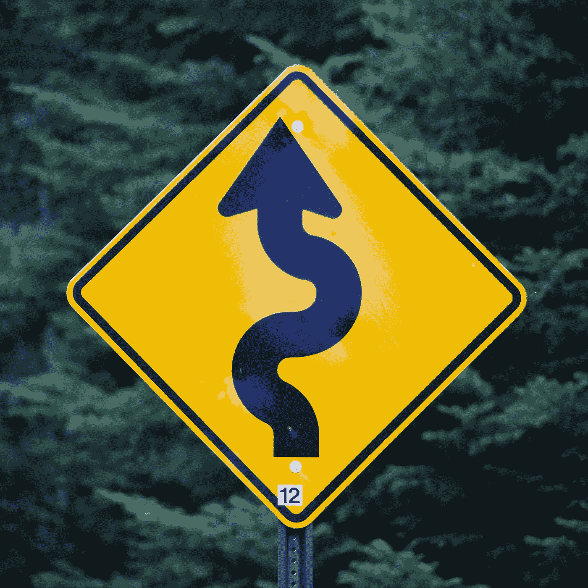

# 按照以下步骤，在 2021 年成为一名数据科学家

> 原文：<https://pub.towardsai.net/become-a-data-scientist-in-2021-with-these-following-steps-5bf70a0fe0a1?source=collection_archive---------0----------------------->

## [数据科学](https://towardsai.net/p/category/data-science)

## 走上数据科学家之路需要具备的基本点

由[马克·柯尼希](https://unsplash.com/@markkoenig?utm_source=medium&utm_medium=referral)在 [Unsplash](https://unsplash.com?utm_source=medium&utm_medium=referral) 上拍摄

数据科学家现在是每个人梦寐以求的工作。首先，问自己一个问题，我想成为一名数据科学家吗？当你发自内心地想要学习新事物时，就开始走上学习之路。从其他领域过渡到数据科学领域是非常困难的，因为它需要学习新的工具和语言。但是，别担心，我会让你的技能要求之旅变得简单一些。本文将为您概述成为一名数据科学家需要学习的主题。

职责:

*   数据收集和清理—这是预处理
*   对数据进行统计分析
*   可视化并从数据中做出推断
*   为未来预测建立良好的算法模型

假设你是一个新手，对这个领域略知一二，并准备接受挑战去学习。

 [## Python:从零到英雄(带示例)

### python 初学者手册指南

medium.com](https://medium.com/towards-artificial-intelligence/python-zero-to-hero-with-examples-c7a5dedb968b) 

## **第一步:学习数据科学领域的基础知识及其应用。**

*   首先，我们需要数据来处理。这些数据从哪里来这是基本需求。数据可以来自现实生活中的任何地方。
*   几乎大部分时间，我们都在解决一个问题，以提高企业收入和帮助社会。
*   在商业行业，我们有食物链，房地产，金融部门，消费品。
*   对于社会来说，我们需要开发新产品来帮助他们。比如，降雨预报，疫苗开发等等。
*   处理需要从特定领域收集的数据。
*   数据需要以可读数字格式存储。
*   通过使用高级统计工具，即机器学习算法，这些数据可用于为业务制作报告和未来预测。

## 第二步:学习数据科学的主干，即统计学。

*   统计数据是我们发展数据科学方法的基本需求。
*   统计数据需要我们正在处理的数据类型。它可以是总体数据或样本数据。大多数时候，我们只处理样本数据。

统计可以是描述性的，也可以是推断性的。

**描述性统计 **

这一部分从集中趋势测量和数据传播的角度处理数据的组织和汇总。本次分析的主题如下所示:

*   数据类型:它是一个类别或数字数据。
*   检查两类数据之间关系的图形和图表。
*   偏斜度:它表明了数据的形状和大部分数据的位置。
*   数据分布:它处理方差和标准差。

***推断统计***

这一部分是通过对样本数据的分析得出的结论和对总体的预测。该分析中的主题如下所示:

*   分布:数据可以用许多分布和标准误差进行分析。
*   置信区间:它处理一系列最重要的信息谎言。

*   假设统计:处理*零假设*和*交替假设*是否成立。

 [## Z-统计量，T-统计量，P-统计量还在迷惑你？

### 机器学习统计学中的定义和概念

medium.com](https://medium.com/towards-artificial-intelligence/z-statistics-t-statistics-p-statistics-are-still-confusing-you-87557047e20a) 

## 第三步:选择一种编程语言来构建模型。

如今，我们可以使用许多工具进行统计和预测建模。

开源:

*   Python:它被用于各种领域的编程，主要用于数据科学中的统计学和机器学习方法。
*   r:它用于统计和图形分析。

商业来源:

*   SPSS:它也用于统计分析，这是 IBM 的一个工具。
*   SAS:它用于业务、预测、数据管理分析等。

## 第四步:学习代数和微积分的基础数学。

对于数据分析人员来说，数学对于选择合适问题的好算法是非常重要的。

*   代数:研究向量、矩阵和函数等。
*   微积分:是一门研究积分、微分、极限等的学科。
*   不仅是这两个领域，还有许多主题需要学习和修改，以理解算法和公式的工作原理。

## 第五步:学习机器学习算法及其工作原理。

这是数据科学领域最热门的词。所有的预测都是在用机器学习算法对数据进行建模之后得出的。关于选择一个好的算法，这方面有很多概念可以学习。机器学习算法分为三类，如下所示:

*   ***监督学习***

监督学习是对已知目标或因变量的数据的算法。目标变量可以是数字和类别。

用于回归算法的数值数据，如用于线性的线性回归、用于非线性的逻辑回归、SVM 和随机森林，可用于回归和分类。

用于分类算法的类别数据，如随机森林、KNN、决策树，在这些算法中，我们对不同类型的对象进行分类。

*   ***无监督学习***

无监督学习用于聚类，因为数据没有依赖值或目标值。这种类型的算法有 K 均值、分层、DBScan 聚类。这些模型给出了聚类之间的比较分析。

*   ***强化学习***

这种学习是基于从错误中学习。学习的基础是在每次训练和建模后最小化错误，这需要自动决策。

## **结论:**

有志于数据科学的人至少需要了解我们在该领域所学的基本知识。这些步骤可能没有涵盖整个主题，但涵盖了一个基本概念。

我希望你喜欢这篇文章。通过我的 [LinkedIn](https://www.linkedin.com/in/data-scientist-95040a1ab/) 和 [twitter](https://twitter.com/amitprius) 联系我。

# 推荐文章

1.  [NLP —用 Python 从零到英雄](https://medium.com/towards-artificial-intelligence/nlp-zero-to-hero-with-python-2df6fcebff6e?sk=2231d868766e96b13d1e9d7db6064df1)

2. [Python 数据结构数据类型和对象](https://medium.com/towards-artificial-intelligence/python-data-structures-data-types-and-objects-244d0a86c3cf?sk=42f4b462499f3fc3a160b21e2c94dba6)

3. [MySQL:零到英雄](https://medium.com/towards-artificial-intelligence/mysql-zero-to-hero-with-syntax-of-all-topics-92e700762c7b?source=friends_link&sk=35a3f8dc1cf1ebd1c4d5008a5d12d6a3)