# 卷积神经网络入门指南-MNIST

> 原文：<https://pub.towardsai.net/beginner-guides-to-convolutional-neural-network-from-scratch-kuzushiji-mnist-75f42c175b21?source=collection_archive---------0----------------------->

## [机器学习](https://towardsai.net/p/category/machine-learning)


**图 1** :卷积神经网络(**来源**:[https://en.wikipedia.org/wiki/Convolutional_neural_network](https://en.wikipedia.org/wiki/Convolutional_neural_network))

在之前的文章中，你可以在这里查看，我已经在库祖什基-MNIST (KMNIST)数据集上演示了各种降维技术。在这篇文章中，我将使用`keras`从头构建卷积神经网络来预测 KMNIST 的类。

# CNN 是什么？

人工智能在过去几年里发展得更快，它是计算机科学的一个子领域，旨在创造智能机器。

人工智能有很多研究领域，例如，语音识别、自然语言处理(NLP)和计算机视觉。我将在这篇文章中重点介绍 ***计算机视觉*** 。

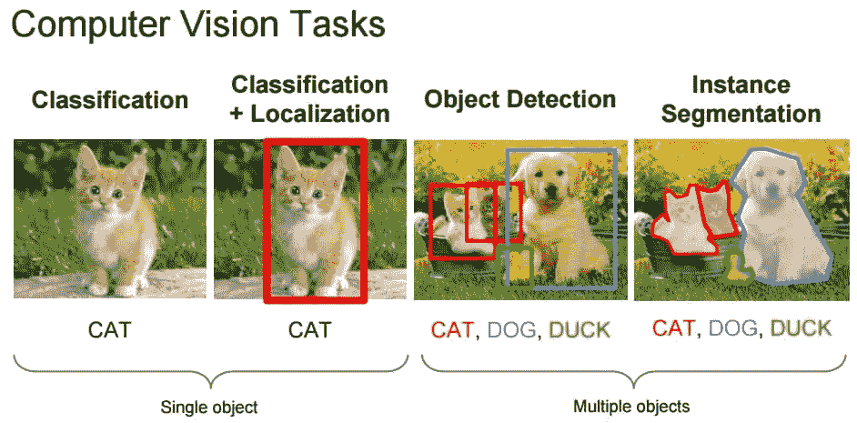

**图 2:** 计算机视觉任务示例(**来源** : [费-李非，安德烈·卡帕西&贾斯廷·约翰逊(2016)](http://cs231n.stanford.edu/slides/2016/winter1516_lecture8.pdf) )

计算机视觉的目标是使机器、计算机或程序能够像人类一样观察世界，并将这些知识应用于特定的任务，如图像和视频识别、图像分类。这是随着深度学习算法的进步而实现的，更具体地说，是一个**卷积神经网络** (CNN / ConvNet)。

> 卷积网络的架构是动物大脑中神经元的连接模式，受生物过程的启发，神经元之间的连接模式类似于动物视觉皮层的组织。

卷积神经网络具有通过应用相关滤波器来捕捉输入图像中的空间和时间依赖性的能力。由于所涉及的参数数量的减少和权重的可重用性，它对于图像数据集表现得更好。

# 它是如何工作的？

卷积神经网络(或 ConvNets)不像我们人类那样查看图像。我们将图像视为带有颜色的平面画布，我们可能不太关心图像的宽度和高度，但我们可以感知这些参数。

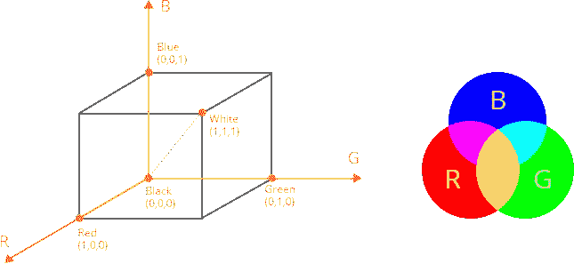

图 3: RGB 颜色组合

然而，ConvNets 将图像视为不同维度的对象，例如三维对象，其中三维作为颜色编码(或颜色通道)，主要是红绿蓝(RGB)，它组合并产生我们看到的颜色(当然，不仅仅是 RGB，例如灰度、HSV 和 CMYK)。

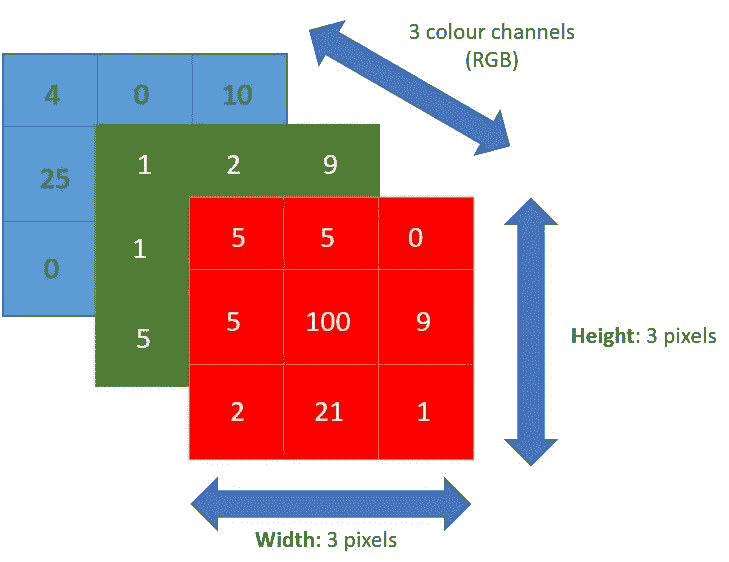

图 4: 3x3x3 RGB 图像

实现 ConvNets 的第一个关键点是精确测量图像的每个维度，因为它将成为用于处理图像的线性代数运算的基础。

图 4 演示了 ConvNets 如何处理 RGB 图像，每一层代表颜色(R-G-B ),数字代表强度(范围在 0 到 255 之间)。

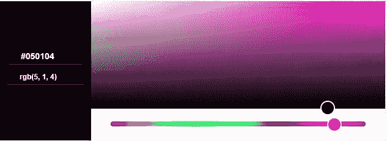

图 5: RGB(5，1，4)

从图 4 继续，如果我们取左上角的像素，RGB (5，1，4)。我们的眼睛会看到紫色。

想象一下现在的数码照片，一个 700 万像素的相机可以产生 3072 x 2304 像素(虽然我不是相机方面的专家！！)，那么这将是多么大的计算量呢？

卷积神经网络(ConvNets)要找出这些数字中哪些是重要信号(通过将图像简化为更容易处理的形式，并且不损失特征)，这实际上有助于它更准确地对图像进行分类。这是在设计 ConvNet 架构时要记住的另一个重要概念，该架构不仅擅长学习特征，而且更适合大规模图像数据集。

# 卷积神经网络层

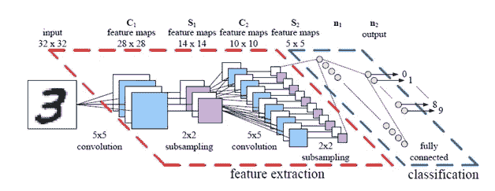

图 ConvNet 架构示例

ConvNets 中实现了几个主要层。

**Conv2D 层**

它是一个二维卷积层，主要用于从原始输入图像中提取特征。第一层负责捕捉低级特征，例如边缘、颜色、梯度方向。随着层的增加，该架构将试图捕捉高级功能。

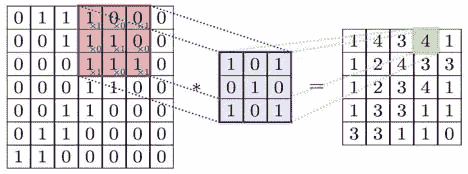

图 7:一维卷积

Conv2D 滤镜贯穿图像中的三个通道(红绿蓝)。每个频道的滤波器也可以不同。

红色区域显示当前**滤波器**被计算的区域，称为**感受野**。滤波器中的数字称为**权重**或**参数**。滤波器在图像周围滑动(或卷积)，它将计算*逐元素乘法*并将输出填充到输出，这被称为**激活图**(或**特征图**)。

我们可以有多个卷积层来识别和捕捉高级特征，但这需要更多的计算能力。

**汇集层**

卷积层之后的下一层是汇集层(或下采样或子采样)。激活贴图被输入到下采样层，这个层将一次应用一个补丁(像卷积层)。

汇集图层逐渐减小了制图表达的空间大小。因此，它减少了网络中的参数数量和计算量。汇集层也旨在控制过度拟合。

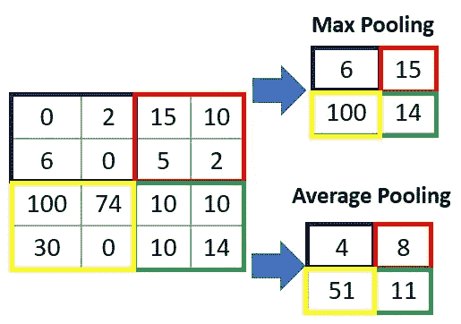

图 8:池层的类型

有两种主要类型的池层:**最大池**返回特定池大小(2x2)的最大值，而**平均池**返回特定池大小的所有值的平均值，如图 8 所示。

最大池作为**噪声抑制**，而平均池作为噪声抑制机制进行维度缩减。因此， **max-pooling 比平均池**执行得好得多，并且是**最常实现的**池层。

在经历了上面的 max-pooling 层之后，我们已经使 ConvNet 模型能够理解图像特征。下一部分，我们将把它输入到完全连接的神经网络进行分类。

然而，在将池层的输出馈送到全连接层之前，我们需要一个中间层来转换 FC 层中分类任务的数据的维度，这个中间层被称为**扁平化层**。

**展平图层**

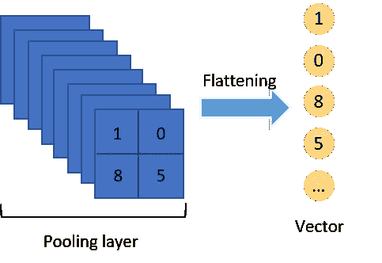

图 9:展平图层

如前所述，顾名思义，这一层将把多维数组展平/转换成一个长的连续的线性向量。用更专业的术语来说，它打破了数据的空间结构，将多维张量转换为一维张量，因此成为向量。

**密集/全连通层**

每个神经元接收来自前一层所有神经元的输入，因此连接紧密。该层具有权重矩阵𝑊、偏置向量𝛽和前一层的激活𝑎.从图 10a 中可以看到一个例子。

`Dense`实现`output = activation(dot(input, kernel) + bias)`的操作。

**辍学**

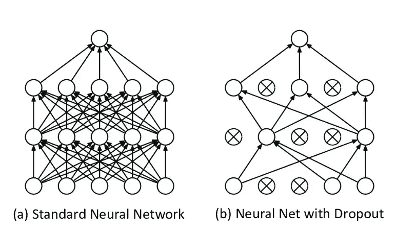

图 10: Dropout method ( **来源** : Giorgio Roffo， [Ranking to Learn 和 Learning to Rank:On the rolling in Pattern Recognition Applications](https://www.researchgate.net/publication/317277576_Ranking_to_Learn_and_Learning_to_Rank_On_the_Role_of_Ranking_in_Pattern_Recognition_Applications)**)**

实际上，丢弃是一种**正则化**方法，在训练过程中，一些层输出的数量被随机忽略(丢弃，切换)。这种实现将具有使层被处理的效果——如同具有不同数量的节点和到前一层的连接的不同层。

在卷积网络中，丢失通常在全连接层而不是卷积层实现。

# Python 在库祖什基-MNIST 上的实现

在前一节中，提供了所有相关层的概念和定义。我将结合这些概念，使用`keras`用 Python 语言对库祖什基-MNIST 进行分类，并从头实现 ConvNet。我将演示如何编写我们自己的回调对象，以便在模型中使用。

KMNIST 是 MNIST 数据集的替代产品，它也表示十类平假名字符。给定的数据集具有 60，000 幅训练图像和 10，000 幅测试图像。所有像素都是 28x28 像素。每个类均匀分布(10 个类，每个类有 6，000 个图像)。


图 11: Kuzushiji-MNIST

标签以从 0 到 9 的数字形式提供，每个数字代表不同的平假名字符(即 0: お，1: き).图像也以 *NumPy* 数组格式提供，形状为`(60000, 28, 28)`。

我们需要对图像(缩放到 0 和 1)和标签(分类编码)数据集进行几次输入转换。最有效的方法是实现一个函数来处理，因为我们可以将它应用于训练和测试数据。我还将进一步细分训练数据，以创建一个**验证**数据集。

训练、验证和测试数据集分别由 48，000、12，000 和 10，000 幅图像组成，具有(28，28，1)的新形状。

如下面的代码片段所示，

1.  我们将在 Keras 中定义`Sequential()`模型，并添加层来构建 ConvNets。全连接的最后一层是具有 10 个输出神经元的输出层(与图像类的数量相同)。激活 **softmax** 会给你每个类标签 的 ***概率。***

```
model.add(Dense(NUM_CLASS, activation='softmax'))
```

2.选择要在模型中使用的**损失**、**优化器**和**指标**

3.定义**回调**功能

4.训练和评估模型性能

**什么是回调函数？**

> 回调是在训练过程的给定阶段应用的一组函数。在训练期间，您可以使用回调来查看模型的内部状态和统计数据。

最终，它可以帮助您修复错误，构建更好的模型，并跟踪模型的训练。它可以用来可视化训练的进行情况，通过使用早期停止来帮助防止过度拟合，并自动保存最佳模型的权重。

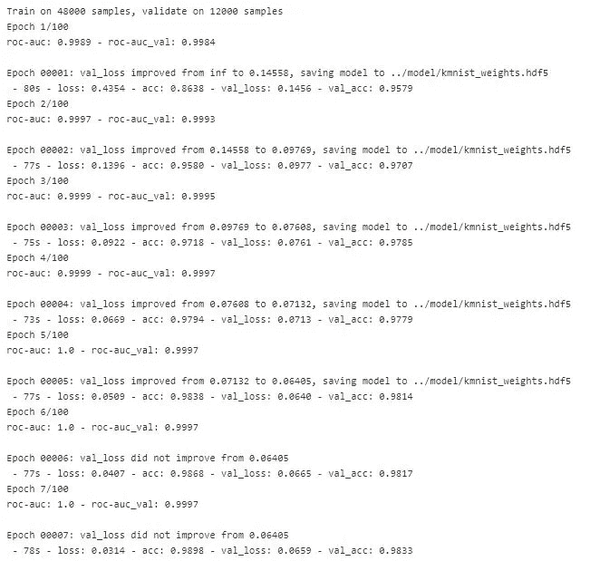

图 12:训练期间的第 7 轮纪元

在本演示中，我手动创建`callbacks`类来保存`auc`每个时期的分数，并使用`ModelCheckPoint`和`EarlyStopping`来保存模型的最佳权重(基于验证数据集上的**损失**分数)并停止训练模型(如果验证数据集上的损失分数停止提高)。

图 12 显示了实际的回调，它打印每个时期的 AUC 分数，并将最佳权重保存到文件中。

然后，我们根据测试图像计算模型性能。来自先前步骤的历史(或回调)可以被馈送以可视化模型如何在每个时期学习。

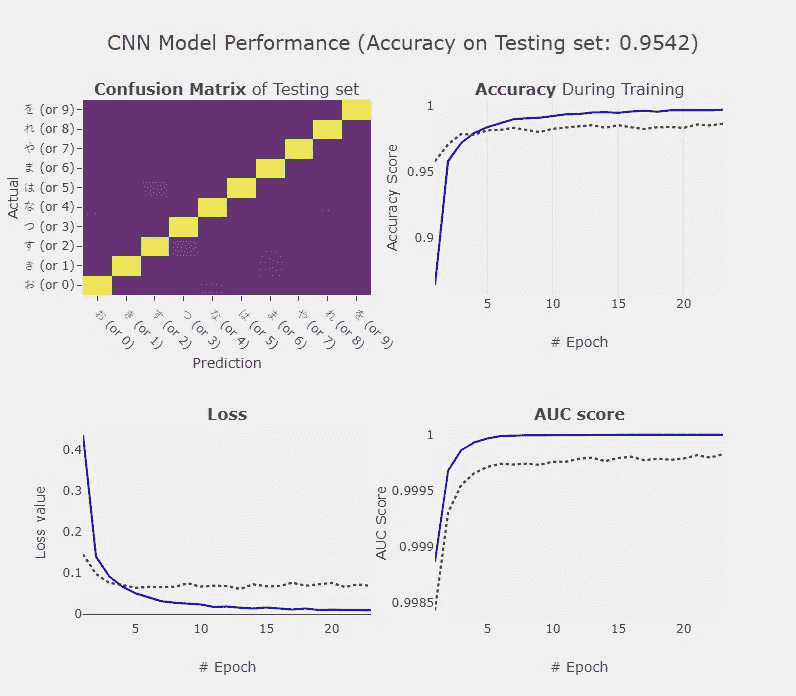

图 13: CNN 从零开始的模型性能

感谢您阅读至此。在本文中，我首先介绍了什么是 ConvNet，以及它是如何工作的。还解释了 ConvNet 架构的各层。我通过使用 Keras 从头实现 ConvNet 并编写我们自己的回调函数来结束本文，这进一步帮助了模型开发过程。

如果您有任何问题，请随时评论或通过 LinkedIn [这里](https://www.linkedin.com/in/satsawat/)联系我。

**GitHub 笔记本—使用 KMNIST 数据集和 Keras 识别 Kuzushiji 字符**

[](https://github.com/netsatsawat/Kuzushiji-Classification/blob/master/code/Kuzushiji-MNIST-Classification.ipynb) [## netsatsawat/Kuzushiji-分类

### 展示深度学习如何帮助识别和分类汉字的知识库…

github.com](https://github.com/netsatsawat/Kuzushiji-Classification/blob/master/code/Kuzushiji-MNIST-Classification.ipynb) 

[1]:“kmn ist 数据集”(CODH 创建)，改编自“Kuzushiji 数据集”(NIJL 等人创建)，doi:10.20676/00000341