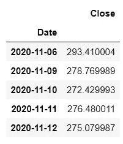
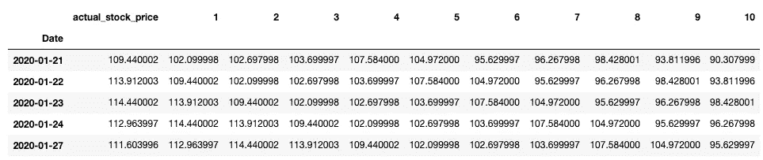
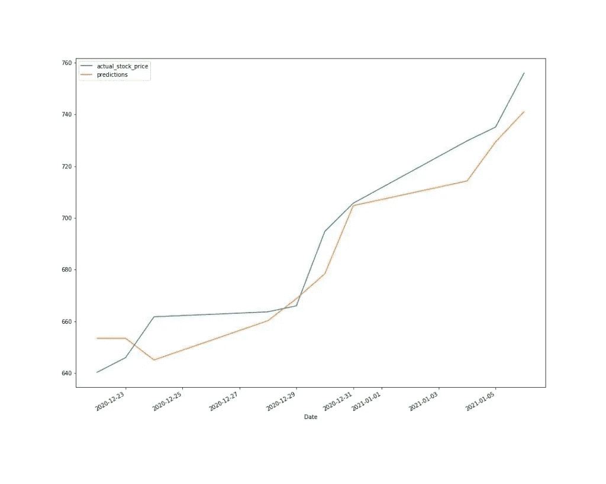
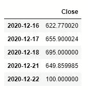
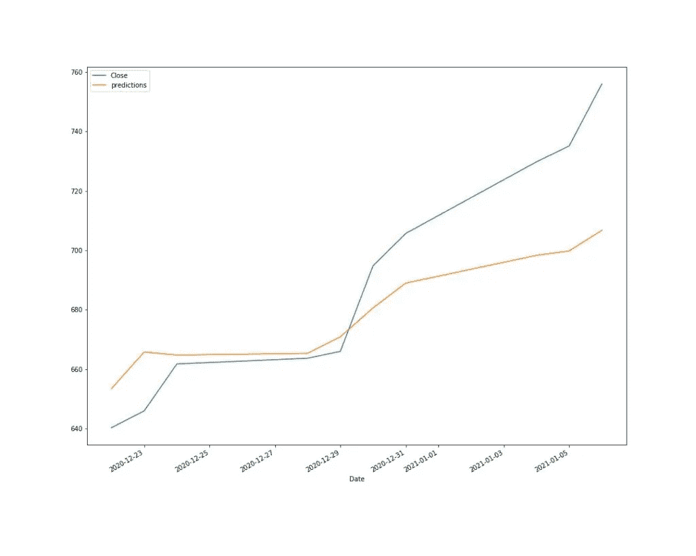
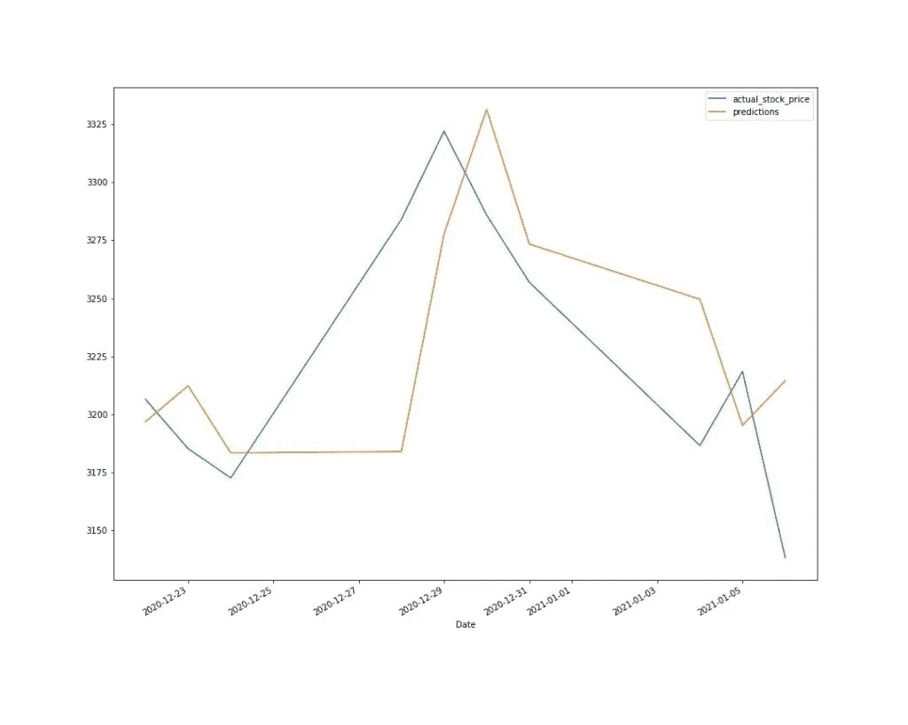
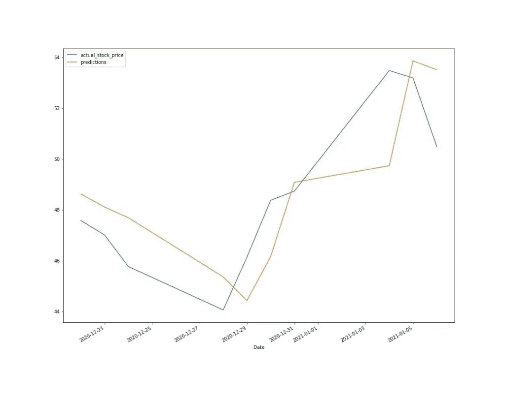
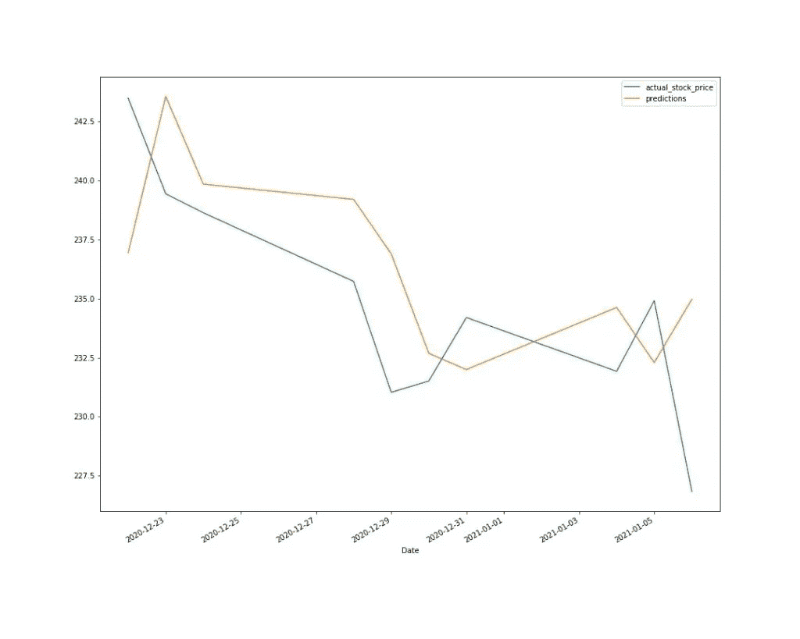

# 新手指南:预测股市

> 原文：<https://pub.towardsai.net/beginners-guide-predict-the-stock-market-38f55f33380?source=collection_archive---------4----------------------->

## [数据科学](https://towardsai.net/p/category/data-science)


我们将向您展示如何创建能够预测股票价格的模型。我们的方法是使用历史数据，更具体地说，是股票最近 10 天的收盘价。

**警告**:股市价格高度不可预测。这个项目完全是为了研究目的！不要在它上面放任何钱！

为了获得我们的数据，我们将使用[雅虎！金融市场下载器](https://pypi.org/project/yfinance/)。对于我们的第一个预测，我们将获得特斯拉股票。

```
import pandas as pd
import yfinance as yf
import datetime
import numpy as npdf=yf.download('TSLA',start='2020-01-07', end='2021-01-07',progress=False)[['Close']] df.head()
```



我们只需要列 **Close** 就是我们想要预测的值。我们现在的目标是转换数据，以便我们可以将它们输入到我们的机器学习模型中。我们希望以最近 10 个收盘价为特征。最简单的方法就是使用**熊猫**的**换挡**功能。

```
df=pd.concat([df, df.shift(), df.shift(2),df.shift(3),df.shift(4),df.shift(5),
           df.shift(6),df.shift(7),df.shift(8),df.shift(9),df.shift(10)], axis=1).dropna()

df.columns=list(range(0,11))
df.rename(columns={0:'actual_stock_price'},inplace=True)
```



# 预测第二天的股价

首先，我们将保留最近 10 天，以便将预测值与实际值进行比较。对于这种方法，我们将预测第二天的价格，这意味着我们将使用实际的股票价格，而不是预测的价格来计算接下来几天的测试。

```
#split data into train and test. We will try to predict the last 10 days

train=df.head(len(df)-10)
test=df.tail(10)

from sklearn.linear_model import LinearRegression
lr=LinearRegression()
lr.fit(train[list(range(1,11))],train['actual_stock_price'])

test['predictions']=lr.predict(test[list(range(1,11))])

ax=test[['actual_stock_price','predictions']].plot(figsize=(15,12))
```



# 预测未来 10 天的股票价格

在这种方法中，我们将预测未来 10 天的价格。这意味着我们将使用我们的预测来继续和预测接下来的日子。

一个非常方便的方法是我们可以用 DateTime 添加天数。在这段代码中，我正在进行预测，并将第二天的新预测连接到训练数据集。然后使用 for 循环，我重复了 10 次。让我们通过向我们的训练数据集添加一个新值来看看它是如何工作的。我们将添加 **100** 的值。

```
df=yf.download('TSLA',start='2020-01-07',  end='2021-01-07',progress=False)[['Close']]
train=df.head(len(df)-10)
test=df.tail(10)

train =pd.concat([train ,pd.DataFrame( {'Close':100},index=[train.tail(1).index[0]+datetime.timedelta(days=1)])])
train.tail()
```



如您所见，新值在**2020–12–21**的第二天添加到索引为的数据集中。使用这个代码，我们现在将预测未来 10 天。让我们看看进展如何。

```
df=yf.download('TSLA',start='2020-01-07',  end='2021-01-07',progress=False)[['Close']]

train=df.head(len(df)-10)
test=df.tail(10)

predictions=[]
for i in range(0,10):
    x=pd.concat([train, train.shift(), train.shift(2),train.shift(3),train.shift(4),train.shift(5),
               train.shift(6),train.shift(7),train.shift(8),train.shift(9)], axis=1).dropna().tail(1)
    x.columns=range(1,11)
    pred=lr.predict(x)

    predictions.append(pred[0])
    train =pd.concat([train ,pd.DataFrame( {'Close':pred},index=[train.tail(1).index[0]+datetime.timedelta(days=1)])])

test['predictions']=predictions

test.plot(figsize=(15,12))
```



不错吧？这只是一个简单的例子，说明我们如何通过转换一些数据并使用简单的线性回归来预测股票价格。我们可以学到很多东西，所以开始尝试吧！如果你想感觉像华尔街之狼，你可以用虚拟货币来测试你的模型。


# 奖金:“预测股市”功能

让我们用第一种方法创建一个函数，看看我们的模型在其他股票上的表现如何。

```
def predictnextday(symbol):
    df=yf.download(symbol,start='2020-01-07',  end='2021-01-07',progress=False)[['Close']]
    df=pd.concat([df, df.shift(), df.shift(2),df.shift(3),df.shift(4),df.shift(5),
               df.shift(6),df.shift(7),df.shift(8),df.shift(9),df.shift(10)], axis=1).dropna()

    df.columns=list(range(0,11))
    df.rename(columns={0:'actual_stock_price'},inplace=True)
    train=df.head(len(df)-10)
    test=df.tail(10)

    from sklearn.linear_model import LinearRegression
    lr=LinearRegression()
    lr.fit(train[list(range(1,11))],train['actual_stock_price'])

    test['predictions']=lr.predict(test.tail(10)[list(range(1,11))])

    ax=test[['actual_stock_price','predictions']].plot(figsize=(15,12))
    return(ax)
```

# AMZN



# 尼奥



# 贝宝



*原载于 https://predictivehacks.com*[](https://predictivehacks.com/beginners-guide-predict-the-stock-market/)**。**