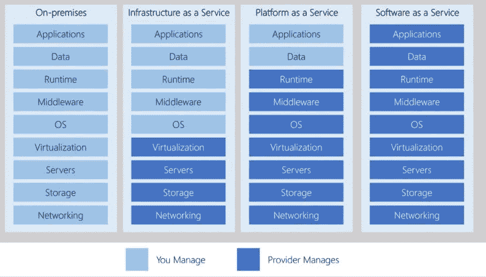
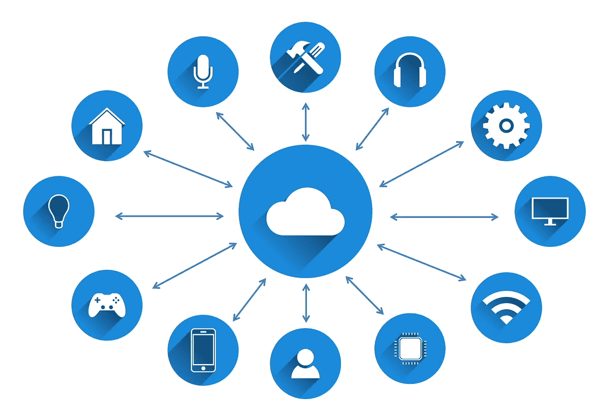
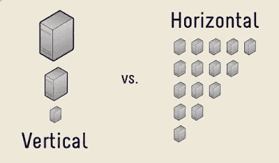

# 云计算初学者指南

> 原文：<https://pub.towardsai.net/beginners-guide-to-cloud-computing-af2e240f0461?source=collection_archive---------1----------------------->

## [云计算](https://towardsai.net/p/category/cloud-computing)

## 云计算基础知识综合指南

在 [Unsplash](https://unsplash.com/s/photos/server?utm_source=unsplash&utm_medium=referral&utm_content=creditCopyText) 上[科学高清](https://unsplash.com/@scienceinhd?utm_source=unsplash&utm_medium=referral&utm_content=creditCopyText)摄影

想象一下，你想训练一个深度学习模型，你有成千上万的图像，但你的系统没有任何 GPU。没有 GPU 很难训练大型训练模型，所以你通常会使用 google collab 来训练你的模型。

考虑到您的系统内存已满，并且您有重要的文档和视频要存储，应该对其进行保护。Google drive 是一个可以存储所有文件的解决方案，包括文档、图像和视频，容量高达 15GB，并提供安全性和备份。

上述场景是云计算的一些应用，使用云计算的优势之一是**您只需为我们使用的东西付费。**

# 什么是云？

云计算是指租用**存储空间**、**计算**、**动力**、**虚拟机**等资源。您只需为您使用的东西付费。提供这些服务的公司被称为云提供商。云提供商的一些例子有微软 Azure、亚马逊网络服务、T21 和谷歌云平台。

云的目标是为商业、初创企业和大型企业提供顺畅的流程和效率。云根据企业的需求提供广泛的服务。

# 云计算的类型

**IaaS —基础设施即服务**

在这种情况下，云供应商为用户提供开发或托管其应用程序所需的系统功能，如存储、服务器、带宽、负载平衡器、IP 地址和硬件。他们为我们提供了可以工作的虚拟机。有了 IaaS，您可以租用硬件，而不是购买硬件。IaaS 的例子包括 DigitalOcean、Amazon EC2 和 Google Compute Engine。

**Saas——软件即服务**

大多数人以此为日常。我们可以使用应用软件。我们不需要担心设置环境、安装问题，提供商会处理所有这些。

软件即服务的例子包括谷歌应用程序，网飞。

**平台即服务——平台即服务**

它提供从操作系统、编程环境、数据库、测试、部署、管理和更新都在一个地方开始的服务。它通常提供应用程序的整个生命周期。

Paas 的例子包括 Windows Azure、AWS Elastic Beanstalk 和 Heroku。

致谢:微软

# 利益

大多数企业都在向云迁移，以节省基础设施和管理成本，大多数新公司都是从云起步的。

图片由[图米苏](https://pixabay.com/users/tumisu-148124/?utm_source=link-attribution&utm_medium=referral&utm_campaign=image&utm_content=3337536)发自[皮萨巴](https://pixabay.com/?utm_source=link-attribution&utm_medium=referral&utm_campaign=image&utm_content=3337536) y

## 划算的

如果我们使用云基础设施，我们不需要投资购买硬件、服务器、计算机、建筑和安全性。我们甚至不需要雇佣数据工程师来管理流程。一切都由云处理。

## 可攀登的

云中最好的事情之一是根据我们网页的输入流量来减少或增加工作负载。如果它的流量很大，我们可以通过增加一些服务器来增加工作量。如果流量突然开始下降，可以灵活地调度增加的服务器。

我们有两种选择，以便根据需要提供灵活的服务

1.  垂直缩放
2.  水平缩放

在**垂直扩展中，**我们通过添加一些内存和处理器来增加资源以提高服务器的性能。

在**水平扩展**中，当我们有更多的输入流量时，我们添加服务器来为站点提供一个平滑的过程。

## 可靠的

万一发生灾难或电网故障，云可以确保您的数据安全，不会被耗尽。云中还添加了冗余，以确保如果一个组件出现故障，我们还有另一个相同的组件来运行相同的任务。

## 全球的

云在世界各地有很多数据中心。如果你想向远离你的地方的特定区域提供服务，在云的帮助下，你可以在没有停机时间和更短响应时间的情况下实现。

感谢您阅读我的文章。我将很高兴听到你的意见。在 Medium 上关注我，了解我的最新文章。你也可以在 [Linkedin](https://www.linkedin.com/in/mukthasaiajay/) 和 [Twitter 上和我联系。](https://twitter.com/saiajay5)看看我关于机器学习和深度学习的博客。

 [## 什么是机器学习？

### 关于机器学习，你需要知道的

medium.com](https://medium.com/dataseries/what-is-machine-learning-c1332527f3ff)  [## 用 Python 进行数据预处理

### 让数据变得可以理解

medium.com](https://medium.com/dataseries/data-preprocessing-with-python-3914d3e9dd30)  [## 人工神经网络导论

### 你深度学习的第一步

towardsdatascience.com](https://towardsdatascience.com/introduction-to-artificial-neural-networks-ac338f4154e5)