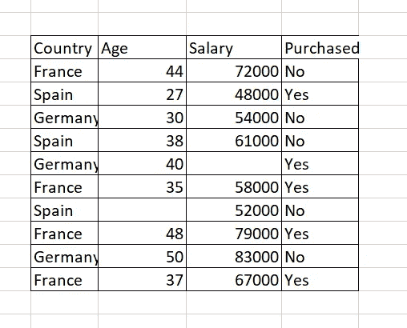

# 机器学习初学者指南:使用 Python 进行数据预处理。

> 原文：<https://pub.towardsai.net/beginners-guide-to-machine-learning-data-pre-processing-using-python-da6a21274620?source=collection_archive---------0----------------------->


学习机器学习的旅程超级漫长，但却非常令人兴奋！

如果你是一个初学者，这个博客正是你所需要的，让你有一个良好的开端！数据处理是你作为机器学习从业者学习的第一个工具。我们开始吧！

## 目录:

1.  介绍
2.  导入库
3.  导入数据集
4.  处理缺失数据
5.  编码分类值
6.  将数据集分为训练数据和测试数据。

数据预处理是这一旅程中必不可少的一部分，随着您的深入，您将会认识到数据预处理在准确构建、训练和测试您的模型中所起的关键作用。

有必要以正确的方式预处理您的数据，以便您将构建的机器学习模型可以使用该数据以正确的方式进行训练！在开始时，这似乎不是一个不寻常的步骤。然而，一旦你学会有效地做这件事，你就能迅速掌握机器学习(ML)的各个分支。

## 步骤 1]导入库

## 什么是图书馆？

Python 中的库是一个相当大的工具、函数和模块的集合体，有助于使期望的任务更容易。

***熊猫库*** :允许我们读取和检索数据集。

***Numpy 库*** :处理数学和高级 2D 数组。

***Matplotlib 库*** :帮助我们以条形图、折线图、饼状图等形式可视化数据。

为了方便地调用上面的库函数，我们使用像“np”、“pd”、“plt”这样的短语法来重命名这些库。"

这些库可以通过以下步骤导入，如下面的代码片段所示:

```
import numpy as npimport pandas as pdimport matplotlib.pyplot as plt
```

## 步骤 2]导入数据集

## 什么是数据集？

**数据集**是包含我们所有数据的集合，帮助我们设计和训练我们的机器学习模型。



来自 Udemy 的数据集。Data.csv

上述数据集有 3 个 ***自变量或特征*** :国家、年龄、工资，以及 1 个 ***因变量或目标变量*** :购买的产品，可以有二进制输出:是或否，取决于自变量。

为了导入数据集，我们需要 pandas 库函数。

首先要做的是创建一个包含数据集的变量，并创建其数据框。

然后声明两个变量，分别包含特性和目标。下面的代码片段显示了如何导入数据集。

```
dataset=pd.read_csv("Path of your csv file location") 
#read_csv is function of pandas which helps in retrieving data in form of data frame.X=dataset.iloc[:,:-1].values #X stores features
#iloc is a function of pandas which helps us split dataset based on its index location.y=dataset.iloc[:,-1].values #y stores target
```

## 步骤 3]处理缺失的数据

正如您所观察到的，上面的数据集在列 Age 和 salary 中有一些缺失数据，如果不进行处理，这些数据可能会成为模型定型时出现错误的原因。因此，有必要注意数据集中缺失的数据值。

在大型数据集的情况下，具有缺失数据的条目可以被忽略或直接移除。但是，如果您的数据集是紧凑的或受限制的，则需要处理缺失的数据。

因此，可用于处理缺失数据的方法是对具有缺失数据的列中的所有条目取平均值。为此，我们导入了一个著名的 ML 库，名为 ***sci-kit-learn*** 。它包含处理缺失值的数据预处理工具。我们将使用类 ***估算器*** 来处理缺失值。

代码片段:

```
from sklearn.impute import SimpleImputerimputer = SimpleImputer(missing_values = np.nan, strategy='mean')imputer.fit(X[:,1:3])// enter columns which contain real numbersX[:,1:3]= imputer.transform(X[:,1:3])print(X)
```

## 步骤 4]编码分类数据

几乎所有数据集都包含分类数据列。这一列字符串需要处理并转换成实数。线性排列类别可能会造成数据之间存在关系的错误印象，从而导致模型中的错误。

因此，我们将使用 ***one-hot-encoding 方法*** 将分类数据转换为数值数据。但是，我们会将包含 ***yes 和***no 的目标变量的分类数据分别转换为 **1** 和 **0、**。不会损害未来数据的准确性。

```
#Encoding Independent variablefrom sklearn.compose import ColumnTransformerfrom sklearn.preprocessing import OneHotEncoderct = ColumnTransformer(transformers=[('encoder',OneHotEncoder(),[0])], remainder='passthrough')X= np.array(ct.fit_transform(X))print(X)#Encoding Dependent Variablefrom sklearn.preprocessing import LabelEncoderle=LabelEncoder()y= le.fit_transform(y)print(y)
```

如上面的代码片段所示，为了对独立的分类数据进行编码，使用了 OneHotEncoder，并将余数设置为“passthrough ”,以便不会抵消剩余的特征。使用 NumPy 将结果转换为数组。

对于因变量编码，使用 scikit-learn 模块中的 LabelEncoder。

## 步骤 5]特征缩放

特征缩放有助于将独立变量或特征的值放在同一范围内。并非总是需要对所有模型应用特征缩放。一些型号使用流量系数自动补偿高值。

使用的两种技术是**标准化和规范化。**

我将使用标准化。(使用任何技术，都不会引起输出的任何显著变化。)

```
# Formula of Standardization 
# Xstand = [x- mean(x)]/standard_deviation(x)from sklearn.preprocessing import StandardScalersc = StandardScaler()X=sc.fit_transform(X)print(X)
```

要素缩放返回在相同范围内缩放的输出。

**步骤 6】将数据集分为训练集和测试集**

这是重要的一步。我们总是需要将数据分为训练集和测试集，以分别训练和测试我们的模型。通常情况下， **80%** 的数据用于训练数据， **20%** 用于在未来的测试数据上测试模型。

为了避免过度拟合，数据应该根据有限的测试数据进行训练。但是，当训练集不足时，模型会对测试集产生错误。因此，应该适当地进行选择和分割。

```
from sklearn.model_selection import train_test_splitX_train, X_test, y_train, y_test = train_test_split(X, y, test_size=0.2, random_state=0 )
```

这概括了处理数据所需的所有工具。对于几乎所有的模型，我们将需要导入库，导入数据集，并将数据分成训练集和测试集。我们有时可能需要其他提到的工具。