# 面向数据科学的 NumPy 初学者指南

> 原文：<https://pub.towardsai.net/beginners-guide-to-numpy-for-data-science-476f428adbdf?source=collection_archive---------0----------------------->

## [数据科学](https://towardsai.net/p/category/data-science)

## 从头开始了解 NumPy

照片由[黑冰](https://www.pexels.com/@black-ice-551383?utm_content=attributionCopyText&utm_medium=referral&utm_source=pexels)从[像素](https://www.pexels.com/photo/eyeglasses-with-black-frames-1314546/?utm_content=attributionCopyText&utm_medium=referral&utm_source=pexels)拍摄

# NumPy

NumPy 代表**数字** erical **Py** thon。NumPy 是一个强大的 python 库，它支持大型多维数组和矩阵，以及一组对这些数组进行操作的高级数学函数。

在本文中，让我们了解一下数据科学所需的 NumPy 的基础知识。

# 目录

1.  创建 NumPy 数组的不同方法
2.  Python 列表与 NumPy 数组
3.  NumPy 数组的属性
4.  索引和切片数字数组
5.  详细的 NumPy 轴
6.  NumPy 数组上的操作。

# 创建 NumPy 数组的不同方法

## 1.从 python 列表创建 NumPy 数组

*   **如何从 python 列表创建矢量？**
    向量是一维数组。

*   **如何从列表中创建矩阵？**

为了从 python 列表中创建一个 n 维数组，该列表应该是 n 层的。

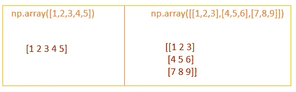

从 Python 列表创建 NumPy 数组

> 类似地，我们可以使用 `*np. array()*`从 python 元组创建 NumPy 数组

**2。使用数组函数创建 Numpy 数组**

`np.arange(start,stop,step)` →返回给定范围内的数组。它类似于 Python range()函数。

np.arange()将返回一个一维数组。
使用`reshape()`函数将其转换为多维数组。

> **range()和 arange()函数的区别**
> 
> `*range()*` →步骤不能是浮点数。它返回一个 range 对象，可以像 python list 一样访问它。
> `*arange()*` →步数可以是浮点数。它返回一个 NumPy 数组。

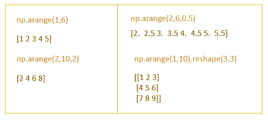

使用 arange()

**3。使用 np.linspace()创建 NumPy 数组**

`np.linspace(start,stop,n)` →返回包含给定范围内均匀分布的`**n**`个元素的数组。

和 arange()一样，linspace()也返回一维数组。
要将其转换为多维数组，使用`reshape()`函数。

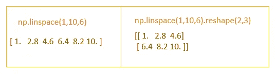

使用 linspace()

> arange()和 linspace()的区别

arange()vs linspace()[图片由作者提供]

**4。创建一个 0 的数组，一个 1 的数组**

`np.zeros(shape,dtype)` →返回用零填充的给定形状和类型的数组。

默认情况下，它将创建一个浮点数组

`np.ones(shape,dtype)` →返回一个给定形状和类型的数组，并用 1 填充。

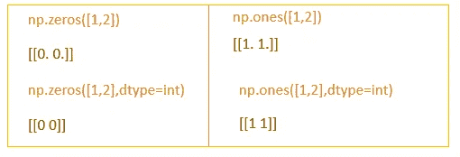

创建 0 和 1 的数组

**5。创建一个随机数数组**

`np.random.random(shape)` →返回一个给定形状的数组，用 0 到 1 之间的随机数填充

**6。创建一个用数字“n”填充的数组**

`np.full(shape,n)`→返回用数字“n”填充的给定形状的数组

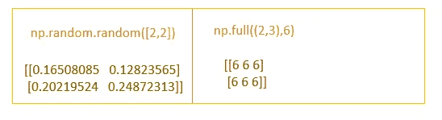

# Python 列表与 NumPy 数组

1.  Python 列表是**异构**。它可以包含不同的数据类型。
    NumPy 数组是**同质的**。它包含相同的数据类型。常用的数组有 int 数组和 float 数组。
2.  在 NumPy 数组中，我们可以执行元素操作。

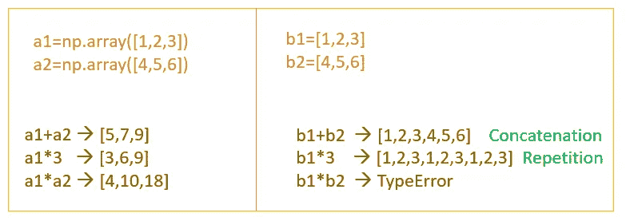

NumpyArray 与 Python 列表上的操作

3.NumPy 数组比 Python 列表快。Numpy 数组的大小是固定的，而 Python List 的大小可以改变。

# NumPy 数组的属性

如果我们从一个 csv 文件创建一个 NumPy 数组，或者如果我们使用大型 NumPy 数组，我们可以通过使用 NumPy 数组的一些属性来获得关于该数组的信息。

`np.shape` →返回数组的形状

`np.dtype`→返回数据类型

`np.ndim`→返回数组的维数

# 索引和切片 NumPy 数组

索引和切片 NumPy 数组类似于 Python 列表索引和切片。

我们可以通过引用元素的特定索引、索引列表、切片或带步长的切片来访问数组中的元素。

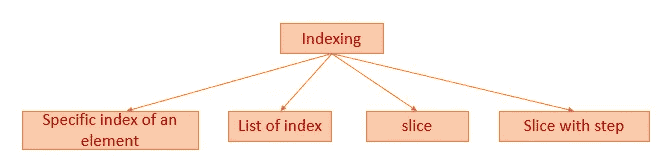

索引数字数组

1.  **从一维数组中访问元素**

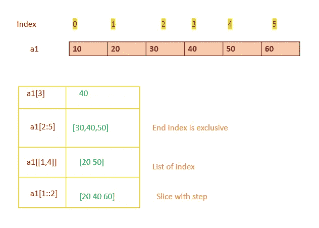

从一维 Numpy 数组中访问元素[图片由作者提供]

**2。从二维数组中访问元素**

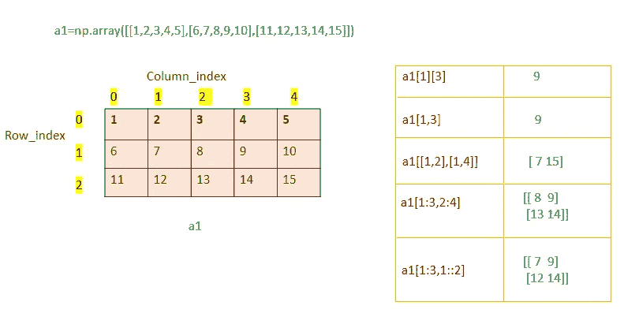

从二维数组中访问元素[图片由作者提供]

基本切片生成的所有数组始终是原数组的**【视图】**。
视图→不拥有自己数据的数组，而是引用另一个数组的数据。

**3。从三维数组中访问元素**

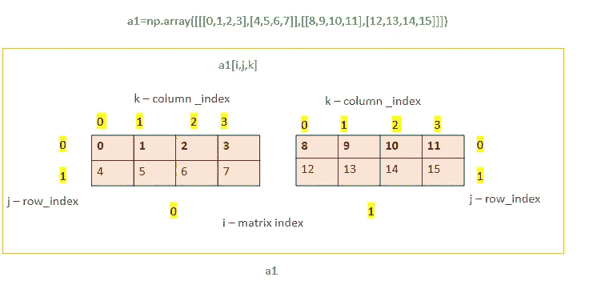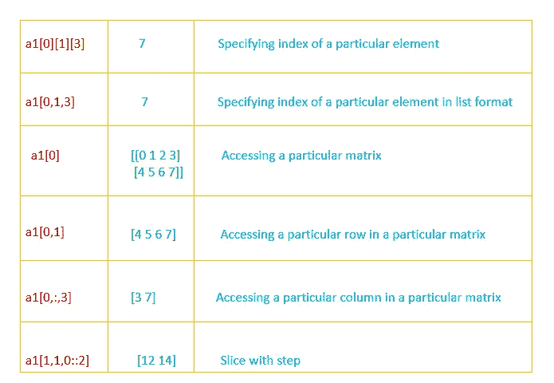

从三维数组中访问元素

# 布尔索引

布尔索引→我们可以使用某些条件来访问和修改数据。

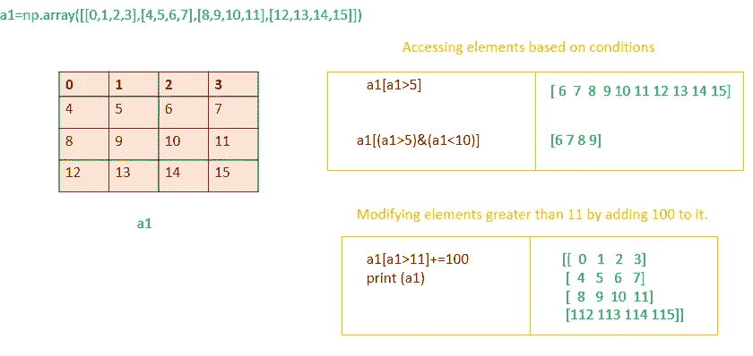

布尔索引[作者图片]

# NumPy 数组上的操作

1.  NumPy 数组上的算术运算
2.  数字统计方法
3.  排序 NumPy 数组
4.  NumPy 数组上的集合操作
5.  置换数组
6.  堆叠 NumPy 数组
7.  广播数字阵列

# NumPy 数组上的算术运算

1.  **加法**

使用`+`或`np.add()`

NumPy 执行元素相加。因此，只有当两个数组具有相同的维数时，我们才能执行加法。

**2。减法**

使用 `-`或`np.subtract()`

**3。乘法运算**

使用`*`或`np.multiply()`

**4。分部**

使用/或 np.divide()

**5。平方根**

`np.sqrt()` →计算数组中所有元素的平方根。

**6。指数**

`np.exp()`→计算数组中所有元素的指数。

# 详细的 NumPy 轴

在学习统计方法之前，我们将学习数轴。这有点棘手。

## 三维数组

让我们来看一个形状为 **(2，2，3)** 的三维数组，它表示**2**→矩阵/数组， **2** →行， **3** →列。

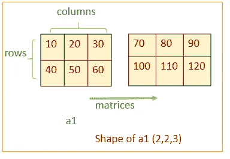

三维数组[图片由作者提供]

如果我们在**轴上求和=0** 意味着，它将折叠指定的轴——这里是一个 3D 数组，它将折叠矩阵/数组。所以和矩阵的形状将是(2，3)。相应的轴将被折叠，并且该轴将在求和矩阵中丢失。

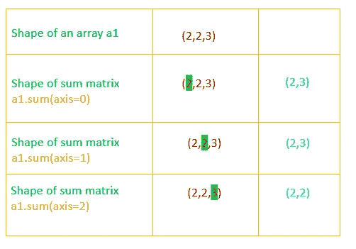

折叠特定轴后和矩阵的形状[图片由作者提供]

如果我们在**轴上求和=0** ，它将折叠**矩阵/数组**。这是通过元素相加来实现的。

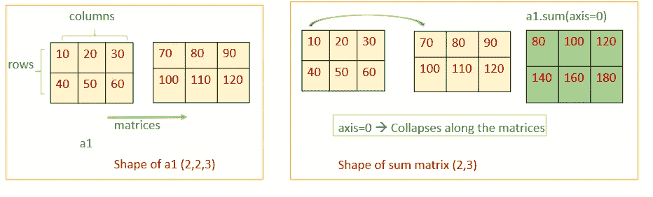

理解三维数组中的轴[图片由作者提供]

如果我们跨**轴求和=1** ，就会折叠**行轴**。这是通过按列相加实现的。

对于**轴=2** ，将**柱轴**折叠。这是通过行加法实现的。

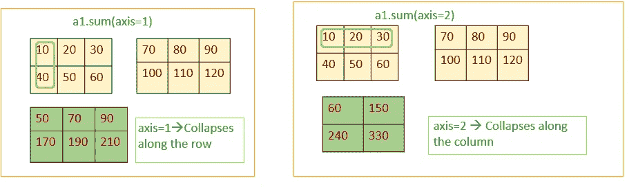

作者图片

所以，在 NumPy 中，我们必须记住**轴的**参数，比如**“它将沿着指定的轴折叠”**

## 二维数组

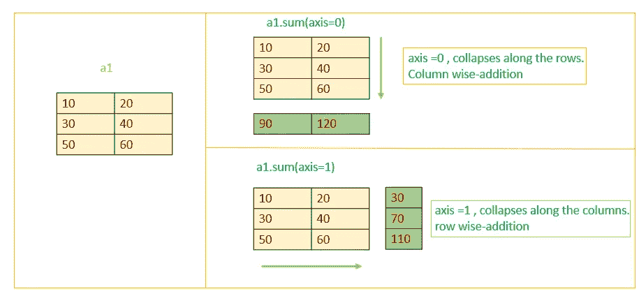

了解二维数组上的轴[图片由作者提供]

要了解更多关于 NumPy 轴的信息，请参考由 **Kshitij Bajracharya** 撰写的这篇中型文章[“了解 Numpy 和】](https://towardsdatascience.com/understanding-numpy-sum-1587eec69527)。

# 数字统计方法

我们可以在 Numpy 数组上计算统计方法，如均值、中值和。

`np.mean(a)` →计算数组的平均值`a`
`np.median(a)` →计算数组的中值`a`
`np.sum(a)` →计算数组的和`a`

`np.mean(a,axis=0)` →如果我们提到 axis=0，column_wise 计算。
`np.mean(a,axis=1)` →如果我们提 axis=1，按行计算。

# 排序 NumPy 数组

`ndarray.sort()` →对原始数组
`np.sort(ndarray)`进行排序→返回排序后的数组副本

要沿特定轴排序，必须提到参数**轴**

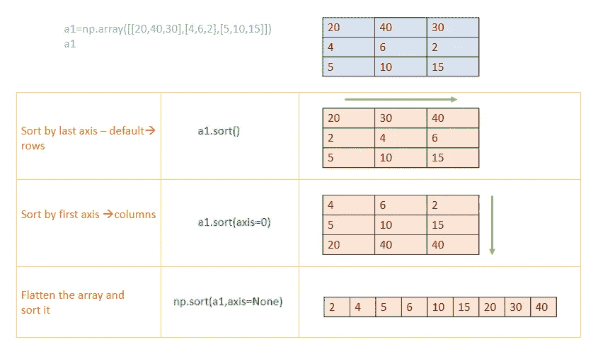

# NumPy 数组上的集合操作

集合运算可以在一维 NumPy 数组上完成

# 转置数字数组

# 堆叠 NumPy 数组

**np.hstack(a1，a2)** →水平堆叠。两个数组应该有相同的行数

**np.vstack(a1，a2)** →垂直堆叠。两个数组应该有相同的列数。

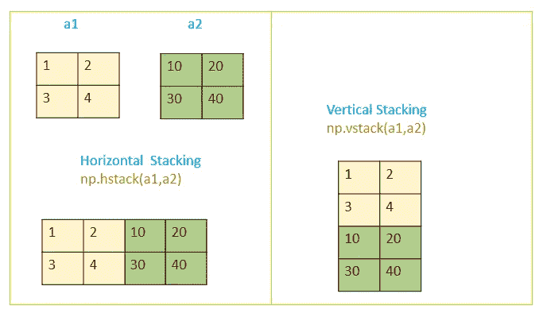

堆叠阵列[图片由作者提供]

# 广播数字阵列

在 NumPy 中，算术运算是按元素进行的。为了实现这一点，数组应该具有相同的大小/形状。

为了对不同大小/形状的阵列执行算术运算，使用了广播。

想象一下，广播意味着将数组拉伸到所需的形状/大小，以对其执行算术运算。

**广播规则**:

1.  每个维度的大小应该是相同的。
2.  其中一个维度的大小应该是 1。

## 场景 1:两个数组的维数相同

**例 1:二维数组**
我们来添加两个不同形状的二维数组(a1，a2)。
a1(2，1)的形状
a2(2，2)的形状

a1+a2 →我们可以执行加法，因为广播规则匹配。

*   第一个轴是相同的
*   第二个轴是数组(a1)
    *中的 1【如果轴不相同，其中一个应该是 1】*

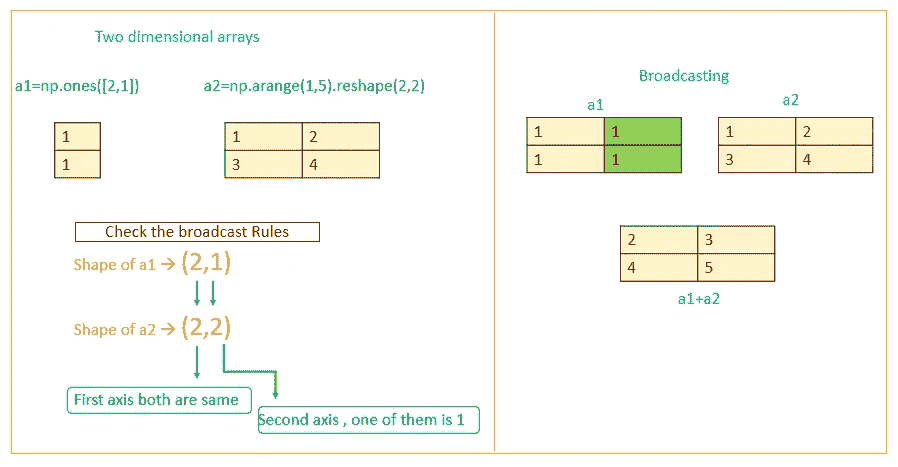

如何查看广播规则[图片由作者提供]

**例 2:三维数组**

让我们添加两个不同形状的三维数组(a1，a2)。
a1(2，3，1)的形状
a2(2，3，2)的形状

a1+a2 →我们可以执行加法，因为广播规则匹配。

*   第一个轴是相同的
*   第二个轴是相同的
*   第三个轴是数组(a1)
    *中的 1【如果轴不相同，其中一个应该是 1】*

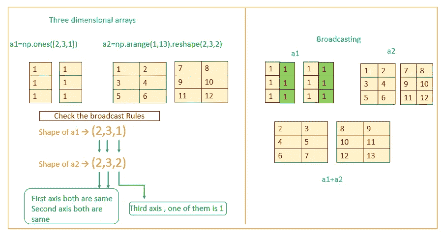

检查三维数组上的广播规则[图片由作者提供]

## 场景 2:两个数组的维数不同

如果两个数组的维数不同，那么维数较小的一个数组的形状将在其前导边(左侧)用 1 填充

**例:我们来添加两个不同维度的数组。**

a1 的形状→ (3，2)
a2 的形状→(2，3，2)

由于两个数组(a1，a2)的维数不同，因此 a1 *(a1 的维数比 a2 小)*的形状在其前导侧(左侧)填充 1

a1 的形状变成→ (1，3，2)
*【a1 只比 a2 的维数少】*

现在检查 a1、a2 中的广播规则

*   其中一个数组(a1)上的第一个轴是 1
    *【如果轴不相同，其中一个应该是 1】*
*   第二个轴是相同的
*   第三个轴是相同的

现在我们可以执行 a1+a2 →了，因为它符合广播规则。

在不同维度的阵列上广播[图片由作者提供]

如果我们需要对两个不同形状的数组执行算术运算，那么它应该匹配广播规则。否则，它将抛出一个错误。*(不能执行算术运算)*

**举例:**
a1(2，3)的形状
a2(2，4)的形状

我们无法执行 a1+a2，因为它不符合广播规则。

[第二个轴不同，并且在其中一个数组中不为 1]

# 结论

在本文中，我介绍了启动 DataScience 之旅所需的大多数标准 NumPy 操作。

# 我的熊猫博客

 [## 熊猫数据科学综合指南

### 快速潜入熊猫

medium.com](https://medium.com/wicds/a-comprehensive-guide-to-pandas-for-data-science-64ed1be1bafe) 

*观看此空间，了解更多关于 Python 和数据科学的文章。如果你喜欢多看我的教程，就关注我的* [***中***](https://medium.com/@IndhumathyChelliah)[***LinkedIn***](https://www.linkedin.com/in/indhumathy-chelliah/)*[***推特***](https://twitter.com/IndhuChelliah) ***。****

**点击这里成为中等会员:*[*https://indhumathychelliah.medium.com/membership*](https://indhumathychelliah.medium.com/membership)*