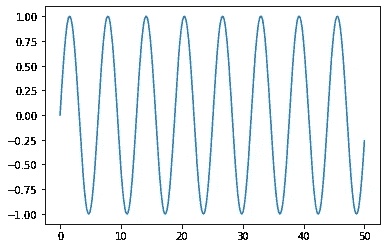
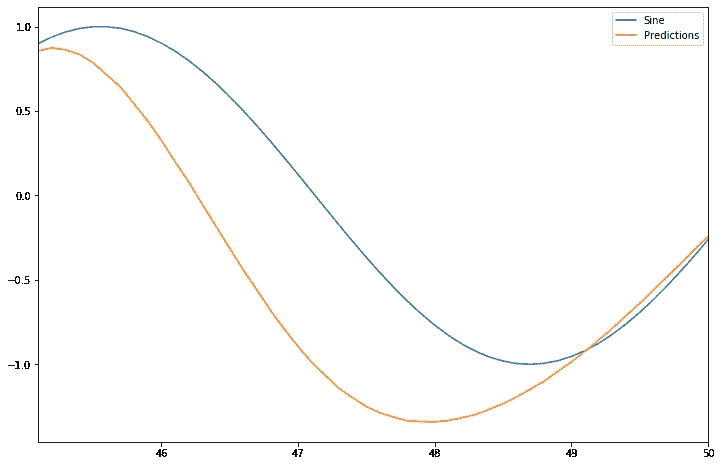
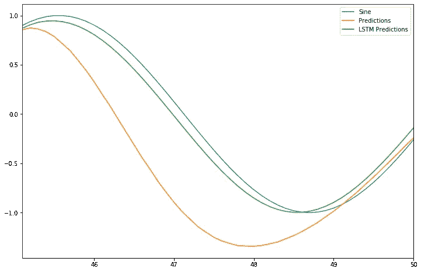
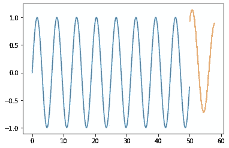

# 使用 TensorFlow 和 Keras 的 LSTMs 时间序列预测初学者指南

> 原文：<https://pub.towardsai.net/beginners-guide-to-timeseries-forecasting-with-lstms-using-tensorflow-and-keras-364ea291909b?source=collection_archive---------1----------------------->

## [深度学习](https://towardsai.net/p/category/machine-learning/deep-learning)

## **时间序列数据用于预测的 A-Z 解释**

[Icons8 团队](https://unsplash.com/@icons8?utm_source=medium&utm_medium=referral)在[un plash](https://unsplash.com?utm_source=medium&utm_medium=referral)上拍摄的照片

H 大家好，我欢迎你们加入 TensorFlow 和 Keras 深度学习初学者系列。本指南将帮助您理解时间序列预测的基础知识。您将学习如何对时间序列数据进行预处理，构建一个简单的 LSTM 模型，对其进行训练，并将其用于预测。

# **什么是时间序列数据？**

假设您正在处理定期捕获的数据，例如，如果您正在使用谷歌股票价格数据并试图预测未来的股票价格。我们每天连续记录这些价格。因此，它可以被称为时间序列数据。

为了让您更好地理解和深入了解如何预处理数据，将数据分为训练和测试，定义模型和进行预测，我们将开始使用简单的正弦波数据作为训练数据，训练深度学习模型，并使用它来预测值。

# **复发性神经网络是如何工作的？**

[塔奇娜·李](https://unsplash.com/@chne_?utm_source=medium&utm_medium=referral)在 [Unsplash](https://unsplash.com?utm_source=medium&utm_medium=referral) 上的照片

从数学角度来看，我们可以将深度学习定义为一种使用可微函数将一种类型的变量映射到另一种类型的变量的方法。

例如，如果您正在执行回归，它会将**向量映射到浮点数**类似地，如果您正在处理分类问题，那么它可能是**向量到向量的**映射，其中输出向量可能是属于多个类的概率。

# **什么是媒介？**

我们可以把向量定义为矩阵。当您向深层神经网络馈送图像时，它会将图像转换为相应像素值的矢量，该矢量将进一步传入前馈网络。在这里，向量代表了图像的含义，通常是人类无法理解的。

# 什么是序列？

当你听到单词序列时，一个让你理解这个概念的简单例子是考虑一个句子，它由一系列单词组成，赋予它完整的含义，或者考虑谷歌股票价格数据，它包含每天间隔记录的数据序列。

**RNNs** 可以将**序列映射到向量**，将**向量映射到序列**或者将**序列映射到序列。**最后**，**如果我们将其与我们当前的时间序列问题联系起来，该模型将获取一系列输入数据，并使用它来预测下一个值。

# **设置**

首先，导入库。

# **产生正弦波**

我们将使用 NumPy[**linspace**](https://numpy.org/devdocs/reference/generated/numpy.linspace.html)来生成范围在 0 到 50 之间的 x 值，并使用 NumPy [**sine**](https://numpy.org/doc/stable/reference/generated/numpy.sin.html) 函数来生成对应 x 的正弦值。最后，让我们将数据可视化。

图片由作者提供:生成的正弦波图。

# **训练，测试分割**

因此，我们不会使用来自 **sklearn** 的传统[**train _ test _ split**](https://scikit-learn.org/stable/modules/generated/sklearn.model_selection.train_test_split.html)函数将数据拆分为训练和测试数据集，而是使用简单的 python 库来拆分数据集，以便更好地理解幕后的过程。

首先，我们将检查数据帧的长度，并使用 10%的训练数据来测试我们的模型。现在，如果我们将数据帧的长度乘以 **test_percent** 并取整该值(因为我们用于索引目的)，我们将得到索引位置，即 **test_index** 。最后，我们将使用 **test_index** 分割训练和测试数据。

# 缩放比例

# **为什么我们需要衡量价值观？**

数据预处理中最关键的步骤之一是缩放值。以防你是机器学习和深度学习的绝对初学者，我用一个简单的例子给你解释一下。例如，考虑这样一个场景，在给定人的身高和体重的情况下，您需要预测身体质量指数(身体质量指数)。因此，身高中给出的值与体重在数量级和单位上有所不同，因为身高以**厘米**计量，而体重以**千克**计量。假设，您正在使用 K-最近邻算法(同样，K-最近邻算法基于欧几里德距离原理工作)并绘制这些值，绘制的点彼此相距很远，这可能不会帮助我们的算法执行预测。

**场景 2:** 考虑我们是否要使用非常基本的线性回归算法。它的工作原理是**梯度下降，即**我们需要找到一个可微函数的局部极小值。如果我们不使用缩放技术来绘制数值，那么你可能会得到疯狂的预测。

**场景 3:** 类似地，如果您使用图像数据集，那么您需要执行单位缩放，其中像素值在 0 到 1 之间归一化。

简而言之,“执行缩放”会在确定的范围内对特征进行归一化。

# **使用 Keras 时间序列生成器**

使用时间序列数据时，我们将面临的一个问题是，在将数据输入模型之前，我们必须将数据转换为具有输入和输出组件的样本序列。我们应该选择序列数据的**长度**,以便模型有足够的输入数据进行归纳和预测，也就是说，在这种情况下，我们必须至少向模型输入一个周期的正弦波值。

该模型将之前的 50 个数据点(一个周期)作为输入数据，并使用它来预测下一个点。如果我们手动执行，这个过程会非常耗时和困难，因此我们将使用 [**Keras 时间序列生成器**](https://keras.io/api/preprocessing/timeseries/#timeseriesgenerator-class) ，它会自动转换数据，并准备好训练模型，而无需繁重的工作。

我们可以看到, **scaled_train** 的长度为 451，生成器的长度为 401(451–50 ),也就是说，如果我们使用 X，y 作为变量来执行生成器函数的元组解包，则 X 包含从开始的 50 个数据点，y 包含模型用于预测的第 51 个数据点。

# **简单的 RNN**

定义的变量( **n_features** )代表训练数据中的特征数量，即，当我们处理单变量数据时，我们将只有一个特征，而如果我们使用包含多个特征的数据，那么我们必须指定数据中的特征数量。

# **测试模型**

让我们使用 **first_eval_batch** 来测试我们的模型。 **first_eval_batch** 包含缩放后的训练数据的最后 50 个点，并使用这些点进行预测。为了便于理解，上文对 **scaled_data** 中的预测值和第一次观察结果进行了注释。我们的模型预测下一个点是 0.927，而原始值是 0.949。因此，我们可以说我们的模型已经完成了大量的训练。

我们可以从测试数据中自动生成用于评估的批量数据。我们将定义一个为我们做繁重工作的函数。

没看懂功能？。我会帮你的。首先，我们将定义一个空列表( **test_predictions** )，这样我们就可以追加预测值。第二步是定义( **first_eval_batch** )，即需要发送到模型中的第一个评估批次，并对批次进行整形，使其与我们的模型的输入形状相匹配。**我们的 current_batch 包含来自训练数据的所有最后 50 个值。**

最后，我们将定义一个循环，这个循环将一直持续到测试数据结束。**预测值被附加到(current _ batch ), current _ batch 中的第一个观察值被删除。即，我们的 current_batch 包含 50 个值，其中 49 个来自训练数据，第 50 个值是追加的模型预测值**。

图片由作者提供:该图显示了预测值和原始正弦值之间的差异。

我们的模特做得很好，对吧？。

在开始时，预测值和原始正弦波值之间的差异几乎可以忽略不计，因为我们发送用于模型评估的第一批包括来自训练数据的最后 50 个值，然而随着循环的继续，预测值被附加到输入模型的批中，即，50 个值中的 49 个来自训练数据，最后一点是模型预测值。这一过程一直持续到测试数据结束，结果越来越多的预测值被附加到评估批次中，这可能会导致曲线与原始值略有偏差。

# 什么是 LSTMs？

> LSTM 层包括一组循环连接的块，称为存储块。这些模块可以被认为是数字计算机中存储芯片的一个不同版本。每一个都包含一个或多个循环连接的存储单元和三个乘法单元——输入、输出和遗忘门——为单元提供连续的写、读和复位操作模拟。网络只能通过门与细胞相互作用[1]

还是那句话，如果你厌倦了这些正式的定义，我来解释一下。假设你正在学习一门新的外语，第一天你会学到一些基本的单词，比如称呼一个陌生人或者说*你好、*等等。同样，第二天你将学习日常对话中使用的小而流行的单词。最后，要理解并形成一个完整的外语句子，你必须记住迄今为止你学过的所有单词。这就是 LSTM 类似于我们大脑的地方，据说它们含有“记忆细胞”,可以长时间保存信息。因此 LSTMs 对于语音识别任务或我们必须处理时间序列数据的任务是完美的，并且它们解决了在 RNNs 中看到的消失梯度问题。

消失梯度问题的详细解释可以在下面的文章中找到。

 [## 消失梯度问题

### 问题、原因、意义及其解决方案

towardsdatascience.com](https://towardsdatascience.com/the-vanishing-gradient-problem-69bf08b15484) 

# **LSTM**

在 **SimpleRNN** 模型和 LSTM 模型之间没有区别，除了这里我们将在一个序列模型中使用 LSTM 层进行预测。

# **预测**

# **可视化模型的性能**

作者图片

因此，我们可以说 LSTMs 非常适合时间序列数据。

# 针对全部数据的培训(培训+测试)

构建我们的深度学习模型的最后一步或座右铭是预测值，因为我们已经完成了我们的分析并对独特的模型架构进行了实验，我们可以得出结论，LSTMs 实现了高精度。

因此，我们将使用整个数据和训练模型，并使用它们来预测未来。

# **预测**

# **绘制预测值**

图片由作者提供:显示预测正弦波值的图。

# **结论**

恭喜你！你做了你的第一个递归神经网络模型！您还学习了如何预处理时间序列数据，预测未来，这是许多人觉得棘手的事情。

# 参考

1.  [https://machine learning mastery . com/gentle-introduction-long-short-short-memory-networks-experts/](https://machinelearningmastery.com/gentle-introduction-long-short-term-memory-networks-experts/)
2.  Andrej Karpathy 的博客+代码(你现在大概可以从这个了解更多了！):[http://karpathy.github.io/2015/05/21/...](http://karpathy.github.io/2015/05/21/rnn-effectiveness/)

我希望这篇文章能帮助你理解递归神经网络的基础知识。如果你有问题，请在下面的评论中提出，或者在 [LinkedIn](https://www.linkedin.com/in/vishnudarshan/) 上联系我。

在那之前，我会在下一个里抓住你！