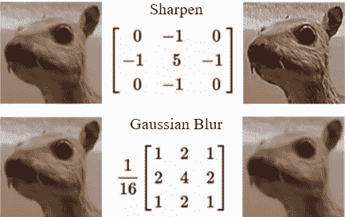
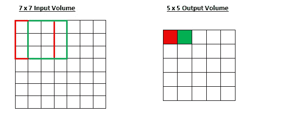
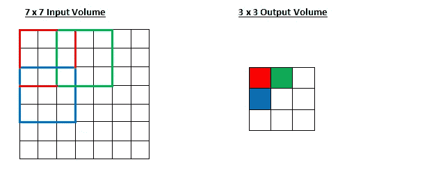
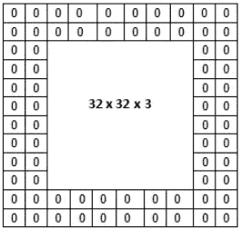
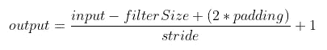
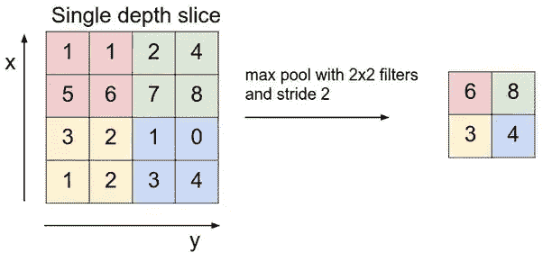
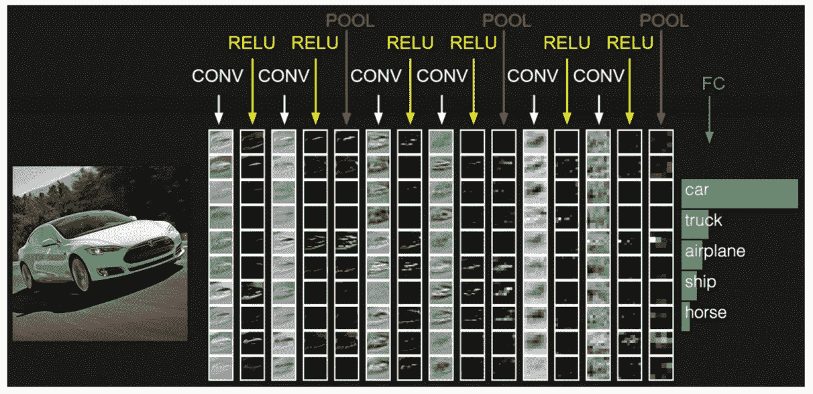

# 理解卷积神经网络的初学者指南

> 原文：<https://pub.towardsai.net/beginners-guide-to-understanding-convolutional-neural-networks-b45386db207b?source=collection_archive---------2----------------------->

## [深度学习](https://towardsai.net/p/category/machine-learning/deep-learning)

你好。因为你点击进入这个博客，意味着你听说过卷积神经网络(CNN)，但不能真正掌握它的想法，并正在寻找更多的信息，对不对？让我们以自上而下的方式深入这个话题——从大图到 CNN 的每个组成部分。

# 定义

CNN 是一类深度前馈(非递归)人工神经网络，用于分析视觉图像。

# 阅读前需要注意的事项

1.  **图像**只是像素值的矩阵。
2.  **通道**是一个常规术语，用于指代图像的某个组件。来自标准数码相机的图像将有三个通道——红色、绿色和蓝色(RGB)。你可以把它们想象成三个互相堆叠的 2D 矩阵(每种颜色一个)。
    而灰度图像只有一个通道。
    矩阵中每个像素的值的范围将从 0 到 255。

# CNN 分为两个主要部分:

1.  这里将介绍特征学习
    的基本组件，如**卷积层**和**池层**。
    其他组件如**丢失**和 **1x1 卷积**也将被讨论，以给出 CNN 如何能够建立*深度*的感觉。
2.  具有学习特征的任务预测
    取决于你希望 CNN 执行的任务——分类、回归、分段等。为了让这篇文章对初学者友好，我们将只讨论**分类。**

# 卷积层

GIF 来说明卷积。([来源](https://cs231n.github.io/convolutional-networks/))

为简单起见，图像用 0 和 1 像素值表示。
在 GIF 中，一个 3×3 的黄色方框是用于对图像进行卷积的过滤器，这个过滤器是一个“X”检测器，它的作用类似于一个**滑动窗口**并执行**逐元素乘法**来搜索图像中的“X”图案。如果图像中的某个部分看起来像“X”，则下一层中该部分的卷积特征(特征图/激活图，这些术语可互换使用)的值将会很高。

如果要检测更多的模式，将需要更多类型的过滤器。这里是下一层的**深度**进入的部分。假设您使用 3 个过滤器，即“X”、“O”和“I”检测器来滑过图像，那么网络的下一层将是深度=3。(更多解释见下文)

滤光器也可以是用于检测颜色对比度、纹理等的滤光器。在这些图像中，*取决于您希望 CNN 学习的预测任务*。

过滤器的例子对图像执行操作。

# 控制每个卷积层行为的超参数:

1.  进展
2.  填料
3.  过滤器数量(下一层的深度)
4.  过滤器的尺寸

# 进展

步幅是图像中滤镜移动的量。步幅越大，下一层的特征图越小。

步幅= 1 时的卷积示例。

步幅= 2 时的卷积示例。

运行过滤器所需的时间=((图像的高度*宽度)/步幅

# 填料

32x32x3 图像上填充= 2 的示例。

示例图像中的填充也称为**相同卷积**。
输入体积是 32×32×3，加上填充，我们得到 36×36×3 的图像尺寸。然后，我们使用 3 个 5x5x3 滤波器和 1 的步长进行卷积，我们将得到 32x32x3 作为下一层的输出音量。

卷积公式。输出和输入表示高度或宽度的大小。

> **对步幅的限制。**再次注意，超参数的空间排列具有相互约束。例如，当
> 输入的大小为 10，没有使用零填充 P=0，并且 filterSize 为 3 时，则不可能使用步长 S=2，因为
> (wf+2P)/S+1 =(103+0)/2+1 = 4.5，即不是一个整数，表明神经元没有整齐对称地“适应”输入。
> 因此，超参数的这种设置被认为是无效的，并且 ConvNet 库可以抛出一个异常或用零填充其余部分以使其适合，或者裁剪输入以使其适合，等等。

# 过滤器数量(下一层的深度)

示例:6x6x3 图像，带 4 个 3x3 滤镜。卷积后，将得到 4x4xn，n 取决于您使用的滤波器的数量，换句话说，它是您使用的特征检测器的数量。在这种情况下，n 将是 4。

# 过滤器的尺寸

滤光器的尺寸通常是奇数**以便滤光器具有**中心像素/中心视觉**从而知道滤光器的位置。如果过滤器的大小是均匀的，那么你需要一些不对称的填充。**

> 卷积层的权重/参数是卷积层中滤波器的值。这些是 CNN 内部可以学习的价值观。

在执行卷积之后，将应用一个**激活函数**来将非线性引入特征图。
我们应用**非线性**的原因是**卷积是一种线性运算**——逐元素的矩阵乘法和加法，因此我们通过引入类似 ReLU 的非线性函数来说明非线性，防止模型计算线性函数，这将是一个糟糕的模型(**因为模型将无法处理复杂的非线性问题**)。更多激活功能将在另一篇文章中讨论，查看我的个人资料！

# 汇集层

空间池(也称为子采样或下采样)降低了每个特征图的维度，并保留了图像中最重要的信息。空间池可以有不同的类型:最大、平均、总和等。

> 在实践中，最大池已被证明工作得更好。

最大池是最受欢迎的。这基本上需要一个过滤器(例如:大小为 2x2)和一个相同长度的步幅(长度为 2)。然后将其应用于输入体积，并输出滤波器所卷积的每个子区域中的最大数量。最大池的输出大小公式与卷积公式相同。

池层没有任何可学习的参数，因此在 CNN 中添加更多池层不会直接增加模型的复杂性。

最大池插图。([来源](https://cs231n.github.io/convolutional-networks/))

汇集的功能是逐渐减小输入表示的空间大小(长度和宽度变化，但深度不变)。
具体来说，汇集:

1.  使输入表示(要素尺寸)更小且更易于管理。
2.  减少网络中参数和计算的数量，从而控制过拟合。
3.  使网络对输入图像中的小变换、扭曲和平移保持不变(输入中的小扭曲不会改变池化的输出，因为我们在局部邻域中取最大值/平均值)。

# 脱落层

*(不在 CNN 的传统架构中，但非常有用，因为它对解决过拟合问题很有帮助)*

辍学的想法本质上是简单化的。该层通过在训练期间将它们设置为零来“丢弃”该层中的一组随机激活图。就这么简单。

那么，这样一个简单且看似不必要、反直觉的过程有什么好处呢？嗯，在某种程度上，它迫使网络冗余。我的意思是网络应该能够为一个特定的例子提供正确的分类或输出，即使一些激活图被遗漏了。它确保网络不会过于“适应”训练数据，从而有助于缓解过度适应问题。
**一个重要的注意事项是，这一层只在训练时使用，而不在测试时使用。**

# 网络层中的网络(1x1 卷积)

*(不在 CNN 的传统架构中，但非常有用，因为它有助于生成更多功能，并以计算成本低廉的方式使网络更深入。)*

网络中的网络层指的是具有 1×1 大小过滤器的卷积层。-1x1 卷积跨越一定的深度，因此我们可以将其视为 1 x 1 x N 卷积，其中 N 是层中应用的滤镜数量。实际上，该层正在执行 N-D 元素式乘法，其中 N 是输入体积进入该层的深度。

例如:
如果前一层有 128 个特征图，那么“1x1 卷积”是所有这些特征图的卷积，每个特征图具有大小为 1x1x128 的过滤器。假设选择 64 个这样的 1×1×128 暗滤光器，那么结果将是 64 个特征地图，每个与之前的尺寸相同。在所有要素地图上使用单一学习过滤器(绑定权重),将每个输出要素地图作为“每像素”投影(点积)查看到低维空间。基本上，他们只是将 128 个特征图(对 128 个学习过滤器的代表性反应)压缩成 64 个特征图，忽略了空间维度。

请记住，像 3x3x128 过滤器这样的较大过滤器也将学习汇总所有要素地图的要素响应，因此以这种方式，所有大小的过滤器都做相同的事情。唯一的区别是 1x1(学习的)过滤器仅在特征地图上这样做，其中 3x3 过滤器也考虑局部空间相关性。

所以，用它有两个原因:
1。降维:
当对大量特征图执行较大尺寸的卷积(空间 3×3 或 5×5…)时，降低深度维度(#特征图)会显著减少计算量。这是在 [GoogLeNet 初始模块](https://www.quora.com/How-does-the-Inception-module-work-in-GoogLeNet-deep-architecture)中完成的，以便在不过度拟合的情况下使网络更深入。

2.由于将再次应用激活函数，因此将非线性应用于模型，从而使模型更加复杂，并且对复杂问题更加稳健。

将特征学习部分的组件放在一起的图示。

# 分类

卷积层的输出代表数据中的高级特征。虽然该输出可以展平并连接到输出图层，但添加全连接图层是一种(通常)获取这些要素的非线性组合的廉价方式。

本质上，卷积层提供了一个有意义的、低维的、某种程度上不变的特征空间，并且全连接层正在该空间中学习一个(可能是非线性的)函数。

正常情况下，用于分类的管道是全连接层，它从展平步骤开始，然后是全连接层(这是一个充满连接来做分类的层，也称为密集层)，并附加有 softmax 函数。

# 变平

CNN 卷积部分的输出被转换成 1D 特征向量，供全连接层使用。这种操作称为展平。它获得卷积层的输出，展平其所有结构以创建单个长特征向量，供全连接层用于最终分类。

# 全连接层

完全连接层中的神经元与前一层中的所有激活具有完全连接，如在常规神经网络中所见。(当一层中的所有节点激活到下一层中的每个节点时。当第 L 层中的所有节点都连接到第(L+1)层中的所有节点时，我们称这些层为全连接层。)

**在该层中，权重和偏差与正常神经网络相同，使用成本来计算损失函数，使用梯度下降来优化参数，并降低成本函数。**

# Softmax 函数

这是我们可以用来在神经网络中进行分类的方法之一。然后，全连接层的输出通过 softmax 函数传递。 [Softmax](http://cs231n.github.io/linear-classify/#softmax) 函数获取任意实值分数的向量，并将其压缩为介于零和一之间的值的向量，总和为一。

# 将所有东西放在一起:

卷积神经网络图解。

文章到此结束，希望你已经对 CNN 的工作有所了解。请随意查看其他文章。如果你有任何问题，只要 ping 我或在下面评论！

3 个可以让初学者轻松理解 CNN 的链接:

*   [Youtube 视频有清晰的 CNN 图片，作者 Brandon Rohrer](https://www.youtube.com/watch?v=FmpDIaiMIeA&t=870s)
*   Adit Deshpande 对 CNN 的介绍
*   Ujjwal Karn 对 CNN 的深入了解

CNN 上的更多强化学习(有代码解释):

*   [斯坦福大学的 cs 231n](http://cs231n.github.io/convolutional-networks/#conv)

摆弄过滤器，了解 CNN 中过滤器的概念:

*   [维克多·鲍威尔的图像内核](http://setosa.io/ev/image-kernels/)

我向初学者强烈推荐的课程:

*   [吴恩达深度学习专业化](https://www.coursera.org/specializations/deep-learning)