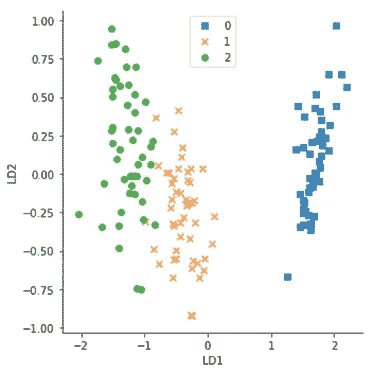
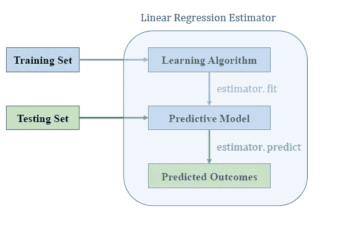
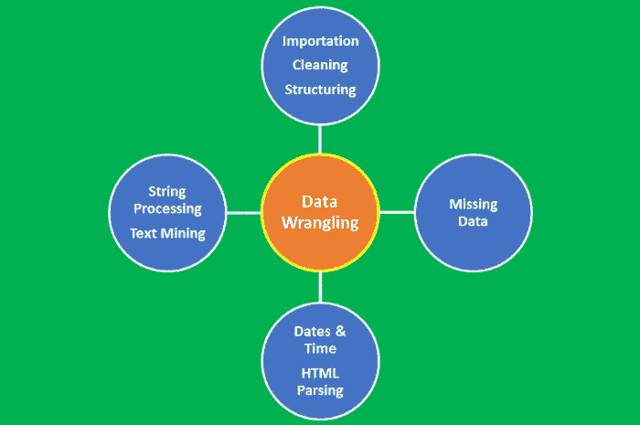
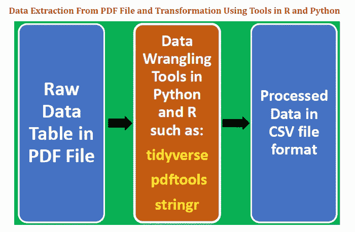
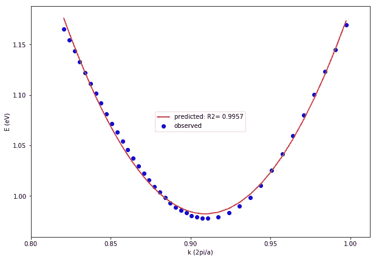

# 在介质上写数据科学博客的初学者指南

> 原文：<https://pub.towardsai.net/beginners-guide-to-writing-data-science-blogs-on-medium-a74774cf8f66?source=collection_archive---------0----------------------->

## 向人工智能写成功的数据科学帖子|

你是新来的吗？您对撰写数据科学文章并在媒体上发表这些文章感兴趣吗？

本文将讨论撰写可以在媒体上发表的优秀数据科学文章的各个阶段。媒介提供了一个便于写作的平台。基本上任何人都可以写中等博客。

我一年多前加入了 medium。我在 2018 年 7 月 7 日**发表了我的第一篇中型文章 [**使用 R 中的 sapply()函数生成一个表格**](https://medium.com/@benjaminobi/using-sapply-function-in-r-to-generate-a-table-310c8fb931cf) 。这篇文章主要是为了实验目的而写的。当有人真正阅读他们的作品并对他们的作品发表反馈和评论时，作家获得的满足感是鼓励我继续写作的原因。**

就在我的第一篇文章在 medium 上发表一年多之后，我现在已经在这个平台上发表了总共 40 篇文章，涵盖了不同的主题，如数据分析、数据科学、机器学习、体育分析、编程、物理教育、材料科学、人力资源和在线教育。我在 Medium 上发表的所有文章都可以在 [**这里**](https://medium.com/@benjaminobi) 找到。

尽管我已经写了几篇涵盖各种主题的文章，但本文将只关注数据科学文章。

在讨论撰写数据科学文章的一些准则之前，我们先来回答一个非常重要的问题。

**为什么要考虑在 Medium 上写数据科学文章？**

写中型文章有 5 个主要优势:

1.  它为您提供了展示数据科学知识和技能的途径。
2.  它激励你从事具有挑战性的数据科学项目，从而提高你的数据科学技能。
3.  它使你能够提高你的沟通技巧。这是有用的，因为它使你能够以一种普通大众能够理解的方式传达信息。
4.  每一篇发表在 medium 上的文章都被认为是知识产权，所以你可以在简历中添加一篇 Medium 文章。
5.  你可以从你的文章中赚钱。通过[**Medium Partner Program**](https://medium.com/creators)，任何在 Medium 上发表文章的人都可以使自己的文章获得赚钱的资格。

既然我们已经讨论了在介质上撰写数据科学文章的优势，那么让我们讨论一下在介质上撰写数据科学文章的指导原则。

# **在媒体上撰写数据科学文章的阶段**

在本节中，我们将讨论撰写一篇好的数据科学文章所涉及的各个阶段。

**第一阶段:开发项目创意**

你需要决定你计划做什么项目，或者你试图解决什么类型的数据科学问题。您可以在数据科学项目中免费使用几个数据集。数据科学项目包括数据可视化、回归分析、分类问题、机器学习、AI 等方面的问题。

**第二阶段:项目工作**

这是您实际处理数据科学问题的地方。你必须导入你的数据集，预处理和清理数据。然后使用数据进行分析或建模。您还可以使用数据集生成汇总统计数据或可视化数据，如散点图、条形图、直方图、线图、矩阵图、热图等。你必须决定使用什么数据科学工具，是 R 还是 Python (jupyter notebook)。

**阶段 3:在 GitHub 上创建一个项目存储库**

一旦您解决了感兴趣的问题，那么您就必须在 GitHub 上创建一个项目资源库，并上传项目文件，如数据集、jupyter 笔记本、R 程序脚本和样本输出。为任何数据科学项目创建 GitHub 存储库都是极其重要的。它使您能够随时访问您的代码。你可以与程序员和其他数据科学家分享你的代码。此外，这也是您展示数据科学技能的一种方式。

**第四阶段:利用项目成果写一篇中型文章**

一旦为项目创建了 GitHub 存储库，编写一篇中型文章就变成了简单的复制和粘贴。可以从代码中复制内容，直接粘贴到 medium 平台上。您还可以从示例输出文件(如图表和表格)中复制内容，并粘贴到您的媒体文章中。另外，如果您不想在您的 medium 文章中包含几行代码，您可以添加一个指向包含您的代码和其他项目文件的 GitHub 存储库的超链接。

# 我在 Medium 上的数据科学文章示例

当我在 medium 上写我的大部分数据科学文章时，我遵循了上面的 4 个阶段。我将在下面展示我的十大数据科学文章中的几个例子。

# **第一条**

**标题** : [数据可视化教程:天气数据](https://medium.com/towards-artificial-intelligence/tutorial-on-data-visualization-weather-data-52efa1bef183)

**Github 网址**:[https://github.com/bot13956/weather_pattern](https://github.com/bot13956/weather_pattern)

# 第二条

**标题** : [随机过程的机器学习模型](https://medium.com/p/c65a96f0b8c5?source=post_stats_page---------------------------)

**Github 网址**:[https://Github . com/bot 13956/Monte _ Carlo _ Simulation _ Loan _ Status](https://github.com/bot13956/Monte_Carlo_Simulation_Loan_Status)

# **第三条**

**标题** : [从零开始构建机器学习推荐模型](https://medium.com/p/6dd478ad9900?source=post_stats_page---------------------------)

**Github 网址**:[https://Github . com/bot 13956/ML _ Model _ for _ Predicting _ Ships _ Crew _ Size](https://github.com/bot13956/ML_Model_for_Predicting_Ships_Crew_Size)

# 第四条

**标题** : [机器学习:通过线性判别分析降维](https://medium.com/p/cc96b49d2757?source=post_stats_page---------------------------)

**Github 网址**:[https://Github . com/bot 13956/linear-discriminal-analysis-iris-dataset](https://github.com/bot13956/linear-discriminant-analysis-iris-dataset)

# 第五条

**标题** : [机器学习:通过主成分分析进行降维](https://medium.com/p/1bdc77462831?source=post_stats_page---------------------------)

**Github 网址**:[https://Github . com/bot 13956/principal _ component _ analysis _ iris _ dataset](https://github.com/bot13956/principal_component_analysis_iris_dataset)

# 第六条

**标题** : [机器学习:使用梯度下降的 Python 线性回归估计器](https://medium.com/p/b0b2c496e463?source=post_stats_page---------------------------)

**Github URL**:[https://Github . com/bot 13956/python-linear-regression-estimator](https://github.com/bot13956/python-linear-regression-estimator)

# **第七条**

**标题** : [使用 R 的 ggplot 包的柱状图教程](https://medium.com/p/b7f86104a974?source=post_stats_page---------------------------)

**Github 网址**:【https://github.com/bot13956/GDP_barplot_using_R】T2，【https://github.com/bot13956/barplot_marketing_emails】T4

# 第八条

**标题** : [数据角力教程:大学城数据集](https://medium.com/p/a0e8f8dfb6ae?source=post_stats_page---------------------------)

**Github 网址**:[https://Github . com/bot 13956/unstructured _ data _ university _ towns](https://github.com/bot13956/unstructured_data_university_towns)

# 第九条

**标题** : [使用 Python 和 R 从 PDF 文件中提取数据](https://medium.com/p/4ed8826bc5a1?source=post_stats_page---------------------------)

**Github 网址**:[https://Github . com/bot 13956/extract _ table _ from _ pdf _ file _ using _ R](https://github.com/bot13956/extract_table_from_pdf_file_using_R)

# 第十条

**标题** : [材料科学中的线性回归分析](https://medium.com/p/a45caac70d70?source=post_stats_page---------------------------)

**Github 网址**:[https://github.com/bot13956/regression_band_structure](https://github.com/bot13956/regression_band_structure)

总之，我们已经讨论了每个初学者在 medium 上撰写和发布数据科学文章应该遵循的主要阶段。在媒体上写作是一项非常有成就感的任务。它挑战你的创造力，激励你与世界分享你的知识，并为你提供展示你的数据科学和相关技能的方法。最后，你的媒介文章可以通过 [**媒介合伙人计划**](https://medium.com/creators) 产生副业收入。