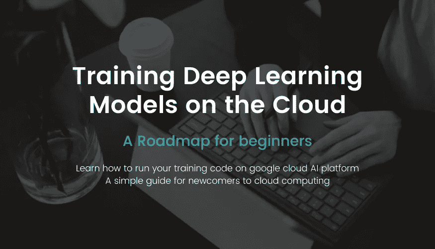
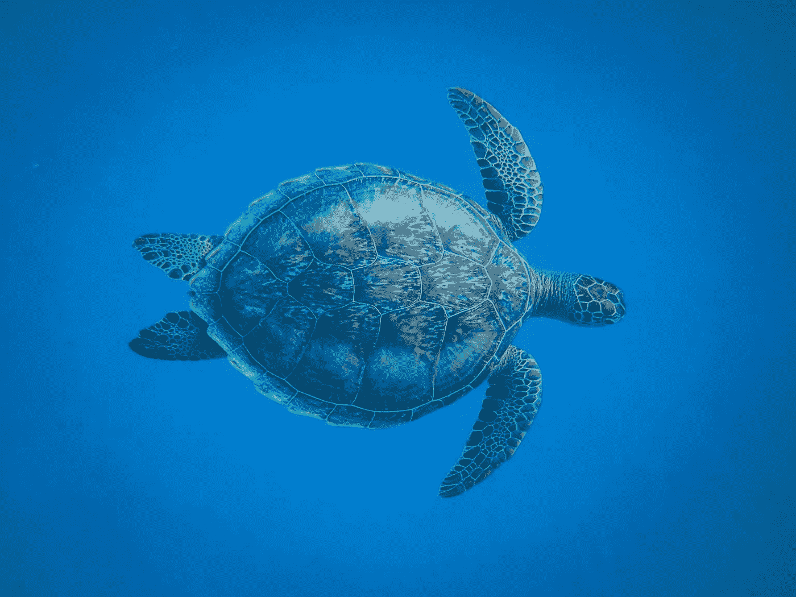

# 云环境下深度学习模型训练的初学者实用指南

> 原文：<https://pub.towardsai.net/beginners-helpful-guide-to-training-deep-learning-models-on-the-cloud-3202f29afd1b?source=collection_archive---------3----------------------->

## [深度学习](https://towardsai.net/p/category/machine-learning/deep-learning)

Google Cloud AI 平台训练深度学习模型简介



# 背景

大约一年前，我在从事一个个人项目，我需要能够在云上训练深度学习模型。这是我第一次在云上训练，所以我开始用谷歌搜索，试图找出哪条路最适合我想要达到的目标。

几个月前，我的一个朋友在 [LinkedIn](https://www.linkedin.com/in/nour-islam-mokhtari-07b521a5/) 上联系我，问我是否有一些云计算的经验，我是否可以指导他学习如何在云上训练他的深度学习模型。

现在，如果你在网上寻找，你会发现大量关于任何云平台(AWS、GCP、Azure 等)培训的资源，但我和我的朋友都找不到一个简单的指南来告诉我们如何从*A 点*到*B 点*。

**点 A** :我拥有的代码，它在我的本地机器上运行我的深度学习模型的训练。

**B 点**:我的代码运行在云上，并将我的模型保存在我可以访问的地方。

我已经有了一些使用 AWS 和 SageMaker 的经验，所以我的第一个想法是使用它。但是 AWS 有一点总是让我恼火，那就是文档。很多时候我不容易找到我要找的信息。

然后我开始研究谷歌云平台(GCP)。在我看来，GCP 产品的文档更加清晰。也有很多关于这个主题的教程，这让我的搜索更容易，但不是更快！

如果你开始研究如何使用你的定制代码和定制数据来训练你的深度学习模型，你很容易就会被你在 GCP 上找到的大量信息所淹没。

我记得花了几天时间试图找出哪个 GCP 选项适合我的项目。

最后，我能够使用文档和网络上的不同资源将事情拼凑起来。

当我完成我的项目时，我记得我在想，应该有一个更好的指南来指导我如何做这件事。事实上，我需要的一件非常重要的事情是一张如何轻松快速地从 A 地到达 B 地的路线图。

# 路线图

这是我最终遵循的路线图:

1.  准备好代码并在本地机器上运行。
2.  获取培训代码所需的依赖项列表。
3.  使用项目的依赖项构建 docker 映像。
4.  将您新创建的 Docker 图像推送到 Google 容器注册中心(GCR)。
5.  使用 Google Cloud SDK (gcloud)你可以使用你之前构建的 Docker 映像在 google AI 平台上运行一个容器。

现在，如果你熟悉上面的术语，那么你就可以在谷歌云上训练深度学习模型时轻松导航。如果事情还是不清楚，那么请继续看下去！

# 深潜



让我们试着分解上面提到的不同步骤。

## 1.准备好代码，并在本地机器上运行

这一步是最容易的，因为你应该已经熟悉深度学习，并且知道如何在你的机器上训练深度神经网络。

不管你的代码是使用 *Tensorflow 1.x* 、 *Tensorflow 2.x* 、 *PyTorch、*还是其他深度学习框架。我上面定义的路线图对他们都适用。

然而，您应该确保这一步得到了很好的验证。这意味着您的代码应该可以在本地机器上顺利运行。在验证此步骤之前，请不要进入下一步！

## 2.获取您的培训代码需要的依赖项列表

您可能正在使用 Python 包管理器来安装训练模型所需的所有库。类似于:pip 或 conda。

要获得程序的依赖项，您需要运行一个简单的 Python 命令。

如果您使用 pip，请使用以下命令:

```
pip freeze > requirements.txt
```

如果您使用的是 conda，请使用以下命令:

```
conda list --export > requirements.txt
```

这两个命令都会在您运行这个命令的目录中创建一个 *requirements.txt* 文件。该文件将包含您的系统或虚拟环境中所有已安装的软件包。

## 3.使用项目的依赖项构建 docker 映像

要构建 docker 映像，您需要创建一个所谓的*Docker 文件*，然后您可以使用 *Docker* (您可能已经安装在您的机器上)及其命令来创建一个所谓的 *docker 映像*。

首先，创建一个 docker 文件，这将是你的 docker 图像的基础。它看起来会像这样:

如果你不明白所有的事情，不要害怕。这实际上是我的 [***深度学习使用 Tensorflow 2***](https://www.aifee.co/p/the-complete-deep-learning-for-computer-vision-bootcamp) 进行计算机视觉 Bootcamp 的样本代码。现在您需要关注的是上面文件中的最后 5 个命令:

第一个命令( *WORKDIR* )在 docker 映像中定义了一个工作目录。这是下一步工作的起点。

第二个命令( *COPY* )会将当前目录中的所有内容复制到您在前一个命令中定义的工作目录中。

第三个命令(*运行)*将创建 3 个目录。为什么具体是 3？原因很简单，当我的脚本运行时，我的代码将需要这些目录。

第四个命令( *RUN* )将利用我们之前生成的 *requirements.txt* 文件。事实上，这个命令将在我们的 docker 映像中安装所有必要的需求。这将确保无论何时你使用你的 docker 映像(无论何时你从你的映像运行一个*容器*)代码都不会有任何问题。

最后一个命令( *ENTRYPOINT* )将是在从 docker 映像运行容器时实际运行训练脚本的命令。

现在，您可以使用以下 docker 命令创建 docker 映像:

```
docker build -t sample-training-app .
```

这里我给我的 docker 图像取了一个人类可读的名字: *sample-training-app*

末尾的点将考虑您的目录中存在的任何名为 ***Dockerfile*** 的 dockerfile(从您运行前面命令的地方)。

## 4.将您新创建的 Docker 图像推送到 Google 容器注册表

现在你已经创建了一个 docker 映像，你可以把它推送到 google 容器注册中心或者简称为 **GCR** 。GCR 和 docker 镜像就像 Github 和库……差不多吧！

当你将 docker 图片推送到 GCR 时，你将能够在谷歌云平台的任何地方访问它，包括人工智能平台。

要将 docker 映像推送到 GCR，您需要使用以下命令:

```
docker push HOSTNAME/PROJECT-ID/IMAGE
```

**主机名**可以是 *gcr.io* 、 *eu.gcr.io、us.gcr.io、*或 *asia.gcr.io (* 第一个是通用容器注册表，可以在美国或其他地方，第二个在欧洲，第三个在美国，最后一个在亚洲)。

**PROJECT-ID** 是你的项目在谷歌云平台上的 ID。

**IMAGE** 是您之前推送的 docker 映像的名称(在我们的例子中是 *sample-training-app* )。

## 5.使用 gcloud 并使用您之前构建的 Docker 映像在 google AI 平台上运行一个容器

*gcloud* 是 google cloud 的 SDK，你可以下载，然后在你的终端中使用它的命令。这里有一个例子(来自文档)是关于如何用你的 docker 图片在 google AI 平台上运行训练的:

```
gcloud ai-platform jobs submit training $JOB_NAME \
  --region $REGION \
  --master-image-uri $IMAGE_URI \
  -- \
  --model-dir=gs://$BUCKET_NAME/$MODEL_DIR \
  --epochs=10
```

**JOB_NAME** 只是你给自己培训工作起的一个名字。每当你在云上运行你的训练，你需要给它一个名字。如果您运行两次培训，则每次都需要提供不同的名称。

**区域**是您希望培训进行的区域。它可能是众多中的一个[。](https://cloud.google.com/compute/docs/regions-zones#available)

**图片 _URI** 是你在谷歌云上的图片的完整路径(看起来像:【gcr.io/project_id/sample-training-app】T42

最后两个参数( *model-dir* 和 *epochs* )实际上是将传递给 python 脚本的参数。这些是可选的。如果您的 python 脚本不带任何参数，那么您可以忽略这些命令，不使用它们。

完成所有这些步骤后，你的训练应该在谷歌人工智能平台上运行，模型将保存在你在脚本中选择的任何位置。

# 结论

我希望这个指南能帮助你在云上训练深度学习模型。还有很多细节我没有在这里介绍，但是如果我介绍了，那么这将变成一门课程而不是一篇博客文章！事实上，我已经创建了这样一个课程来帮助那些需要更详细的代码和支持方法的人。它是使用 tensor flow 2***进行计算机视觉 Bootcamp 的 [***完整深度学习的一部分。*** 学习如何在云上训练你的深度学习模型只是训练营的一部分。还有其他关于*物体检测* ( *更快的 RCNN，SSD，和 YOLOv3* )和*图像分割* ( *掩膜 RCNN* )。](https://www.aifee.co/p/the-complete-deep-learning-for-computer-vision-bootcamp)***


作者制作的图像

我是一名机器学习工程师，致力于解决具有挑战性的计算机视觉问题。我想帮助你学习应用于计算机视觉问题的机器学习。以下是方法。

1.  通过帮助您了解该领域的最新动态。我几乎每天都在 [**LinkedIn**](https://www.linkedin.com/in/nour-islam-mokhtari-07b521a5/) 和[**Twitter**](https://twitter.com/NourIslamMo)**上分享一点点 ML 帖子。所以跟我去吧！**
2.  **每周给你一份我的 [**时事通讯**](https://nourislam.ck.page/dc3e8b7e12) 上那些小帖子的摘要。所以订阅吧！**
3.  **通过在 Medium 上写关于机器学习不同主题的文章。所以跟我来吧！**
4.  **给你一份免费的机器学习工作清单，帮助你检查你需要学习的所有要点，如果你计划在 ML，特别是在计算机视觉方面的职业生涯。你可以在这里 得到核对表 [**。**](https://www.aifee.co/free-resources)**

**5.最后但同样重要的是，通过与你分享我的 [**免费入门 Tensorflow 课程**](https://aifee.teachable.com/p/introduction-to-tensorflow-2-for-computer-vision) ，它有超过 ***4 小时*的视频内容**，你可以在那里问我任何问题。**

**此外，如果您有任何问题或者您只是想聊聊 ML，请随时在 LinkedIn 或 Twitter 上联系我！**