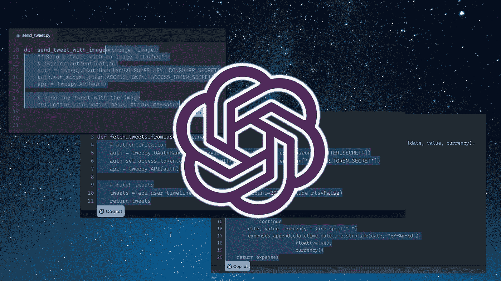

# OpenAI Codex 背后:5 个你不知道的关于构建 Codex 的有趣挑战

> 原文：<https://pub.towardsai.net/behind-openai-codex-5-some-fascinating-challenges-about-building-codex-you-didnt-know-about-4e820d58a3c4?source=collection_archive---------1----------------------->

## [人工智能](https://towardsai.net/p/category/artificial-intelligence)

## 法典构建过程中遇到的一些 ML 工程和建模挑战。

来源:[https://bdtechtalks . com/2021/07/15/open ai-codex-ai-programming/](https://bdtechtalks.com/2021/07/15/openai-codex-ai-programming/)

几周前，OpenAI 发布了 Codex，这是一个可以将自然语言翻译成代码的大型模型，震惊了人工智能(AI)世界。Codex 可以有效地从基本语言指令生成端到端。如果你不相信我，你应该看看这个视频，它可以被认为是有史以来最好的人工智能演示之一😉

视频鸣谢:OpenAI

自从最初发布以来，已经有很多关于 Codex 能力的文章。
然而，我更感兴趣的是那些与构建如此庞大的模型极其相关的小需求。深入研究法典，我发现了一些有趣的事情，值得一提的是:

## Codex 精通十几种语言，但它是为 Python 而训练的。

我觉得这非常有见地。OpenAI 的最初目标是让 Codex 精通 Python，但结果是该模型在预训练过程中学会了其他语言。这说明了语言预训练模型的独特能力。

## **2)**

人工智能社区对 Codex 背后的研究感到惊讶，但我认为工程方面也同样令人印象深刻。我特别感兴趣的一个方面是测试部分。你如何在不冒巨大风险的情况下测试实时代码呢？事实证明，OpenAI 团队投入了大量的工作来构建非常复杂的沙箱，以孤立地测试 Codex 的输出。

## **3)** **将语义与代码相匹配绝非易事**

在世界上所有的源代码中训练一个模型听起来很酷，但它远非无足轻重。毕竟，并非所有代码都是生而平等的。Github 中的代码可能没有很好的文档记录，而笔记本可以有丰富的语义信息。类似地，堆栈溢出中的代码片段具有更丰富的语义信息。将代码段映射到语言语义是构建 Codex 的挑战之一。

## **4)**

如果你考虑程序员是如何工作的，我们倾向于将一个问题分解成更小的任务，并为这些任务生成代码。事实证明，Codex 非常擅长后者，但仍在问题分解任务中苦苦挣扎。如果我们认为问题分解需要非常复杂的认知技能，这就不足为奇了。

## 监督微调是建立法典的一个重要部分

互联网上的代码以各种层次的完整性、文档化、语法丰富性等出现。在如此多样的代码集中训练模型可能会产生不可靠的结果。从这个意义上说，OpenAI 必须经历一次大规模的有监督的微调。

这些是法典的一些不太为人所知的方面，但却是模型第一版成功的主要贡献者。食品法典委员会的成功是由于先进的 ML 研究，大规模 ML 工程和基础设施的努力。