# 伯努利分布 Python 概率教程

> 原文：<https://pub.towardsai.net/bernoulli-distribution-probability-tutorial-with-python-90061ee078a?source=collection_archive---------0----------------------->

来源: [Unsplash](https://unsplash.com/photos/RgLaH00kZOk)

## [概率](https://towardsai.net/p/category/probability)，[社论](https://towardsai.net/p/category/editorial)，[统计](https://towardsai.net/p/category/statistics)，[教程](https://towardsai.net/p/category/tutorial)

## 伯努利分布教程-通过 Python 中的示例深入研究随机变量的离散概率分布

**作者:**普拉蒂克·舒克拉，[罗伯特·伊里翁多](https://mktg.best/vguzs)

最后更新，2021 年 1 月 7 日

 [## 加入我们吧↓ |面向人工智能成员|数据驱动的社区

### 加入人工智能，成为会员，你将不仅支持人工智能，但你将有机会…

members.towardsai.net](https://members.towardsai.net/) 

在这一系列教程中，我们将详细探究概率分布。我们将不仅仅展示公式，相反，我们将看到每个公式是如何从它们的基本定义中推导出来的(因为理解推导背后的数学是很重要的)，我们将通过使用 Python 中的一些例子来展示这一点。

**本教程的代码可在**[**Github**](https://github.com/towardsai/tutorials/tree/master/bernoulli_distribution_tutorial)**上获得，其完整实现也可在**[**Google Colab**](https://colab.research.google.com/drive/1HZzn5rOPQKq_x6693sY5I0658W9P6z3p?usp=sharing)**上获得。**

## 目录:

1.  什么是随机变量？
2.  离散随机变量。
3.  连续随机变量。
4.  概率分布。
5.  伯努利分布。
6.  概率质量函数(PMF)。
7.  伯努利分布的平均值。
8.  伯努利分布的方差。
9.  伯努利分布的标准差。
10.  伯努利分布的平均偏差。
11.  伯努利分布的矩母函数。
12.  伯努利分布的累积密度函数。
13.  Python 实现。
14.  伯努利分布概述。
15.  资源。
16.  参考文献。

> 📚查看我们用 Python 编写的[力矩生成函数](https://towardsai.net/p/data-science/moment-generating-function-for-probability-distribution-with-python-tutorial-34857e93d8f6)教程。📚

在深入研究概率分布之前，让我们先了解一些关于随机变量的基本术语。

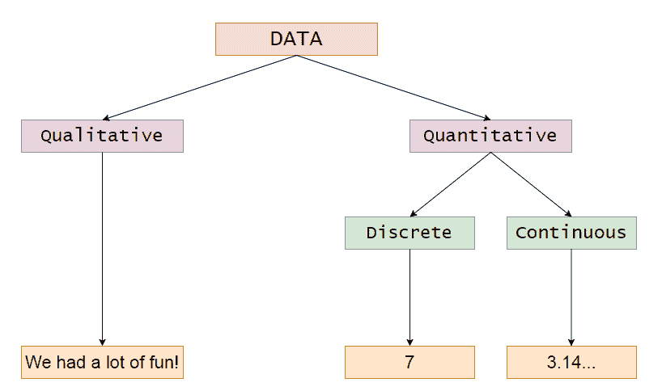

图 1:数据的基本类型

# 什么是随机变量？

如果一个变量的值是未知的，则称它为随机变量。换句话说，如果我们不能用任何函数得到相同的变量，那么这个变量就是随机变量。

随机变量的可能值是随机现象的数字结果。

**随机变量的性质:**

1.  我们用大写字母表示随机变量。
2.  随机变量可以是离散的，也可以是连续的。

**例子:**

1.  抛一枚公平的硬币:

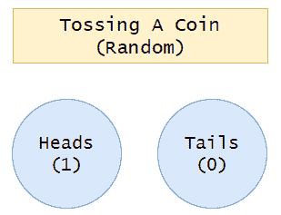

图 2:随机投掷一枚硬币。

在图 1 中，我们展示了结果不依赖于任何其他变量。所以抛硬币的输出是随机的。

2.掷骰子:

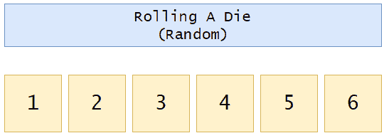

图 3:滚动骰子。

在图 2 中，我们可以注意到，芯片的产量无法预先预测，也不依赖于任何其他变量。所以我们可以说输出是随机的。

现在让我们简单看一下非随机变量。

图 4:非随机事件。

在上面的例子中，我们可以看到，在例 1 中，通过两边各减一，可以快速得到变量 x 的值。所以 x 的值不是随机的，而是固定的。在第二个例子中，我们可以看到变量 y 的值依赖于变量 x 的值，这里我们可以注意到，y 的值根据 x 的值而变化。当我们插入 x 的相同值时，我们可以生成相同的输出变量 y。所以变量 y 根本不是随机的。在概率分布中，我们将研究随机变量。

# 离散随机变量:

如果一个随机变量的值可以通过**计数**得到，则称该随机变量为离散随机变量。离散变量可以在**有限时间**内计数。这里需要注意的关键点是，离散变量不必是整数。我们可以有有限浮点值的离散随机变量。

**例子:**

1.  校车上的学生人数。
2.  盘子里饼干的数量。
3.  抛硬币时的人头数。
4.  一颗恒星周围行星的数量。
5.  家庭成员的净收入。

# 连续随机变量:

如果一个随机变量的值可以通过**测量**得到，则称该随机变量为连续随机变量。我们无法在有限的时间内计算连续变量。换句话说，我们可以说计算连续变量需要无限长的时间。

**示例:**

1.  宇宙中任意一种动物的确切重量。
2.  随机选择的学生的准确身高。
3.  一小时内走过的确切距离。
4.  昨天吃的食物的确切数量。
5.  运动员准确的获胜时间。

需要注意的重要一点是，我们在这里提到了单词**“Exact”**。这意味着我们进行的所有测量都达到了绝对的精度。

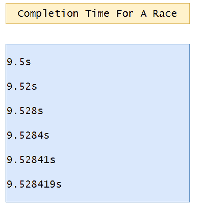

图 5:一场比赛的完成时间。

例如，如果我们为一名运动员测量一场比赛的完成时间，我们可以说他在 9.5 秒内完成了比赛。更确切地说，我们可以说他以 9.52 秒跑完了全程。更确切地说，我们可以说这位运动员以 9.523 秒跑完了全程。为了增加时间的精确性，我们也可以说他以 9.5238 秒完成了比赛。如果我们继续这样做，我们可以把这个东西提高到无限精确的水平，这将花费我们无限的时间来测量它。这就是为什么它被称为连续变量。

# 离散变量和连续变量的主要区别:

**例子:你现在的年龄是多少？**

对此你怎么看？是连续变量还是离散变量？请花点时间考虑一下。

这个例子被归入连续变量组。如上所述，关于你的年龄，我们可以说如下:

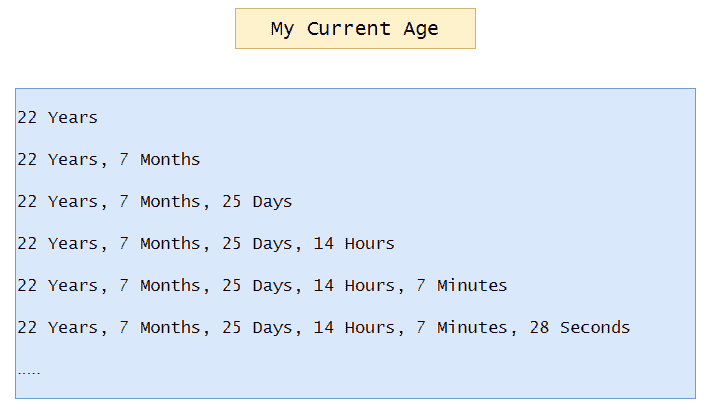

图 6:精确的当前年龄。

请注意，我们可以越来越精确地写出年龄。因此，我们无法在有限的时间内计算一个人的确切年龄。这就是为什么它是一个连续变量。

另一方面，如果问题是，你现在的年龄是多少岁？".那么，在这种情况下，变量可以被分类到离散变量组中。因为我们已经知道我现在的年龄是“X 年”。"

接下来，让我们讨论概率分布。概率分布基于数据类型，可以是离散的，也可以是连续的。

# 概率分布:

> *概率分布是一种数学函数，它给出了实验中不同可能结果出现的概率。*[*【1】*](https://en.wikipedia.org/wiki/Probability_distribution)

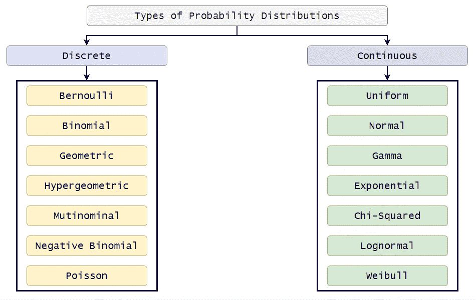

图 7:概率分布的类型。

# 伯努利分布:

## 伯努利分布的条件

1.  必须只有一次审判。
2.  试验的结果肯定只有两种可能，一种叫做成功，一种叫做失败。
3.  p(成功)= p
4.  p(故障)= 1 — p = q
5.  通常，我们将值 1 分配给概率为 p 的事件，将值 0 分配给概率为 1 — p 的事件
6.  按照惯例，我们有 p>1 — p。另一种方法是，我们把成功的概率(1)作为 P，把失败的概率(0)作为 1 — p，这样 P(成功)> P(失败)。
7.  我们必须有其中一个事件的概率(成功或失败)或一些表明实验概率的过去数据。

如果我们的数据满足上述条件，那么:

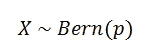

图 8:

离散随机变量 X 遵循伯努利分布，成功概率=p.
伯努利分布的直观表示:

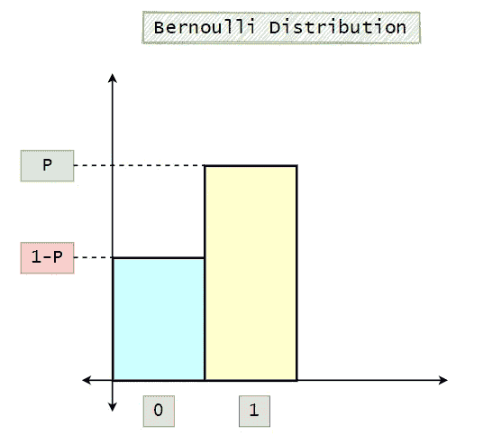

图 9:伯努利分布的可视化表示。

**例子:**

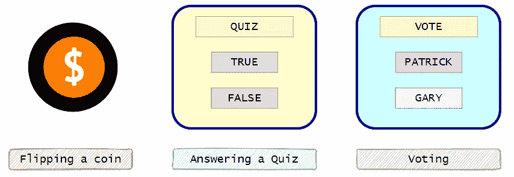

图 10:伯努利分布的例子。

例如:

一次选举只有两个候选人:帕特里克和加里，我们可以投帕特里克或加里的票。

*   P(成功)= P(1) =投帕特里克一票= 0.7
*   P(失败)= P(0) =投 Gary = 0.3

这里我们只有一个试验和两种可能的结果。所以我们可以说数据遵循伯努利分布。为了形象化它:

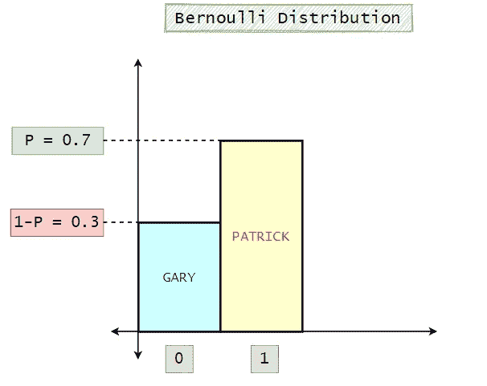

图 11:伯努利分布示例图。

# 概率质量函数(PMF):

> *离散随机变量 X 的概率质量函数为随机变量的每个可能值分配概率。通过使用 PMF，我们可以得到每个随机变量的概率。【*[*6*](https://en.wikipedia.org/wiki/Probability_mass_function)*】*

设 X 是一个离散随机变量，它的可能值用 x1，x2，x3，…，xn 表示。概率质量函数(PMF)必须满足以下条件:

**PMF 的属性:**

1.  给定 PMF 中所有概率的总和必须为 1。

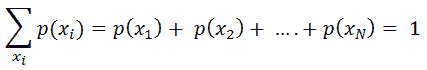

图 12:PMF 的概率总和。

2.所有可能的概率值必须大于或等于 0。

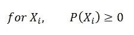

图 13:随机变量的概率。

## **伯努利分布的概率质量函数(PMF):**

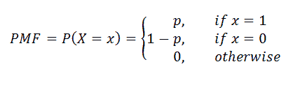

图 14:概率质量函数(PMF)。

让我们想象一下这个函数:

图 15:伯努利分布可视化。

# 伯努利分布平均值:

离散随机变量 X 的均值是它的加权平均值。它的概率对随机变量 X 的每一个值进行加权，在伯努利分布中，随机变量 X 只能取两个值:0 和 1，我们可以利用概率质量函数(PMF)快速得到权重。

> *均值:概率分布的均值是具有该分布的随机变量的长期算术平均值。*

期望值 E[X]表示有利事件的可能性。

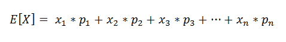

图 16:期望值 E[X}。

伯努利分布的期望值或均值由下式给出:

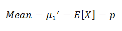

图 17:伯努利分布的平均值。

**伯努利分布的平均值:**

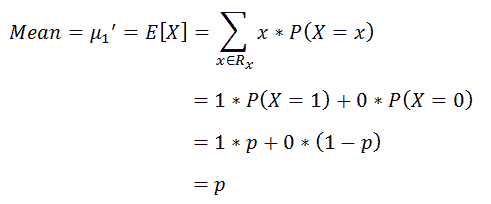

图 18:伯努利分布的均值证明。

# 伯努利分布的方差:

> *方差(σ2)是随机数集合中的每个数字与平均值的距离。方差的平方根叫做标准差。*

根据其定义:

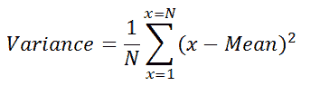

图 19:方差公式。

离散概率分布的方差:

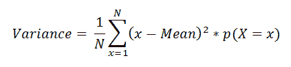

图 20；离散概率分布的方差。

在我们的例子中，变量 x 只能取两个值:0 和 1。

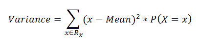

图 21:伯努利分布的方差。

**伯努利分布的方差:**

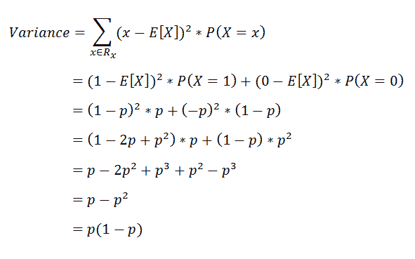

图 22:伯努利分布方差的证明。

有一种更流行的形式来计算统计中的方差:

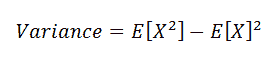

图 23:方差公式的流行形式。

让我们看看这是如何产生的。

> *基本上，方差是每个值与分布均值之间的平方差的期望值。【*[*7*](https://www.probabilisticworld.com/mean-variance-probability-distributions/)

*根据方差的定义，我们可以得出:*

*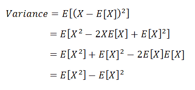*

*图 24:方差公式的证明。*

*使用以下公式计算方差:*

*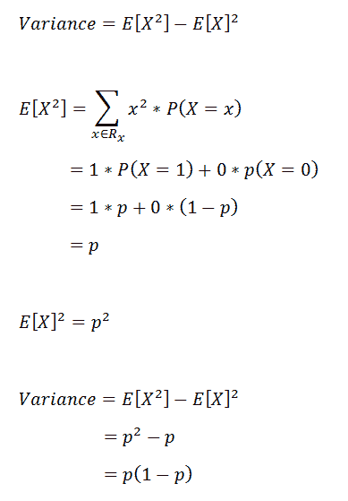*

*图 25:伯努利分布的方差证明。*

*在图 25 中，我们可以看到，无论我们使用哪个公式，伯努利分布方差都是相同的。*

# *伯努利分布的标准偏差:*

> **标准偏差是一个数字，用于说明一组的测量值如何从平均值(平均值或期望值)中分散出来[*[*8*](https://en.wikipedia.org/wiki/Standard_deviation)*]。**

*低标准差意味着大多数数字接近平均值，而高标准差意味着数字更加分散。*

*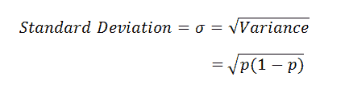*

*图 26:伯努利分布的标准偏差。*

# *伯努利分布的平均偏差:*

> **平均偏差是数据集相对于数据平均值的绝对偏差的平均值。**

*根据定义:*

*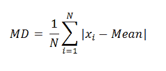*

*图 27:平均偏差公式。*

*对于离散概率分布:*

*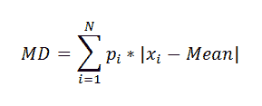*

*图 28:概率分布的平均偏差。*

*求伯努利分布的平均偏差:*

*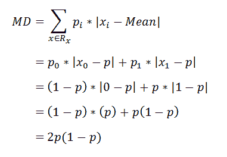*

*图 29:伯努利分布的平均偏差。*

# *伯努利分布的矩母函数；*

*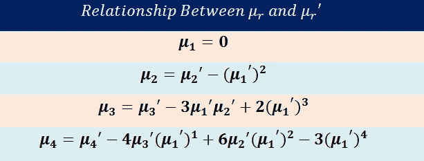*

*图 30；中心矩和原始矩之间关系的总结。*

*对于下面的推导，我们将使用我们在之前的教程中推导出的公式。所以我们建议你去看看我们的矩母函数教程。*

**

*图 31:力矩生成函数的定义。*

***力矩生成函数:***

*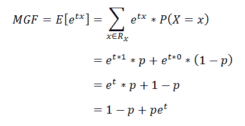*

*图 32:伯努利分布的矩母函数。*

## *寻找原始时刻:*

## *1.第一时刻:*

***a .第一个原始力矩:***

*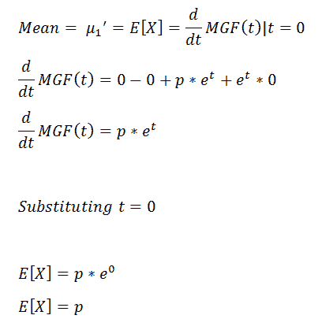*

*图 33:第一个原始时刻。*

## *2.二阶矩:*

***a .第二个原始力矩:***

*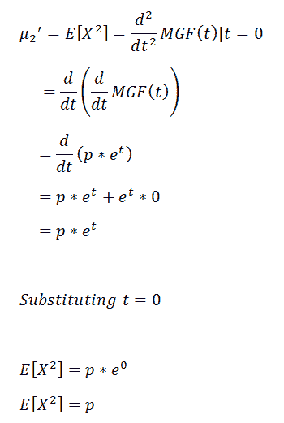*

*图 34:第二个原始时刻。*

***b .第二中心矩(方差):***

*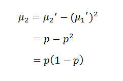*

*图 35:第二个中心矩。*

## *3.三阶矩:*

***a .第三个原始时刻:***

*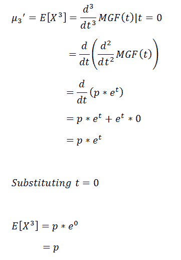*

*图 36:第三个原始时刻。*

***b .第三中心矩:***

*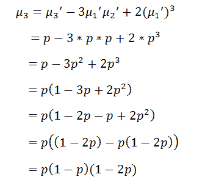*

*图 37:第三中心矩。*

***c .第三标准化矩:(偏斜度)***

*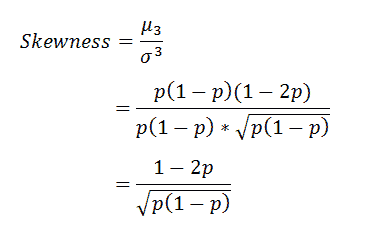*

*图 38:第三个标准化矩(偏斜度)。*

## *4.第四个时刻:*

***a .第四生时刻:***

*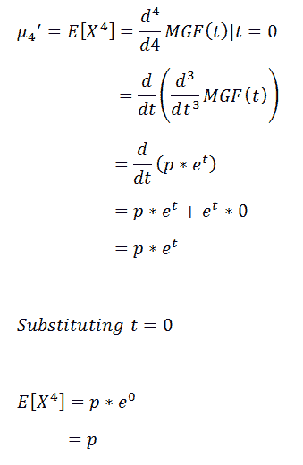*

*图 39；第四个原始时刻。*

***b .第四居中时刻:***

*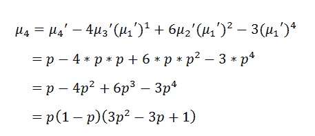*

*图 40:第四个居中的力矩。*

***c .第四标准化矩:(峰度):***

*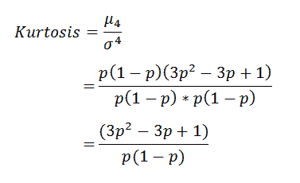*

*图 41:第四个标准化矩(峰度)。*

**

*图 42:第四个标准化矩(过度峰度)。*

# *累积分布函数(CDF):*

*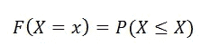*

*图 43:累积密度函数定义。*

*基于概率质量函数(PMF)，我们可以将伯努利分布的累积分布函数(CDF)写成如下:*

*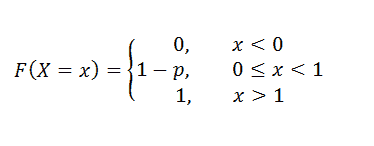*

*图 44:伯努利分布的累积密度函数。*

> *接下来有趣的部分，让我们继续它在 Python 中的实现。*

# *Python 实现:*

1.  *导入所需的库:*

*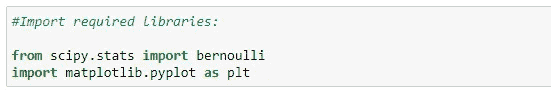*

*图 45:导入所需的库。*

*2.寻找瞬间:*

*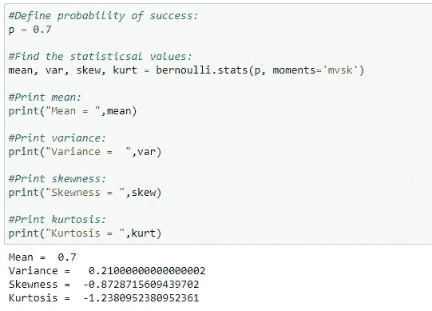*

*图 46:寻找 p 值为 0.7 的伯努利分布的矩。*

*3.获取平均值:*

*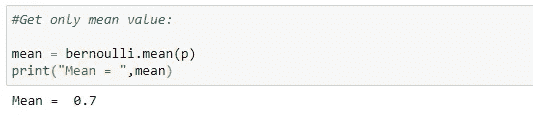*

*图 47:p = 0.7 时的平均值。*

*4.获取中值:*

*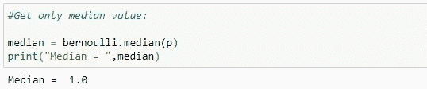*

*图 48:p = 0.7 时的中值。*

*5.获取方差值:*

*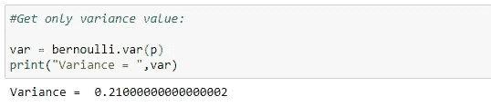*

*图 49:p = 0.7 时的方差。*

*6.获取标准偏差值:*

*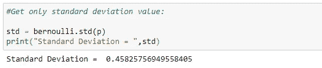*

*图 50:p = 0.7 的标准偏差。*

*7.概率质量函数(PMF):*

*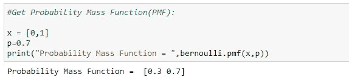*

*图 51:p = 0.7 的概率质量函数。*

*8.策划着 PMF:*

*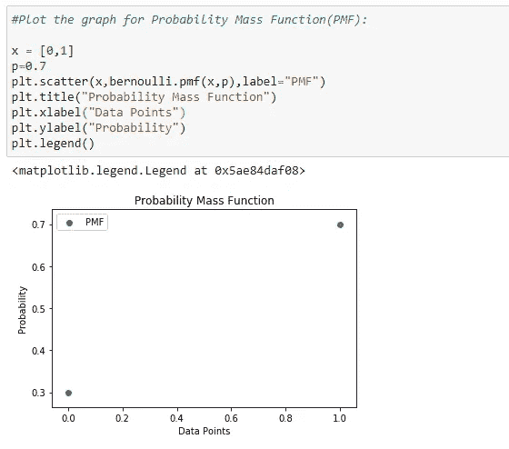*

*图 52:p = 0.7 时的 PMF 散点图。*

*9.累积密度函数(CDF):*

*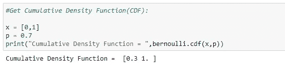*

*图 53:p = 0.7 时的累积密度函数。*

*10.绘制 CDF:*

*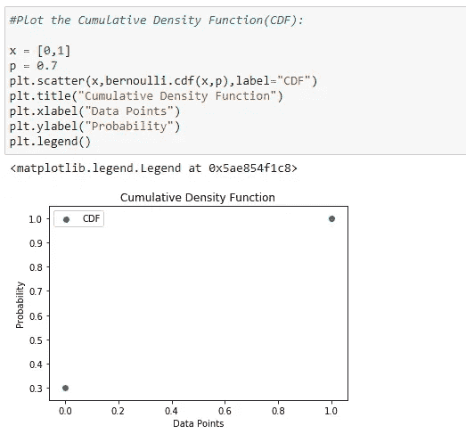*

*图 54:p = 0.7 时的 CDF 散点图。*

*11.绘制 PMF 的条形图:*

**

*图 55:p 值为 0.7 的 PMF 的条形图。*

*12.绘制 CDF 的条形图:*

**

*图 56:p 值为 0.7 时的 CDF 条形图。*

*13.不同实验的输出:*

**

*图 57:为不同的伯努利实验生成输出。*

# *伯努利分布概述:*

**

*图 58:伯努利分布总结。*

*这就是伯努利分布教程。我们希望你喜欢阅读它，并学到一些新的东西。我们将尝试在未来更深入地涵盖概率分布。任何建议或反馈对于继续改进都至关重要。如果你有任何问题，请在评论中告诉我们。*

*

给普拉蒂克买杯咖啡！* 

***免责声明:**本文表达的观点仅代表作者个人观点，不代表卡内基梅隆大学或其他(直接或间接)与作者相关的公司的观点。这些文章并不打算成为最终产品，而是当前思想的反映，同时也是讨论和改进的催化剂。*

*通过[向 AI](https://towardsai.net/) 发布*

# *资源:*

*[Google colab 实现](https://colab.research.google.com/drive/1HZzn5rOPQKq_x6693sY5I0658W9P6z3p?usp=sharing)。*

*[Github 库](https://github.com/towardsai/tutorials/tree/master/bernoulli_distribution_tutorial)。*

# *参考资料:*

*[1]概率分布，维基百科，【https://en.wikipedia.org/wiki/Probability_distribution *

*[2]伯努利分布，Statlect，[https://www . stat lect . com/probability-distributions/伯努利分布](https://www.statlect.com/probability-distributions/Bernoulli-distribution)*

*[3]方差，维基，[https://en.wikipedia.org/wiki/Variance](https://en.wikipedia.org/wiki/Variance)*

*[4]伯努利分布，维基百科，[https://en.wikipedia.org/wiki/Bernoulli_distribution](https://en.wikipedia.org/wiki/Bernoulli_distribution)*

*[5]伯努利分布，scipy.org，[https://docs . scipy . org/doc/scipy-0 . 14 . 0/reference/generated/scipy . stats . Bernoulli . html](https://docs.scipy.org/doc/scipy-0.14.0/reference/generated/scipy.stats.bernoulli.html)*

*[6]概率质量函数，维基百科，[https://en.wikipedia.org/wiki/Probability_mass_function](https://en.wikipedia.org/wiki/Probability_mass_function)*

*[7]概率分布的均值和方差，概率世界，[https://www . Probabilistic World . com/Mean-Variance-Probability-Distributions/](https://www.probabilisticworld.com/mean-variance-probability-distributions/)*

*[8]标准差，维基百科，[https://en.wikipedia.org/wiki/Standard_deviation](https://en.wikipedia.org/wiki/Standard_deviation)*