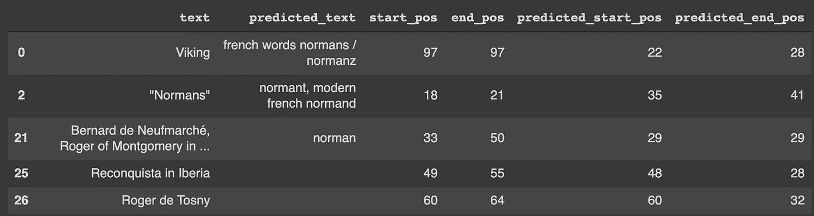

# 回答问题的伯特

> 原文：<https://pub.towardsai.net/bert-for-questionanswering-bfff793a4cd8?source=collection_archive---------0----------------------->

照片由 [Alex(嘉豪)霍](https://jhuo831alex.github.io/)

## [自然语言处理](https://towardsai.net/p/category/nlp)

几个月前，我写了一篇关于 [BERT](https://medium.com/@shwetabaranwal20/understanding-bert-b69ce7ad03c1) 的中型文章，讨论了它的功能和用例，以及它通过 Transformers 的实现。在这篇文章中，我们将看看如何使用 BERT 根据给定的上下文使用拥抱脸中的[变形金刚](https://huggingface.co/transformers/)来回答我们的问题。

假设问的问题是: ***虚构的《肖邦》是谁写的？*《肖邦》是贾科莫·奥雷菲西创作的，1901 年在米兰制作。所有的音乐都源自肖邦的作品。** 那么伯特所期待的答案是 ***贾科莫·奥利佛。***

斯坦福问答数据集可以从这里下载，用于微调伯特:[https://rajpurkar.github.io/SQuAD-explorer/](https://rajpurkar.github.io/SQuAD-explorer/)。数据集采用 JSON 格式，需要转换为 pandas 数据框。转换后，我们需要三列。`question`、`context`和`text`。`answer_start`列给出了`context`中答案的字符级开始位置，而我们需要答案的令牌级开始位置，因为输入是在令牌级进入模型的。例如:如果上下文是*“她叫亚历克斯。”*答案是*“Alex”，*则`answer_start`的值为 12，而我们需要从 4 开始定位。`text`列中有答案文本，我们将使用该列来获取答案在上下文中的开始位置。

SQAUD 数据集转换为 Pandas 数据框

## 输入和输出向量

问题和上下文被连接到一个由`[SEP]`标记(标记 id: 102)分隔的标记化向量中，并与标记类型 id 向量一起被馈送到 BERT 中，其中我们将 0 分配给问题向量，然后将 1 分配给上下文向量。这类似于两个文本的标记化，其中第一个文本是问题，第二个文本是上下文。使用的记号赋予器是来自`bert-base-uncased`的预先训练的 Bert 记号赋予器。输出向量是来自输入标记化向量的答案的开始和结束位置。

要获得答案的开始和结束位置，对`text`进行标记化，并在输入标记向量中查找文本标记 id 向量，并注意输入标记向量的开始和结束索引，它与文本标记 id 向量相匹配。

下面是 torch Dataloader 的代码，它输出输入令牌向量、令牌类型、ids 以及答案的开始和结束位置。

## 模型

使用的模型是来自`bert-base-uncased`的预训练伯特模型，后面是形状的线性密集层`(hidden_size, 2)`。输入是问题上下文连接的标记 id 向量和标记类型 id 向量，输出是来自输入标记 id 的答案的开始和结束位置。使用的损失函数是`nn.CrossEntropyLoss()`。总损失是答案的开始和结束位置的损失的总和。

## 培养

所用令牌 id 的最大序列长度为 512，批处理大小为 8，在 Google colab GPU 上运行了 2 个时期。

## 估价

来自小队的 dev 数据集被转换成 pandas df 并通过训练的模型运行。预测的开始和结束位置用于从输入令牌 id 向量中获取预测的答案文本，并与数据的`text`(实际答案)列进行比较。

如果预测的开始和结束位置位于实际的开始和结束位置内，则认为是成功的。使用的 dev 数据集样本有 454 个数据点，其中 349 个数据点位于实际答案范围内，模型的验证准确率约为 77%。

开发组中正确识别的答案示例

来自开发集的错误识别答案示例

## 代码 Git repo

 [## ShwetaBaranwal/回答问题的伯特

### 在 GitHub 上创建一个帐户，为 ShwetaBaranwal/BERT-for-question-answering 开发做贡献。

github.com](https://github.com/ShwetaBaranwal/BERT-for-QuestionAnswering) 

## 参考

 [## BERT -变压器 2.6.0 文档

### BERT 模型是在 BERT:用于语言理解的深度双向转换器的预训练中提出的…

huggingface.co](https://huggingface.co/transformers/model_doc/bert.html)