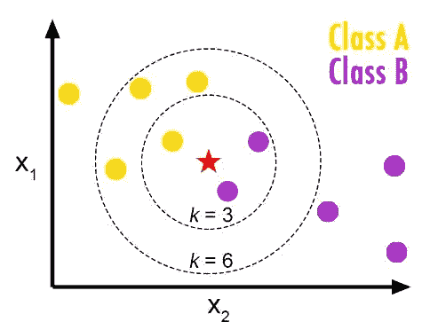
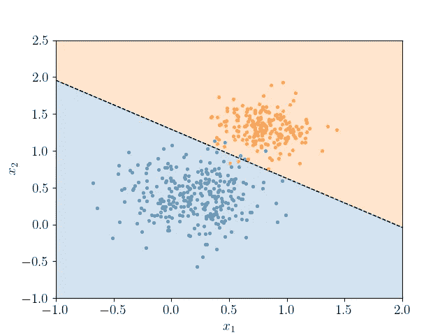
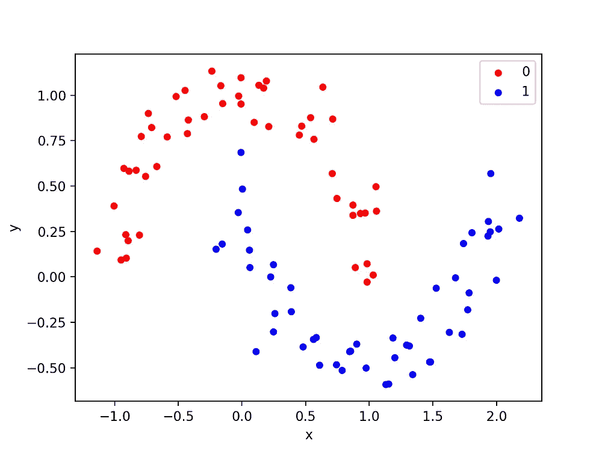
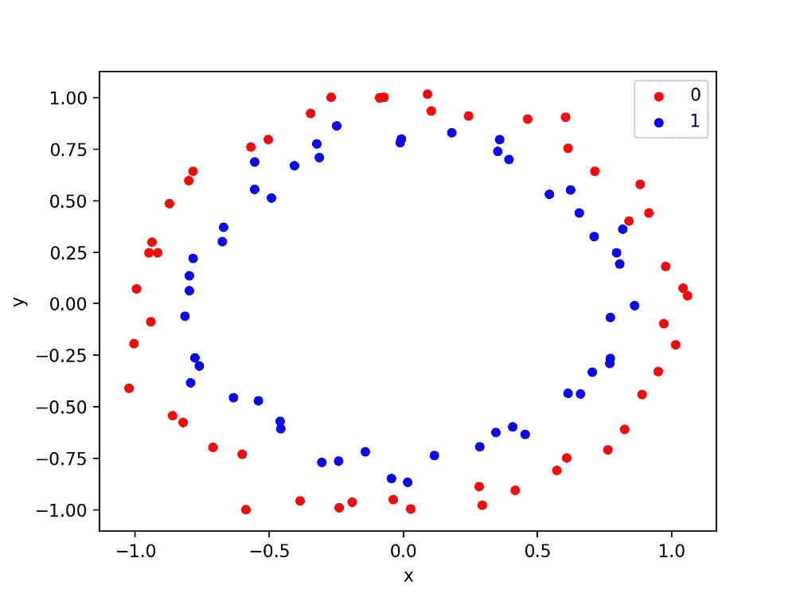
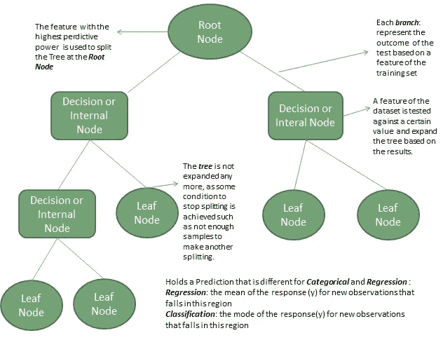
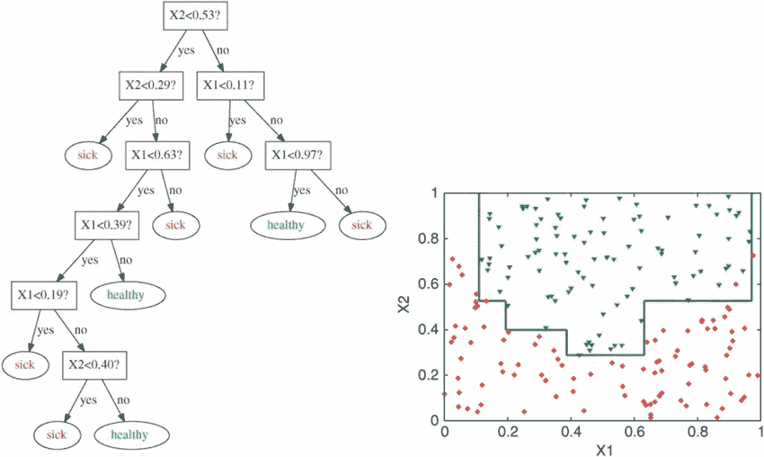

# 机器学习模型的最佳和最差情况—第一部分

> 原文：<https://pub.towardsai.net/best-and-worst-cases-of-machine-learning-models-part-1-36cdb9296611?source=collection_archive---------1----------------------->

## [机器学习](https://towardsai.net/p/category/machine-learning)

## 用什么？

# **简介:**

了解我们的模型在哪里运行良好，在哪里失败，这非常重要。如果有一个低延迟的要求，KNN 肯定会是一个更差的选择。类似地，如果数据是非线性的，那么选择逻辑回归是不好的，所以让我们深入讨论并找出模型的利弊。

# **1) KNN:**

摘自 https://www . fromthegenesis . com/pros-and-cons-of-k-nearest-neighbors/

## **最佳案例:**

*   当数据不是线性的时候，KNN 将胜过逻辑回归和线性 SVM。
*   当没有延迟要求时，KNN 可以很好地处理维度很少的数据。
*   KNN 不需要训练，因此模型可以轻松处理新数据。

## **限制:**

*   **大数据集:**由于 KNN 是基于距离的模型，计算查询点到数据中每一点的距离的代价非常高。所以当数据很大时，Knn 不是首选。
*   **不同比例特征:**距离测量前必须进行标准化或规范化。
*   **不平衡数据:**当数据不平衡时，则 KNN 预测值偏向多数类。
*   由于维度效应的诅咒，KNN 不能很好地管理大维度的数据。
*   **随机数据:**如果数据被严重随机化，那么 KNN 的表现会更差。

# 2)逻辑回归:

## 最佳案例:

*   **低潜伏期:**逻辑回归在推断阶段非常快。这只是向量乘法，很容易部署。

> 预测值=Sigmoid(W*(查询点))

*   **特征重要性:**来自逻辑回归的训练权重给出了每个特征的重要性。
*   **可解释性:**逻辑回归生成的输出是概率。这比其他只给出标签作为输出的模型有优势，比如 SVM。
*   **基准模型:**由于实现起来简单优雅，所以最好用作基准，而不是从复杂的模型开始。

## **限制:**

*   **非线性数据:**在现实世界中，在大多数情况下，数据会是杂乱的和非线性可分的，那么逻辑回归将表现不佳，因为模型创建的决策边界是线性的。

**非线性数据示例**(摘自 https://machine learning mastery . com/generate-test-datasets-python-sci kit-learn/)

*   **异常值的影响:**异常值会转移逻辑回归创建的决策边界，因此建议将其移除以提高性能。
*   要素中的共线性会影响要素重要性权重的可解释性。

# 3)决策树:

[https://finance train . com/决策树-机器学习/](https://financetrain.com/decision-trees-in-machine-learning/)

## 最佳案例:

*   **低延迟:**训练模型后无需计算。通过训练的 if-else 条件，DT 预测查询点的标签。
*   **灵活性:**决策树可以灵活地使用分类和数字数据执行多类分类和回归任务。
*   **特征重要度:**通过对特征用于分裂节点的次数进行排序，可以得到重要特征。
*   **数据预处理:**不需要对数据进行缩放、标准化或规范化，因为不需要对分割树进行距离测量。

**限制:**

*   **计算量大:**决策树训练在每个节点分裂树的计算量大。必须考虑每个特征，并且必须计算信息增益。
*   **决策边界:**决策**树**有轴平行边界，如果你有平滑的边界，它就不能很好地工作。

摘自[https://www . research gate . net/figure/An-example-of-a-decision tree-left-with-decision-boundary-for-two-features-X1 _ fig 5 _ 313720565](https://www.researchgate.net/figure/An-example-of-a-decision-tree-left-with-the-decision-boundary-for-two-features-X1_fig5_313720565)

*   **无关变量:**决策树在数据中相互影响变量。如果变量之间没有关系，DT 可能不是最好的。

# 4) SVM:

## 最佳案例:

*   非线性数据: SVMS 可以解决不一定是线性的复杂问题。这可以通过使用内核化技术将输入数据转换成高维数据来实现。

> x1+x2)^p(多项式 kenel)

*   x1、x2 是用于将 n 维空间映射到 m 维空间的 n 维输入
*   **对异常值稳健:**由于 SVM 的决策边界依赖于支持向量，异常值对边界的影响较小
*   **低延迟:**与其他分类器相比，推理时间非常少。

## 局限性:

1.  内核 SVM 的一个困难任务是为给定的问题选择正确的内核。
2.  **高训练时间:**在大数据上训练 SVM 在计算上是昂贵的。
3.  **可解释性和特征重要性:**支持向量机不能给出标签的概率输出，难以从权重中解释特征重要性。

# 结论:

事实上，没有使用特定模型的经验法则；这完全取决于给定问题的业务需求。尝试每个模型，调整超参数，并仔细分析误差。

# **参考文献:**

www.appliedaicourse.com

# 检查:

 [## 机器学习模型的时间和空间复杂性

### ML 模型训练和测试时间复杂性的详细解释

medium.com](https://medium.com/towards-artificial-intelligence/time-and-space-complexity-of-machine-learning-models-df9b704e3e9c)  [## 用“如何”和“为什么”的问题赢得你的机器学习面试。

### 这都是关于如何和为什么？

medium.com](https://medium.com/towards-artificial-intelligence/ace-your-machine-learning-interview-with-how-and-why-questions-a0f028a8439e)