# 2022 年最佳数据科学书籍——免费和付费——编辑推荐

> 原文：<https://pub.towardsai.net/best-data-science-books-free-and-paid-data-science-book-recommendations-b519046dcca5?source=collection_archive---------0----------------------->

来源:由 Ivo Rainha 在 [Unsplash](https://unsplash.com/photos/Lg9NLmu4B_A) 上的照片衍生而来

## [数据科学](https://towardsai.net/p/category/data-science)，[社论](https://towardsai.net/p/category/editorial)

## 在过去的一年里，我们查看了超过 23，000 本数据科学书籍，我们选择了我们认为在技术性、解释复杂主题的能力、深度和经过验证的评论方面收费最高的免费书籍。

最后更新于 2022 年 1 月 1 日

 [## AI 社区↓走向 AI

### 与成千上万的数据领导者一起加入我们的 AI 社区。支持我们，与其他人工智能爱好者合作，参与…

community.towardsai.net](https://community.towardsai.net/) 

在过去的十年里，数据科学已经成为信息技术领域专业人士薪酬最高、声誉最高的领域之一。

如今， [**数据科学**](https://mld.ai/mldcmu) 应用已经成为大多数(如果不是全部)企业的必然。因此，熟练的数据科学专业人员激增。

因此，如果您计划进入这一领域，您可能会在网上找到各种各样与数据科学相关的书籍，这反过来又会是一项艰巨的任务，即挑选出最值得关注的书籍进入数据科学领域。

本文旨在通过向您提供我们关于最佳和高质量数据科学书籍的编辑建议来解决这个难题。

*披露:我们在《走向人工智能》的编辑团队撰写真实可信的评论，并可能在我们选择支持走向人工智能的产品上获得少量报酬。就本文而言，作为亚马逊的合作伙伴，oriented AI 可能会从合格的购买中获得一小笔佣金(买家无需支付额外费用)。如有反馈、问题或疑虑，请发邮件给我们*[【pub@towardsai.net】](mailto:pub@towardsai.net)**。**

> 📚查看我们用 Python 编写的[力矩生成函数](https://towardsai.net/p/data-science/moment-generating-function-for-probability-distribution-with-python-tutorial-34857e93d8f6)教程。📚

## 1.[数据科学家实用统计数据](https://amzn.to/30BnSQw):

**作者:彼得·布鲁斯，安德鲁·布鲁斯，彼得·格德克**

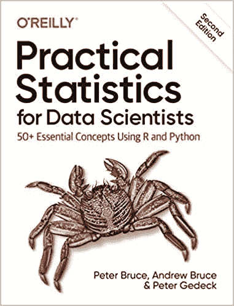

数据科学家实用统计|来源:[亚马逊](https://amzn.to/30BnSQw)

这本书非常适合初学者。它涵盖了深入数据科学领域的所有先决概念的基本概述。在本书中，你将学习探索性数据分析、随机抽样、回归分析、分类技术、统计机器学习方法等概念。除了理论概念之外，它还包括 R 和 Python 编程语言中的代码示例。我们发现这是学习数据科学的一个很好的资源，因为它只是让你熟悉数据科学，而不需要深入研究。除此之外，您还将找到其他资源，引导您了解数据科学中一些更高级的主题。总之，对于数据科学初学者来说，这是一个极好的资源。

在 [**亚马逊**](https://amzn.to/30BnSQw) 上抢一份。

## 2.[用 Python 进行机器学习简介](https://amzn.to/2Swbw7Z):

**作者:安德烈亚斯·穆勒、萨拉·圭多**

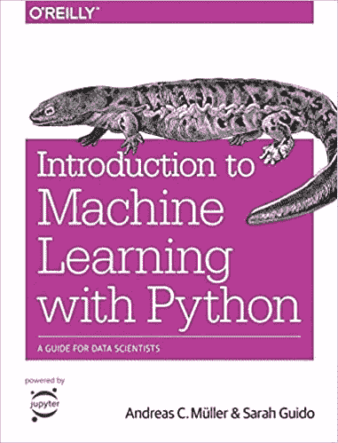

Python 机器学习入门|来源:[亚马逊](https://amzn.to/2Swbw7Z)

这本书是那些想开始数据科学之旅的人的理想选择。用友好的语气和说明性的例子，这本书提供了数据科学和机器学习的基本概念的清晰解释。这本书最好的一点是，读者不需要任何数据科学、机器学习和 Python 的先验知识。这本书包含机器学习的基本概念和应用、模型评估的高级技术、数据的表示、管道的概念、提高数据科学和机器学习技能的建议，以及许多其他内容。这本书可能是用 Python 学习数据科学的最佳书籍之一。

在 [**亚马逊**](https://amzn.to/2Swbw7Z) 上抢一份。

## 3.[商业数据科学](https://amzn.to/36yXhYl):

**作者:马特·塔迪**

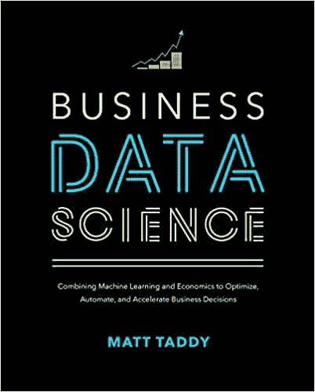

商业数据科学|来源:[亚马逊](https://amzn.to/36yXhYl)

本书由来自 [**亚马逊科学**](https://mktg.best/z07g3) 的 Matt Taddy 博士撰写，主要关注数据科学的商业视角。它涵盖了影响真实商业环境的主题。它包含理论和适当的编码练习，帮助读者从中获得有用的见解。在商业领域应用我们的知识可能具有挑战性，因为模型在理论上做出不同类型的假设，当它们应用于实践时，有时我们会看到比纸上呈现的结果更令人惊讶的结果。

Taddy 在学术界和工业界的背景和专业知识使他成为写这本书的完美作者。我们相信，在阅读本书后，您将确信能够在现实世界中应用您的数据科学技能和知识。

在[上抢一份**亚马逊**。](https://amzn.to/36yXhYl)

## 4.[概率介绍](https://amzn.to/3nqmTfM):

**作者:约瑟夫·k·布利茨坦、杰西卡·黄**

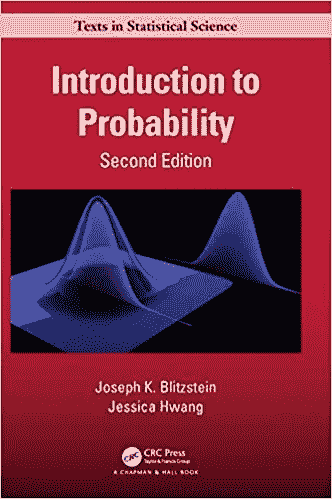

概率介绍|来源:[亚马逊](https://amzn.to/3nqmTfM)

从著名的哈佛统计讲座发展而来的《概率介绍》为理解统计、随机性和不确定性提供了必要的语言和工具。这也许是学习概率的最佳书籍。这本书推荐给初学者和专家，因为它从基本概念开始，通过概率的核心概念，帮助您在数据科学领域建立坚实的基础。这本书包括直观的解释，例子，图表和实践问题。本书的每一章都以 R 编程语言的相关代码示例结尾。在新的版本中，他们包括了在线补充，包括交互式可视化和动画。这本书是近五十年来最受欢迎的书籍之一，这也是为什么它绝对应该放在你的书架上的另一个原因。

在 [**亚马逊**](https://amzn.to/3nqmTfM) **上抢一份。**

## 5.[数据科学从无到有](https://amzn.to/34xFo9J):

作者:乔尔·格鲁什

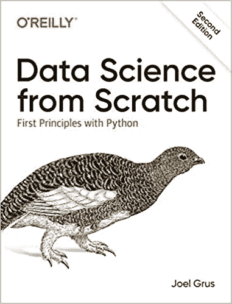

从零开始的数据科学|来源:[亚马逊](https://amzn.to/34xFo9J)

在这本书里，你将了解到有多少最基本的数据科学工具和算法是通过从头开始实现的。如果你有很强的数学天赋和一些必要的编程技能，这本书将帮助你以一种令人满意的方式进入数据科学的核心。网上有很多书籍，可以让你了解使用库实现统计模型的基本思想。但毕竟这些库都是白手起家的。所以如果你想从零开始学习数据科学，并增强你在这一领域的知识，那么这本书肯定会帮助你实现你的目标。这本书的主题是-统计学的基础，清理和操作数据，深入研究机器学习算法的基础，从零开始实现机器学习算法，探索自然语言处理，推荐系统，网络分析，等等。因此，如果你真的想努力学习数据科学，这本书适合你。

在 [**亚马逊**](https://amzn.to/34xFo9J) 上抢一份。

## 6.[裸体统计](https://amzn.to/33xrGEp):

**作者:查尔斯·惠兰**

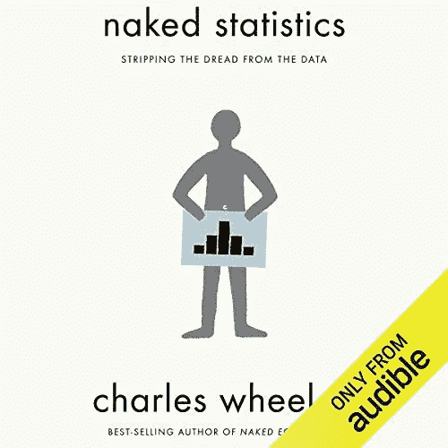

裸统计|来源:[亚马逊](https://amzn.to/33xrGEp)

这本书给了我们很多统计概念在现实世界中应用的真实例子。这本书的基调是诙谐和对话式的。这本书的作者并没有深入研究这些理论，相反，他使用了非常有说服力的例子来帮助你理解一些复杂的统计概念。这本书从统计学的基本概念开始，如正态分布，中心极限定理，然后到复杂的现实世界的问题和相关的数据分析和机器学习。总而言之，如果你是数据科学新手，这本书会让你在理解统计概念的同时开怀大笑。

在 [**亚马逊**](https://amzn.to/33xrGEp) **上抢一份。**

## 7.[用于数据分析的 Python](https://amzn.to/3dfwPV7):

**作者:韦斯·麦金尼**

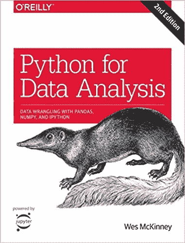

用于数据分析的 Python 来源:[亚马逊](https://amzn.to/3dfwPV7)

如果你有一些数据科学概念的基础知识，这本书是另一个很好的读物。这本书涵盖了几乎所有的数据分析方法以及 python 编程语言的基础知识。该书涵盖了-使用 Ipython shell 和 jupyter notebook 进行探索性数据分析、NumPy 的基本和高级功能、使用 pandas 进行数据分析、如何获得干净的数据、使用 matplotlib 进行可视化、使用 pandas 汇总数据、时间序列分析等等。简而言之，我们可以说作者给了你一个作为数据科学家应该期待什么的完整想法。除此之外，这本书是全面的，易于阅读，并自定进度。

在 [**亚马逊**](https://amzn.to/3dfwPV7) 上抢一份。

## 8.[使用 Scikit-Learn 和 TensorFlow 进行动手机器学习](https://amzn.to/30UNAjt):

**作者:奥雷连·盖伦**

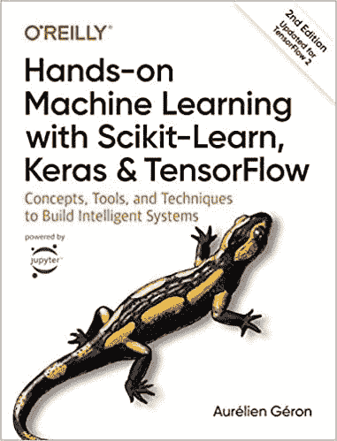

使用 Scikit-Learn、Keras 和 Tensorflow 进行机器学习|来源:[亚马逊](https://amzn.to/30UNAjt)

这本书可能是数据科学和机器学习领域最大的一本书，里面充满了奇妙的知识。建议初学者和专家都获得这个领域的有用见解。这本书有一点理论，但它有强大的例子支持它，这使它在这个列表中。本书包含的主题有:神经网络、用于机器学习项目的 scikit-learn、机器学习中的训练模型、用于构建和训练神经网络的 TensorFlow 等等。我们可以自信地说，通读这本书之后，你将能够更深入地钻研深度学习，解决现实世界的问题。

在 [**亚马逊**](https://amzn.to/30UNAjt) 上抢一份。

## 9.[头头统计](https://amzn.to/3noYGGM):

**作者:道恩·格里菲斯**

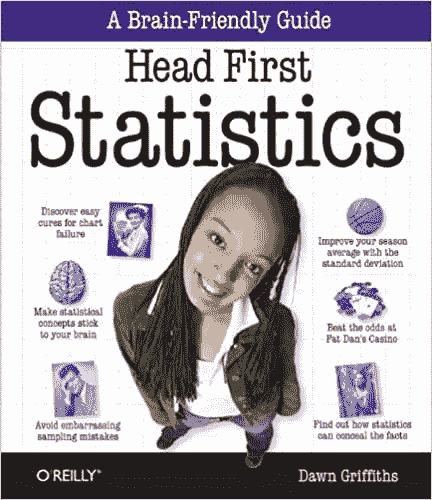

Head First 统计|来源:[亚马逊](https://amzn.to/3noYGGM)

就像 headfirst 的其他书一样，这本书的基调是平易近人，对话式的，看几页就不会觉得无聊。这本书涵盖了对数据科学至关重要的第一年统计学中所涵盖的一系列主题。这本书通过提供引人入胜和发人深省的材料，充满了视觉辅助和真实生活的例子，使典型的枯燥主题变得生动起来。在本书中，您将从描述性统计的主题(均值、中值、众数、标准差、方差)开始，然后转向推断性统计，如相关、回归等。它还包括一个全面的解释正常，二项式，泊松，几何概率分布。除此之外，这本书充满了图片和图形，使统计主题易于理解。总的来说，这是一本重温你的统计学概念的好书。

在 [**亚马逊**](https://amzn.to/3noYGGM) 上抢一份。

## 10.[模式识别和机器学习](https://amzn.to/3d3CixT):

**作者:克里斯托弗·毕晓普**

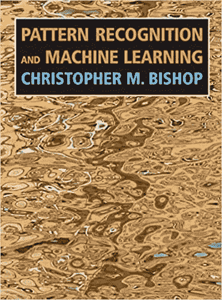

模式识别和机器学习|来源:[亚马逊](https://amzn.to/3d3CixT)

如果你已经读过几本关于数据科学的书，并且你熟悉许多机器学习算法，并且你想进一步提高你在这一领域的技能，那么这本书就是为你准备的。这本书深入研究了机器学习算法和数学。这本书的先决条件包括熟悉——线性和多元微积分，概率分布，以及强大的编程语言基础。如果你已经熟悉机器学习和数据科学，这可能是最好的书。

在 [**亚马逊**](https://amzn.to/3d3CixT) 上抢一份。

## 11.[拐点](https://amzn.to/30yWQcL):

**作者:斯科特·斯托夫斯基**

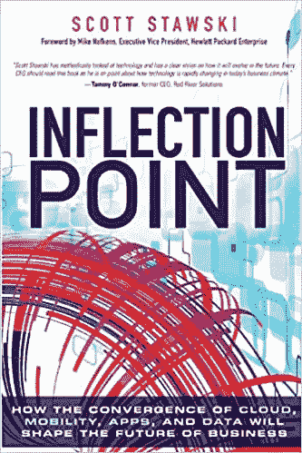

拐点|来源:[亚马逊](https://amzn.to/30yWQcL)

如果你对数据科学的技术内容感到厌倦，并想知道数据科学在现实生活中的实际应用，那么这本书非常适合你。这本书从数据科学的技术角度稍作休息，侧重于 it 的业务视角。如果你真的想深入数据科学领域，想知道所有这些东西是如何结合在一起的，那么这是你的必读之作，因为它包含了作者的经验，展示了数据科学在现实生活中是如何工作的。

在 [**亚马逊**](https://amzn.to/30yWQcL) 上抢一份。

## 12.[统计的艺术:如何从数据中学习](https://amzn.to/3pxWM80)

**作者:大卫·斯皮格尔哈特**

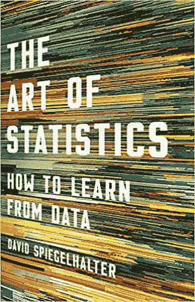

统计的艺术:如何从数据中学习|来源:[亚马逊](https://amzn.to/3pxWM80)

《统计学的艺术:如何从数据中学习》是一本由 David Spiegelhalter 撰写的透彻的书，被许多人称为“统计学思维的权威指南”。在本书中，Spiegelhalter 深入并展示了如何使用原始数据解决现实世界的问题，重点是数学概念和联系。这本书是你数据科学之旅的绝佳补充，因为他教我们如何像统计学家一样思考，并使用我们从数据中获得的答案来解决现实世界的问题。

在 [**亚马逊**](https://amzn.to/3pxWM80) 上抢一份。

# 最佳免费数据科学书籍:

## 1.[思贝氏](https://greenteapress.com/wp/think-bayes/):

**作者:艾伦·唐尼**

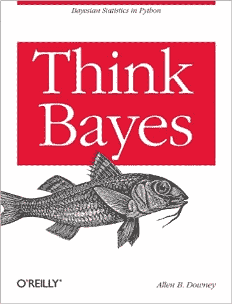

思贝氏|来源:[绿茶出版社](https://greenteapress.com/wp/think-bayes/)

《思考贝叶斯》是使用计算方法对贝叶斯统计的介绍。如果你知道如何用 Python 编程，并且也知道一点概率，你就准备好处理贝叶斯统计了。通过这本书，你将学习如何用 Python 代码代替数学符号解决统计问题，以及如何用离散概率分布代替连续数学。一旦你解决了数学问题，贝叶斯基础将变得更加透明，你将开始把这些技术应用到现实世界的问题中。

在 [**绿茶出版社**](https://greenteapress.com/wp/think-bayes/) **上免费抢。**

## 2. [Python for Data Science 手册](https://github.com/jakevdp/PythonDataScienceHandbook):

作者:杰克·范德普拉斯

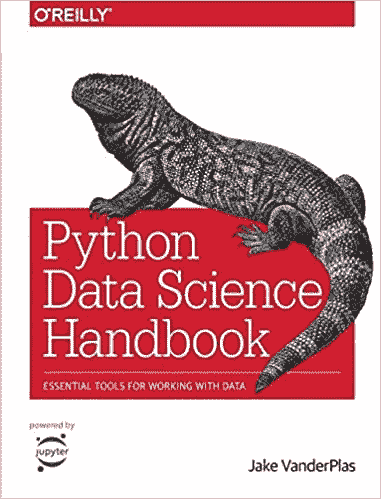

Python for Data Science 手册|来源: [GitHub](https://github.com/jakevdp/PythonDataScienceHandbook)

如果您熟悉数据科学概念的基础，那么这本书是让您的数据科学技能更上一层楼的最佳书籍。它包括一个完整的 python 库解释，用于数据分析和代码示例。这是本书中包含的几个主题——以最佳方式利用 Ipython 和 jupyter notebook，高效存储数据的 Numpy，操纵和分析数据的 pandas，可视化数据的 Matplotlib，实现机器学习算法的 scikit-learn。总之，我们可以说，通过这本书，你会学到很多关于 python 库的知识。

在 [**GitHub**](https://github.com/jakevdp/PythonDataScienceHandbook) 上免费抢。

## 3.[统计学习的要素](https://web.stanford.edu/~hastie/ElemStatLearn/)

**作者特雷弗·哈斯蒂、罗伯特·蒂布拉尼和杰罗姆·弗里德曼**

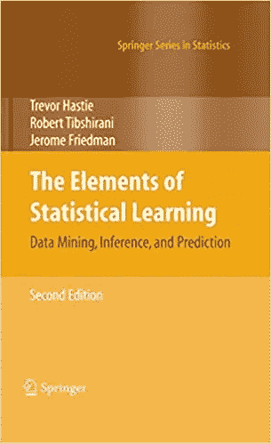

统计学习的要素|来源:[斯坦福](https://web.stanford.edu/~hastie/ElemStatLearn/)

《统计学习的要素》是一本非常棒的免费书籍，有生动的数据可视化，涵盖了大量关于数据挖掘、推理和预测的高质量教育信息。这本书由著名的斯坦福大学教授 Trevor Hastie、Robert Tibshirani 和 Jerome Friedman 撰写，理解了数据科学在过去十年中如何成为不同领域的需求，包括医学、生物学、金融、营销和其他领域。虽然它很宽泛，但它教会了我们许多技术，从监督学习到非监督学习，帮助那些在数据科学之旅中的人使用真实的用例场景。

在 [**斯坦福大学网站**](https://web.stanford.edu/~hastie/ElemStatLearn/) 免费抢。

## 4.[统计学习简介](http://faculty.marshall.usc.edu/gareth-james/ISL/)

**作者:加雷斯·詹姆斯、丹妮拉·威滕、特雷弗·哈斯蒂和罗伯特·蒂布拉尼**

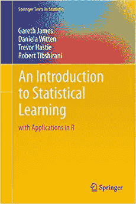

统计学习介绍|来源:[南加州大学](http://faculty.marshall.usc.edu/gareth-james/ISL/)

对于那些没有很强的数学背景的人来说,《统计学习导论》是一个极好的资源。它展示了关于 R 的统计学习方法的优秀介绍，对于数据科学家来说是一个非常有价值的资源。这本书在向统计和非统计从业者呈现一个全面的和可访问的资源方面是关键的，这些从业者想要使用尖端技术用数据解决复杂的问题。如果你对它的要求很好奇，你只需要知道如何与 [**线性回归**](https://towardsai.net/p/machine-learning/calculating-simple-linear-regression-and-linear-best-fit-an-in-depth-tutorial-with-math-and-python-804a0cb23660) 配合使用，就能最大限度地利用这本书。

在 [**USC 网站**](http://faculty.marshall.usc.edu/gareth-james/ISL/) 免费抢。

# 结论:

我们希望您喜欢阅读这些书籍，并从中获得一些关于数据科学的有用见解。如果你遇到了任何关于数据科学的非凡书籍，比如这个列表中提到的那些，请通过发送电子邮件给我们来告诉我们。

感谢您的阅读！

# 参考资料:

[1]数据来自亚马逊、[https://www.amazon.com/s?k=data+science](https://www.amazon.com/s?k=data+science)

[2]绿茶出版社，[https://greenteapress.com/wp/](https://greenteapress.com/wp/)

[3] Python 数据科学手册，Github，[https://github.com/jakevdp/PythonDataScienceHandbook](https://github.com/jakevdp/PythonDataScienceHandbook)

[4]思贝伊斯著，绿茶出版社，[https://greenteapress.com/wp/think-bayes/](https://greenteapress.com/wp/think-bayes/)