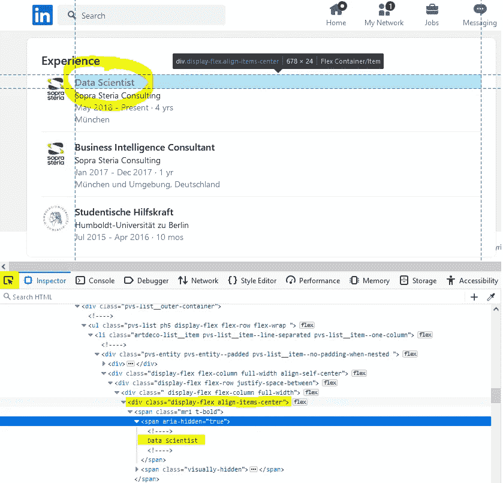
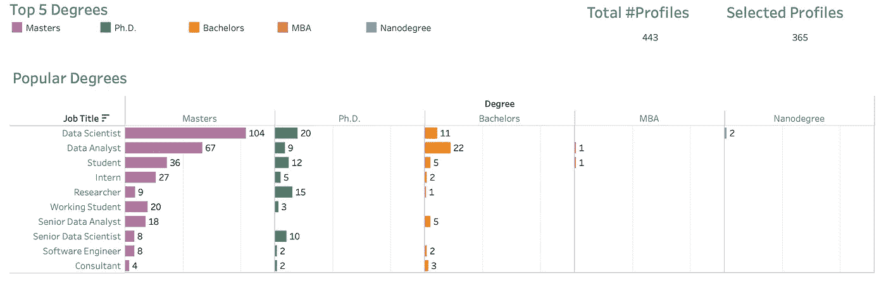
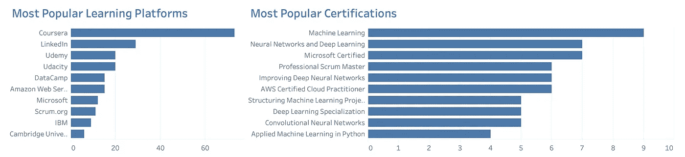

# 丢弃 LinkedIn 数据，寻找数据科学的最佳学位

> 原文：<https://pub.towardsai.net/best-degrees-for-data-science-eb0e968b00c1?source=collection_archive---------1----------------------->

照片由[杰米街](https://unsplash.com/@jamie452?utm_source=medium&utm_medium=referral)在 [Unsplash](https://unsplash.com?utm_source=medium&utm_medium=referral)

人们想知道一个人应该获得什么学位才能进入分析领域。我本人拥有计算机科学学位，但我曾与来自不同学科的人共事过，如化学、物理、心理学等。所以我知道几乎任何学科的人都可以来这个领域大放异彩。

为了回答这个问题，很多人会调查职位空缺，分析职位需求。但是我认为一个更好的方法是看那些在那个领域工作的人的简介。因为在工作岗位上，人们经常会要求很多东西，但实际聘用的人并不符合这些要求。这就是为什么我决定分析作为数据科学家或分析师的实际专业人士的 LinkedIn 个人资料。

为此，我从 LinkedIn 下载了大约 500 份数据分析师和数据科学家的资料，并搜集了他们在资料中列出的职业、教育、认证和其他在线课程。我为此使用了一个全新的账户，因为 LinkedIn 对他们的数据很认真，如果他们发现任何可疑的活动，他们会禁止你的账户。因此，如果你想从 LinkedIn 收集数据，我的建议是，为了安全起见，使用一个不同于你的专业账户的账户。

在这篇文章中，我将带你了解整个过程，并分享整个[代码](https://github.com/asish012/profile_analysis)和[仪表盘](https://public.tableau.com/views/LinkedInProfileAnalysis_16541209594500/Dashboard?:language=en-US&:display_count=n&:origin=viz_share_link)，这样你就可以在你感兴趣的任何其他职业中自己复制这些代码。

**流程中有 4 个步骤:**

1.  浏览 LinkedIn 网站，下载有趣的个人资料(HTML 格式)
2.  解析这些 HTML 页面，删除相关信息(职业、学位、课程、证书等)。)
3.  清理原始数据并为最终分析做准备
4.  数据可视化和分析

# 第一步:下载有趣的简介

> D isclaimer:这篇文章只是出于教育目的。我们不鼓励任何人抓取网站，尤其是那些可能有条款和条件反对此类行为的网站。

第一步是在 LinkedIn 上搜索数据科学家和分析师，并下载他们的简介。为了自动化这一步，我使用了 [Selenium 的 python 包](https://selenium-python.readthedocs.io/index.html)。Selenium 用于自动化 web 应用程序的测试用例，我们可以利用它来增强人与浏览器的交互。

在这里，我使用 Selenium 的 web 驱动程序启动一个浏览器窗口，然后登录 LinkedIn，搜索数据科学家和分析师的资料。当我找到个人资料链接时，我导航到它们并以 HTML 格式下载整个页面。我不想同时访问个人资料和废弃数据，因为这需要时间，我也不想让浏览器长时间连接 LinkedIn。除了解析 HTML 和抓取数据之外，还需要几个 go 来完善。

有了 Selenium，我们可以通过 CSS 选择器、id、XPath 等定位网页中的任何 HTML 元素。在下面的代码中，我们看到了使用 Selenium 的自动登录过程。步骤包括:用 Chrome 浏览器打开登录页面，用 CSS 选择器找到用户名和密码输入字段，填充它们，然后按提交按钮。您可以在 git 中找到完整的代码。

# 第 2 步:用 BeautifulSoup 删除个人资料:

一旦下载了目标概要文件，我们就继续解析。我使用 [BeautifulSoup](https://www.crummy.com/software/BeautifulSoup/bs4/doc/) (bs4)来解析 HTML 文件。我使用 BeautifulSoup 而不是 Selenium，因为 bs4 速度更快，对用户更友好。另一方面，Selenium 有点笨重，因为它是为 web 应用程序测试自动化开发的。

对于我们的分析，我从个人资料页面中寻找以下信息:

*   职称
*   公司名称
*   教育背景(学位、专业)
*   认证详情
*   在线课程等

一旦收集到感兴趣的数据，我会将它们存储在 raw data 文件夹中的单独 CSV 文件中。

为了发现包含我们正在寻找的信息的 HTML 标记，我打开浏览器的 inspect 窗口并使用元素选择器。当您在浏览器中选择项目或将鼠标悬停在项目上时，浏览器会自动指向准确的 HTML 代码。

在下面的例子中，我们看到职位位于 HTML 标签*“div”*下，CSS 类名*“display-flex align-items-center”*。完整的[代码](https://github.com/asish012/profile_analysis)可以在 Git 存储库中获得。

# 第三步:数据准备

数据清理和准备是任何数据分析项目中最重要的步骤之一。它有助于将数据放入上下文中。例如，在我们的项目中，不同的人以不同的方式书写相同的职业，并且，公司在发明名称方面显示他们的创造力。此外，拥有不同语言学位的人很难找到学位几乎相同的人。使相似的职业、学位等一致。，我们需要清理和协调数据。实际上，在现实生活中，数据清理和准备占用了数据科学家或分析师的大部分时间。没有干净的数据，我们就不可能真正得到干净的结果。“垃圾进，垃圾出”是计算领域的经典说法，对于数据分析来说更是如此。

> L 从 Tableau 中了解有关数据清理的更多信息。

 [## 数据清理指南:定义、好处、组件以及如何清理数据

### 在使用数据时，大多数人都认为你的洞察力和分析能力取决于你正在使用的数据…

www.tableau.com](https://www.tableau.com/learn/articles/what-is-data-cleaning) 

我对相似的职业进行了分组，这样像“数据分析师”、“业务数据分析师”和“业务分析师”就属于同一个组。同样，我也对学位进行了分组。清理之后，我将数据存储在一个单独的文件夹中的 CSV 文件中。

# 步骤 4:数据可视化和仪表板

在最后一步中，一旦我们有了干净和协调的数据，我就转移到 Tableau 进行分析和可视化。我首先将干净的 CSV 文件导入 Tableau，然后创建不同数据集之间的关系(不过，在 Tableau 中，当您有一个关系列时，这是自动的，这很酷)。在那之后，我在度量图上画出了学位、专业和职业。我使用了一个过滤器来显示前 5 个学位，只是因为其他学位没有那么受欢迎，否则，情节就太大了。在应用过滤器之后，我们从 443 个概要文件的整个数据集中获得了 365 个概要文件(82%)。

我把仪表板分成了三个部分。在第一部分中，我们看到了数据专业人员中最受欢迎的学位。我们注意到硕士学位是最常见的，其次是博士学位。还有学士学位。

在第二部分，我深入研究了这些学位，以了解最广泛的专业化。在那里，它看起来像通用硕士(我认为这是一个数据质量问题)和计算机科学领先董事会(毫不奇怪)。但有趣的是，数学、物理和经济学学位在数据专业人士中也相当普遍。这与我的专业经验相吻合。

在最后一部分，我绘制了最常见的在线学习平台和最受欢迎的数据科学和分析专业认证。看起来 Coursera 是这里最受欢迎的。LinkedIn 排名第二，考虑到它作为一个学习平台起步较晚，这对 LinkedIn 来说是一个相当大的成就。

# 结论

由于我的地理位置、使用的账户网络以及其他原因，收集的数据中存在一些偏差。我来自德国慕尼黑，它位于德国的南部(巴伐利亚地区)，这就是为什么大多数的个人资料来自德国南部。由于我使用的新帐户只有一个连接(我自己的)，搜索结果中显示的配置文件是我自己的多级连接。尽管存在这些偏见，但我认为，如果你想进入数据科学或分析专业，这个分析很好地说明了你应该获得的学位。此外，你可以使用[代码](https://github.com/asish012/profile_analysis)和表格[工作簿](https://public.tableau.com/views/LinkedInProfileAnalysis_16541209594500/Dashboard?:language=en-US&:display_count=n&:origin=viz_share_link)在更多动态数据中对不同职业进行你自己的分析。

*感谢阅读！如果你喜欢这篇文章一定要* ***鼓掌(最多 50！)*** *让我们* ***连接上****[***LinkedIn***](https://www.linkedin.com/in/asish-biswas/)*和* ***在 Medium*** *上关注我，随时更新我的新文章。**

**通过此* [*推荐链接*](https://analyticsoul.medium.com/membership) *加入 Medium，免费支持我。**

* [## 通过我的推荐链接加入 Medium—Asish bis was

### 阅读阿西什·比斯瓦斯(以及媒体上成千上万的其他作家)的每一个故事。您的会员费直接支持…

analyticsoul.medium.com](https://analyticsoul.medium.com/membership)*