# 2023 年深度学习、机器学习(ML)和数据科学最佳笔记本电脑

> 原文：<https://pub.towardsai.net/best-laptops-for-machine-learning-deep-learning-data-science-ml-f55602197593?source=collection_archive---------0----------------------->

来源:[罗伯托·伊里翁多](https://www.robertoiriondo.com/)通过中途生成的人工智能生成的图像。

## [数据科学](https://towardsai.net/p/category/data-science)，[社论](https://towardsai.net/p/category/editorial)，[机器学习](https://towardsai.net/p/category/machine-learning)

## 凭借我们为机器学习、数据科学和深度学习提供的最佳笔记本电脑，在人工智能游戏中取得领先。在分析了超过 8000 个选项[8]后，我们确定了最佳选择，以帮助您的人工智能装备适应未来。

最后更新时间 2023 年 3 月 5 日

你是否厌倦了无休止地在互联网上寻找完美的笔记本电脑来支持你的机器学习、深度学习和数据科学项目？好了，不要再找了！我们从多达 8，000 台笔记本电脑中进行筛选，为您带来最强大、最高效的电脑，满足您的各种预算。无论您是在寻找顶级笔记本电脑还是更实惠的选择，我们都能满足您的需求。有了我们的专家建议，您可以在游戏中保持领先，让您的人工智能设置经得起未来考验。

随着技术的发展，我们将不断更新这一资源，为您提供更强大、更高效的笔记本电脑。我们的收件箱被来自人工智能爱好者的电子邮件淹没，他们正在为他们的人工智能项目寻找最好的笔记本电脑，这激发了我们创建这个列表。如果您有任何建议要添加到列表中，请随时发送电子邮件至[pub@towardsai.net](mailto:pub@towardsai.net)给我们。

*披露:我们在《走向人工智能》的编辑团队撰写真实可信的评论，并可能因我们选择支持走向人工智能的产品而获得少量报酬。就本文而言，作为亚马逊的合作伙伴，oriented AI 可能会从合格的购买中获得一小笔佣金(买家无需支付额外费用)。有关反馈、问题或顾虑，请发送电子邮件至*[*pub@towardsai.net*](mailto:pub@towardsai.net)*。*

# 为 ML 和数据科学选择笔记本电脑的关键考虑因素

1.  处理器:强大的 CPU 对于运行复杂的 ML 算法和数据分析至关重要。寻找采用英特尔酷睿 i7 或 i9 处理器或 AMD 锐龙 7 或 9 处理器的笔记本电脑。
2.  **GPU:**GPU(图形处理单元)对于运行深度学习算法很重要，因为它处理并行处理的速度比 CPU 快得多。寻找一台配备专用 GPU 的笔记本电脑，如 NVIDIA GeForce 或 Quadro，或 AMD 镭龙。
3.  **内存:**笔记本电脑的内存越大，它处理大型数据集和复杂的 ML 模型的能力就越强。寻找至少有 16GB 内存的笔记本电脑，但 32GB 或更大是理想的。
4.  **存储:**用于深度学习和数据科学的数据集可能会非常庞大，所以你需要一台存储容量足够大的笔记本电脑。寻找至少配有 512GB 固态硬盘的笔记本电脑，或者考虑配有多个驱动器或能够添加外部存储的笔记本电脑。
5.  **显示:**高质量的显示对于可视化数据和模型非常重要。寻找分辨率至少为 1080p 的笔记本电脑，或者考虑 4K 显示器以获得更多细节。你也可以考虑高色域的笔记本电脑，比如 Adobe RGB 或 DCI-P3。

通过考虑这些因素，您可以找到一款能够处理深度学习、机器学习和数据科学需求的笔记本电脑，让您高效地工作。

> 📚查看我们对最佳[深度学习工作站](https://towardsai.net/p/news/best-workstations-for-deep-learning-data-science-and-machine-learning-ml-4a6e43213b9e)的编辑推荐。📚

# 我们开始吧！

# 预算低于 1000.00 美元

[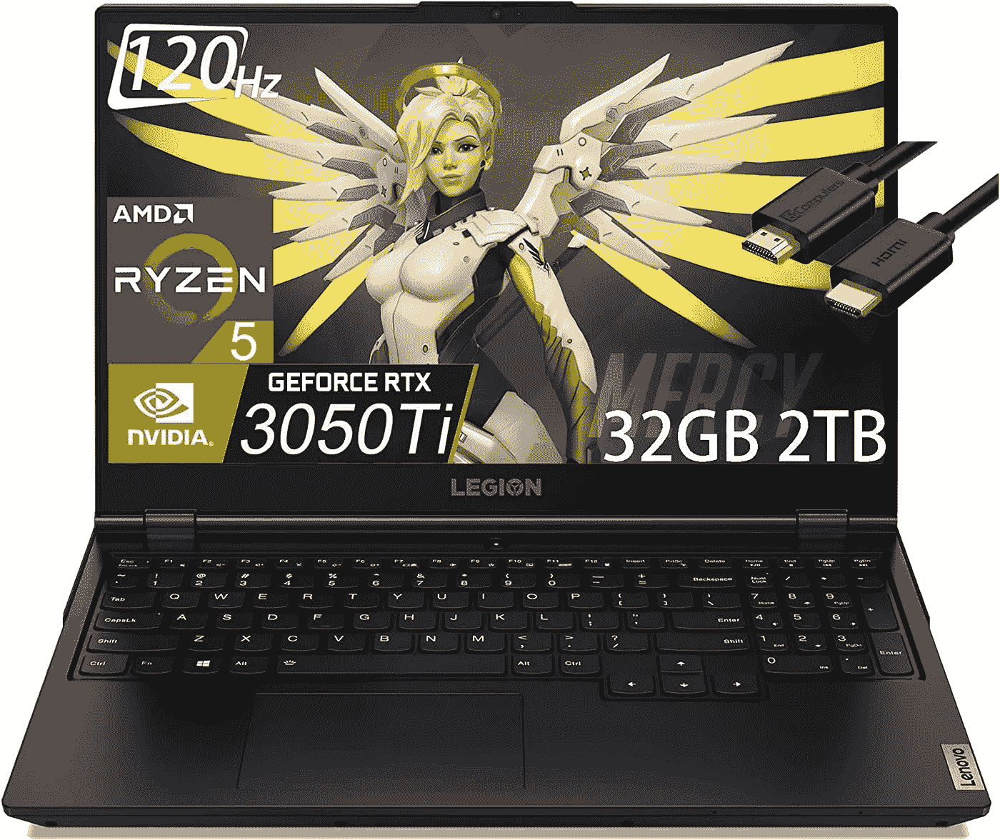](https://amzn.to/3IEdIp2)

来源:[亚马逊](https://amzn.to/3IEdIp2)

## [联想军团 5](https://amzn.to/3IEdIp2)

> **更新:[Tie]1k 以下最佳笔记本电脑。**非常适合那些关注 AMD 处理器、出色的 RAM 大小和 RTX 3050ti GPU(预算在 1000 美元以下)的数据领导者。

**规格:**

*   处理器:AMD 锐龙 5 5600H(六核，12 线程，基本时钟速度 3.3 GHz，最高睿频加速至 4.2GHz，16MB 三级高速缓存)
*   内存:32GB (16GB x 2) DDR4 3200MHz
*   硬盘:2TB PCIe 固态硬盘
*   GPU:专用 NVIDIA GeForce RTX 3050 Ti 4 GB GDDR6，提升时钟高达 1695MHz，TGP 高达 95W
*   计算能力:8.6 [ [9](https://developer.nvidia.com/cuda-gpus)
*   端口:1 个 USB-C 3.2 Gen 2(支持数据传输、电源传输和显示端口 1.4)、1 个 USB-C 3.2 Gen 2(支持数据传输和显示端口 1.4)、1 个 USB 3.2 Gen 1(始终开启)、3 个 USB 3.2 Gen 1
    1 个 HDMI 2.1、1 个以太网(RJ-45)、1 个耳机/麦克风组合插孔(3.5 毫米)
*   操作系统:Windows 11 家庭版
*   重量:5.3 磅
*   显示屏:15.6 英寸全高清(1920 x 1080)IPS 250 尼特防眩光，45% NTSC，120Hz，FreeSync
*   连接:Wi-Fi 6，11ax 2x2 +蓝牙 5.1
*   电池寿命:平均约 4 小时。

在[上抢一个**亚马逊**](https://amzn.to/3IEdIp2)

[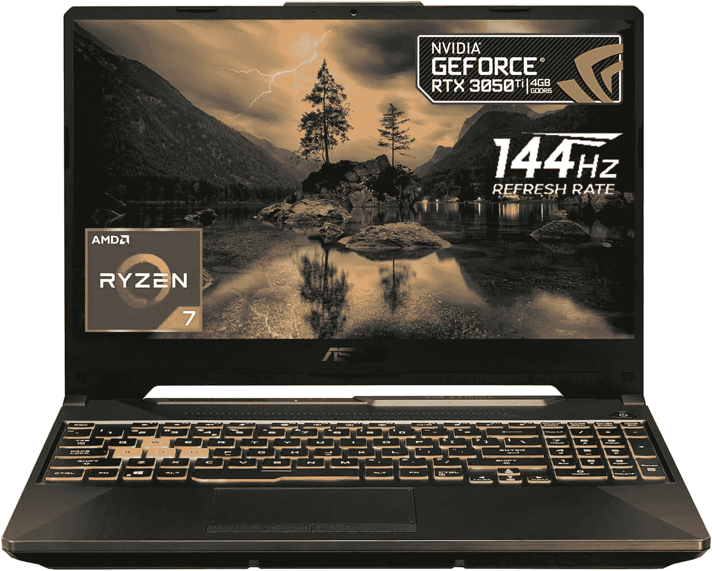](https://amzn.to/3YHvbSN)

来源:[亚马逊](https://amzn.to/3kisJTM)

## [华硕 TUF 游戏 A15](https://amzn.to/3kisJTM)

> **更新:[Tie]1k 以下最佳笔记本电脑。**非常适合关注英特尔处理器、合适的 RAM 大小和 RTX 3050 ti GPU 且预算在千美元以下的数据领导者。

**规格:**

*   处理器:AMD 锐龙 7 8 核处理器 AMD R7–6800h 16 MB 高速缓存，基础时钟 3.2Ghz，最大提升时钟 4.7Ghz，
*   内存:32GB DDR5 内存
*   硬盘:1TB 固态硬盘
*   GPU:英伟达 GeForce RTX 3050 Ti 4 GB。
*   计算能力:8.6 [ [9](https://developer.nvidia.com/cuda-gpus)
*   端口:2 个 USB 3.1 Type A | 1 个 DisplayPort | 1 个 RJ-45 | 1 个耳机/扬声器/线路输出插孔| 2 个 USB 3.1 TYPE-C | 1 个 HDMI |
*   操作系统:Windows 10 Home。
*   重量:4.85 磅。
*   显示屏:144Hz 全高清 1920x1080 显示屏
*   连接:WiFi 802.11ax，千兆局域网(以太网)，蓝牙。
*   电池寿命:平均约 4 小时。

在 [**亚马逊**](https://amzn.to/3kisJTM) 上抢一个

[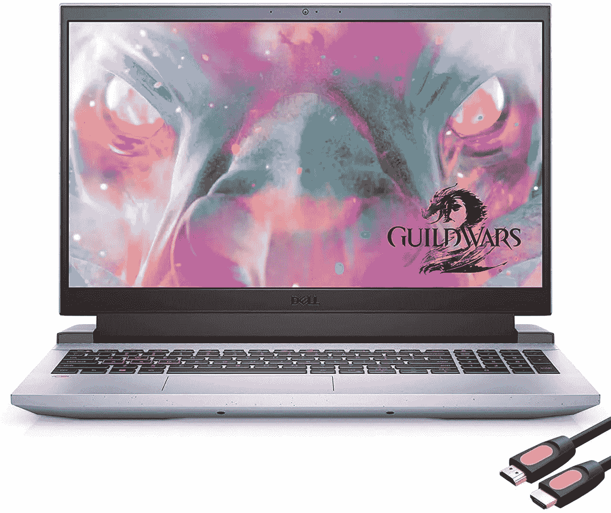](https://amzn.to/3Czi5Lz)

来源:[亚马逊](https://amzn.to/3Czi5Lz)

## 戴尔 Mytrix G15

> 更新:不到 1000 美元的神奇笔记本电脑。对于那些关心 AMD 处理器、合适的 RAM 大小和预算在 1000 美元以下的 RTX 30XX GPU 的人来说，这是理想之选。

**规格:**

*   处理器:AMD 锐龙 5 5600H 3.30 GHz
*   内存:16 GB DDR4。
*   硬盘:512 GB NVMe 固态硬盘。
*   GPU:英伟达 GeForce RTX 3050 Ti 4 GB。
*   计算能力:8.6 [ [9](https://developer.nvidia.com/cuda-gpus) ]
*   端口:1 个 HDMI 2.0、1 个 USB 3.1 Type-C、2 个 USB 3.1、1 个 USB 2.0。
*   操作系统:Windows 10 Home。
*   重量:5.39 磅。
*   显示屏:15.6，1920 x 1080。
*   连接:WiFi 802.11ax，千兆局域网(以太网)，蓝牙。
*   电池寿命:平均约 4 小时。

在 [**亚马逊**](https://amzn.to/3Czi5Lz) 上抢一个

[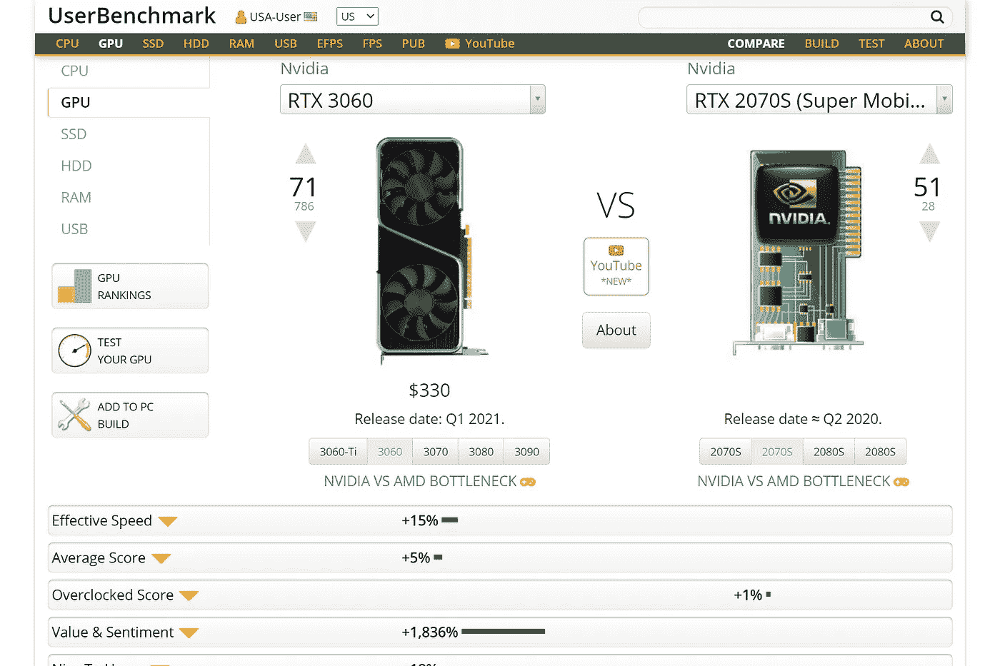](https://amzn.to/391Rmvm)

RTX 3060 与 RTX 2070 的性能比较[ [11](https://gpu.userbenchmark.com/Compare/Nvidia-RTX-3060-vs-Nvidia-RTX-2070S-Super-Mobile-Max-Q/4105vsm1168355) ]

# 预算低于 2000.00 美元

[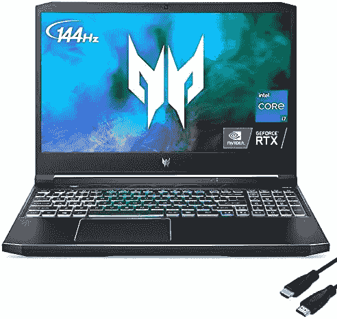](https://amzn.to/3CwWcg5)

来源:[亚马逊](https://amzn.to/3CwWcg5)

## [宏碁掠夺者 Helios 300](https://amzn.to/3CwWcg5)

> **更新:[Tie]2k 以下最佳笔记本电脑。**非常适合希望在 2000 美元预算内获得最佳性能、关注英特尔处理器、出色的 RAM 大小和 RTX 30XX GPU 的数据领导者。

**规格:**

*   处理器:英特尔酷睿 i7 -11800H，最高 4.6GHz
*   内存:64 GB DDR4。
*   硬盘:1 TB NVMe 固态硬盘。
*   GPU:英伟达 GeForce RTX 3060 4 GB。
*   计算能力:8.6 [ [9](https://developer.nvidia.com/cuda-gpus) ]
*   端口:1 个 HDMI 2.0、1 个 USB 3.1 Type-C、2 个 USB 3.1、1 个 USB 2.0。
*   操作系统:Windows 10 Home。
*   重量:5.07 磅。
*   显示屏:15.6，1920 x 1080。
*   连接:WiFi 802.11ax，千兆局域网(以太网)，蓝牙。
*   电池寿命:平均约 6 小时。

在 [**亚马逊**](https://amzn.to/3CwWcg5) 上抢一个

[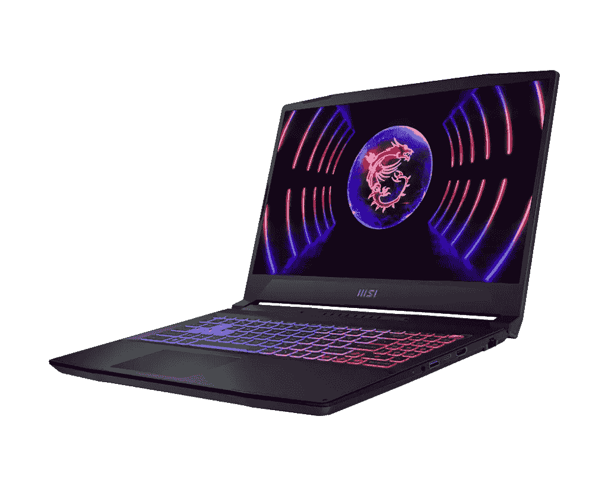](https://amzn.to/3kSj0nF)

来源:[亚马逊](https://amzn.to/3kSj0nF)

## [CUK 武士刀 15](https://amzn.to/3kSj0nF)

> **2k 以下的最佳笔记本电脑。**非常适合希望在 2000 美元预算内获得最佳性能、关注英特尔处理器、出色的 RAM 大小和 RTX 30XX GPU 的数据领导者。

**规格:**

*   处理器:英特尔酷睿 i7 -12650H，最高 4.8GHz
*   内存:64 GB DDR5
*   硬盘:2 TB NVMe 固态硬盘
*   GPU:英伟达 GeForce RTX 4070 8 GB GDDR6
*   计算能力:8.9 [ [9](https://developer.nvidia.com/cuda-gpus)
*   端口:1 个 HDMI 2.0、1 个 USB 3.1 Type-C、2 个 USB 3.1、1 个 USB 2.0
*   操作系统:Windows 11
*   重量:4.96 磅
*   显示屏:15.6，1920 x 1080 144Hz 赫兹
*   连接:WiFi 802.11ax、千兆局域网(以太网)、蓝牙
*   电池寿命:平均约 6 小时

[上抢一个**亚马逊**上抢一个](https://amzn.to/3kSj0nF)

[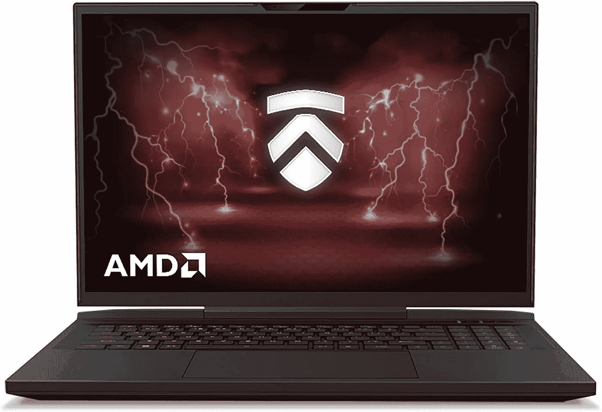](https://amzn.to/3JibnjT)

来源:[亚马逊](https://amzn.to/3JibnjT)

## [Eluktronics MECH 17](https://amzn.to/3JibnjT)

> 2000 美元以下最好的笔记本电脑之一。非常适合希望在 2000 美元预算内获得最佳性能、关心 AMD 处理器、出色的 RAM 大小和 RTX 30XX GPU 的数据领导者。

**规格:**

*   处理器:AMD 锐龙 9 6900HX
*   内存:32 GB DDR5
*   硬盘:2 TB NVMe 固态硬盘
*   GPU:英伟达 GeForce RTX 3080 Ti
*   计算能力:8.6 [ [9](https://developer.nvidia.com/cuda-gpus) ]
*   端口:1 个 HDMI 2.1、1 个 USB 3.2 Type-C、1 个 USB 3.1、SD 读卡器、2，500GB 以太网 RJ-45、音频输出和麦克风输入、Kensington 锁插槽
*   操作系统:Windows 11
*   重量:5.95 磅
*   显示器:17，2560 x 1600
*   连接:英特尔 WiFi 6 和蓝牙 5.2
*   电池寿命:平均约 6 小时

在[上抢一个**亚马逊**](https://amzn.to/3JibnjT)

[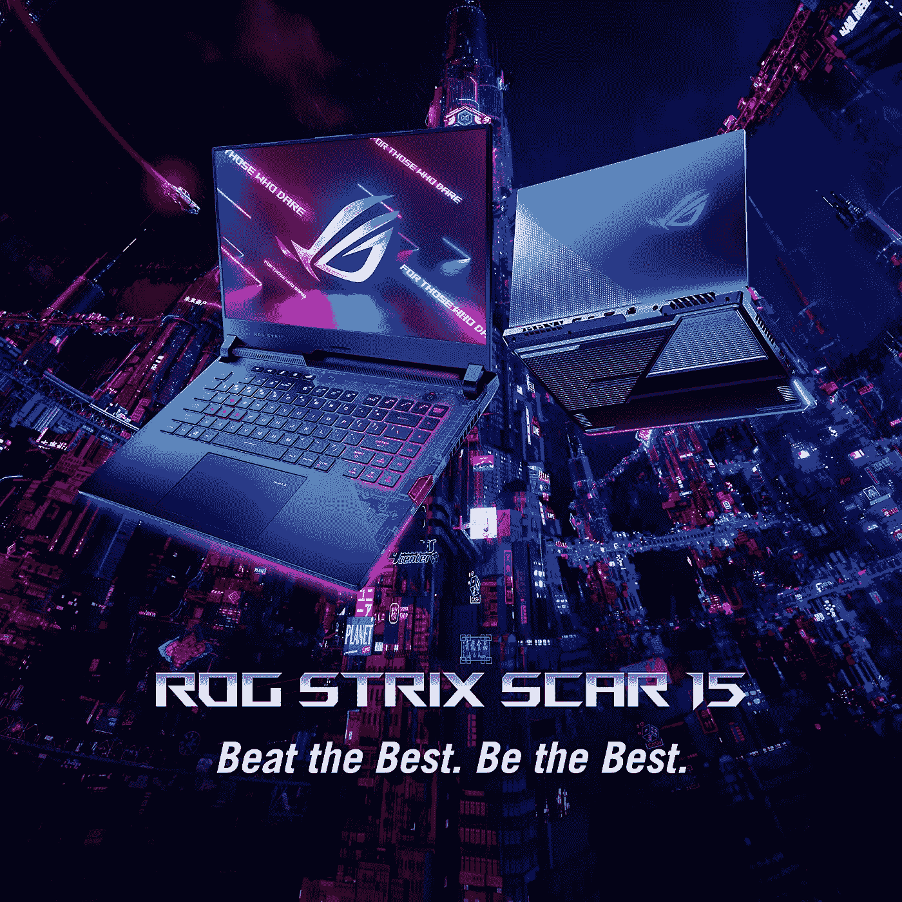](https://amzn.to/3kSidmM)

来源:[亚马逊](https://amzn.to/3kSidmM)

## [华硕 ROG Strix Scar 15](https://amzn.to/3kSidmM)

> **价格低于 2000 美元的经济实惠的笔记本电脑。**非常适合希望在 2000 美元预算内获得最佳性能、关心英特尔处理器、合适的 RAM 大小和 RTX 30XX GPU 的数据领导者。

**规格:**

*   处理器:AMD 锐龙 9 5900 HX
*   内存:32GB 内存
*   硬盘:1TB 固态硬盘
*   GPU:NVIDIA GeForce RTX 3080 8GB gddr 6
*   计算能力:8.6 [ [9](https://developer.nvidia.com/cuda-gpus)
*   端口:1 个雷电 3 端口，1 个 HDMI x 2.0 端口，3 个 USB 3.2 端口(第 1 代)，1 个 USB 3.2 类型 C 端口
*   操作系统:Windows 11
*   重量:5.07
*   显示屏:15.6 1920 x 1080
*   连接:WiFi 802.11ax，千兆局域网(以太网)，蓝牙 5.1。
*   电池寿命:约 3-4 小时。

在 [**亚马逊**](https://amzn.to/3kSidmM) 上抢一个

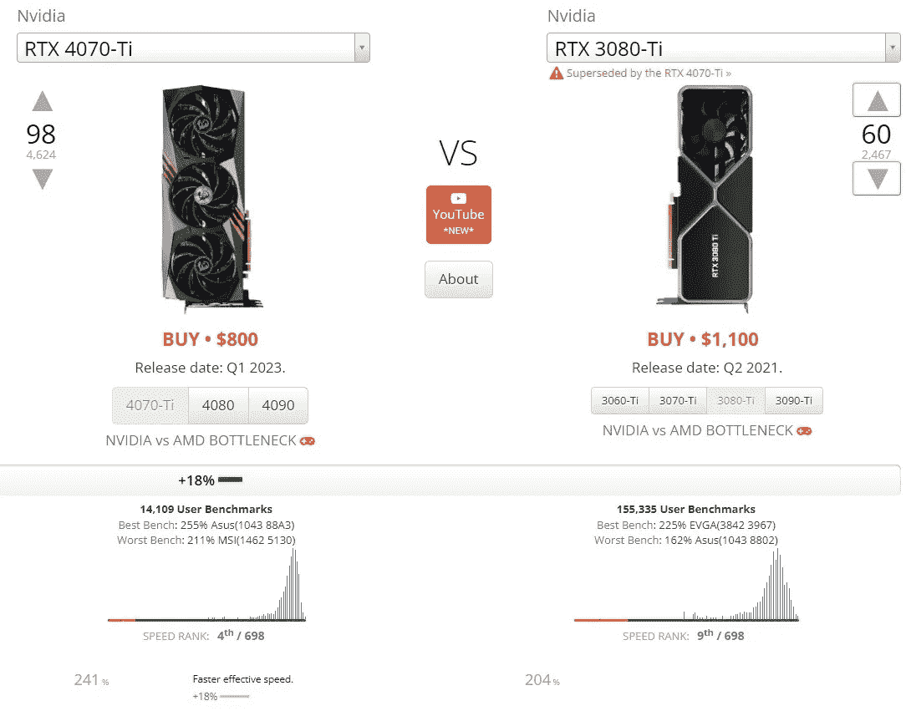

RTX 4070 Ti 对 RTX 3080 Ti [ [14](https://gpu.userbenchmark.com/Compare/Nvidia-RTX-4070-Ti-vs-Nvidia-RTX-3080-Ti/4146vs4115) ]

# 预算低于 3，000.00 美元

来源:[亚马逊](https://amzn.to/3KXLLtG)

## [CUK 主动脉 17H](https://amzn.to/3KXLLtG)

> **3k 美元以下的最佳装备毫无疑问**。更新的 CUK AORUS 17H 笔记本电脑是一个野兽，使强大的笔记本电脑。偏爱英特尔 CPU 和大容量 NVIDIA 40XX GPU 的数据领导者的首选人工智能装备。

**规格:**

*   处理器:英特尔酷睿 i7–13700h
*   内存:32GB 内存 DDR5。
*   硬盘:2TB NVMe 固态硬盘。
*   GPU:英伟达 RTX 4080 12GB GDDR
*   x 计算能力:8.9 [ [9](https://developer.nvidia.com/cuda-gpus)
*   端口:1 个 HDMI、1 个雷电 3、1 个 USB 3.1 Gen 2、2 个 USB 3.2。
*   操作系统:Windows 11
*   重量:5.95 磅。
*   显示:17.3，2560–1440 FHD 360 赫兹。
*   连接:WiFi 802.11ac，千兆局域网(以太网)，蓝牙。
*   电池寿命:更好~ 4-5 小时。

在 [**亚马逊**](https://amzn.to/3KXLLtG) 上抢一个

[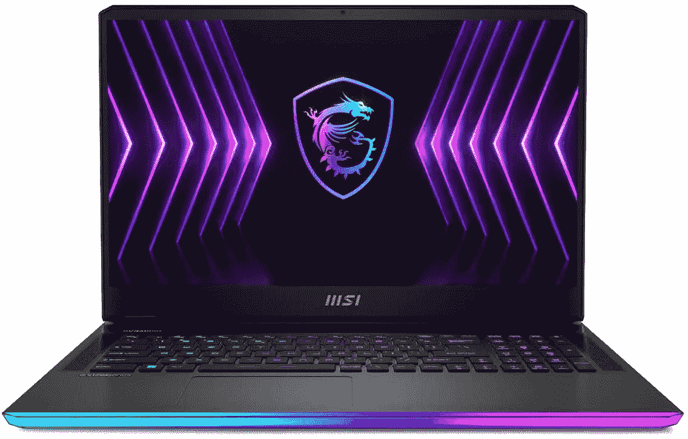](https://amzn.to/3EYc1QO)

来源:[亚马逊](https://amzn.to/3EYc1QO)

## [微星攻略 GE77Hx](https://amzn.to/3EYc1QO)

> **3k 美元以下的最佳钻机之一**。这款微星突袭机也是一款猛兽。这种人工智能装备是倾向于**英特尔 CPU**的数据领导者的首选。

**规格:**

*   处理器:英特尔酷睿 i9–12900 hx 5 GHz
*   内存:32GB 内存 DDR5
*   硬盘:2TB PCle Gen 4 固态硬盘。
*   GPU:英伟达 RTX 3080 Ti
*   计算能力:8.6 [ [9](https://developer.nvidia.com/cuda-gpus)
*   端口:Thunderbolt 4，USB-C 型
*   操作系统:Windows 11 专业版
*   重量:9.9 磅
*   显示:17.3，2560–1440 QHD 240 赫兹
*   连接:WiFi 802.11ac，千兆局域网(以太网)，蓝牙。
*   电池寿命:更好~ 5 小时。

在 [**亚马逊**](https://amzn.to/3EYc1QO) 上抢一个

[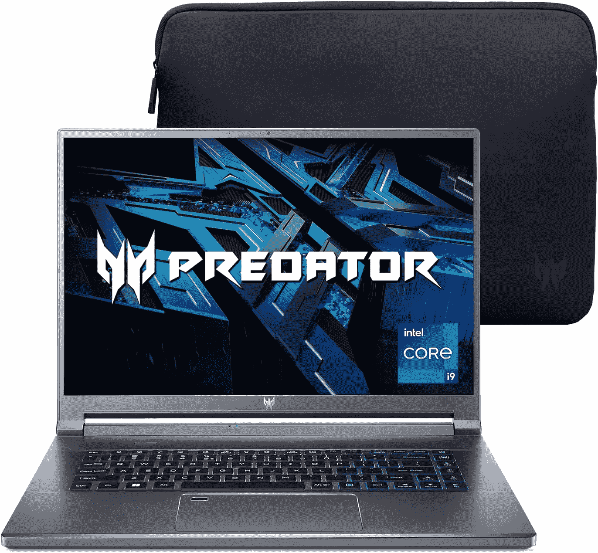](https://amzn.to/3ZpGyPE)

来源:[亚马逊](https://amzn.to/3ZpGyPE)

## [宏碁 Predator Triton 500 SE](https://amzn.to/3ZpGyPE)

> **更新:**最适合那些希望以低于 2.5k 美元的价格获得顶级性能的人。

**规格:**

*   处理器:英特尔 i9–12900h 5 GHz
*   内存:32GB 内存 LPDDR5
*   硬盘:1TB NVMe 固态硬盘
*   GPU:英伟达 RTX 3080 Ti 16GB
*   计算能力:8.6 [ [9](https://developer.nvidia.com/cuda-gpus)
*   端口:1 个 HDMI 接口、1 个雷电 3 接口、1 个 USB-C 接口、2 个 USB 3.2 接口
*   操作系统:Windows 10 专业版
*   重量:5.29
*   显示器:16 WQXGA 240 Hz
*   连接:黑仔 Wi-Fi 6E
*   电池寿命:尚未进行基准测试

在 [**亚马逊**](https://amzn.to/3ZpGyPE) 上抢一个

# 怪物钻机(无限预算)

[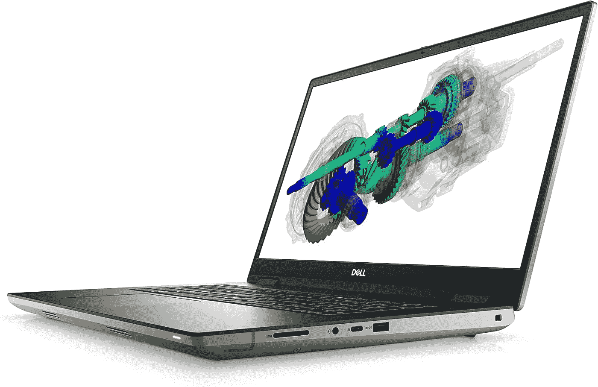](https://amzn.to/3L2LHJ9)

来源:[亚马逊](https://amzn.to/3L2LHJ9)

## [戴尔 Precision 7770 人工智能](https://amzn.to/3L2LHJ9)

> **疯狂的钻机**，最适合倾向于英特尔 CPU 的数据领导者，他们寻求各方面的顶级性能，以及非常知名的品牌，如拥有 128GB 内存的戴尔。

**规格:**

*   处理器:英特尔第 12 代 i9–12950 hx
*   内存:128GB RAM DDR5。
*   硬盘:8TB NVMe 固态硬盘。
*   GPU:英伟达 RTX A5500 16GB GDDR6[ [1](https://www.nvidia.com/en-us/geforce/gaming-laptops/max-q/) ]。
*   计算能力:8.6 [ [9](https://developer.nvidia.com/cuda-gpus) ]
*   端口:1 个 HDMI 接口、1 个雷电 3 接口、1 个 USB-C 接口、2 个 USB 3.2 接口。
*   操作系统:Windows 11 专业版
*   重量:6.73 磅
*   显示屏:17.3 UHD
*   连接:英特尔 Wifi 6E (6GHz) AX211 2x2，带蓝牙无线主设备
*   电池寿命:尚未进行基准测试。

在[上抢一个**亚马逊**](https://amzn.to/3L2LHJ9)

[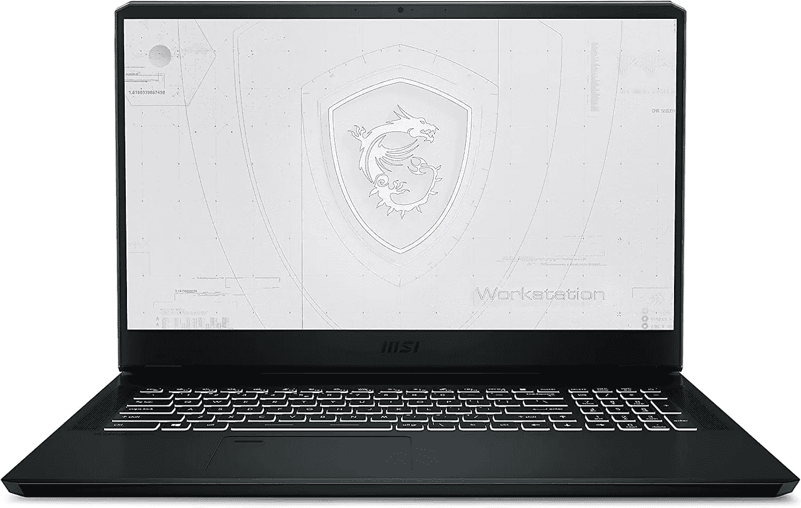](https://amzn.to/3kMSLij)

来源:[亚马逊](https://amzn.to/3kMSLij)

## [微星 WE76 11UM](https://amzn.to/3kMSLij)

> 数据领导者的最佳怪兽装备，倾向于寻求各方面最高性能的 AMD CPUs。这款普罗米修斯笔记本也是一款野兽，顶配我们的 [**Eluktronics 推荐**](https://amzn.to/3DDU4o2) 基于 specs。

**规格:**

*   处理器:英特尔酷睿 i9–11980 hk
*   内存:64GB 内存 DDR4
*   硬盘:1TB NVME 固态硬盘
*   GPU:英伟达 RTX A5000 16GB [ [1](https://www.nvidia.com/en-us/geforce/gaming-laptops/max-q/)
*   计算能力:8.6 [ [9](https://developer.nvidia.com/cuda-gpus)
*   端口:1 个 HDMI 接口、1 个雷电 3 接口、1 个第 2 代 USB 3.1 接口、2 个 USB 3.2 接口
*   操作系统:Windows 10 专业版
*   重量:6.39 磅
*   显示屏:17.3，1920x1080
*   连接:WiFi 802.11ac、千兆局域网(以太网)、蓝牙
*   电池寿命:更长约 5 小时

[上抢一个**亚马逊**上抢一个](https://amzn.to/3kMSLij)

# 最后的想法

对于那些希望在这些领域高效工作的人来说，找到适合深度学习、机器学习和数据科学的笔记本电脑至关重要。随着技术的发展，跟上最新的进步和创新是至关重要的。在分析了 8，000 多台笔记本电脑后，我们确定了适合各种预算的最佳笔记本电脑，从预算不到 1，000 美元的联想 Legion 5 到预算不到 3，000 美元的 CUK AORUS 17H。

选择笔记本电脑时，考虑处理器、GPU、RAM、存储和显示器等因素非常重要。强大的 CPU 对于运行复杂的 ML 算法和数据分析至关重要。GPU 对于运行深度学习算法很重要，笔记本电脑的 RAM 越多，它就能更好地处理大型数据集和复杂的 ML 模型。此外，用于深度学习和数据科学的数据集可能非常庞大，因此您需要一台存储容量足够大的笔记本电脑。最后，高质量的显示对于可视化数据和模型非常重要。

总的来说，有了合适的笔记本电脑，你可以让你的人工智能设置面向未来，并在深度学习、机器学习和数据科学领域保持领先。如果你遇到了任何非凡的笔记本电脑，比如这个列表中提到的那些，请通过给我们发电子邮件让我们知道。

感谢您的阅读！

# 参考

[1] Max-Q 设计，英伟达，[https://www.nvidia.com/en-us/geforce/gaming-laptops/max-q/](https://www.nvidia.com/en-us/geforce/gaming-laptops/max-q/)

[2]英特尔 10750H Q2 2020，英特尔，[https://www . Intel . com/content/www/us/en/products/processors/core/i7-processors/i7-10750h . html](https://www.intel.com/content/www/us/en/products/processors/core/i7-processors/i7-10750h.html)

[3]英特尔 9750H，英特尔，[https://www . Intel . com/content/www/us/en/products/processors/core/i7-processors/i7-9750h . html](https://www.intel.com/content/www/us/en/products/processors/core/i7-processors/i7-9750h.html)

[4]AMD https://www.amd.com/en/products/apu/amd-ryzen-7-4800h 7 7800h，[AMD](https://www.amd.com/en/products/apu/amd-ryzen-7-4800h)

[5]英特尔 10980 HK，英特尔，[https://ark . Intel . com/content/www/us/en/ark/products/201838/Intel-core-i9-10980 HK-processor-16m-cache-up-to-5-30-GHz . html](https://ark.intel.com/content/www/us/en/ark/products/201838/intel-core-i9-10980hk-processor-16m-cache-up-to-5-30-ghz.html)

[6]英特尔 10875 HK。英特尔，[https://ark . Intel . com/content/www/us/en/ark/products/202329/Intel-core-i7-10875h-处理器-16m-cache-up-to-5-10-GHz . html](https://ark.intel.com/content/www/us/en/ark/products/202329/intel-core-i7-10875h-processor-16m-cache-up-to-5-10-ghz.html)

[7]RTX 2080 vs AMD 镭龙 Pro 5500M，用户基准，[https://GPU . User Benchmark . com/Compare/Nvidia-RTX-2080-vs-AMD-镭龙-Pro-5500M/4026vsm960765](https://gpu.userbenchmark.com/Compare/Nvidia-RTX-2080-vs-AMD-Radeon-Pro-5500M/4026vsm960765)

[8]亚马逊的 RTX 高性能笔记本电脑，[https://www.amazon.com/s?k=rtx+laptop&RH = n % 3a 565108&ref = nb _ sb _ noss](https://www.amazon.com/s?k=rtx+laptop&rh=n%3A565108&ref=nb_sb_noss)

[9]NVidia CUDA Geforce GPU，NVidia，[https://developer.nvidia.com/cuda-gpus](https://developer.nvidia.com/cuda-gpus)

[10]Nvidia CUDA Quadro GPU，Nvidia，[https://www . Nvidia . com/object/Quadro-for-mobile-workstations . html](https://www.nvidia.com/object/quadro-for-mobile-workstations.html)

[11] GPU UserBenchmark，[https://GPU . user benchmark . com/Compare/Nvidia-RTX-3060-vs-Nvidia-RTX-2070s-Super-Mobile-Max-Q/4105 VSM 1168355](https://gpu.userbenchmark.com/Compare/Nvidia-RTX-3060-vs-Nvidia-RTX-2070S-Super-Mobile-Max-Q/4105vsm1168355)

[12] GPU UserBenchmark，[https://GPU . user benchmark . com/Compare/Nvidia-RTX-3080-Laptop-vs-Nvidia-RTX-2080s-Super-Mobile-Max-Q/m 1443565 VSM 1114823](https://gpu.userbenchmark.com/Compare/Nvidia-RTX-3080-Laptop-vs-Nvidia-RTX-2080S-Super-Mobile-Max-Q/m1443565vsm1114823)

[13]支持 CUDA 的 GeForce 和 TITAN 产品，【https://developer.nvidia.com/cuda-gpus 

[14] GPU UserBenchmark，[https://GPU . user benchmark . com/Compare/Nvidia-RTX-4070-Ti-vs-Nvidia-RTX-3080-Ti/4146 vs 4115](https://gpu.userbenchmark.com/Compare/Nvidia-RTX-4070-Ti-vs-Nvidia-RTX-3080-Ti/4146vs4115)