# 2022 年最佳机器学习博客

> 原文：<https://pub.towardsai.net/best-machine-learning-blogs-to-follow-ml-research-ai-3994e01967f9?source=collection_archive---------0----------------------->

来源: [Pixabay](https://pixabay.com/photos/neural-networks-brain-5321301/)

## [机器学习](https://towardsai.net/p/category/machine-learning)，[社论](https://towardsai.net/p/category/editorial)

## 通过可靠的来源跟上最好和最新的[机器学习](https://towardsai.net/ai/machine-learning) (ML) **研究博客。**

最后更新于 2022 年 1 月 1 日

**作者:** [罗伯特·伊里翁多](https://mktg.best/roberto)

 [## AI 社区↓走向 AI

### 与成千上万的数据领导者一起加入我们的 AI 社区。支持我们，与其他人工智能爱好者合作，参与…

community.towardsai.net](https://community.towardsai.net/) 

机器学习是一个令人兴奋的研究领域，它已经并将继续像其他技术一样强烈地影响着我们的生活。因此，你可以肯定，它将在未来十年产生大量的研究，这使得它值得关注一些有前途的 ML 博客。我为数据科学家、研究人员和爱好者挑选了一些我个人最喜欢的。从研究人员到学生、行业专家和机器学习(ML)爱好者——跟上最好和最新的机器学习研究是找到可靠的科学工作来源的问题。

虽然博客通常以更非正式和对话的方式更新，但我们发现这个列表中的来源是准确、丰富和可靠的机器学习研究来源。适合所有那些有兴趣了解更多关于机器学习科学领域的人，虽然有几个机器学习博客，但科学界最近发表了很多研究，很难跟上最新的发展。另外，并不总是清楚哪些博客值得关注。

这篇文章的目标是与你分享一些关于机器学习的最好的博客。这些博客可能是你阅读机器学习最新消息的最佳资源，或者它们可能会让你了解这个令人兴奋的领域正在发生的事情，请知道下面列出的博客绝不是排名或特定顺序。它们都是机器学习研究的不可思议的来源。如果你知道机器学习方面的任何其他可靠的博客来源，请在评论中或通过给我们发电子邮件告诉我们。

> 📚查看我们的[机器学习算法](https://towardsai.net/p/machine-learning/machine-learning-algorithms-for-beginners-with-python-code-examples-ml-19c6afd60daa)教程。📚

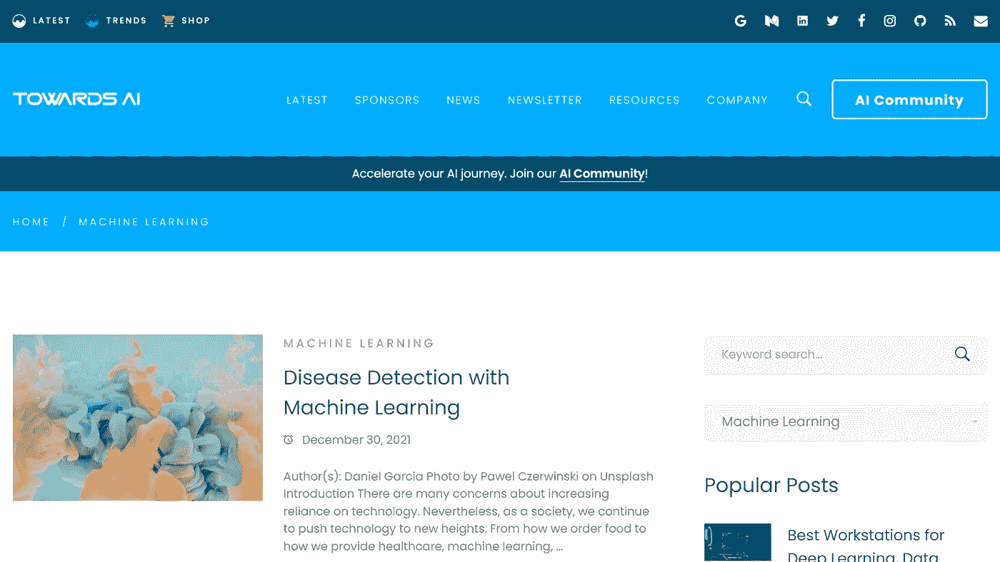

来源:[朝艾](https://towardsai.net/)

## [机器学习，走向人工智能](https://towardsai.net/ai/machine-learning)

《走向人工智能》成立于美国，是公认的世界领先的人工智能和技术出版物，专注于多样性、公平和包容性。专门有一个机器学习板块，旨在发布不带偏见的 [**机器学习**](https://towardsai.net/ai/machine-learning) 相关文章，做一个公正的信息来源。全世界的思想领袖和决策者都在阅读。我们有数千名来自大学教授、研究人员、研究生、行业专家和爱好者的撰稿人。我们每年接受数百万次访问，在社交媒体上拥有数千粉丝和数千订户。

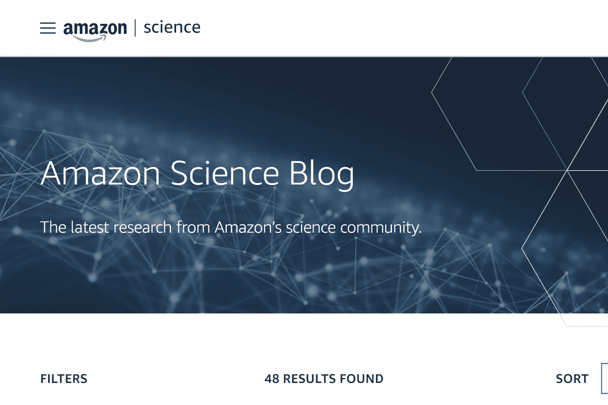

来源:[亚马逊科学](https://mktg.best/eldwv)

## [亚马逊科学博客](https://mktg.best/eldwv)

[**亚马逊科学**](https://mktg.best/eldwv) 有一个神奇的 [**科学博客**](https://mktg.best/eldwv) 可以让你按研究领域进行筛选。它的博客涵盖了亚马逊科学社区的工作，其研究领域包括云和系统、计算机视觉、对话式人工智能、自然语言处理、 [**机器学习**](https://mktg.best/eldwv) 、机器人、搜索和信息检索以及安全、隐私和滥用预防[ [13](https://mktg.best/eldwv) 。

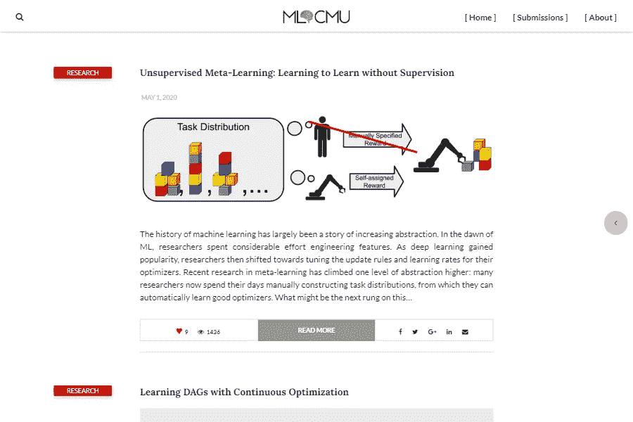

来源: [ML@CMU](https://mktg.best/machine-learning-blog)

## [机器学习博客，ML@CMU，卡耐基梅隆大学](https://mktg.best/machine-learning-blog)

卡耐基梅隆大学的机器学习博客， [**ML@CMU**](https://mktg.best/machine-learning-blog) **，**为研究人员提供了一个可访问的普通受众媒介，用于向专家和普通受众交流研究成果、机器学习领域的观点和各种更新。帖子来自卡内基梅隆大学的学生、博士后和教师。

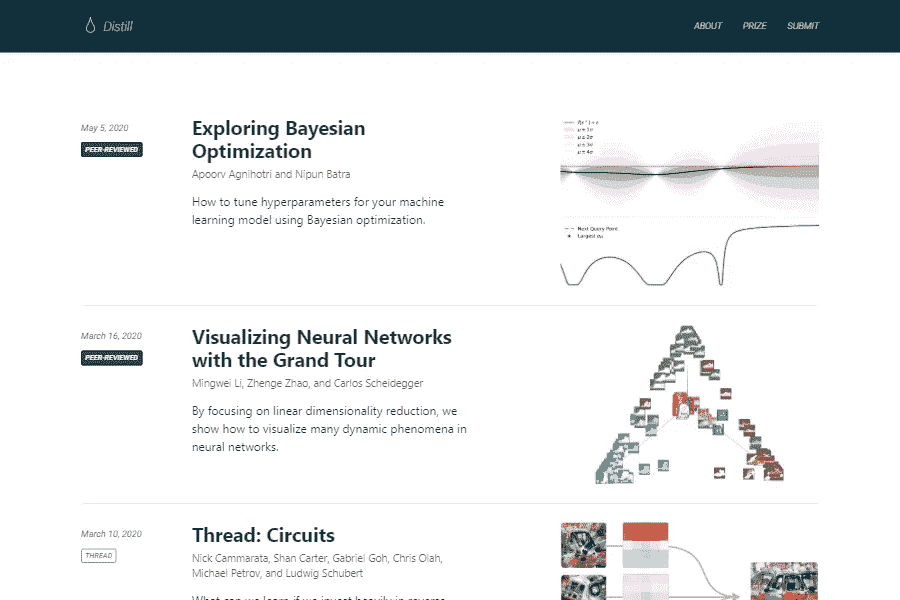

来源:[提取](https://mktg.best/distill)

## [提取](https://mktg.best/distill)

Distill 是机器学习领域的学术期刊。一篇精华文章的显著特点是出色的交流和对人类理解的贡献。 [**提炼**](https://mktg.best/distill) 文章经常使用互动媒体，但并非总是如此。在 Distill 上发表的大多数文章(如果不是全部的话)通常需要 100 多个小时才能发表。

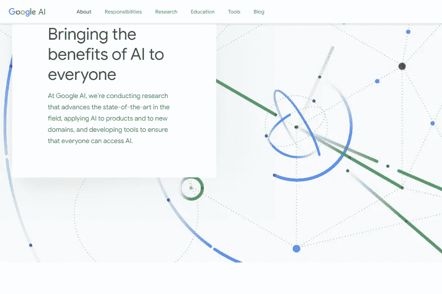

来源:[谷歌 AI](https://mktg.best/google-ai)

## [谷歌人工智能博客](https://mktg.best/google-ai)

谷歌人工智能进行的研究推动了该领域的最新发展。Google AI(或 Google.ai)是谷歌专门致力于人工智能的一个部门。它是由首席执行官桑德尔·皮帅在谷歌 2017 年 I/O 大会上宣布的[3]。Google AI 博客有一个专门针对 [**机器学习研究**](https://mktg.best/google-ai)[4](https://mktg.best/google-ai)的板块。

来源:[数据科学道场](https://mktg.best/h8f59)

## [数据科学道场](https://mktg.best/ewye9)

Data Science Dojo 是一家教育初创公司，帮助专业人员从数据中提取可操作的见解。他们有一个令人兴奋的 [**机器学习博客**](https://mktg.best/h8f59) ，里面有几篇非常翔实的关于机器学习的文章。你还可以找到其他资源，比如数据科学、人工智能、分析、现实世界中的数据技能、编程等等。

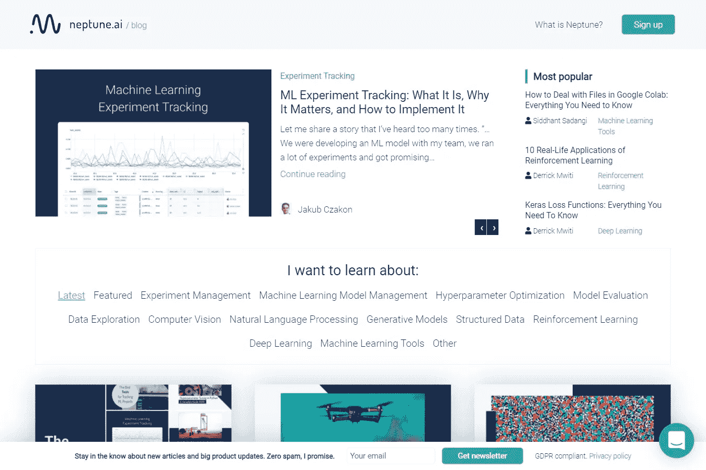

来源:[海王星。艾](https://mktg.best/2z6w4)

## [海王星。艾](https://mktg.best/2z6w4)

海王星。AI 提供了一个卓越的 [**机器学习博客**](https://mktg.best/2z6w4) ，提供关于机器学习建模、超参数优化、模型评估、数据探索、生成模型、机器学习工具等更多内容的教程。 [**海王星。AI**](https://mktg.best/2z6w4) 还提供了一个框架，可以更容易地跟踪你的 Jupyter 笔记本的版本，帮助管理你的实验过程，并与你的团队的工作流程轻松集成。

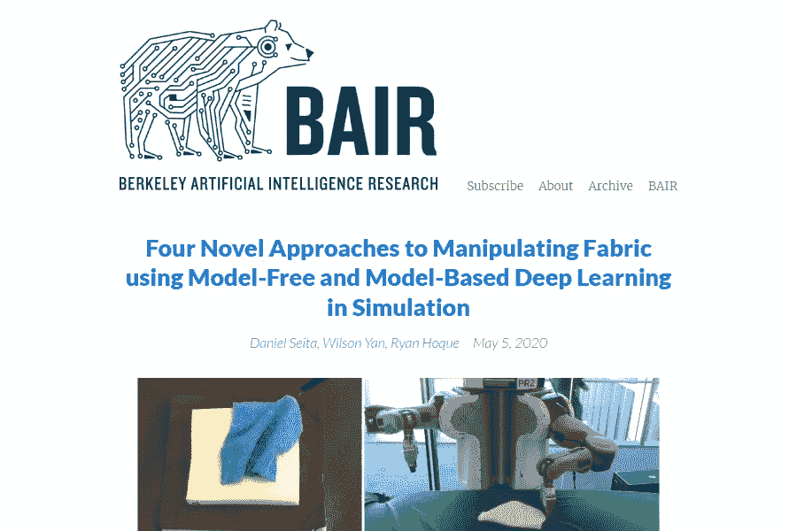

来源:[拜尔伯克利](https://mktg.best/bair)

## [BAIR·柏克莱](https://mktg.best/bair)

BAIR 博客为研究人员提供了一个可访问的、面向大众的媒介，以交流研究发现、该领域的观点和各种更新。帖子来自**的学生、博士后和教师，旨在为专家和普通观众提供相关和及时的研究发现和成果讨论。**

**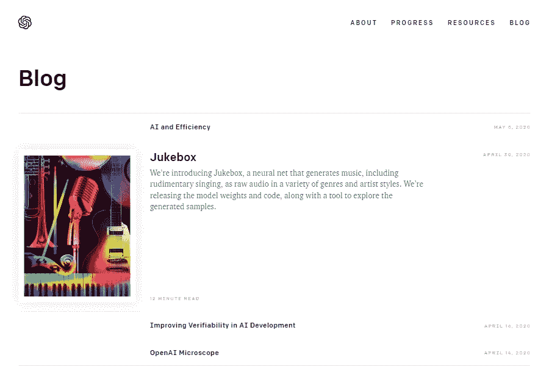**

**来源:[开放 AI](https://mktg.best/tyewn)**

## **[开启 AI](https://mktg.best/tyewn)**

**OpenAI 是一个位于加州旧金山的研究实验室。他们的使命是确保人工通用智能造福全人类[ [8](https://mktg.best/te1jy) ]。OpenAI 博客带来了该领域最先进的研究。他们的任务是发现并制定通往安全的人工通用智能(AGI)的道路。**

****

**来源:[机器学习(理论)](https://mktg.best/hunch)**

## **约翰·兰福德的机器学习(理论)**

**机器学习(理论)博客(Machine Learning (Theory) blog)是机器学习研究者[**约翰·兰福德**](https://mktg.best/john-langford)[6](https://mktg.best/hunch-about)将博客应用于机器学习和学习理论学术研究的一次实验。他强调，机器学习领域“正在从一门学术学科转向一种工业工具”。**

**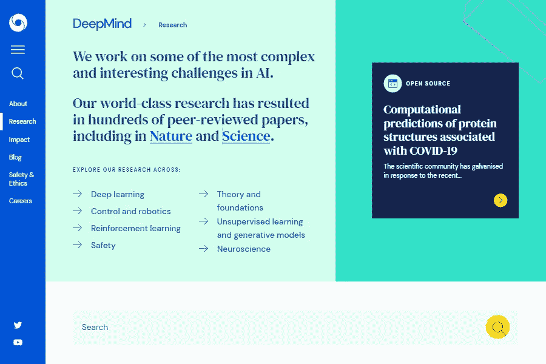**

**来源: [DeepMind](https://mktg.best/deepmind-research)**

## **[DeepMind 博客](https://mktg.best/deepmind-research)**

**DeepMind 致力于人工智能领域一些最复杂、最激动人心的挑战。他们世界级的研究已经产生了数百篇同行评议的论文，包括《自然》和《科学》杂志。**

**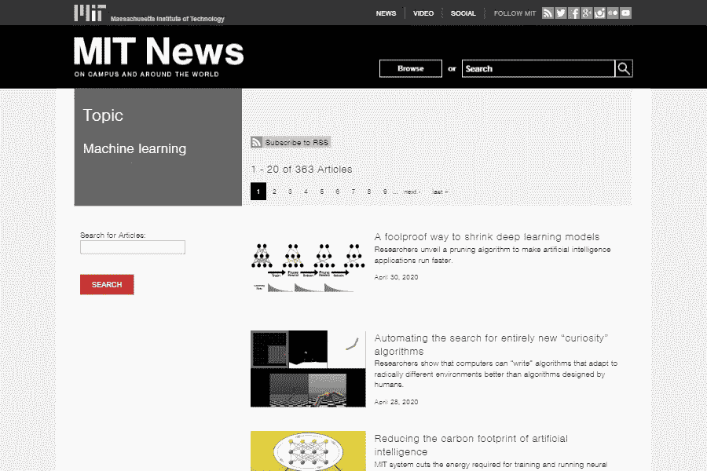**

**来源:[麻省理工学院](https://mktg.best/ml-mit)**

## **[麻省理工学院的机器学习](https://mktg.best/ml-mit)**

**麻省理工学院经常在机器学习领域进行最先进的研究。这个[**过滤后的新闻流**](https://mktg.best/ml-mit) 提供了在 [**麻省理工**](https://mktg.best/mitu) 发生在机器学习领域的最新新闻和研究。**

**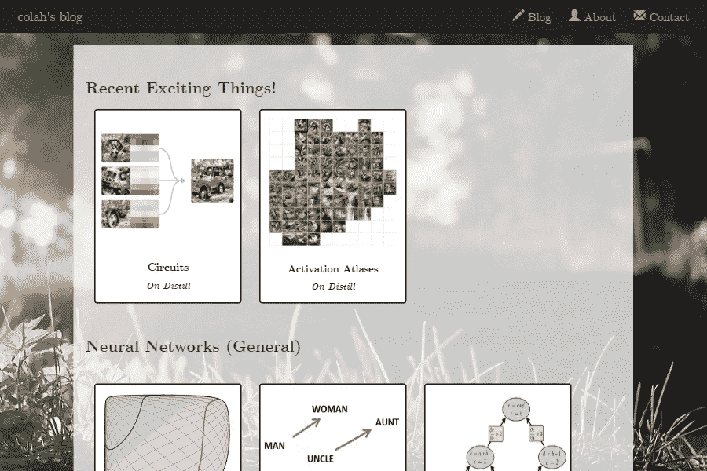**

**来源:Colah 的[博客](https://mktg.best/9byh5)**

## **[科拉的博客](https://mktg.best/9byh5)**

**克里斯托弗·奥拉(Christopher Olah)将自己描述为一名流浪的机器学习研究人员，希望清楚地理解事物，并很好地解释它们[ [10](https://mktg.best/3tkxu) ]。Olah 是开放人工智能的研究员，以前在谷歌人工智能工作。他的博客为机器学习研究人员和爱好者提供了完整而令人兴奋的文章——这是免费、开放的机器学习研究的金矿。**

**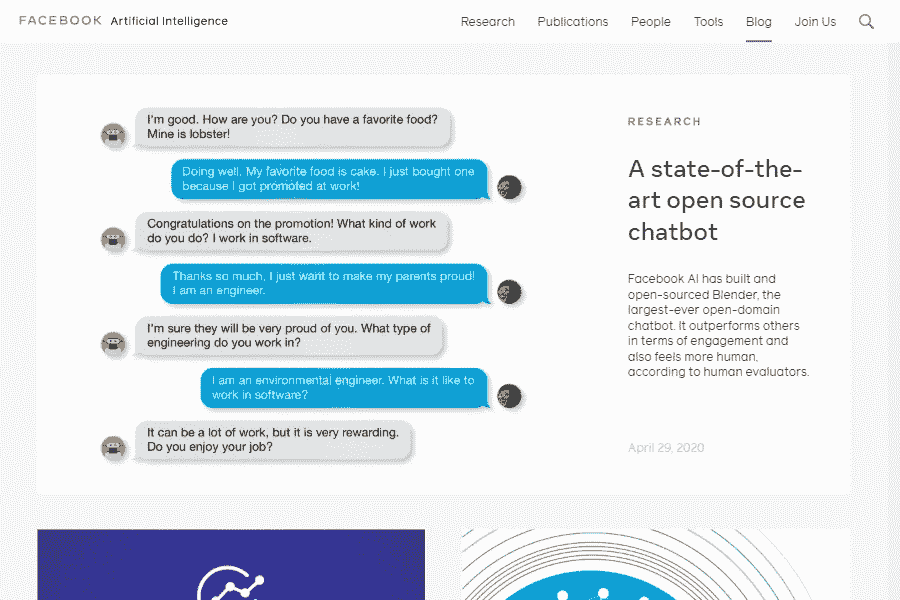**

**来源:[脸书艾](https://mktg.best/732i6)**

## **[艾的博客](https://mktg.best/732i6)**

**脸书·艾以致力于该领域的最新研究而闻名。他们的研究领域专注于计算机视觉、对话式人工智能、完整性、NLP、排名和推荐、系统研究、机器学习理论、语音和音频，以及人类和机器智能。脸书人工智能博客涵盖了从博客帖子到研究出版物的优秀内容。**

**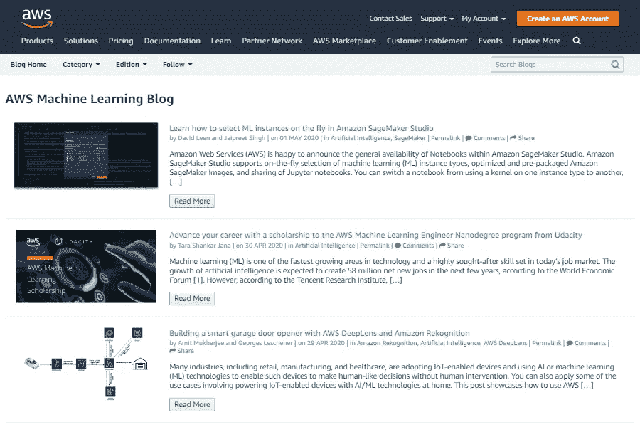**

**来源: [AWS 机器学习](https://mktg.best/z405-)**

## **[亚马逊 AWS 机器学习博客](https://mktg.best/z405-)**

**[**亚马逊网络服务**](https://mktg.best/wzlw0) **(AWS)** 是全球使用最多的云服务之一。他们提供可靠、可扩展和可访问的云计算服务。他们的研究团队在 [**AWS 博客**](https://mktg.best/z405-) [ [11](https://mktg.best/z405-) 上发布关于机器学习最新研究和 ML 应用的博文。**

> **如果你碰巧知道任何其他可靠的机器学习博客，请在评论中让我知道。感谢您的阅读！**

**由[向艾](https://towardsai.net/)发布**

****免责声明:**本文表达的观点仅代表作者个人观点，不代表卡内基梅隆大学或其他(直接或间接)与作者相关的公司的观点。这些文章并不打算成为最终产品，而是当前思想的反映，同时也是讨论和改进的催化剂。**

**通过[向 AI](https://towardsai.net/) 发布**

## **参考**

**[1]机器学习博客，ML@CMU 关于页面| ML @ CMU |[https://blog.ml.cmu.edu/about/](https://mktg.best/mlcmu-about)**

**[2]发表在蒸馏研究杂志|蒸馏|[https://distill.pub/journal](https://mktg.best/distill-about)**

**[3]谷歌人工智能|维基百科|[https://en.wikipedia.com/wiki/google-ai](https://mktg.best/wiki-google-ai)**

**[4]谷歌人工智能博客，机器学习|谷歌人工智能|[https://ai.googleblog.com/search/label/Machine%20Learning](https://mktg.best/google-ai)**

**[5]柏克莱人工智能研究博客，关于页面| https://bair.berkeley.edu/blog/about/ | BAIR | T2**

**[6]机器学习(理论)，关于页面|机器学习理论| https://hunch.net/?page_id=122**

**[7]约翰·兰福德(计算机科学家)|维基百科|[https://en . Wikipedia . org/wiki/John _ Langford _(计算机科学家)](https://mktg.best/john-langford)**

**【8】关于开 AI |开 AI |[https://openai.com/about/](https://mktg.best/te1jy)**

**[9] DeepMind 博客| deep mind |[https://deepmind.com/research/](https://mktg.best/deepmind-research)**

**[10]克里斯托弗·奥拉赫的关于页面|科拉赫的博客|[https://colah.github.io/](https://mktg.best/3tkxu)**

**[11]亚马逊网络服务博客|亚马逊网络服务|[https://aws.amazon.com/blogs/machine-learning/](https://mktg.best/z405-)**

**[12]艾博客|脸书艾|[https://ai.facebook.com/blog/](https://mktg.best/732i6)**

**[13]亚马逊科学|亚马逊|[https://www.amazon.science/blog](https://mktg.best/eldwv)**

**[14]海王星。AI 博客|海王。艾|[https://neptune.ai/blog](https://mktg.best/2z6w4)**