# 2022 年最佳机器学习(ML)书籍——免费和付费——编辑推荐

> 原文：<https://pub.towardsai.net/best-machine-learning-books-free-and-paid-ml-book-recommendations-40c9ab30b0c?source=collection_archive---------0----------------------->

来源:由原始照片衍生而来，照片由 Patrick Robert Doyle 在 [Unsplash](https://unsplash.com/photos/OvXht_wi5Ew) 上拍摄

## [机器学习](https://towardsai.net/p/category/machine-learning)，[社论](https://towardsai.net/p/category/editorial)

## 在过去的一年里，我们已经查看了超过 8371 本机器学习(ML)书籍，我们从技术性、解释复杂主题的能力、深度和经过验证的评论等方面挑选了我们认为最好的付费和免费的 ML 书籍。

最后更新于 2022 年 1 月 1 日

 [## AI 社区↓走向 AI

### 与成千上万的数据领导者一起加入我们的 AI 社区。支持我们，与其他人工智能爱好者合作，参与…

community.towardsai.net](https://community.towardsai.net/) 

N 如今，我们知道 [**机器学习**](https://mld.ai/mldcmu) 及其应用已经成为大多数(如果不是全部)企业不可避免的事情。因此，熟练的机器学习工程师激增。

我们知道，如果你刚刚开始这个领域的职业生涯，机器学习可能会令人生畏。因此，如果你计划进入机器学习的科学领域，你可能会发现自己被网上各种各样与机器学习相关的书籍淹没了。

在本文中，我们将列出一些关于机器学习的最佳书籍。这些书经常在大学课程中使用，并由教授和行业专家推荐。

*披露:我们在《走向人工智能》的编辑团队撰写真实可信的评论，并可能在我们选择支持走向人工智能的产品上获得少量报酬。就本文而言，作为亚马逊的合作伙伴，oriented AI 可能会从合格的购买中获得一小笔佣金(买家无需支付额外费用)。如有反馈、问题或疑虑，请发邮件给我们*[【pub@towardsai.net】](mailto:pub@towardsai.net)**。**

> 📚查看我们的教程，用数学和 Python 深入研究[简单线性回归](https://towardsai.net/p/machine-learning/calculating-simple-linear-regression-and-linear-best-fit-an-in-depth-tutorial-with-math-and-python-804a0cb23660)。📚

## 1.[机器学习](https://amzn.to/3fPVelg)

**作者:汤姆·米契尔**

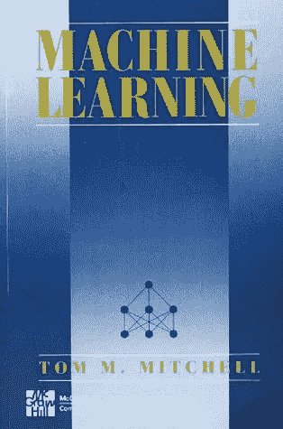

汤姆·m·米切尔的机器学习|来源:[亚马逊](https://amzn.to/3fPVelg)

本书是“ [**机器学习的圣经**](https://amzn.to/3fPVelg) ”，由世界知名的卡内基梅隆大学教授汤姆·m·米切尔撰写。如果你正在开始机器学习(ML)的冒险，这可能是最好的书籍。

这本书充满了全面的理论和它们的例子，包括各种机器学习算法的案例研究。此外，伪代码示例使读者能够深入理解未来的工作。书中包括的主题有——机器学习数学概念、技术和各种 ML 模型，以有形的数学和统计方式介绍机器学习，等等。我们向所有对机器学习感兴趣的人推荐这本书。

此外，这本书大量用于高年级本科生和研究生的机器学习入门课程，在最 [**有声望和公认的研究型大学**](https://towardsai.net/p/machine-learning/best-universities-to-pursue-a-phd-in-machine-learning-in-the-us-artificial-intelligence-ai-ml-ffb745a1554a)**[**人工智能和机器学习**](https://towardsai.net/p/machine-learning/top-universities-to-pursue-a-masters-in-machine-learning-ml-in-the-us-ai-d4a461229fbb) 。**

**在 [**亚马逊**](https://amzn.to/3fPVelg) 上抢一份。**

## **2. [TinyML:在 Arduino 和超低功耗微控制器上使用 TensorFlow Lite 进行机器学习](https://amzn.to/3ob55F0)**

****作者:皮特·沃顿，丹尼尔·斯图纳亚克****

**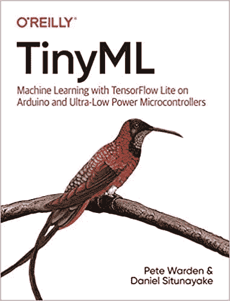**

**Tiny ML |来源:[亚马逊](https://amzn.to/3ob55F0)**

**[**TinyML**](https://amzn.to/3ob55F0) 是一本由谷歌工程师皮特·沃顿(Pete Warden)和(前任)丹尼尔·斯图纳亚克(Daniel Situnayake)撰写的优秀书籍，它向我们展示了如何在嵌入式设备上创建迷你机器学习项目。为了享受这本书的大部分内容，你需要一点关于机器学习和软件开发的知识。然而，作者让它变得非常简单，并假设读者没有 ML 或软件工程的背景。**

**我们在 [**走向人工智能**](https://towardsai.net/p) 的人对这本书非常兴奋，因为它打破了空白，展示了如何在微型设备上构建微型 ML 应用程序，帮助那些资源较少的人获得使用机器学习的乐趣，更让你兴奋的是，作者发布了本书前六章的免费介绍 和如何充分利用本书的视频教程**

****在 [**亚马逊**](https://amzn.to/3ob55F0) 上抢一本。****

## ****3.[使用 Scikit-Learn 和 TensorFlow 进行机器实践学习](https://amzn.to/30UNAjt):****

******作者:奥雷连·盖伦******

****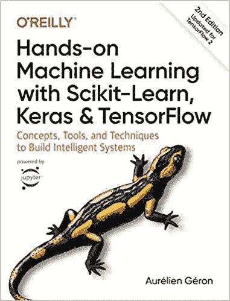****

****用 Scikit-Learn、Keras 和 Tensorflow 实践机器学习|来源:[亚马逊](https://amzn.to/30UNAjt)****

****这本书可能是数据科学和机器学习领域最大的一本书，它包含了奇妙的知识。建议初学者和专家都获得这个领域的有用见解。这本书有一点理论，但它有强大的例子支持它，使它在这个列表中。本书包含的主题有:神经网络、用于机器学习项目的 scikit-learn、机器学习中的训练模型、用于构建和训练神经网络的 TensorFlow 等等。我们可以自信地说，通读这本书之后，你将能够更深入地钻研深度学习，解决现实世界的问题。****

****在 [**亚马逊**](https://amzn.to/30UNAjt) 上抢一份。****

## ****4.[黑客的机器学习](https://amzn.to/36jafst)****

****作者:德鲁·康威，约翰·迈尔斯·怀特****

****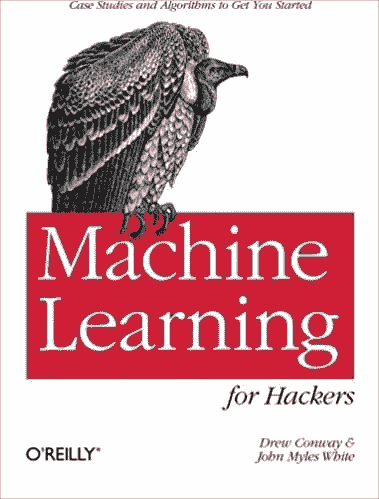****

****黑客的机器学习|来源:[亚马逊](https://amzn.to/36jafst)****

****这本书最适合有一些 R 编程经验的初学者。该书主要关注使用 r 的数据角力，书中包含的案例研究有助于您建立强大的机器学习算法基础。本书的主题包括——朴素贝叶斯分类器、线性回归、优化技术、推荐系统等等。更准确地说，这本书没有涵盖算法的数学推导，而是专注于机器学习算法的应用。****

****在[上抢一份**亚马逊**。](https://amzn.to/36jafst)****

## ****5.[模式识别和机器学习](https://amzn.to/3d3CixT):****

******作者:克里斯托弗·毕晓普******

********

****模式识别和机器学习|来源:[亚马逊](https://amzn.to/3d3CixT)****

****如果你已经阅读了几本关于机器学习的书籍，熟悉了许多机器学习算法，并进一步提高了你在这一领域的技能，这本书就是为你准备的。这本书深入研究了机器学习算法和数学。这本书的先决条件包括熟悉——线性和多元微积分，概率分布，以及编程语言的坚实基础。如果你已经熟悉机器学习和数据科学，这可能是最好的书。****

****在 [**亚马逊**](https://amzn.to/3d3CixT) 上抢一份。****

## ****6.[用 Python 进行自然语言处理](https://amzn.to/3leMBBS)****

****作者:史蒂文·伯德、伊万·克莱恩、爱德华·洛珀****

****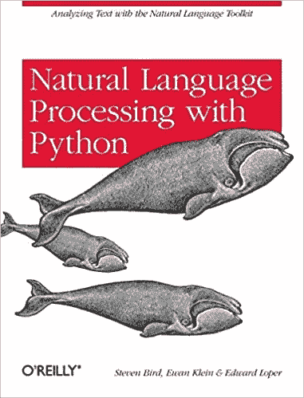****

****用 Python 进行自然语言处理|来源:[亚马逊](https://amzn.to/3leMBBS)****

****本书主要关注应用机器学习技术解决 [**自然语言处理**](https://towardsai.net/p/nlp/natural-language-processing-nlp-with-python-tutorial-for-beginners-1f54e610a1a0) (NLP)问题。所有对 Python 的自然语言处理(NLP)感兴趣的人都应该参考这本书。这本书的写作是直截了当的，并且以一种非常整洁的方式呈现。此外，该书以精确的方式展示了 Python 中的代码示例。这本书涵盖的主题是—从纯文本中提取特征、分析语言结构、访问流行的 NLP 数据集、NLTK 等等。这本书使用 python 编程语言和自然语言工具包(NLTK)库帮助获得 NLP 的实用知识。****

****在[上抢一份**亚马逊**。](https://amzn.to/3leMBBS)****

## ****7.[百页机器学习书](https://amzn.to/3lnjRqB)****

******作者:安德烈·布尔科夫******

****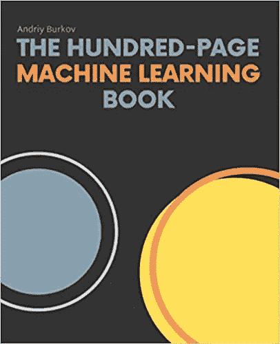****

****百页机器学习书|来源:[亚马逊](https://amzn.to/3lnjRqB)****

****短短 100 页有可能理解机器学习吗？这本书也是为了实现同样的目标。这本书推荐给机器学习的初学者和专家，因为这本书写得直截了当。 [**这本百页的机器学习书籍**](https://amzn.to/3lnjRqB) 得到了机器学习领域非常知名的人物的认可，比如彼得·诺维格、奥雷连·盖伦、卡罗利斯·乌尔博纳、韩朝、苏吉特·瓦拉克赫迪、文森特·波莱、迪帕克·阿加瓦尔等等。这本书涵盖了各种主题，如基本的机器学习算法，监督和非监督学习，神经网络和深度学习，等等。毫无疑问，我们会向 ML 爱好者推荐这本书。****

****在 [**亚马逊**](https://amzn.to/3lnjRqB) 上抢一本。****

## ****8.[Python 机器学习简介](https://amzn.to/2Swbw7Z)****

******作者:安德烈亚斯·穆勒、萨拉·圭多******

****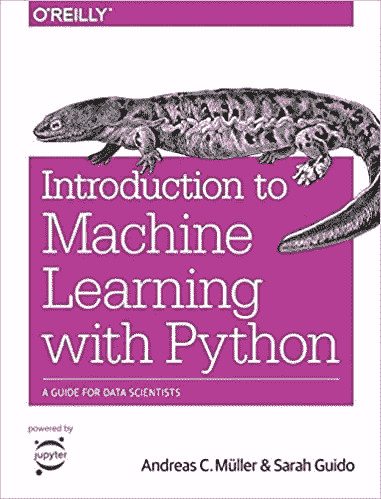****

****Python 机器学习入门|来源:[亚马逊](https://amzn.to/2Swbw7Z)****

****这本书是那些想开始机器学习之旅的人的理想选择。这本书用友好的语气和说明性的例子清楚地解释了数据科学和机器学习的基本概念。这本书最好的一点是，读者不需要任何数据科学、机器学习和 Python 的先验知识。本书包含机器学习的基本概念和应用、模型评估的高级技术、数据表示、管道概念、提高数据科学和机器学习技能的建议，以及更多内容。这本书可能是用 Python 学习机器学习最好的书之一。****

****在 [**亚马逊**](https://amzn.to/2Swbw7Z) 上抢一份。****

## ****9.[数据挖掘](https://amzn.to/3lkYPsH):****

******作者:伊恩·h·威滕，艾贝·弗兰克，马克·霍尔，克里斯托弗·帕尔******

****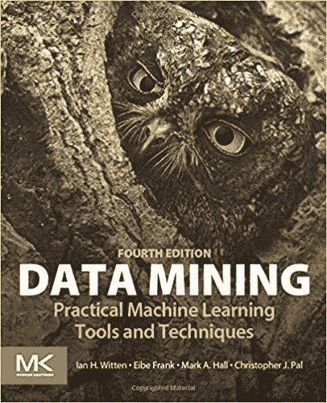****

****数据挖掘、实用机器学习工具和技术|来源:[亚马逊](https://amzn.to/3lkYPsH)****

****这本书关注机器学习算法的技术方面。数据挖掘从根本上帮助我们在庞大的数据集中找到模式并得出结论。如果你对大数据和机器学习感兴趣，那么这本书适合你。本书涵盖的主题有——聚类、回归技术、知识表示、数据挖掘技术等等。这本书内容清晰明了，值得我们推荐。****

****在 [**亚马逊**](https://amzn.to/3lkYPsH) 上抢一份。****

# ****最佳免费机器学习书籍:****

## ****1.机器学习向往****

******作者:吴恩达******

****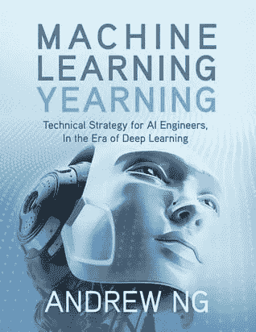****

****机器学习向往|来源: [deeplearning.ai](https://www.deeplearning.ai/machine-learning-yearning/)****

****如果你在机器学习领域，你一定听说过这本书的作者。《机器学习向往》是吴恩达的免费电子书，他教我们如何设计和构建机器学习项目。Ng 的书重点不是教你 [**机器学习算法**](https://towardsai.net/p/machine-learning/machine-learning-algorithms-for-beginners-with-python-code-examples-ml-19c6afd60daa) ，而是如何让这些复杂的算法在真实场景中工作。****

****在[**deep learning . ai**](https://www.deeplearning.ai/machine-learning-yearning/)上免费抢****

## ****2.[统计学习的要素](https://web.stanford.edu/~hastie/ElemStatLearn/)****

******作者特雷弗·哈斯蒂、罗伯特·蒂布拉尼和杰罗姆·弗里德曼******

****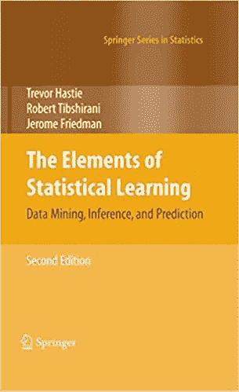****

****统计学习的要素|来源:[史丹福](https://web.stanford.edu/~hastie/ElemStatLearn/)****

****《统计学习的要素》是一本非常棒的免费书籍，有生动的数据可视化，涵盖了大量关于数据挖掘、推理和预测的高质量教育信息。这本书由著名的斯坦福大学教授 Trevor Hastie，Robert Tibshirani 和 Jerome Friedman 撰写，理解了机器学习在过去十年中如何成为不同领域的需求，包括医学，生物学，金融，营销和其他领域。虽然它很宽泛，但它教会了我们许多技术，从监督学习到非监督学习，帮助那些在机器学习之旅中的人处理真实的用例场景。****

****在 [**斯坦福大学网站**](https://web.stanford.edu/~hastie/ElemStatLearn/) 免费抢。****

## ****3.[统计学习简介](http://faculty.marshall.usc.edu/gareth-james/ISL/)****

******作者:加雷斯·詹姆斯、丹妮拉·威滕、特雷弗·哈斯蒂和罗伯特·蒂布拉尼******

****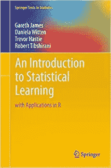****

****统计学习介绍|来源:[南加州大学](http://faculty.marshall.usc.edu/gareth-james/ISL/)****

****对于那些没有很强的数学背景的人来说,《统计学习导论》是一个极好的资源。它展示了一个很好的 R 统计学习方法的介绍，是机器学习者的宝贵资源。这本书在向统计和非统计从业者呈现一个全面的和可访问的资源方面是关键的，这些从业者想要使用尖端技术用数据解决复杂的问题。如果你对它的要求很好奇，你只需要知道如何与 [**线性回归**](https://towardsai.net/p/machine-learning/calculating-simple-linear-regression-and-linear-best-fit-an-in-depth-tutorial-with-math-and-python-804a0cb23660) 配合，就能最大限度的利用这本书。****

****在 [**USC 的网站**](http://faculty.marshall.usc.edu/gareth-james/ISL/) 上免费抢。****

# ****结论:****

****我们希望你喜欢阅读这些书，并从中获得一些关于机器学习的有用见解。如果你遇到任何关于机器学习科学领域的现象级书籍，比如这个列表中提到的那些，请通过 [**电子邮件**](mailto:pub@towardsai.net) 让我们知道。****

****感谢您的阅读！****

# ****参考资料:****

****[1]机器学习书籍，数据来自亚马逊，【https://www.amazon.com/s?k=machine+learning ****

****[2]南加州大学统计学习导论，[http://faculty.marshall.usc.edu/gareth-james/ISL/](http://faculty.marshall.usc.edu/gareth-james/ISL/)****

****[3]《统计学习的要素》，斯坦福大学，[https://web.stanford.edu/~hastie/ElemStatLearn/](https://web.stanford.edu/~hastie/ElemStatLearn/)****

****[4]机器学习向往，deeplearning.ai，[https://www.deeplearning.ai/machine-learning-yearning/](https://www.deeplearning.ai/machine-learning-yearning/)****

****[5]机器学习改善公司工作流程的 8 种方式，《哈佛商业评论》，[https://HBR . org/2017/05/8-Ways-Machine-Learning-Is-Improving-Companies-Work-Processes](https://hbr.org/2017/05/8-ways-machine-learning-is-improving-companies-work-processes)****