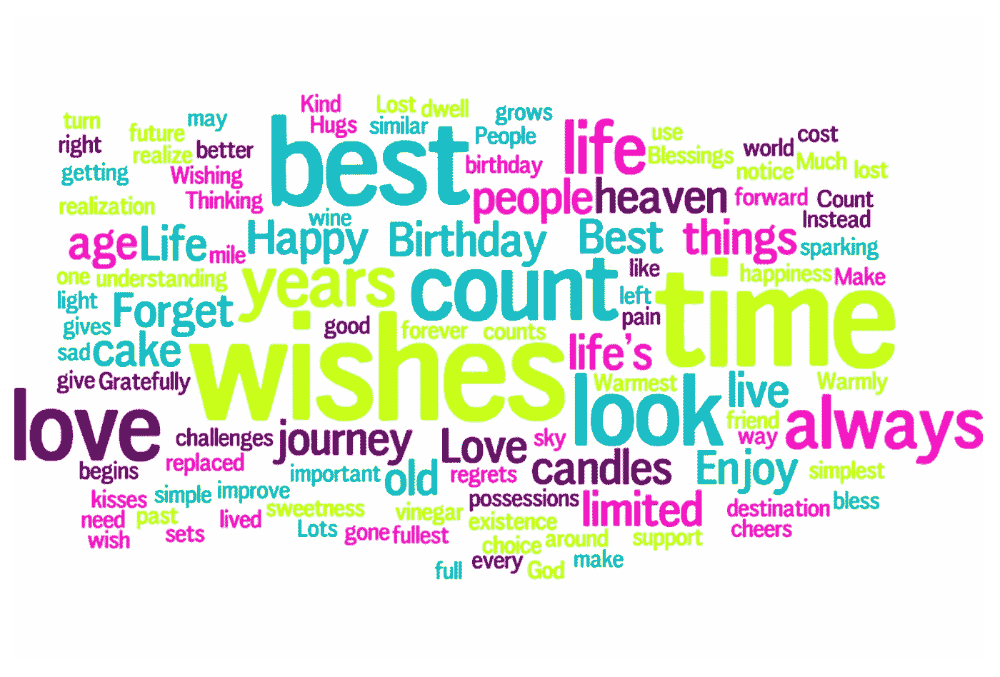

# 在线学习 NLP 的最佳资源

> 原文：<https://pub.towardsai.net/best-resources-to-learn-nlp-online-9b17fd814981?source=collection_archive---------2----------------------->

## [教程](https://towardsai.net/p/category/tutorial)

## 用这些辅助工具掌握自然语言处理

图片由 [narciso1](https://pixabay.com/users/narciso1-608227/?utm_source=link-attribution&utm_medium=referral&utm_campaign=image&utm_content=680706) 来自 [Pixabay](https://pixabay.com/?utm_source=link-attribution&utm_medium=referral&utm_campaign=image&utm_content=680706)

**简介**

有很多人问我如何开始学习自然语言处理，所以我决定写这篇指南来分享一些资源，这些资源将帮助你开始这一领域的学习。

在过去的十年中，NLP 一直是数据科学中的一个热门话题，并且是一个非常广泛的话题。这个资源列表旨在帮助您逐步学习自然语言处理。更多基本概念的参考资料在最开始，如果在使用它们之后，您仍然感兴趣，您可以在列表中向下移动。

所以让我们开始吧

1.  **什么是 NLP 和一些 NLP 基础在简短的教程和文章中解释？**

最好的入门方式是浏览一些基础教程，其中包括理论、概念解释和一些代码。通过阅读这些，你将学习什么是自然语言处理，并了解一些基本的自然语言处理概念。这将让你对什么是 NLP 有所了解，并且你可以决定你是否有兴趣学习更多。

下面的一些教程假设您已经熟悉 python 和基本的数据科学概念。

*   [自然语言处理教程](https://www.tutorialspoint.com/natural_language_processing/index.htm)

如果你想获得关于 NLP 和 NLP 概念的理论，你应该阅读本教程，或者一系列教程，因为它们是文章的系列。不涉及编码，但是 NLP 概念解释得很好，所以值得一读。

对有些人来说可能有点长，你可以略读，然后阅读列表中的下一个位置。

*   [卢卡斯·苏亚雷斯](https://medium.com/swlh/a-quick-tutorial-on-nlp-basics-66082c242262)撰写的关于自然语言处理基础知识的快速教程。

在本教程中，Lucas 以通俗易懂的方式解释了一些 NLP 概念和术语，并包含了完成这些任务所需的 python 代码。他没有详细介绍每种技术，但很好地解释了概念的本质。

*   [自然语言处理从业者指南(上)——处理&理解文本](https://towardsdatascience.com/a-practitioners-guide-to-natural-language-processing-part-i-processing-understanding-text-9f4abfd13e72)作者[迪潘坚(DJ)萨卡尔](https://medium.com/u/6278d12b0682?source=post_page-----9b17fd814981--------------------------------)

这是一个基于真实例子的令人惊奇的教程。它着重于用 python 编写的代码，但也在背景中解释了 NLP 概念。这是列表中最实用的教程。

这个教程有点长，但是很有价值。

**2。一些基本的 NLP 课程。**

一旦你知道什么是 NLP，并且你想投入更多的时间去更好地了解它，你就可以完成一些基础课程。这将让你对代码和概念有更多的实践经验。

*   [**Kaggle 上的自然语言处理教程**](https://www.kaggle.com/learn/natural-language-processing)

这个短期课程是一个很好的开始。大约需要 4 个小时，而且是免费的。您将使用 python 和 spacy 构建一个文本分类器。

*   [**Python 中的自然语言处理**](http://datacamp.pxf.io/EazABn) 在 DataCamp(附属链接)上

如果你仍然渴望更多，我建议你完成 Python Datacamp 课程中的[自然语言处理。本课程由六个不同的子课程组成，会给你一个很好的不同 NLP 概念和技术的概述。您将学习的内容包括情感分析、构建聊天机器人以及 spacy 的一些更高级的用法。整个课程需要 25 个小时完成，所以这绝对是一个比 Kaggle 更大的承诺。](http://datacamp.pxf.io/EazABn)

*   [**自然语言处理与深度学习**](https://click.linksynergy.com/link?id=*VF1FhMTX1A&offerid=507388.918390&type=2&murl=https%3A%2F%2Fwww.udemy.com%2Fcourse%2Fnatural-language-processing-with-deep-learning-in-python%2F)****Udemy(附属链接)****

****如果你想超越基本概念，学习深度学习在 NLP 中是如何使用的，我推荐这个 Udemy 课程。这是该平台上评分最高的 NLP 课程，涵盖了更高级的概念。它侧重于使用递归神经网络来解决 NLP 问题。这门课程绝对不适合初学者。它是非常代码密集型的，并且深入到 TensorFlow 网络实现中。如果这是你想学的，你一定要完成它。****

******3。YouTube 视频******

****我不知道有哪个 YouTube 频道是专门为自然语言处理材料设计的，但是有一些来自不同数据科学社区的视频。****

*   ****[用 Python 编写的自然语言处理教程& NLTK](https://www.youtube.com/watch?v=X2vAabgKiuM)****

****这是一个简短的基本 NLP 视频，将教你如何使用 python 和 NLTK(自然语言工具包)。它首先解释了基本的 NLP 概念，然后开始使用 python 和 Jupyter 笔记本来实现这些技术。****

*   ****斯坦福大学[全 NLP 课程](https://www.youtube.com/watch?v=oWsMIW-5xUc&list=PLLssT5z_DsK8HbD2sPcUIDfQ7zmBarMYv)****

****如果你喜欢大学风格的教学，你可以观看斯坦福大学课程的所有视频。斯坦福大学是教授自然语言处理的最好的大学之一，该课程由著名的自然语言处理研究者 Dan Jurafsky 教授。****

******4。NLP 播客。******

****自然语言播客，你知道它们的存在吗？我会把它们推荐给对自然语言处理非常感兴趣的人，因为他们通常会谈论该领域的最新进展，对初学者来说可能没那么有趣。****

*   ****[AllenAI NLP 播客](https://allenai.org/podcasts)****

****这个播客是由 AllenAI 带给你的，这里是科学家们谈论最近与 NLP 相关的有趣工作的地方。如果你对 NLP 的最新进展有很高的兴趣，并且播客是你的专长，你绝对应该尝试一下。****

******总结******

****您已经获得了学习自然语言处理的不同资源。我已经包含了一系列的教程、视频和课程，应该可以帮助你在这个领域起步和进步。****

****我希望你会发现它们有用，并快乐学习！****

*****最初发布于 aboutdatablog.com:* [学习 NLP 的最佳资源在线](https://www.aboutdatablog.com/post/best-resources-to-learn-nlp-online)，*2021 年 8 月 9 日*****

*****PS:我正在 Medium 和***上撰写深入浅出地解释基本数据科学概念的文章。你可以订阅我的* [***邮件列表***](https://medium.com/subscribe/@konkiewicz.m) *每次我写新文章都会收到通知。如果你还不是中等会员，你可以在这里加入**[***。***](https://medium.com/@konkiewicz.m/membership)******

******下面还有一些你可能喜欢的帖子******

****** [## Jupyter 笔记本自动完成

### 数据科学家的最佳生产力工具，如果您还没有使用它，您应该使用它…

towardsdatascience.com](https://towardsdatascience.com/jupyter-notebook-autocompletion-f291008c66c)  [## 9 大 Jupyter 笔记本扩展

### 改进笔记本电脑功能，提高您的工作效率

towardsdatascience.com](https://towardsdatascience.com/top-9-jupyter-notebook-extensions-7a5d30269bc8)  [## 作为一名有抱负的数据科学家，你应该关注的中型作家

### 我最喜欢的 10 个数据科学博主，让你的学习之旅更轻松。

towardsdatascience.com](https://towardsdatascience.com/medium-writers-you-should-follow-as-an-aspiring-data-scientist-13d5a7e6c5dc)******