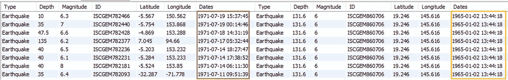
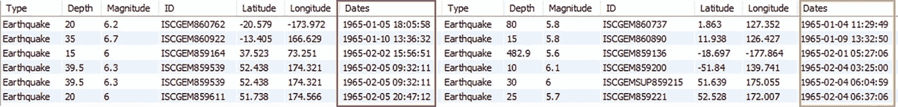
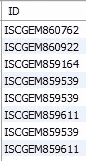

# 理解自联接的最佳 SQL 示例

> 原文：<https://pub.towardsai.net/best-sql-examples-to-understand-self-join-905495f0f5a9?source=collection_archive---------1----------------------->

## 用自连接、非等价连接和日期函数提高您的 SQL 技能！


由 freepik 创建的[人体插图矢量——www.freepik.com](https://www.freepik.com/vectors/human-illustration)

*作为我之前两篇文章的快速延续—***T**[**op 5 2022 年你应该知道的 SQL 日期函数**](https://towardsdatascience.com/top-5-sql-date-functions-you-should-know-in-2022-2180328ab940) 和[**2022 年你应该知道的 5 个高级 SQL 概念**](https://towardsdatascience.com/5-advanced-sql-concepts-you-should-know-in-2022-b50efe6c99)

我在 Leetcode 上发现了这个有趣的问题，它本质上是测试你如何实现 SQL 自连接和日期函数。

> [编写一个 SQL 查询，查找所有与之前日期(昨天)相比温度更高的日期。](https://leetcode.com/problems/rising-temperature/)

因此，我在这里提出了一个完整的解决方案，并通过一个例子逐步解释了每个步骤。

在这篇文章的结尾，你可以有效地使用—

✅自连接—将表与其自身连接起来

✅非相等连接—执行不带相等运算符的连接`**=**`

SQL 中的✅日期函数-根据日期时间值过滤记录

> 📍注意:我使用的 MySQL Workbench &地震数据集来自[ka ggle](https://www.kaggle.com/datasets/usgs/earthquake-database)[public](https://creativecommons.org/publicdomain/zero/1.0/)dataset&，现在可以在我的 [**Github**](https://github.com/17rsuraj/data-curious/blob/master/TowardsDataScience/Dummy_Sales_Data_v1.csv) repo 上免费获得 [MIT 许可](https://github.com/17rsuraj/data-curious/blob/master/LICENSE.md)！

我将使用的数据集如下所示..


地震数据集|作者图片

这是一个简单的 2000 x 7 数据集！

> 为了更容易理解，请务必阅读开头提到的两篇文章

好了，我们开始吧…🚀

在开始这个实际的问题之前，让我们先了解它是如何与下面的例子一起工作的，我确信在看完这个例子之后，您将为 Leetcode 问题编写自己的查询。

为了简单起见，我将这个问题转化为我们的地震数据集版本，如下所示—

> **编写一个查询，返回地震震级高于前一天(昨天)的所有 id**

有一点很清楚，你需要比较两个日期的地震震级。然而，你只有一个表，这意味着，这是自连接的问题。

正如我在上一篇文章 [**5 高级 SQL 概念**](https://towardsdatascience.com/5-advanced-sql-concepts-you-should-know-in-2022-b50efe6c99#3ad5) 中提到的，SELF JOIN 是使用关键字`JOIN`将一个表与其自身连接起来。

因为两个表名相同，所以在自连接的情况下使用表别名是很重要的。💯

这个问题中最重要的一步是如何执行连接操作。

让我们首先使用公共列 ID 连接两个表。

```
SELECT t1.*, t2.*
FROM sql_practice.earthquakes AS t1
**JOIN sql_practice.earthquakes AS t2**
**ON t1.ID = t2.ID**
WHERE t1.Magnitude > t2.Magnitude
AND DATEDIFF(t1.Dates, t2.Dates) = 1;
```

这将空数据集作为输出返回。

> 注:别名 T1 和 t2 分别代表今天的**和昨天的**和**两个表，这样当你说 t1 的时候。震级> t2。震级，你实际上是在用昨天的震级来检验今天的震级。**

好吧，我们先来了解一下为什么它什么都不返回。

如果仔细观察原始数据集，您会发现每个 ID 对应一个日期时间值和一个量值。

所以当你把表和它本身连接在一起的时候，它永远不会有两个不同的量级。这意味着条件`**t1.Magnitude > t2.Magnitude**`永远不会满足。因此，您会得到空数据集作为输出。

那么，❓有什么解决办法呢

与 JOIN 子句中常用的等式运算符`**=**`不同，您需要使用非等式运算符(从`**>**`、`**<**`、`**≤**`、`**≥**`、`**<>**`中的任何一个)。这种类型的连接称为**非对等**连接。

让我们用修改后的 JOIN 子句重写解决方案。

```
SELECT t1.*, t2.*
FROM sql_practice.earthquakes AS t1
**JOIN sql_practice.earthquakes AS t2**
**ON t1.Magnitude > t2.Magnitude**;
```

现在，您正在连接两个表，使得今天的数值总是高于昨天的数值。它很快返回输出，



非对等 SQL 联接|按作者排列的图像

如您所见，今天部分的日期(*标为红色*)总是多于昨天部分的日期(*标为黄色*)。但是，同一行中两个日期之间的差值并不总是等于 1，而是在大多数情况下大于 1。

此时，您需要使用`**DATEDIFF**`函数将两个日期之间的差异限制在 1 天之内。

```
SELECT t1.*, t2.*
FROM sql_practice.earthquakes AS t1
JOIN sql_practice.earthquakes AS t2
ON t1.Magnitude > t2.Magnitude
AND **DATEDIFF(t1.Dates, t2.Dates) = 1**;
```



非对等 SQL 联接|按作者排列的图像

同样，您可以看到任何记录中两个日期之间的差异只有一天，这是需要的。在最终输出中，您只需要震级高于前一天的 id，您可以使用`t1.ID`而不是`t1.*, t2.*`来选择，如下所示。

```
SELECT t1.ID
FROM sql_practice.earthquakes AS t1
**JOIN sql_practice.earthquakes AS t2
ON t1.Magnitude > t2.Magnitude
AND DATEDIFF(t1.Dates, t2.Dates) = 1;**
```



最终输出|作者图片

以类似的方式，您也可以使用我在这里提到的非等价连接和 SQL 日期函数来编写对 [Leetcode](https://leetcode.com/problems/rising-temperature/) 问题的解决方案。

> 编写一个 SQL 查询来查找所有与之前日期(昨天)相比温度更高的日期'`Id`。

```
SELECT today.id FROM Weather AS today 
JOIN Weather AS yesterday
**ON today.temperature > yesterday.temperature**
**AND TIMESTAMPDIFF(DAY, yesterday.recordDate, today.recordDate) = 1**
```

您也可以使用`DATEDIFF`功能重新编写这个查询，并在这里 交叉检查您的答案 [***。***](https://towardsdatascience.com/top-5-sql-date-functions-you-should-know-in-2022-2180328ab940)

仅此而已！

我希望您发现这个示例很有用，并学会了如何一起使用 SQL `**SELF JOIN**`、`**Non-Equi**` Join 和`**DATE**`函数。我发现总结高级 SQL 查询的经验非常有用。

关于日期-时间运算和自连接的问题通常是数据科学工作的面试问题，因为它们在现实世界的分析中更有用。

> *对阅读介质上的无限故事感兴趣？？*

💡考虑 [**成为媒体会员**](https://medium.com/@17.rsuraj/membership)**访问媒体上无限的**故事和每日有趣的媒体文摘。我会得到你的费用的一小部分，没有额外的费用给你。

💡请务必 [**注册我的电子邮件列表**](https://medium.com/subscribe/@17.rsuraj) ，千万不要错过另一篇关于数据科学指南、技巧和提示、SQL 和 Python 的文章。

**感谢您的阅读！**