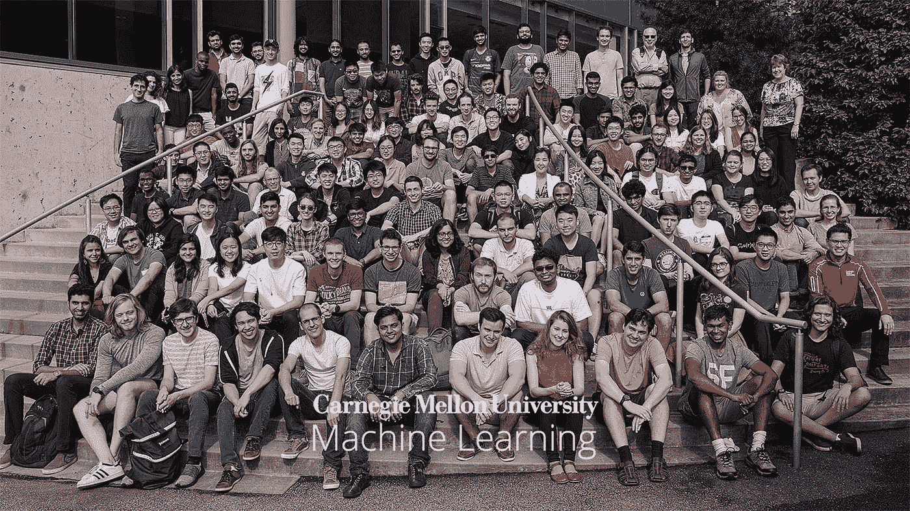
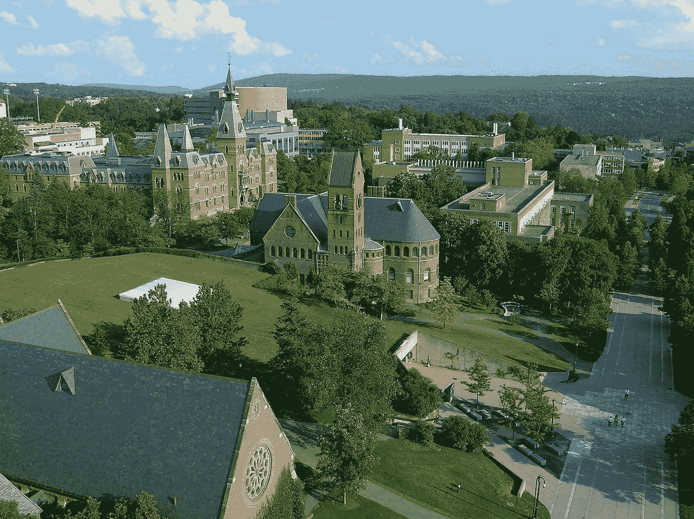
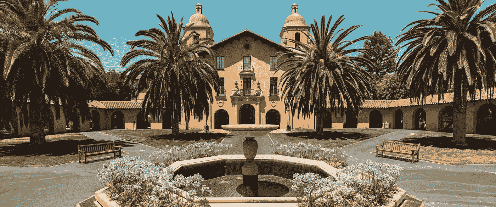
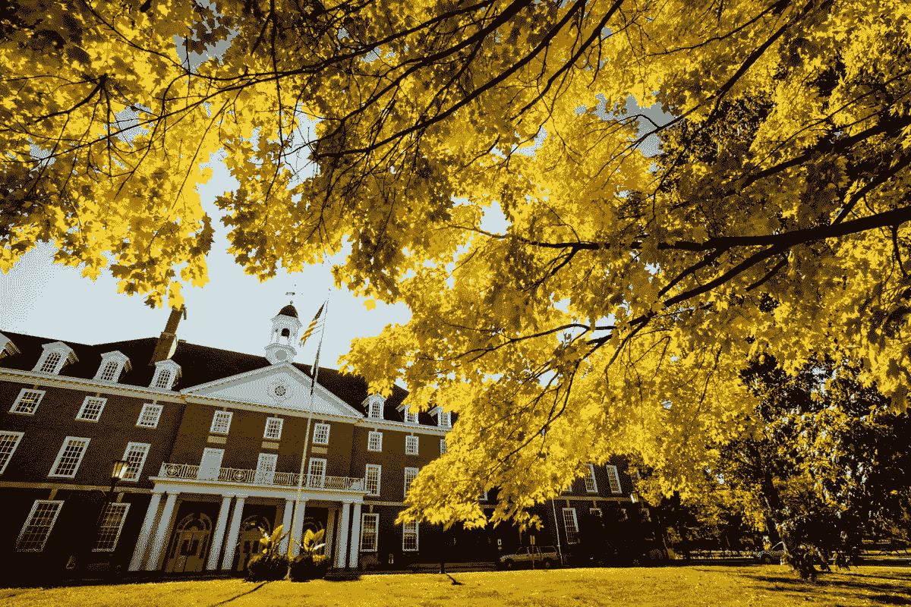
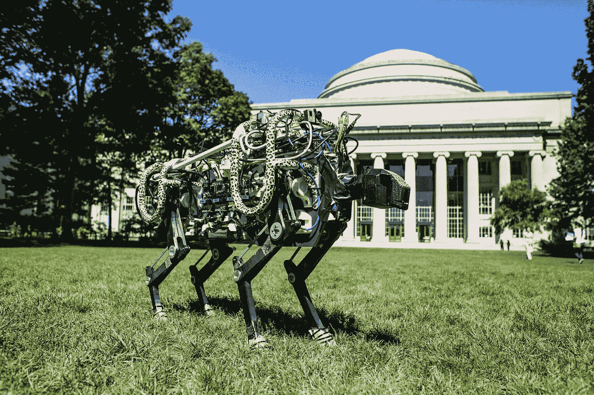
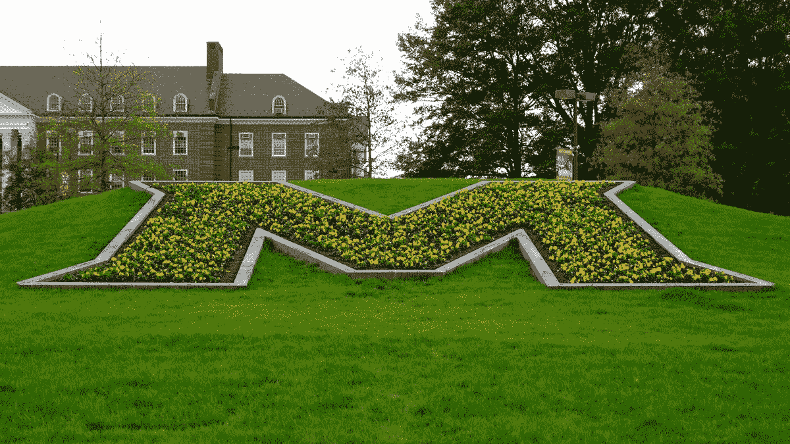
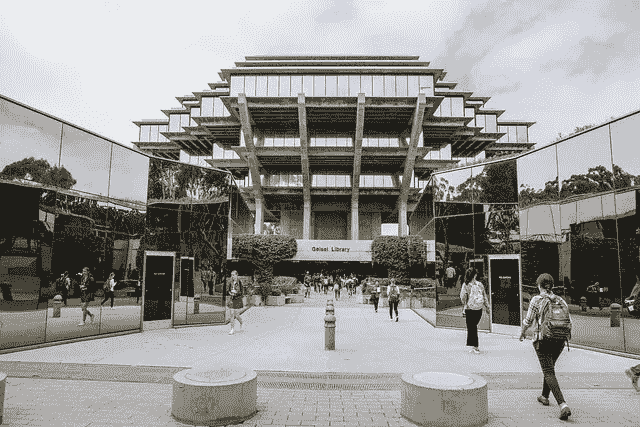
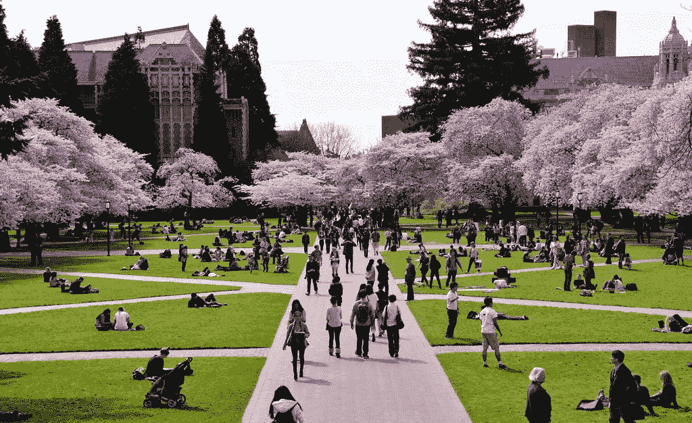
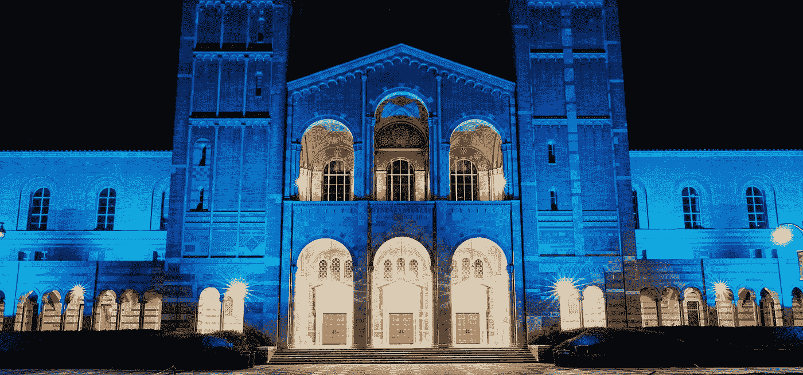

# 2022 年人工智能(AI)项目最佳大学

> 原文：<https://pub.towardsai.net/best-universities-for-artificial-intelligence-ai-programs-3c22cd3e9179?source=collection_archive---------0----------------------->

来源:图片由 [Unsplash](https://unsplash.com/photos/yNZ49cjCN4Q) 上的 [Nick Fewings](https://unsplash.com/@jannerboy62) 拍摄

## [职业](https://towardsai.net/p/category/careers)、[教育](https://towardsai.net/p/category/education)、[新闻](https://towardsai.net/p/category/news)

## 这些大学是世界上最好的人工智能(AI)本科或研究生课程，重点是人工智能的研究排名

最后更新于 2022 年 1 月 1 日

 [## AI 社区↓走向 AI

### 与成千上万的数据领导者一起加入我们的 AI 社区。支持我们，与其他人工智能爱好者合作，参与…

community.towardsai.net](https://community.towardsai.net/) 

人工智能(AI)是当今最令人兴奋的研究领域之一，近年来非常受欢迎。一些大学现在提供人工智能方面的专业学位，一些主要的大学提供计算机科学，机器学习或其他定量领域的更广泛的关注。虽然人工智能领域最佳大学项目的列表并不详尽，但它提供了一些在人工智能领域进行卓越研究的大学的重要概述。

当今许多最大的科技公司都在寻找具有人工智能(AI)背景的个人:脸书、苹果、谷歌，仅举几个例子，专注于这项技术。它帮助他们改善和优化核心业务流程(借助这些新技术，脸书在几年内就获得了超过 20 亿的注册用户)。这就是为什么世界各地的大学开始提供专门针对人工智能的特定课程和学位并不令人惊讶。

拥有人工智能学士学位、硕士学位或博士学位的学生有许多职业机会，同时瞄准他们可以专注的领域——信息技术(IT)、软件开发、机器学习、大数据分析、生物技术、机器人等领域。

如果您只是在寻找大学名称，请随意跳到最后。

来源:[卡内基梅隆大学](https://mktg.best/9d0bf)

# 1.[卡内基梅隆大学](https://mktg.best/9d0bf)

## **人工智能研究排名:** 1

卡耐基梅隆大学(CMU)是人工智能领域的顶级大学之一。来自 CMU 的人工智能毕业生有机会在世界上最受欢迎的公司工作。正如《纽约时报》所提到的，像谷歌、苹果、优步、亚马逊，甚至脸书这样的大型科技公司都从这所学校招人。CMU 也是接受公开信敦促不要在武器上使用人工智能的主要机构之一。

在 CMU，他们的重点是不同领域的人工智能研究，如神经计算、神经网络、机器学习、计算机视觉和机器人技术。CMU 大学在世界和北美其他大学中排名第一，拥有著名的计算机科学、工程、统计和技术系。在那里学习的学生的意见是积极的；他们认为，CMU 的教职员工对促进学生的进步和整体福祉表现出了真正的兴趣。

[**联系卡耐基梅隆艾**](https://mktg.best/9d0bf) **。**

来源:[康奈尔大学](https://www.overview.law.cornell.edu/)

# 2.[康奈尔大学](https://mktg.best/ap3bg)

## **人工智能研究排名:** 2

康奈尔大学是一所私立的、具有最高国际标准的教育研究型大学。它是美国为数不多的将学院和学校组织成一所大学的机构之一。康奈尔大学的教师与学生合作，帮助创造下一代技术来解决一些世界上最紧迫的问题。

纽约州伊萨卡市康乃尔大学的计算机科学硕士(MSCS)学位课程和计算机科学博士(CS)课程旨在为您提供计算机科学基础方面的坚实背景知识，并为您的计算机科学研究生涯做好准备。

康奈尔大学是世界上最优秀的研究型大学之一，它的愿望是被公认为世界上最杰出的人工智能大学之一。这是一个崇高的愿望——他们可以通过致力于培养体现伟大教育家品质的学生、教师和职员来实现这一愿望；他们努力使课堂体验更具吸引力和互动性；或者用新技术来提高教师的能力。

[**联系科内尔工程**](https://mktg.best/ystoc) **。**

来源:斯坦福大学

# 3.[斯坦福大学](https://mktg.best/mejob)

## **人工智能研究排名:** 3

人工智能(AI)是一个科学领域，它探索展示智能行为的计算机系统的理论和发展。斯坦福大学的人工智能首次被研究是在 1962 年，当时 Patrick Winston 和 Juris Hartmanis 设计了他们的人工智能课程，作为当时更受欢迎的控制论课程“控制系统实验室”的扩展。由于詹姆斯·雷的捐赠，斯坦福大学的人工智能实验室于 1997 年成立，并被誉为人工智能(AI)的最佳大学之一。

斯坦福大学的计算机科学系被认为是从事人工智能项目的好地方。自 2011 年以来，著名的 Peter Norvig 一直在教授一门名为“人工智能导论”的在线课程，并于 2017 年冬季推出了该计划的第三个版本。他说，到目前为止，大约有 100，000 名学生选修了这门课程——此外，约翰·兰福德还发表了许多关于机器学习的演讲。其中最引人注目的是一门名为“从数据中学习”(2017 年春季)的 MOOC 课程，以及去年一门类似但规模较小的课程，名为“分析图像的价值”。

如果不提到斯坦福大学，你就不能谈论“人工智能”或“人工智能”，因为它一直被视为世界上人工智能(AI)专业最好的大学之一。

[**联系斯坦福工程**](https://mktg.best/qhb7-) **。**

来源: [UIUC](https://news.illinois.edu/view/6367/643491)

# 4.[伊利诺伊大学香槟分校(UIUC)](https://mktg.best/2hmvo)

## **人工智能研究排名:** 4

几十年来，人工智能一直是科幻小说的主题，但人工智能在日常生活中变得越来越重要。对具有智能行为的系统的研究，人工智能包括伊利诺伊大学厄巴纳-香槟分校(UIUC)的教师被公认为领导者的几个关键领域，包括计算机视觉、机器听力、自然语言处理、机器学习和机器人技术。

UIUC 的研究人员与行业密切合作，探索和开发支撑人工智能进步的新技术。例如，伊利诺伊州人工智能(Illinois AI)实验室是一个跨学科项目，位于 UIUC 计算机科学系，旨在应用前沿的机器学习方法来解决商业、健康、安全和娱乐挑战以及其他领域的问题。

[**联系 UIUC**](https://mktg.best/nfpvp) **。**

来源:[麻省理工](https://news.mit.edu/sites/default/files/download/201409/MIT-Cheetah-05-press.jpg)

# 5.[麻省理工学院](https://mktg.best/5sit7)

## **人工智能研究排名:** 5

麻省理工学院的计算机科学和人工智能实验室(CSAIL)是世界领先的人工智能(AI)和机器学习研究中心之一。所以，当麻省理工学院推出一个项目，提出一些关于人工智能和机器学习的伦理问题时，我们正在倾听。

根据麻省理工学院的网站，计算机科学和人工智能实验室(CSAIL)致力于人工智能。与流行观点相反，人工智能存在于日常生活中，而不仅仅是科幻电影中。来自制造业的机器人可以检查和清洁他们的环境，这是人工智能在现实生活中应用的一个很好的例子。

国际数据公司预计，到 2021 年，全球将有超过 30 亿人使用移动互联网，包括智能手机、平板电脑、手表和其他可穿戴设备。这种简化的采用将为人工智能驱动的移动商务应用的增长提供广泛的机会。

[**联系麻省理工学院 EECS**](https://mktg.best/5xzp4) **。**

来源: [UMD](https://mktg.best/1syfl)

# 6.马里兰大学学院公园

## **人工智能研究排名:** 6

马里兰大学帕克分校有一个非常活跃的研究和教育项目。他们的课程提供了广泛的课程，包括入门人工智能、认知建模、常识推理、进化计算、博弈论、机器学习、多代理系统、NLP 和神经计算。

从进化计算到机器学习和神经计算，马里兰大学致力于开发坚实的人工智能程序。

[**联系 UMD**](https://mktg.best/tvq1u) **。**

来源:[佐治亚理工](https://www.gatech.edu/about)

# 7.[佐治亚理工学院](https://mktg.best/33gws)

## **人工智能研究排名:** 7

佐治亚理工学院位于佐治亚州亚特兰大市中心，这座城市以其南方魅力而闻名。其顶级人工智能程序因其多学科研究重点而闻名，并在 CS 排名中排名第七。佐治亚理工学院的学生在学习人工智能(AI)和机器学习(ML)方面有很多选择。

无论你对机器人学、数值分析、网络安全、逻辑学、数学、语言学、心理学、人机交互还是数据管理和分析感兴趣，你都会找到与你有着相似研究兴趣和合作机会的众多教师。

[**联系佐治亚理工**](https://mktg.best/ggsqb) **。**

来源: [UCSD](https://ucsdnews.ucsd.edu/pressrelease/u.s-news-world-report-ranks-uc-san-diego-top-10-in-the-nation)

# 8.[加州大学圣地亚哥分校](https://mktg.best/nlnip)

## **人工智能研究排名:** 8

两股强大的潮流引导加州大学圣迭戈分校的人工智能研究。首先是致力于卓越的理论和实验研究。第二，我们致力于为现实世界的问题做出有价值的贡献。根据宾夕法尼亚大学的宾夕法尼亚未来指数，UCSD 的机器学习和智能系统中心(CMUIS)在人工智能的教育应用和影响方面一直名列全球前五名。

[**联系 UCSD**](https://mktg.best/1pk-z) **。**

来源:[华盛顿大学](https://www.washington.edu/studyabroad/visitingexchange/)

# 9.华盛顿大学

## **人工智能研究排名:** 9

UW 大学的人工智能小组致力于理解智能行为背后的计算机制。他们的研究侧重于人工智能的研究，其观点基于实验研究。这个项目需要积极参与广泛的机器学习、自然语言处理、认知建模、概率推理和自动化规划领域；他们认为理解智力是一个跨越许多传统学科界限的统一概念。

[**联系华盛顿大学**](https://mktg.best/gbofl) **。**

来源:[加州大学洛杉矶分校](https://www.ucla.edu/)

# 10.[马萨诸塞大学阿姆赫斯特校区 CICS](https://mktg.best/py529)

## 人工智能研究排名:10

根据 2017 年《美国新闻与世界报道》，马萨诸塞大学阿姆赫斯特分校在人工智能方面排名第一。该项目在过去十年中三次被评为世界第十名，被认为是美国顶尖的研究型学校之一。人工智能是计算机科学中一个快速发展的领域，它为机器提供了智能，使其行为更像人类。其目的是建造能够独立学习并适应新环境而无需任何人工干预的计算机。人工智能融合了其他几个领域，如编程语言、自然语言处理、机器学习和概率论。

[联系 UMass】联系 CICS 联系 ](https://mktg.best/qocow)

总结一下，我们把人工智能最好的大学列为:

1.  **卡内基梅隆大学**
2.  **康奈尔大学**
3.  **斯坦福大学**
4.  **伊利诺伊大学香槟分校**
5.  **麻省理工学院**
6.  **马里兰大学——学院公园**
7.  佐治亚理工学院
8.  **加州大学圣地亚哥分校**
9.  **华盛顿大学**
10.  **马萨诸塞大学阿姆赫斯特分校**

*如果有什么可能需要重温或改进的地方，请发* [***邮件给我们***](mailto:pub@towardsai.net) *。*

# 进一步阅读

 [## 2021 年最佳机器学习博士项目

### 这些是攻读机器学习博士学位的最佳大学，在 AI 和机器方面的研究排名…

pub.towardsai.net](/best-universities-to-pursue-a-phd-in-machine-learning-ml-academic-program-8fa31eee3b6d)  [## 2021 年最佳机器学习硕士项目

### 这些是攻读机器学习硕士学位的最佳大学，在人工智能和…

pub.towardsai.net](/best-universities-for-masters-programs-in-machine-learning-ml-ai-24f54ee755e6)  [## 搜索引擎优化(SEO)中的自然语言——如何、做什么、何时以及为什么

新闻网](https://news.mktg.best/natural-language-in-search-engine-optimization-seo-how-what-when-and-why-b390364b5d3d) 

# 参考

[1]美国新闻与世界报道，大学排名，[https://www.usnews.com/best-colleges](https://www.usnews.com/best-graduate-schools/top-science-schools/artificial-intelligence-rankings)

[2] CSRankings:计算机科学排名，机器学习&数据挖掘，[http://csrankings.org/#/index?mlmining](http://csrankings.org/#/index?mlmining)

[3] CSRankings:计算机科学排名，人工智能，【http://csrankings.org/#/index?ai 

[4]美国新闻与世界报道，最佳研究生院，顶级科学学院，人工智能排名，[https://www . US News . com/Best-Graduate-Schools/Top-Science-Schools/computer-Science-Rankings](https://www.usnews.com/best-graduate-schools/top-science-schools/computer-science-rankings)

[5] CSRankings: AI，CV，ML，数据挖掘，NLP，Web 信息与检索，[http://csrankings.org/#/index?ai&视觉& mlmining & nlp & ir](http://csrankings.org/#/index?ai&vision&mlmining&nlp&ir)

[6]谷歌大学搜索排名，[https://mktg.best/c0hwy](https://mktg.best/c0hwy)

 [## 走向人工智能

### 发布最好的技术、科学和工程|社论→https://towardsai.net/p/editorial |订阅→…

ws.towardsai.net](https://ws.towardsai.net/shop)  [## 加入我们吧↓ |面向人工智能成员|数据驱动的社区

### 向着 AI 加入。通过成为会员，你不仅将支持人工智能，但你将有机会…

members.towardsai.net](https://members.towardsai.net/)  [## 赞助商|了解如何成为面向人工智能的赞助商

### 无论你是想以一种吸引读者的方式突出你的产品，吸引高度相关的利基受众，还是…

sponsors.towardsai.net](https://sponsors.towardsai.net/)