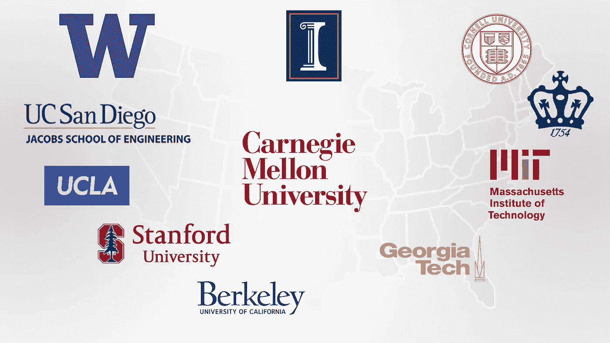
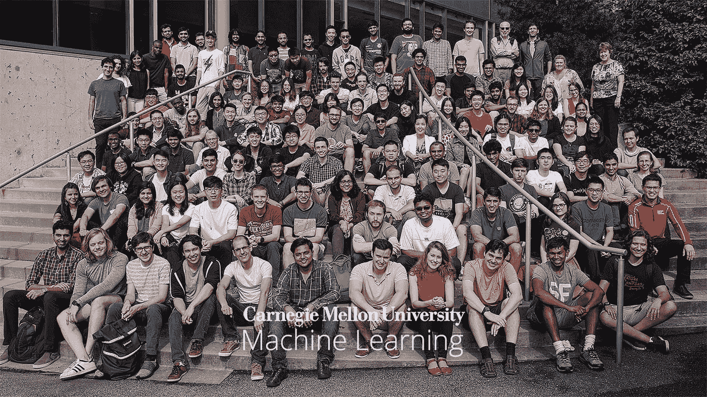
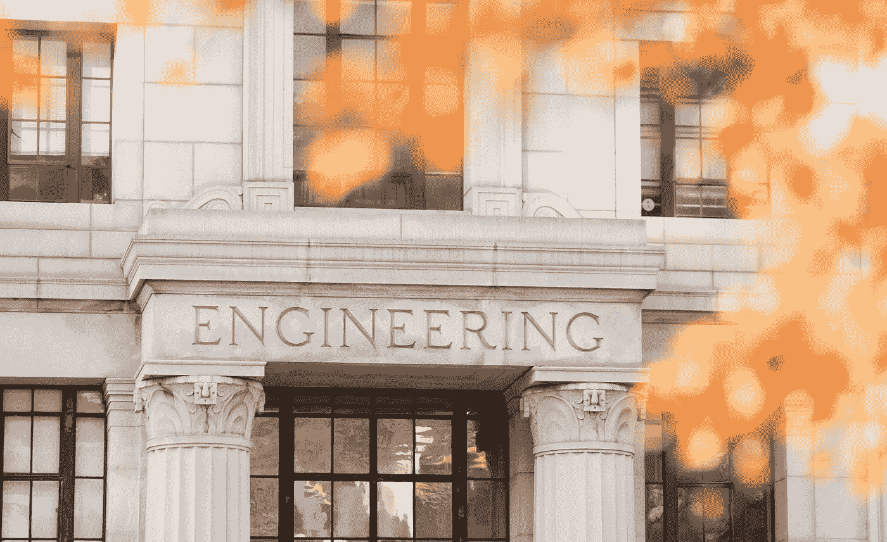
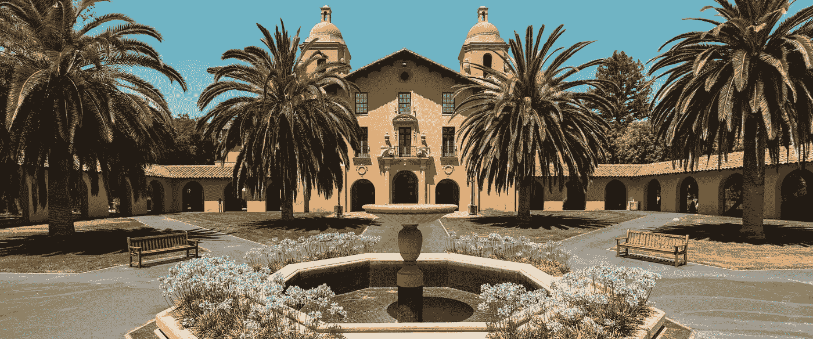
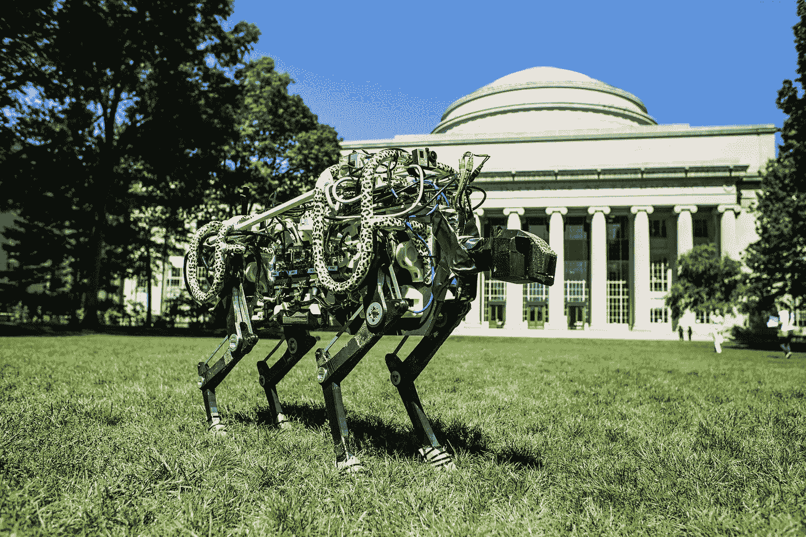
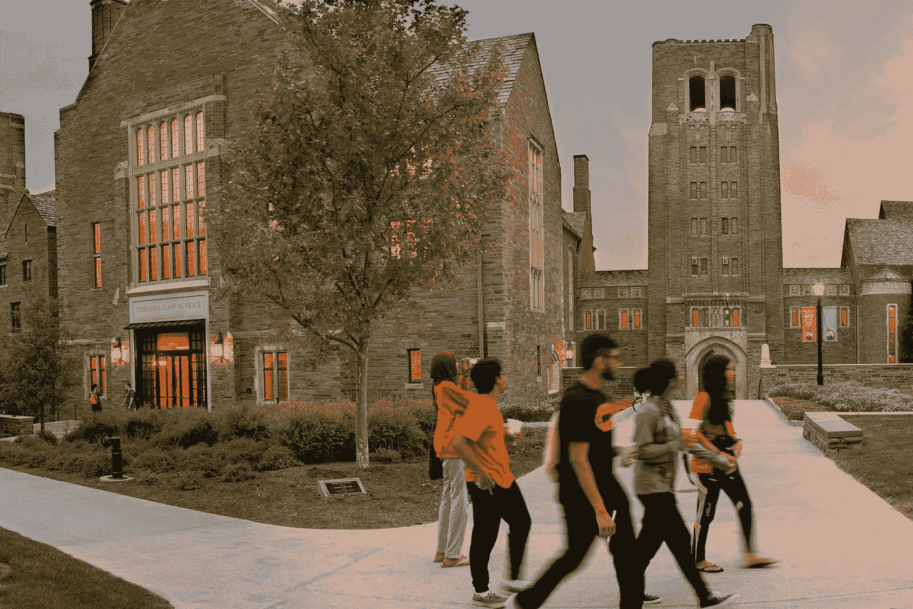
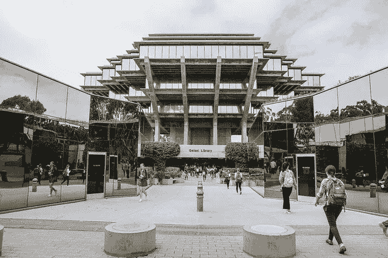
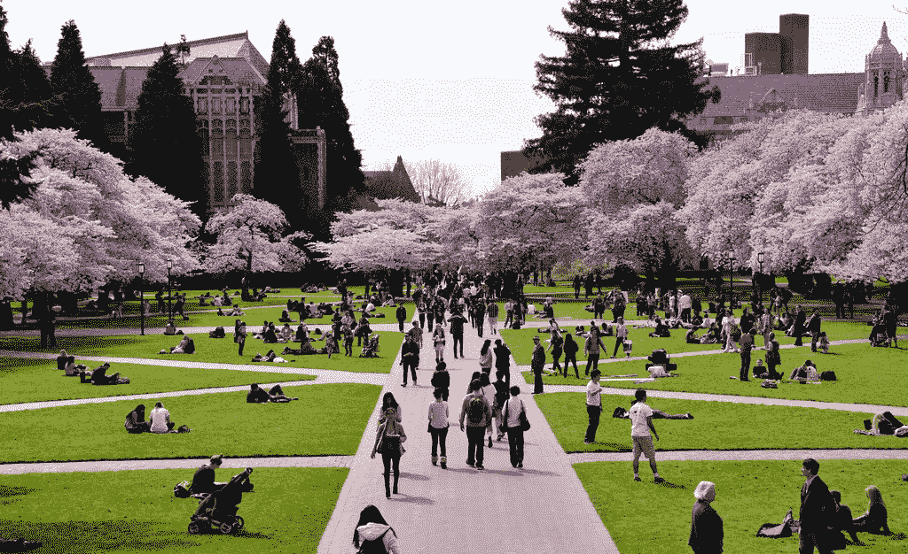
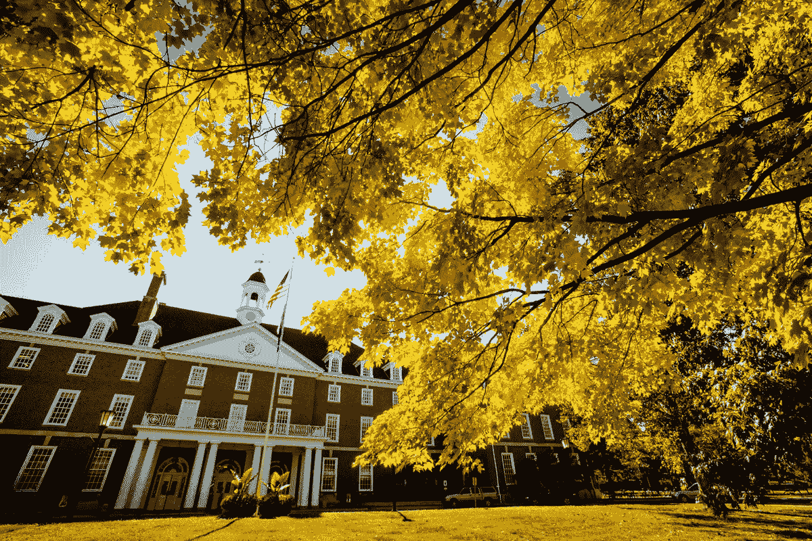

# 2022 年机器学习(ML)最佳硕士项目

> 原文：<https://pub.towardsai.net/best-universities-for-masters-programs-in-machine-learning-ml-ai-24f54ee755e6?source=collection_archive---------0----------------------->

来源:来源于 [Pixabay](https://pixabay.com/da/vectors/usa-kort-united-stater-af-amerika-35713/) 上的原创，用 Photoshop 创作。

## [择业](https://towardsai.net/p/category/careers)，[教育](https://towardsai.net/p/category/education)，[新闻](https://towardsai.net/p/category/news)，[机器学习](https://towardsai.net/p/category/machine-learning)

## 这些都是最好的攻读[机器学习](https://mld.ai/mldcmu)硕士学位的大学，在 AI 和机器学习研究方面的研究排名。

最后更新于 2022 年 1 月 1 日

 [## AI 社区↓走向 AI

### 与成千上万的数据领导者一起加入我们的 AI 社区。支持我们，与其他人工智能爱好者合作，参与…

community.towardsai.net](https://community.towardsai.net/) 

C 考虑到各种因素，如研究领域、研究重点、提供的课程、项目期限、大学位置、荣誉、奖励和就业前景，我们提出了最佳大学，以帮助您进行选择。这篇文章最适合那些想攻读机器学习硕士学位并需要一些决策指导的人。

如果你只是在找大学的名字，请随意跳到最后。

***注*** *:* *下面提到的大学排名不分先后。*

来源:[卡内基梅隆大学](https://mktg.best/9d0bf)

## 1. [**卡内基梅隆大学**](https://mktg.best/9d0bf)

**项目名称:**机器学习理学硕士
**机器学习研究排名:**1
**AI 研究排名:** 1
**时长** : 9 个月到 2 年
**地点**:宾夕法尼亚州匹兹堡
**核心课程:**高级机器学习、统计学、研究、统计机器学习、数据分析、人工智能、数据科学。
**可用曲目**:机器学习理学硕士、机器学习五年级硕士、机器学习二年级理学硕士、计算数据科学硕士、计算机科学理学硕士。
**关注领域**:机器学习、人工智能、自然语言处理、计算机视觉、机器人技术、深度学习、数据挖掘、网络和信息检索、计算机科学等。

[**联系 CMU 机器学习部**](https://mktg.best/9d0bf) **。**

来源:[加州大学伯克利分校](https://engineering.berkeley.edu/)

## 2.[加州大学伯克利分校](https://mktg.best/-17zl)

**项目名称:**数据科学硕士、EECS 硕士
**机器学习研究排名:**2
**AI 研究排名:** 15
**持续时间**:1–2.5 年以上
**地点**:加州柏克莱
**核心课程:**研究设计、数据工程、机器学习、数据挖掘、伦理与隐私、数据可视化、计算机科学
**可用曲目**:数据科学硕士，EECS 重点机器学习硕士。
**关注领域**:机器学习、人工智能、NLP、计算机视觉、深度学习、数据挖掘、web 和信息检索等。

[**联系加州大学伯克利分校**](https://mktg.best/1qaz3) **。**

来源:[斯坦福大学](https://news.stanford.edu/2020/08/25/stanfords-long-range-vision-accelerating-university-impact/)

## 3.[斯坦福大学](https://mktg.best/mejob)

**项目名称:**计算机科学硕士
**机器学习研究排名:**3
**AI 研究排名:** 3
**持续时间**:1-2 年以上
**地点**:加州斯坦福
**核心课程**:数学与理论基础、计算机系统、应用、研究、人工智能。
**可用曲目**:计算机科学硕士，重点研究机器学习。
**关注领域**:计算机科学、机器学习、人工智能、自然语言处理、计算机视觉、深度学习、数据挖掘、web 和信息检索等。

[**联系斯坦福工程**](https://mktg.best/qhb7-) **。**

来源:[麻省理工](https://news.mit.edu/sites/default/files/download/201409/MIT-Cheetah-05-press.jpg)

## 4.[麻省理工学院](https://mktg.best/5sit7)

**项目名称:**EECS 理科硕士
**机器学习领域研究排名:**4
**AI 领域研究排名:** 5
**持续时间**:1–2+年
**地点**:马萨诸塞州剑桥
**核心课程**:计算机体系结构与逻辑设计、计算机科学、高级数学、电气工程基础、人工智能。
**可用曲目**:专注机器学习的 EECS 硕士。
**关注领域**:机器学习、人工智能、NLP、计算机视觉、深度学习、数据挖掘、web 和信息检索等。

[**联系麻省理工学院 EECS**](https://mktg.best/5xzp4) **。**

来源:[康奈尔大学](https://www.overview.law.cornell.edu/)

## 5.[康奈尔大学](https://mktg.best/ap3bg)

**项目名称:**计算机科学硕士
**机器学习研究排名:**5
**AI 研究排名:** 2
**时长**:1–2 年以上
**地点**:纽约州伊萨卡
**核心课程**:数学与理论基础、计算机系统、应用、研究、人工智能。
**可用曲目**:计算机科学硕士。
**关注领域**:人工智能、机器学习、计算机科学、编程语言和逻辑、科学计算和应用、系统、理论和计算。

[**联系科内尔工程**](https://mktg.best/ystoc) **。**

资料来源: [UCSD](https://ucsdnews.ucsd.edu/pressrelease/u.s-news-world-report-ranks-uc-san-diego-top-10-in-the-nation)

## 6.[加州大学圣地亚哥分校](https://mktg.best/nlnip)

**项目名称:**计算机科学硕士
**机器学习研究排名:**6
**AI 研究排名:** 12
**期限** : 1 至 2 年以上
**地点**:加州圣地亚哥
**核心课程:**计算机体系结构与逻辑设计、计算机科学、高级数学、电气工程、人工智能、机器学习。
**赛道可用**:计算机科学硕士。
**关注领域**:机器学习、人工智能、NLP、计算机视觉、深度学习、数据挖掘、web 和信息检索等。

[**联系 UCSD**](https://mktg.best/1pk-z) **。**

来源:[佐治亚理工](https://www.gatech.edu/about)

## 7.[佐治亚理工学院](https://mktg.best/33gws)

**项目名称:**计算机科学硕士
**机器学习研究排名:**6
**AI 研究排名:** 13
**课程时长** : 1 至 2 年+年
**地点**:佐治亚州亚特兰大
**核心课程:**高级机器学习、统计学、研究、统计机器学习、数据分析、人工智能。
**可供选择的课程**:计算机科学硕士，专攻机器学习。
**关注领域**:机器学习、人工智能、自然语言处理、计算机视觉、深度学习、数据挖掘、web 和信息检索、计算机科学等。

[**联系佐治亚理工**](https://mktg.best/ggsqb) **。**

来源:[华盛顿大学](https://www.washington.edu/studyabroad/visitingexchange/)

## 8.[华盛顿大学](https://mktg.best/mfw2y)

**项目名称:**计算机科学硕士，数据科学硕士。
**机器学习中的研究排名:**7
**AI 中的研究排名:** 6
**持续时间** : 1 至 2+年
**地点**:华盛顿州西雅图
**核心课程:**计算机体系结构与逻辑设计、计算机科学、高级数学、电气工程基础、人工智能、数据科学、机器学习、应用机器学习、统计分析。
**可用曲目**:计算机科学硕士，数据科学硕士。
**关注领域**:机器学习、人工智能、NLP、计算机视觉、深度学习、数据挖掘、web 和信息检索等。

[**联系华盛顿大学**](https://mktg.best/gbofl) **。**

来源:[加州大学洛杉矶分校](https://www.ucla.edu/)

## 9.[加州大学洛杉矶分校](https://mktg.best/vu9av)

**项目名称:**计算机科学硕士
**机器学习研究排名:**8
**AI 研究排名:** 7
**持续时间** : 1 至 2 年以上
**地点**:美国加州洛杉矶
**核心课程:**计算机体系结构与逻辑设计、计算机科学、高级数学、电气工程、人工智能、机器学习。
**可用曲目**:计算机科学理学硕士。
**关注领域**:机器学习、人工智能、自然语言处理、计算机视觉、深度学习、数据挖掘、web 和信息检索等。

[**联系 UCLA**](https://mktg.best/vu9av) **。**

来源: [UIUC](https://news.illinois.edu/view/6367/643491)

## 10.[伊利诺伊大学香槟分校(UIUC)](https://mktg.best/2hmvo)

**项目名称:**计算机科学硕士
**机器学习研究排名:**9
**AI 研究排名:** 4
**课程时长** : 1 至 2 年以上
**地点**:伊利诺伊州尚佩恩
**核心课程**:计算机体系结构与逻辑设计、计算机科学、高级数学、电气工程、人工智能、机器学习。
**可用曲目**:计算机科学硕士。
**关注领域**:机器学习、人工智能、NLP、计算机视觉、深度学习、数据挖掘、web 和信息检索等。

[**联系 UIUC**](https://mktg.best/nfpvp) **。**

来源:[哥伦比亚大学](https://secretary.columbia.edu/)

## 11.[哥伦比亚大学](https://mktg.best/sya9w)

**项目名称:**计算机科学理学硕士
**机器学习研究排名:**10
**AI 研究排名:** 12
**持续时间** : 1 至 2 年以上
**地点**:纽约市
**核心课程**:计算机体系结构与逻辑设计、计算机科学、高级数学、电气工程基础、人工智能。
**可用曲目**:计算机科学理学硕士。
**关注领域**:计算生物学、计算机安全、计算机科学基础、机器学习、NLP、网络系统、软件系统、视觉、图形与机器人、人工智能、理论。

[**联系哥伦比亚大学**](https://mktg.best/2j6dq) **。**

> 📚查看我们对[最佳机器学习书籍](https://towardsai.net/p/machine-learning/best-machine-learning-books-free-and-paid-ml-book-recommendations-40c9ab30b0c)的编辑推荐。📚

总而言之，我们列出了机器学习领域的硕士课程的最佳大学:

1.  **卡内基梅隆大学**
2.  **加州大学伯克利分校**
3.  **斯坦福大学**
4.  **麻省理工学院**
5.  **康奈尔大学**
6.  **加州大学圣地亚哥分校**
7.  **佐治亚理工学院**
8.  **华盛顿大学**
9.  **加州大学洛杉矶分校**
10.  **伊利诺伊大学香槟分校**
11.  **哥伦比亚大学**

*如果有什么可能需要重温或改进的地方，请发* [***邮件给我们***](mailto:pub@towardsai.net) *。*

# 参考

[1]美国新闻与世界报道，大学排名，[https://www.usnews.com/best-colleges](https://www.usnews.com/best-graduate-schools/top-science-schools/artificial-intelligence-rankings)

[2] CSRankings:计算机科学排名，机器学习&数据挖掘，[http://csrankings.org/#/index?mlmining](http://csrankings.org/#/index?mlmining)

[3] CSRankings:计算机科学排名，人工智能，[http://csrankings.org/#/index?ai](http://csrankings.org/#/index?ai)

[4]美国新闻与世界报道，最佳研究生院，顶级科学学院，人工智能排名，[https://www . US News . com/Best-Graduate-Schools/Top-Science-Schools/computer-Science-Rankings](https://www.usnews.com/best-graduate-schools/top-science-schools/computer-science-rankings)

[5] CSRankings: AI，CV，ML，数据挖掘，NLP，Web 信息与检索，【http://csrankings.org/#/index?ai】T4&视觉& mlmining & nlp & ir

[6]谷歌大学搜索排名，[https://mktg.best/c0hwy](https://mktg.best/c0hwy)