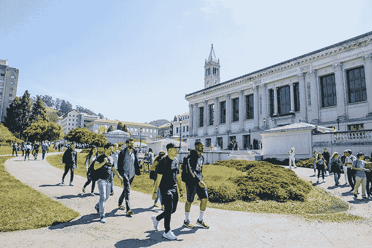
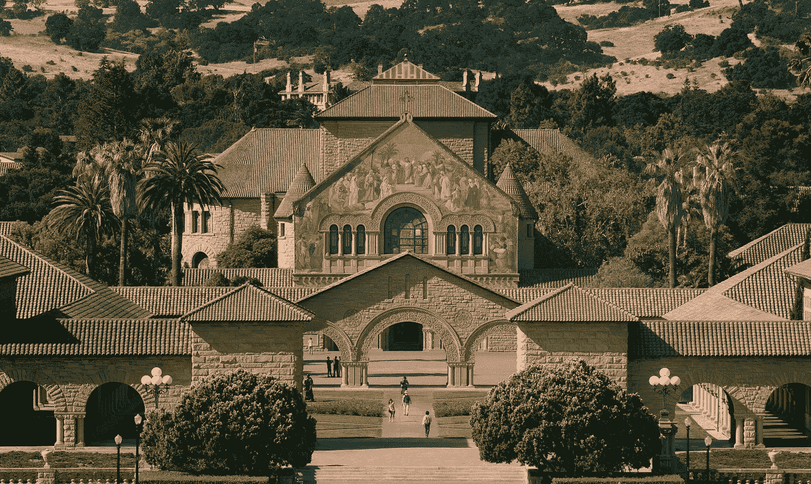
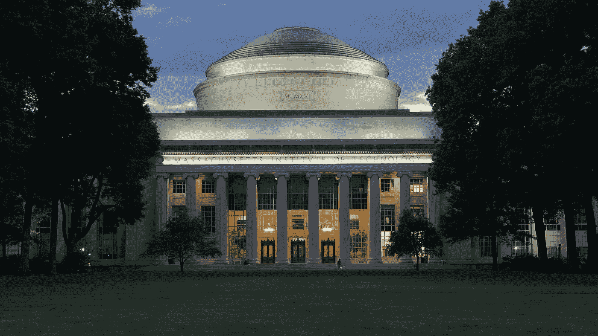
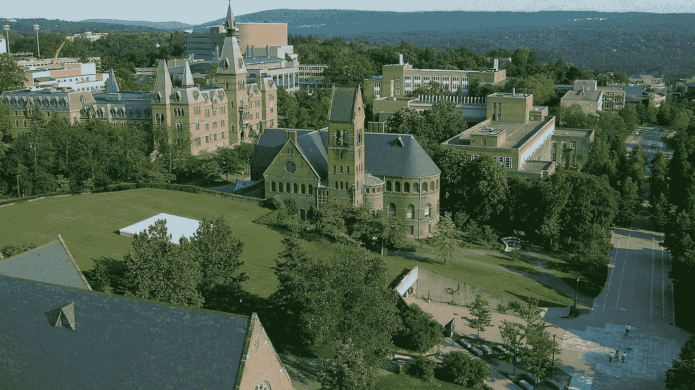
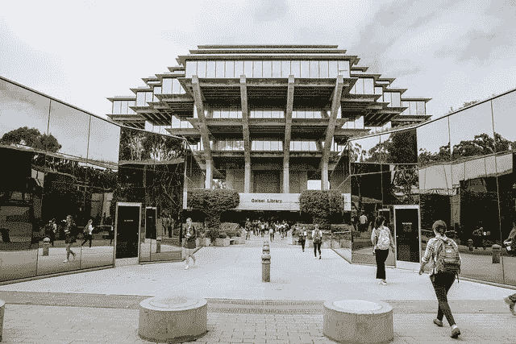
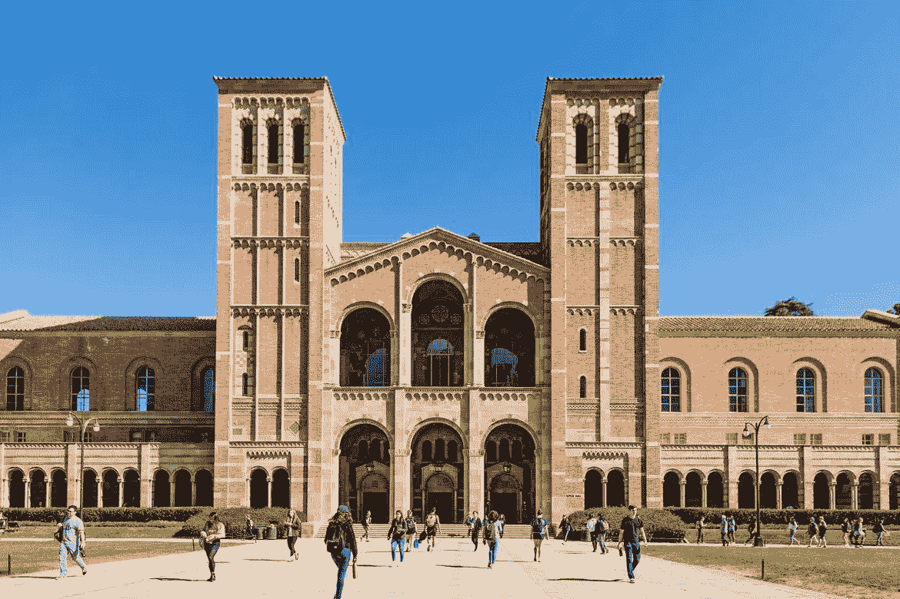
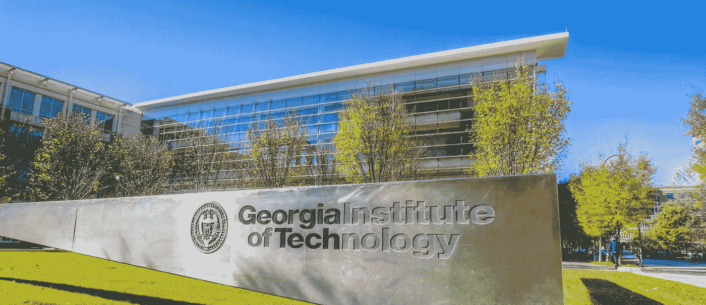
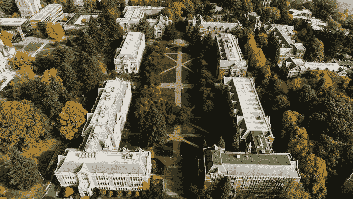

# 2022 年最佳机器学习博士项目

> 原文：<https://pub.towardsai.net/best-universities-to-pursue-a-phd-in-machine-learning-ml-academic-program-8fa31eee3b6d?source=collection_archive---------1----------------------->

来源:来源于 [Pixabay](https://pixabay.com/da/vectors/usa-kort-united-stater-af-amerika-35713/) 上的原作，用 photoshop 创作。

## [择业](https://towardsai.net/p/category/careers)，[教育](https://towardsai.net/p/category/education)，[新闻](https://towardsai.net/p/category/news)，[机器学习](https://towardsai.net/p/category/machine-learning)

## 这些是攻读机器学习博士的最好的大学，在 AI 和机器学习研究方面有研究排名。

最后更新于 2022 年 1 月 1 日

 [## AI 社区↓走向 AI

### 与成千上万的数据领导者一起加入我们的 AI 社区。支持我们，与其他人工智能爱好者合作，参与…

community.towardsai.net](https://community.towardsai.net/) 

考虑到各种因素，如研究领域、研究重点、提供的课程、项目期限、大学位置、荣誉、奖励和就业前景，我们提出了最佳大学，以帮助未来的学生选择。这篇文章最适合那些想攻读博士学位，专注于机器学习，并需要一些决策指导的人。

关于这些大学的名单，请在文章的最后跳转。

***注*** *:* *下面提到的大学排名不分先后。*

> 📚查看我们的[简单线性回归](https://towardsai.net/p/machine-learning/calculating-simple-linear-regression-and-linear-best-fit-an-in-depth-tutorial-with-math-and-python-804a0cb23660)机器学习教程。📚

来源:[卡内基梅隆大学](https://mktg.best/u-mbs)

## 1.[卡内基梅隆大学](https://mktg.best/u-mbs)

**项目名称:**机器学习博士
**机器学习研究排名:**1
**AI 研究排名:** 1
**时长** : 4 到 5 年以上
**地点**:宾夕法尼亚州匹兹堡
**核心课程:**高级机器学习、统计学、研究、统计机器学习、数据分析、人工智能。
**可供选择的赛道**:机器学习博士、统计学与机器学习博士、机器学习与公共政策博士、神经计算与机器学习博士、计算机科学博士等。
**关注领域**:机器学习、人工智能、自然语言处理、计算机视觉、机器人技术、深度学习、数据挖掘、web 和信息检索等。

[**联系 CMU 机器学习部**](https://mktg.best/u-mbs) **。**

来源:[伯克利](https://news.berkeley.edu/2019/01/29/2019-application-numbers/)

## 2.[加州大学伯克利分校](https://mktg.best/t-2dq)

**项目名称:**EECS 博士
**机器学习方面的研究排名:**2
**AI 方面的研究排名:** 12
**时长** : 5 到 6 年以上
**地点**:加州伯克利
**核心课程:**计算机体系结构与逻辑设计、计算机科学、高级数学、电气工程基础、人工智能。
**可用曲目**:EECS 博士。
**关注领域**:机器学习、人工智能、NLP、计算机视觉、深度学习、数据挖掘、web 和信息检索等。

[**联系加州大学伯克利分校的 EECS**](https://mktg.best/wn-f2)**。**

来源:[斯坦福大学](https://www-csli.stanford.edu/)

## 3.[斯坦福大学](https://mktg.best/bp799)

**项目名称:**计算机科学博士
**机器学习研究排名:**3
**AI 研究排名:** 3
**时长** : 4 到 6 年以上
**地点**:加州斯坦福
**核心课程**:数学与理论基础、计算机系统、应用、研究、人工智能。
**可用曲目**:计算机科学博士。
**关注领域**:机器学习、人工智能、自然语言处理、计算机视觉、深度学习、数据挖掘、web 和信息检索等。

[**联系斯坦福工程**](https://mktg.best/hnyw8) **。**

来源:[麻省理工](https://news.mit.edu/2018/mit-reshapes-itself-stephen-schwarzman-college-of-computing-1015)

## 4.[麻省理工学院](https://mktg.best/8r1lp)

**项目名称:**EECS 博士
**机器学习方面的研究排名:**4
**AI 方面的研究排名:** 5
**持续时间**:4–6+年
**地点**:马萨诸塞州剑桥
**核心课程**:计算机体系结构与逻辑设计、计算机科学、高级数学、电气工程基础、人工智能。
**可用曲目**:计算机科学博士。
**关注领域**:机器学习、人工智能、NLP、计算机视觉、深度学习、数据挖掘、web 和信息检索等。

[**联系麻省理工学院 EECS**](https://mktg.best/eppbk) **。**

资料来源:康奈尔大学

## 5.[康奈尔大学](https://mktg.best/no1oz)

**项目名称:**计算机科学博士
**机器学习研究排名:**5
**AI 研究排名:** 2
**持续时间** : 4 到 6 年以上
**地点**:纽约州伊萨卡
**核心课程**:数学与理论基础、计算机系统、应用、研究、人工智能。
**可用曲目**:计算机科学博士。
**关注领域**:机器学习、人工智能、自然语言处理、计算机视觉、深度学习、数据挖掘、web 和信息检索等。

[**联系科内尔工程**](https://mktg.best/pkrt3) **。**

资料来源: [UCSD](https://ucsdnews.ucsd.edu/pressrelease/u.s-news-world-report-ranks-uc-san-diego-top-10-in-the-nation)

## 6.[加州大学圣地亚哥分校](https://mktg.best/nlnip)

**项目名称:**计算机科学博士
**机器学习研究排名:**6
**AI 研究排名:** 12
**持续时间** : 4 到 6 年以上
**地点**:加州圣地亚哥
**核心课程:**计算机体系结构与逻辑设计、计算机科学、高级数学、电气工程、人工智能、机器学习。
**赛道可用**:计算机科学博士。
**关注领域**:机器学习、人工智能、NLP、计算机视觉、深度学习、数据挖掘、web 和信息检索等。

[**联系 UCSD**](https://mktg.best/1pk-z) **。**

来源: [UIUC](https://linguistics.illinois.edu/languages/english-placement-test-ept)

## 7.[伊利诺伊大学香槟分校(UIUC)](https://mktg.best/40van)

**项目名称:**计算机科学博士
**机器学习研究排名:**7
**AI 研究排名:** 4
**课程时长** : 4 至 6 年以上
**地点**:伊利诺伊州香槟
**核心课程**:计算机体系结构与逻辑设计、计算机科学、高级数学、电气工程、人工智能、机器学习。
**可用曲目**:计算机科学博士。
**关注领域**:机器学习、人工智能、自然语言处理、计算机视觉、深度学习、数据挖掘、web 和信息检索等。

[**联系 UIUC**](https://mktg.best/j64ty) **。**

来源:[加州大学洛杉矶分校](https://newsroom.ucla.edu/releases/ucla-named-no-1-u-s-public-institution-by-u-s-news-world-report-for-third-consecutive-year)

## 8.[加州大学洛杉矶分校](https://mktg.best/8oton)

**项目名称:**计算机科学博士
**机器学习研究排名:**8
**AI 研究排名:** 8
**时长** : 5 到 6 年以上
**地点**:美国加州洛杉矶
**核心课程:**计算机体系结构与逻辑设计、计算机科学、高级数学、电气工程基础、人工智能。
**可用曲目**:EECS 博士。
**关注领域**:机器学习、人工智能、NLP、计算机视觉、深度学习、数据挖掘、web 和信息检索等。

[联系加州大学洛杉矶分校。](https://mktg.best/ujtt6)

来源:[佐治亚理工](https://www.gatech.edu/about/visit)

## 9.[佐治亚理工学院](https://mktg.best/kwve7)

**项目名称:**机器学习博士
**机器学习研究排名:**9
**AI 研究排名:** 9
**课程时长** : 4 到 6 年以上
**地点**:佐治亚州亚特兰大
**核心课程:**高级机器学习、统计学、研究、统计机器学习、数据分析、人工智能。
**可供选择的赛道**:机器学习博士，算法、组合学、最优化博士，计算机科学博士，计算机科学与工程博士。
**关注领域**:机器学习、人工智能、自然语言处理、计算机视觉、深度学习、数据挖掘、web 和信息检索等。

[**联系佐治亚理工**](https://mktg.best/uavrg) **。**

来源:[华盛顿大学](https://art.washington.edu/news/2020/08/11/faculty-searches)

## 10.[华盛顿大学](https://mktg.best/oo6fd)

**项目名称:**计算机科学博士
**机器学习研究排名:**10
**AI 研究排名:** 6
**持续时间** : 4 到 6 年以上
**地点**:华盛顿州西雅图
**核心课程:**计算机体系结构与逻辑设计、计算机科学、高级数学、电气工程基础、人工智能、数据科学、机
**可用曲目**:计算机科学博士，数据科学博士。
**关注领域**:机器学习、人工智能、NLP、计算机视觉、深度学习、数据挖掘、web 和信息检索等。

[**联系华盛顿大学**](https://mktg.best/oo6fd) **。**

来源:[哥伦比亚大学](https://www.columbia.edu/content/admissions)

## 11.[哥伦比亚大学](https://mktg.best/y1lt1)

**项目名称:**计算机科学博士
**机器学习研究排名:**11
**AI 研究排名:** 16
**持续时间** : 4 到 6 年以上
**地点**:纽约市
**核心课程**:计算机体系结构与逻辑设计、计算机科学、高级数学、电气工程基础、人工智能。
**可用曲目**:计算机科学博士。
**关注领域**:机器学习、人工智能、自然语言处理、计算机视觉、深度学习、数据挖掘、web 和信息检索等。

[**联系哥伦比亚大学**](https://mktg.best/zn721) **。**

总而言之，我们列出了最好的博士大学，重点领域是机器学习，如下所示:

1.  **卡内基梅隆大学**
2.  **加州大学伯克利分校**
3.  **斯坦福大学**
4.  **麻省理工学院**
5.  **康奈尔大学**
6.  **加州大学圣地亚哥分校**
7.  **伊利诺伊大学香槟分校**
8.  **加州大学洛杉矶分校**
9.  **佐治亚理工学院**
10.  **华盛顿大学**
11.  **哥伦比亚大学**

*如果有什么可能需要重温或改进的地方，请发* [***邮件给我们***](mailto:pub@towardsai.net) *。*

# 参考

[1]美国新闻与世界报道，大学排名，[https://www.usnews.com/best-colleges](https://www.usnews.com/best-graduate-schools/top-science-schools/artificial-intelligence-rankings)

[2] CSRankings:计算机科学排名，机器学习&数据挖掘，[http://csrankings.org/#/index?mlmining](http://csrankings.org/#/index?mlmining)

[3] CSRankings:计算机科学排名，人工智能，[http://csrankings.org/#/index?ai](http://csrankings.org/#/index?ai)

[4]美国新闻与世界报道，最佳研究生院，顶级科学学院，人工智能排名，[https://www . US News . com/Best-Graduate-Schools/Top-Science-Schools/computer-Science-Rankings](https://www.usnews.com/best-graduate-schools/top-science-schools/computer-science-rankings)

[5] CSRankings: AI，CV，ML，数据挖掘，NLP，Web 信息与检索，【http://csrankings.org/#/index?ai】T2&视觉& mlmining & nlp & ir

[6]谷歌大学搜索排名，【https://mktg.best/c0hwy 