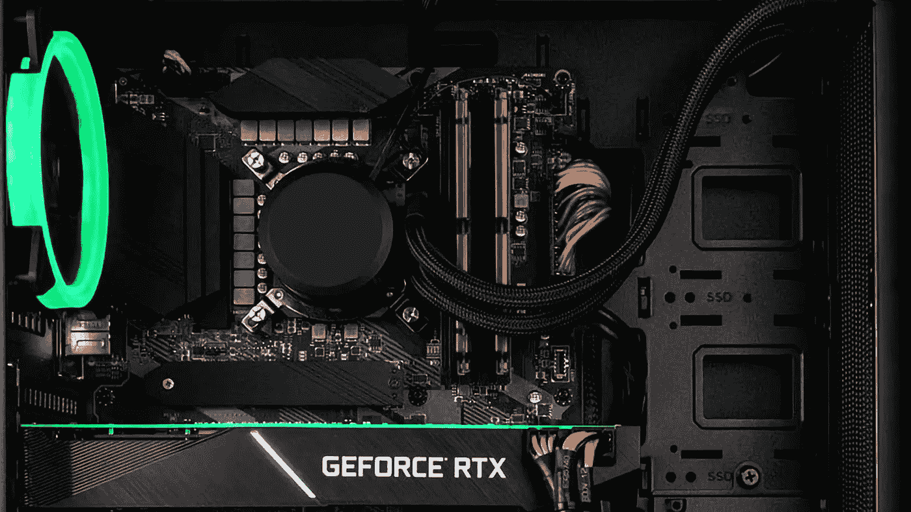
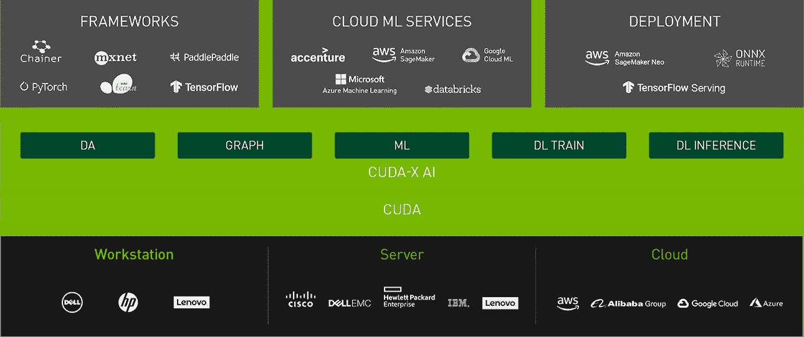
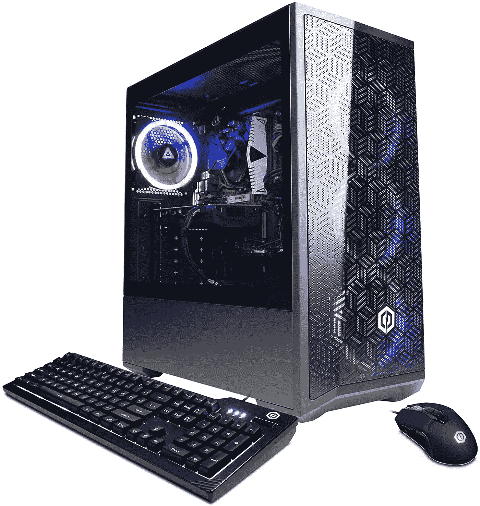
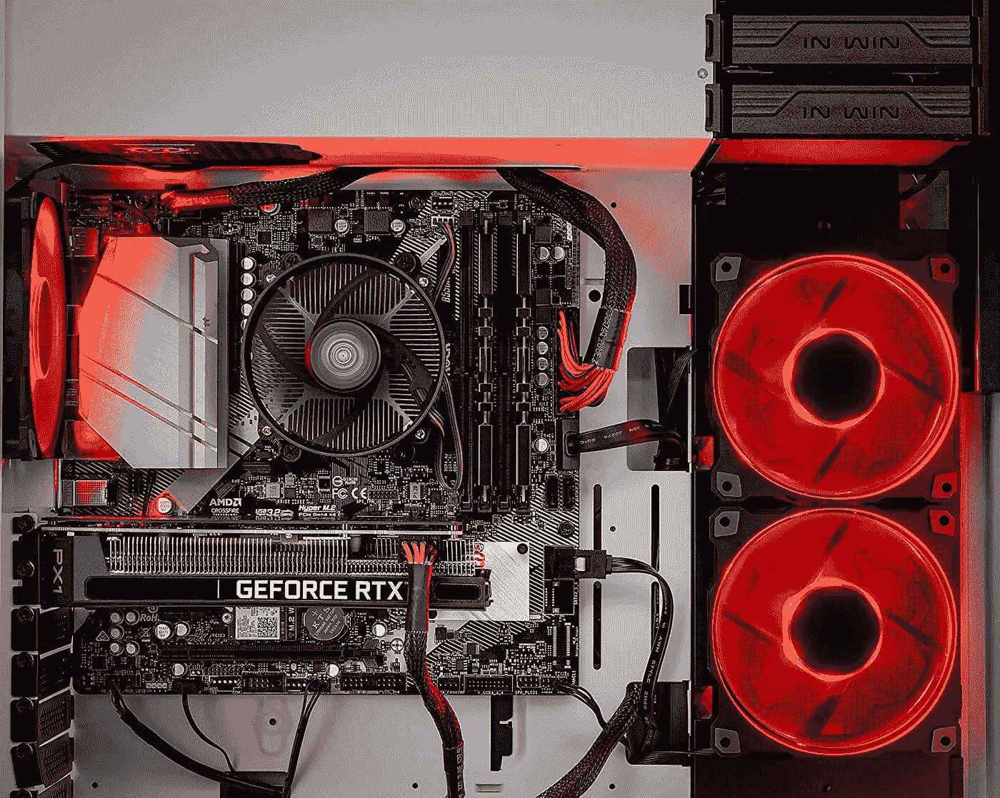
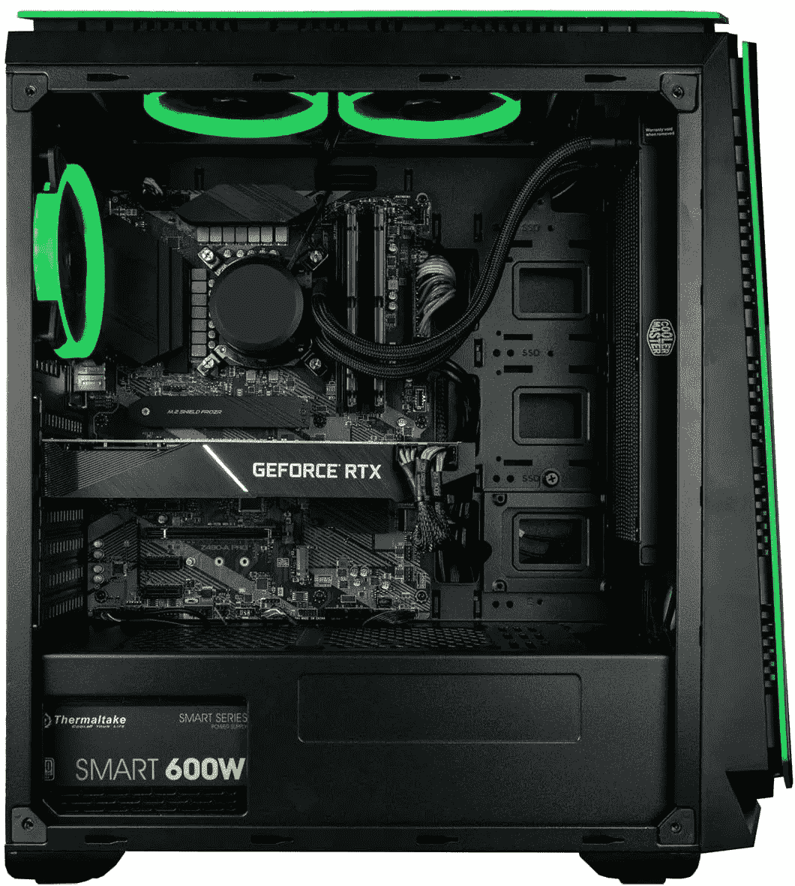
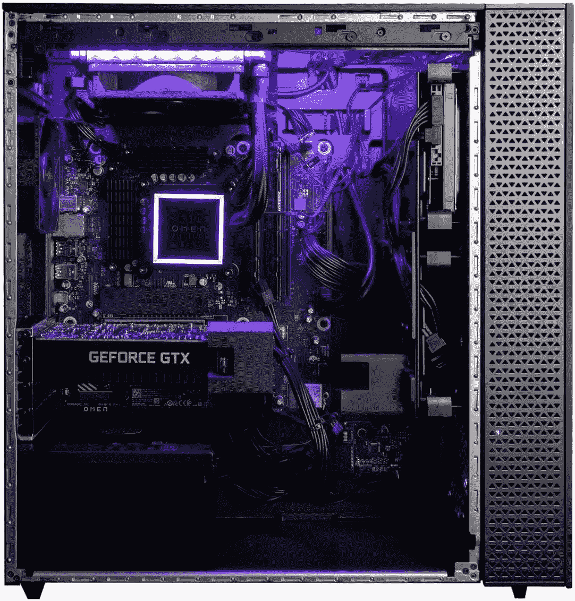
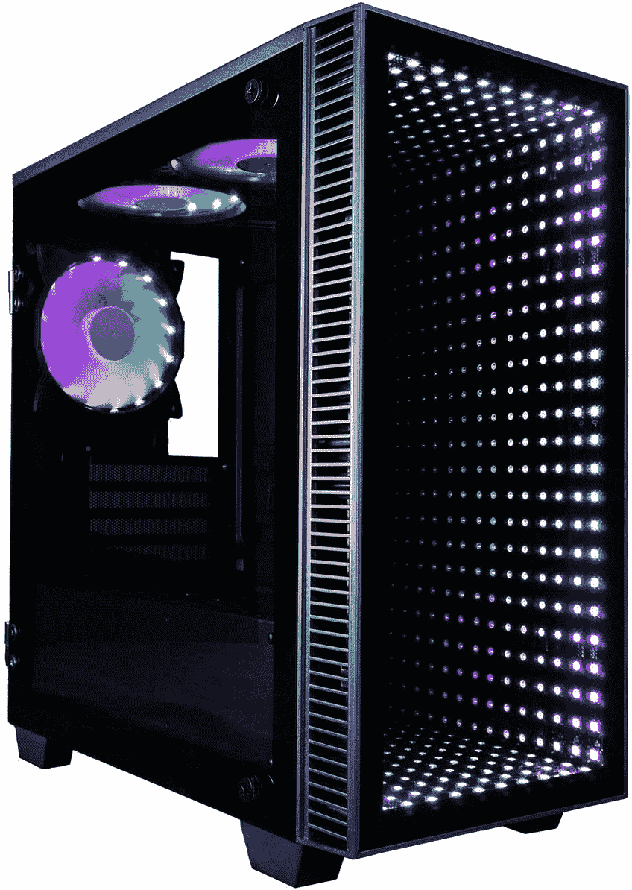

# 深度学习、数据科学和机器学习的最佳工作站(ML)

> 原文：<https://pub.towardsai.net/best-workstations-for-deep-learning-data-science-and-machine-learning-ml-for-2021-4a6e43213b9e?source=collection_archive---------0----------------------->

来源:图片由作者提供。

## [数据科学](https://towardsai.net/p/category/data-science)，[社论](https://towardsai.net/p/category/editorial)，[机器学习](https://towardsai.net/p/category/machine-learning)

## 是时候从你的电脑上释放人工智能的超级计算能力了。我们已经查看了 5000 多台台式机[ [1](https://www.amazon.com/s?k=rtx+64gb+desktop&ref=nb_sb_noss_2) ]，并挑选了我们认为最适合深度学习、[机器学习](https://towardsai.net/p/machine-learning/what-is-machine-learning-ml-b58162f97ec7) (ML)和数据科学的工作站。

最后更新于 2022 年 1 月 1 日

 [## 帮助将人工智能和技术初创公司扩展到企业|走向人工智能

### 《走向人工智能》每月通过我们的定制软件为数百万科技读者提供服务。我们拥有成千上万的人工智能和…

sponsors.towardsai.net](https://sponsors.towardsai.net/) 

建造或购买一台人工智能电脑的最大优势之一是你可以自己升级你认为合适的大部分组件。例如，如果您需要更多内存，可以从 16 GB 增加到 32 GB、64 GB、128 GB 等。—取决于您主板的限制。这同样适用于升级您的 GPU。例如，如果你的钻机有一个 RTX 3060，而 NVIDIA 在几年内推出了更新的 GPU，你可以轻松地交换它们，让你的钻机更加适应未来。

使用人工智能电脑而不是人工智能笔记本电脑的另一个相当大的优势是，你可以很好地执行更多耗电任务，而不必太担心人工智能装备的冷却能力。英伟达还为支持 CUDA 的桌面 GPU 提供了更多可能性，如 RTX AXXXX 系列和夸德罗 RTX 选项。你可以在 NVIDIA 开发者 的 [**这个列表中看到 AI 驱动的 GPU 的完整列表。**](https://developer.nvidia.com/cuda-gpus)

面向 AI 和 HPC 的 GPU 加速库|来源:NVIDIA [ [15](https://www.nvidia.com/en-us/technologies/cuda-x/) ]

但是购买人工智能 PC 装备也有缺点，例如，如果你经常旅行，你可能会发现购买一台 [**深度学习笔记本电脑**](https://towardsai.net/p/news/best-laptops-for-machine-learning-deep-learning-data-science-ml-f55602197593) 对你来说更方便，因为你将会进行大量的旅行，而且在大多数情况下，如果你购买一台合适的装备，你将能够在这两台电脑上很好地执行大多数人工智能相关的任务。

对于有更多预算和需求的数据领导者来说，同时拥有一个人工智能工作站和一台人工智能笔记本电脑将更有意义，因为它提供了灵活性，让您可以自由支配。而对于每一个你能想到的 AI 任务，包括在 TensorFlow、PyTorch、Jupyter、CUDA、cuDNN 等等中运行强大的模型。

我们继续收到大量来自人工智能爱好者的电子邮件，询问最好的人工智能装备。因此，我们列出了人工智能项目的最佳电脑名单。如果你有任何建议要添加到列表中，请通过 pub@towardsai.net 与我们联系——我们将更新这篇文章，因为我们会推出更新更好的人工智能工作站来满足你的每一个需求。

*披露:我们在《走向人工智能》的编辑团队撰写真实可信的评论，并可能在我们选择支持走向人工智能的产品上获得少量报酬。就本文而言，作为亚马逊的合作伙伴，oriented AI 可能会从合格的购买中获得一小笔佣金(买家无需支付额外费用)。有关反馈、问题或顾虑，请发送电子邮件至*[*pub@towardsai.net*](mailto:pub@towardsai.net)*。*

> 📚查看我们编辑推荐的最佳[深度学习笔记本电脑](https://towardsai.net/p/news/best-laptops-for-machine-learning-deep-learning-data-science-ml-f55602197593)。📚

# 我们开始吧！

# 预算低于 1000.00 美元

在中等预算的人工智能电脑中，你需要寻找一种处理器来处理复杂的操作，比如 Jupyter 笔记本电脑。英特尔建议使用 i3 至 i5，介于 10x 至 11x F 或 K 系列之间，即英特尔酷睿 i5–11400 F。F 和 K 系列处理器没有集成 GPU，它们可以胜任大多数人工智能任务。除了英特尔 CPU 之外，我们还建议看看 AMD CPUs，因为据报道，它们在更经济的价格预算中表现类似。

来源:[亚马逊](https://amzn.to/3cxmmEL)

## CyberpowerPC

> ***1k 美元以下最佳 PC。*** *非常适合那些关注英特尔处理器、合适的 RAM 大小、合理的可扩展性以及预算在 1k 美元以下的 RTX GPU 的数据领导者。*

**规格:**

*   处理器:英特尔酷睿 i5–11400 f，最高 4.5 GHz。
*   内存:8 GB DDR4。
*   硬盘:500 GB NVMe 固态硬盘。
*   GPU:英伟达 GeForce RTX 2060 6 GB。
*   计算能力:7.5 [ [9](https://developer.nvidia.com/cuda-gpus) ]
*   端口:1 个 HDMI 2.0、1 个 USB 3.1 Type-C、2 个 USB 3.1、1 个 USB 2.0。
*   OS: Windows 11 Home。
*   连接:WiFi 802.11ax，千兆局域网(以太网)，蓝牙。

在 [**亚马逊**](https://amzn.to/3cxmmEL) 上抢一个

# 预算约为 1500 美元

如果你能稍微扩展一下你的预算，我们强烈建议你购买一台 RTX 30x 电脑，并且让你的装备更加经得起未来的考验。比如这本 [**亚马逊畅销书**](https://amzn.to/3oR2Okm) :

来源:[亚马逊](https://amzn.to/3oR2Okm)

## [Skytech Shiva](https://amzn.to/3oR2Okm)

> ***约 1.5k 美元的最佳 PC。****非常适合关心 AMD 处理器、合适的 RAM 大小、RTX 30x GPU 和大量可扩展性的数据领导者。*

**规格:**

*   处理器:AMD 锐龙 5600X 3.7GHz
*   内存:16 GB DDR4。
*   硬盘:1 TB NVMe 固态硬盘。
*   GPU:英伟达 GeForce RTX 3060 Ti 8GB。
*   计算能力:8.6 [ [9](https://developer.nvidia.com/cuda-gpus)
*   端口:1 个 HDMI 2.0、1 个 USB 3.1 Type-C、2 个 USB 3.1、1 个 USB 2.0。
*   OS: Windows 11 Home。
*   连接:WiFi 802.11ax，千兆局域网(以太网)，蓝牙。
*   电源:600w

在 [**亚马逊**](https://amzn.to/3oR2Okm) 上抢一个

# 预算约为 2000.00 美元

来源:[亚马逊](https://amzn.to/3oNPNbn)

## [CUK 螳螂](https://amzn.to/3oNPNbn)

> ***约 2k 美元的最佳 PC。*** *看看这种美感，可扩展性，主板，液体冷却-它让我们惊叹不已这款人工智能设备非常适合那些关心未来的人工智能电脑，希望获得最好的处理器、大内存、可扩展性和 RTX 30x GPU 的数据领导者。如果你想用一个* ***更好的 GPU，但有点少 RAM*** *，看看这个*[***SkyTech AI rig***](https://amzn.to/3FyS7tB)*，提供一个 RTX 3070 Ti，但有 16GB 的 RAM。*

**规格:**

*   处理器:英特尔酷睿 i9 K-
*   内存:32 GB DDR4。
*   硬盘:512 GB NVMe 固态硬盘+ 2 TB 硬盘。
*   GPU:英伟达 GeForce RTX 3060 Ti 12GB。
*   计算能力:8.6 [ [9](https://developer.nvidia.com/cuda-gpus)
*   端口:1 个 HDMI 2.0、1 个 USB 3.1 Type-C、2 个 USB 3.1、1 个 USB 2.0。
*   OS: Windows 11 Home。
*   连接:WiFi 802.11ax，千兆局域网(以太网)，蓝牙。
*   电源:600w

在 [**亚马逊**](https://amzn.to/3oNPNbn) 上抢一个

# 预算约 3000 美元

来源:[亚马逊](https://amzn.to/2Z7x2qw)

## [CUK 预兆 30L](https://amzn.to/2Z7x2qw)

> ***3k 以下最好的 PC。*** *漂亮的 AI rig，这款 AI PC 是想要最好的处理器、大 RAM、可扩展性、RTX 3070 GPU 和大电源的数据领导者的理想选择。*

**规格:**

*   处理器:英特尔酷睿 i9 10900KF。
*   内存:32 GB DDR4。
*   硬盘:1 TB NVMe 固态硬盘+ 2 TB 硬盘。
*   GPU:英伟达 GeForce RTX 3070 8GB。
*   计算能力:8.6 [ [9](https://developer.nvidia.com/cuda-gpus)
*   端口:1 个 HDMI 2.0、1 个 USB 3.1 Type-C、2 个 USB 3.1、1 个 USB 2.0。
*   OS: Windows 11 Home。
*   连接:WiFi 802.11ax，千兆局域网(以太网)，蓝牙。
*   电源:750w

在[上抢一个**亚马逊**上抢一个](https://amzn.to/2Z7x2qw)

# 怪物人工智能钻机-无限的预算！

来源:[亚马逊](https://amzn.to/3CEx7zy)

## [CUK 连续统](https://amzn.to/3CEx7zy)

> ***【Tie】最佳 AI 工作站。*** *漂亮的 AI rig，这款 AI PC 是想要最好的东西但倾向于 AMD 处理器的数据领导者的理想选择。*

**规格:**

*   处理器:AMD 9 5950X 3.4GHz 至 4.9GHz
*   内存:64 GB DDR4。
*   硬盘:1 TB NVMe 固态硬盘+ 3 TB 硬盘。
*   GPU:英伟达 GeForce RTX 3090 24GB。
*   计算能力:7.5 [ [9](https://developer.nvidia.com/cuda-gpus)
*   端口:1 个 HDMI 2.0、1 个 USB 3.1 Type-C、2 个 USB 3.1、1 个 USB 2.0。
*   OS: Windows 11 Home。
*   连接:WiFi 802.11ax，千兆局域网(以太网)，蓝牙。
*   电源:750w

在[上抢一个**亚马逊**](https://amzn.to/3CEx7zy)

来源:[亚马逊](https://amzn.to/2Z9o3Fr)

## [CUK 螳螂](https://amzn.to/2Z9o3Fr)

> ***【Tie】最佳 AI 工作站。*** *漂亮的人工智能平台，这款人工智能电脑是想要最好的东西，但倾向于英特尔处理器和超大电源的数据领导者的理想选择。这款 AI 工作站是我们$ ~* [***2k 推荐***](https://amzn.to/3oNPNbn) *的顶级之作。*

**规格:**

*   处理器:AMD 9 5950X 3.4GHz 至 4.9GHz
*   内存:64 GB DDR4。
*   硬盘:1 TB NVMe 固态硬盘+ 2 TB 硬盘。
*   GPU:英伟达 GeForce RTX 3090 24GB。
*   计算能力:7.5 [ [9](https://developer.nvidia.com/cuda-gpus)
*   端口:1 个 HDMI 2.0、1 个 USB 3.1 Type-C、2 个 USB 3.1、1 个 USB 2.0。
*   OS: Windows 11 Home。
*   连接:WiFi 802.11ax，千兆局域网(以太网)，蓝牙。
*   电源:850w

在 [**亚马逊**](https://amzn.to/2Z9o3Fr) 上抢一个

# 结论

我们希望你会发现这个列表有助于搜索用于深度学习、机器学习和数据科学项目的人工智能工作站。如果你遇到任何非凡的人工智能工作站，比如这个列表中提到的那些，请通过给我们发电子邮件让我们知道。如果，你不想买一台 AI 台式机，而是想造一台， [**敬请期待**](https://towardsai.net/subscribe) 。我们将发布一份新的推荐列表，列出为您的人工智能工作站购买的最佳组件。

我们也很乐意向我们的读者展示如何建立一个端到端的人工智能装备。因此，如果你代表一家供应商，并希望 [**赞助**](https://sponsors.towardsai.net) 一个即将到来的教程，向我们的观众展示如何建立一个人工智能装备， [**，请随时联系我们**](mailto:pub@towardsai.net) 。

感谢您的阅读！

 [## 加入我们吧↓ |面向人工智能成员|人工智能社区

### 加入人工智能，成为会员，你将不仅支持人工智能，但你将有机会…

members.towardsai.net](https://members.towardsai.net/)  [## 店铺↓ |走向 AI

### 全球领先的人工智能&科技新闻&传媒公司

towardsai.net](https://towardsai.net/shop)  [## 帮助将人工智能和技术初创公司扩展到企业|走向人工智能

### 《走向人工智能》每月通过我们的定制软件为数百万科技读者提供服务。我们拥有成千上万的人工智能和…

sponsors.towardsai.net](https://sponsors.towardsai.net) 

# 参考

[1]亚马逊的 RTX Performance AI Rigs，[https://www.amazon.com/s?k=rtx+64gb+desktop&ref = nb _ sb _ noss _ 2](https://www.amazon.com/s?k=rtx+64gb+desktop&ref=nb_sb_noss_2)

[2]英特尔 10750H Q2 2020，英特尔，[https://www . Intel . com/content/www/us/en/products/processors/core/i7-processors/i7-10750h . html](https://www.intel.com/content/www/us/en/products/processors/core/i7-processors/i7-10750h.html)

[3]英特尔 9750H，英特尔，[https://www . Intel . com/content/www/us/en/products/processors/core/i7-processors/i7-9750h . html](https://www.intel.com/content/www/us/en/products/processors/core/i7-processors/i7-9750h.html)

[4]https://www.amd.com/en/products/apu/amd-ryzen-7-4800h AMD 锐龙 7 7800H，

[5]英特尔 10980 HK，英特尔，[https://ark . Intel . com/content/www/us/en/ark/products/201838/Intel-core-i9-10980 HK-processor-16m-cache-up-to-5-30-GHz . html](https://ark.intel.com/content/www/us/en/ark/products/201838/intel-core-i9-10980hk-processor-16m-cache-up-to-5-30-ghz.html)

[6]英特尔 10875 HK。英特尔，[https://ark . Intel . com/content/www/us/en/ark/products/202329/Intel-core-i7-10875h-处理器-16m-cache-up-to-5-10-GHz . html](https://ark.intel.com/content/www/us/en/ark/products/202329/intel-core-i7-10875h-processor-16m-cache-up-to-5-10-ghz.html)

[7]RTX 2080 vs AMD 镭龙 Pro 5500M，用户基准，[https://GPU . User Benchmark . com/Compare/Nvidia-RTX-2080-vs-AMD-镭龙-Pro-5500M/4026vsm960765](https://gpu.userbenchmark.com/Compare/Nvidia-RTX-2080-vs-AMD-Radeon-Pro-5500M/4026vsm960765)

[8]https://www.amazon.com/s?k=rtx+64gb+desktop RTX 性能台式机，亚马逊，[ref = nb _ sb _ noss _ 2](https://www.amazon.com/s?k=rtx+64gb+desktop&ref=nb_sb_noss_2)

[9]NVidia CUDA Geforce GPU，NVidia，【https://www.nvidia.com/en-us/geforce/gaming-laptops/ 

[10]Nvidia CUDA Quadro GPU，Nvidia，[https://www . Nvidia . com/object/Quadro-for-mobile-workstations . html](https://www.nvidia.com/object/quadro-for-mobile-workstations.html)

[11] GPU UserBenchmark，[https://GPU . user benchmark . com/Compare/Nvidia-RTX-3060-vs-Nvidia-RTX-2070s-Super-Mobile-Max-Q/4105 VSM 1168355](https://gpu.userbenchmark.com/Compare/Nvidia-RTX-3060-vs-Nvidia-RTX-2070S-Super-Mobile-Max-Q/4105vsm1168355)

[12] GPU UserBenchmark，[https://GPU . user benchmark . com/Compare/Nvidia-RTX-3080-Laptop-vs-Nvidia-RTX-2080s-Super-Mobile-Max-Q/m 1443565 VSM 1114823](https://gpu.userbenchmark.com/Compare/Nvidia-RTX-3080-Laptop-vs-Nvidia-RTX-2080S-Super-Mobile-Max-Q/m1443565vsm1114823)

[13]支持 CUDA 的 GeForce 和 TITAN 产品，[https://developer.nvidia.com/cuda-gpus](https://developer.nvidia.com/cuda-gpus)

[14] Max-Q 设计，英伟达，[https://www.nvidia.com/en-us/geforce/gaming-laptops/max-q/](https://www.nvidia.com/en-us/geforce/gaming-laptops/max-q/)

[15]英伟达 CUDA-X

面向人工智能和高性能计算的 GPU 加速库，[https://www.nvidia.com/en-us/technologies/cuda-x/](https://www.nvidia.com/en-us/technologies/cuda-x/)