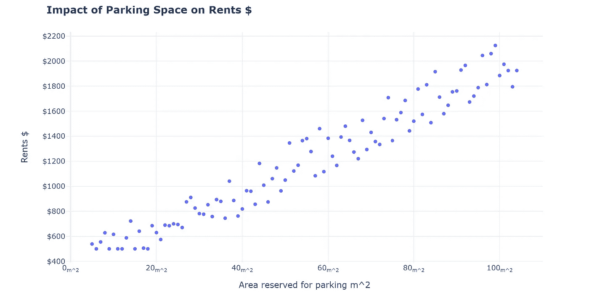
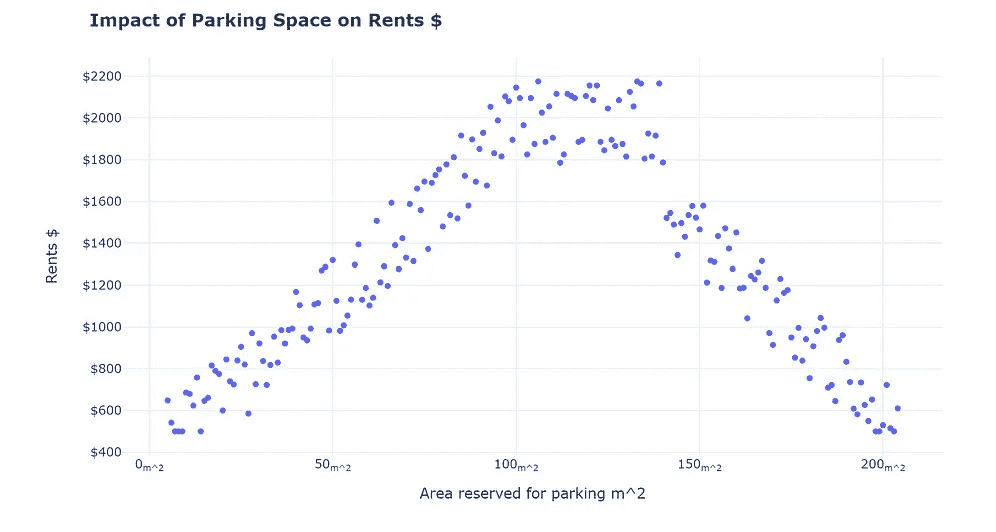
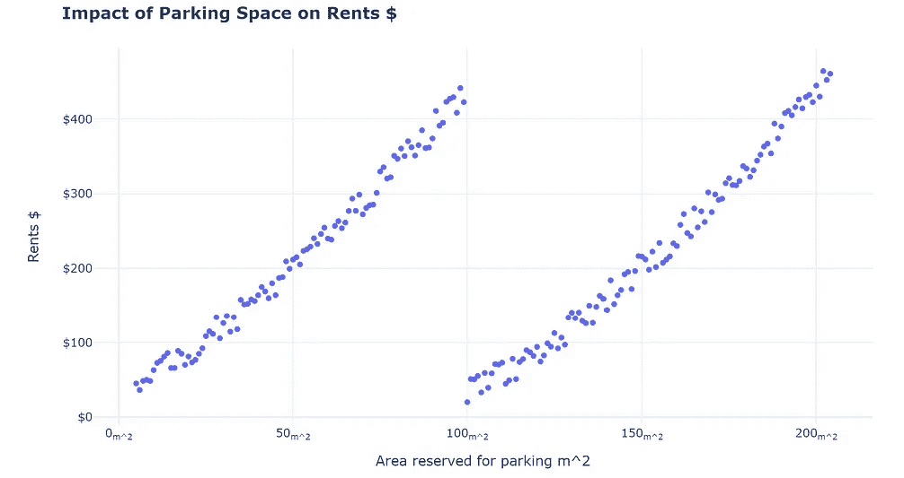
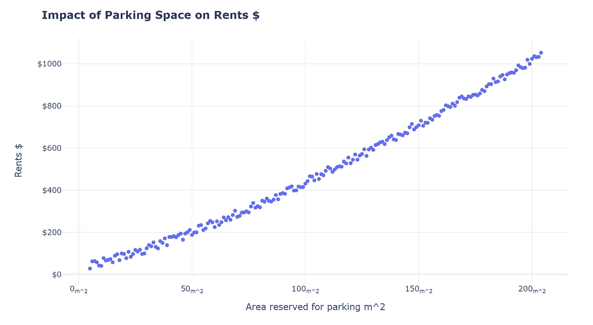
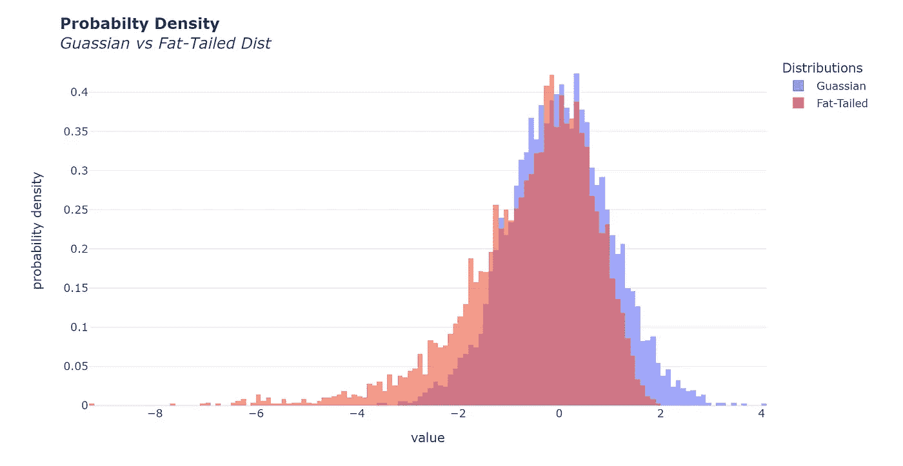
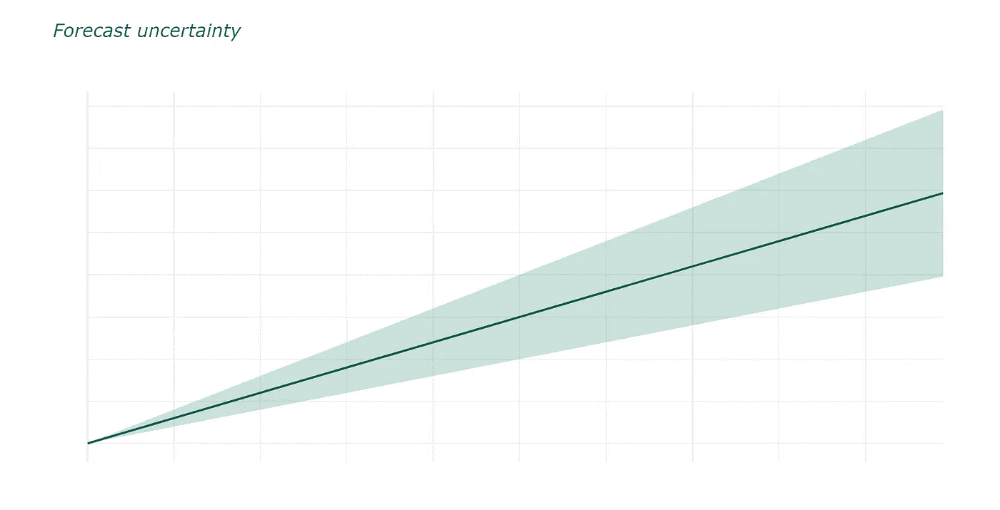

# 当心黑天鹅

> 原文：<https://pub.towardsai.net/beware-the-black-swan-d3e0c6d0b3e4?source=collection_archive---------3----------------------->

## 纳西姆·尼古拉斯·塔勒布关于概率和随机性的书能教给数据专家什么

图片来自 [Pexel](https://www.pexels.com/photo/14569917/)

纳西姆·塔勒布是前金融衍生品交易员和概率研究员，他的书《黑天鹅:极不可能事件的影响》强调了极不可能事件如何影响我们的日常生活和金融市场。不出所料，这对数据专业人士来说有很多教训，因为定量金融和数据科学都涉及统计模型和概率论。

# 什么是黑天鹅？

黑天鹅是一个非常不可能但非常有影响力的事件的隐喻。根据 Nassim 的说法，我们的模型似乎从来没有为这样的事件做好准备，尽管我们在开发它们时使用了魔法。Covid-19 爆发可能是没有人预见到但对日常生活造成毁灭性影响的不可预见事件的最新例子。对于金融市场来说，2008 年的金融危机是一只黑天鹅，它导致了雷曼兄弟的破产和全球经济衰退。

黑天鹅不一定具有破坏性。在挪威北海发现石油可以被认为是一只黑天鹅。据说，当挪威宣称对北海拥有主权时，没人相信那里有巨大的石油储量。另一个“积极的”黑天鹅可能是激光的发明，当发展时它没有真正的目的，但随着时间的推移，应用被发现，如治疗视力。在这两个案例中，意外的结果是无法预料的(非常不可能),但却非常有影响力。

# 不透明的三重性

纳西姆指出了人类在评估历史事件时会犯的三个错误:

1.  **理解的错觉:**我们认为我们知道什么导致了什么，但我们所有的解释都可能是虚构的。给人一种我们可以预测和解释事件的错觉，而事实上，它们可能是不可预测的。
2.  **追溯扭曲**:我们在事后提出解释、解决方案和预防措施。给人一种负面的黑天鹅本可以被减轻的错觉。
3.  事实信息的高估:我们没有意识到看似“事实”的东西可能是扭曲的或不完整的。

## **这对数据专家来说意味着什么？**

有些事情是无法预测或解释的。如果它们是可以解释的，解释通常出现在问题之后而不是之前，警告我们它们是数据中没有捕捉到的不可预见的事件，因此我们的模型是盲目的。最后一点与从模型中得出的推论有关，我们认为数据集中关系的事实表示可能是从“不完整”样本中得出的有偏估计。

# **叙事谬误**

作为人类，当我们观察随机事件时，我们倾向于构建故事和叙事。我们的大脑容易在没有适当证据的情况下做出推论。

考虑以下场景，你是一名为高层公寓房地产经纪人工作的数据分析师。你被指派确定以下问题，在他们的新开发项目中，应该分配多少空间用于停车？

下图描述了租金和停车位之间的关系:

图片由作者提供。

作为一名数据专业人士，你看到上面的图表，你会得出什么结论？如果他们有 1000 平方米用于整个项目，他们应该拨多少钱用于停车？人们很容易认为停车对承租人来说是一个巨大的便利。因此，分配巨大的空间将允许房地产经纪人收取更多的租金！似乎合理？

前面提到的推理路线不一定是错误的，但它有陷入**叙事谬误**的问题。事实是，仅从目前提供给我们的数据来看，我们无法确定因果关系。**我们可以构建数百种其他解释来解释我们观察到的现象**。例如，你可以争辩说，房地产经纪人参与大型和小型建筑项目，大型建筑项目产生更高的租金，也有更多的停车空间。因此，停车位对租金没有影响。

哪个才是解读数据的真实方式？这需要增加控制，也许还需要收集更多的证据。

如果我们在更多的停车位上收集样本，就可以观察到不同的关系。作者提供的图片

我知道你一定在想什么，这太荒谬了！当然，事情不会尽善尽美并不意味着我们不应该回答，是吗？

不，那不是重点。重点是要**持怀疑态度！作为人类，我们编造故事来解释我们观察到的现象；作为数据专业人员，我们应该抑制自己构建叙事(没有具体证据)的冲动。我们永远不应该试图做出超出我们观察的推论，或者如果我们这样做了，要小心风险。我们应该时刻警惕篡改我们的叙述。讲故事可能有助于销售，但也会延续自欺欺人！**

***欣赏这个故事？有一个数据科学问题，需要专家来解决？考虑招聘*** [***我***](https://www.upwork.com/ab/flservices/workwith/naivebayesian) ***！***

# 卢迪谬论

纳西姆为这种谬误起了个名字。他指出，学术专家构建了不符合现实的模型，然而我们却坚持使用它们。他特别指出，现代投资组合理论和高斯分布的不当使用导致现代金融分析师低估了黑天鹅事件的风险。

与高斯分布(蓝色)相比，厚尾分布(红色)的示例。厚尾分布估计出现极端不利结果的可能性更高。图片作者。

## 不可思议的事件比我们想象的更有可能发生！

纳西姆阐述说，股票市场的回报分布不是高斯分布，而是遵循厚尾分布，这使得极端事件比高斯模型让我们相信的更有可能发生，这反过来导致期权交易员过度杠杆化或过度暴露他们的投资组合的下行风险。

作为数据专业人员，我们都已经习惯了一套让我们的生活更轻松的方法和分布。大多数线性模型遵循误差正态分布(高斯)，然而，自然或我们选择建模的任何东西都没有义务是高斯的。卢迪谬误不仅仅是一种分配；我们使用的任何数学构造都可能使我们陷入谬误。

我们要关心的是，我们能在多大程度上依赖这些简化。数据工具和技术的激增让我们更容易接受错误的答案！仅仅因为一个广为人知的方法估计或预测了某件事，并不意味着它就是真的。只有在模型的数据和假设允许的情况下，它才是真实的。

# 预测不是事实！

作者图片

这一点在被指出时是显而易见的，但我们现在比以往任何时候都更认真地对待预测。在大多数情况下，它们是无害的，在大多数情况下，对你的业务做出错误的销售预测不会是灾难性的。然而，试图扰乱传统行业的人工智能企业越来越多，如 Opendoor，试图扰乱住房市场。他们的整个商业模式依赖于他们的算法预测房价的能力，并给客户一个准确的房屋价值预测。

有些事情很容易预测，但大多数关于社会科学的事情，比如经济学，就不容易预测。尤其是涉及到人类行为的时候。众所周知，经济学家是错误的，然而我们仍然依赖他们的预测。

越来越多的企业依靠预测和预报来赚钱。纳西姆强调世界是混乱的。因此，我们输入的微小变化会导致输出的巨大变化。不管使用什么魔法，根据定义，混沌是不可预测的。随着时间的推移，预测和预言越来越失去效力。

关键是，你越依赖预测，系统性失败的几率就越高，因为如果一个模型做出错误的预测，就可能导致其他系统失灵。我们越依赖模型，我们给系统带来的风险就越大。

感谢您的阅读！如果你喜欢我写的东西，请关注并订阅，以便在我发表时收到电子邮件！

以下是我的一些帖子，你可能会喜欢:

 [## 为什么 AI 公平性在电信个性化中很重要

### 个性化是电信业的游戏名称

出版 towardsai.net](/why-ai-fairness-is-important-in-telecom-personalization-e6aa876a7d02)  [## 金钱球板球——使用重复条件反射的概率为 100

### 板球得分≥ 100 分的概率分析

towardsdatascience.com](https://towardsdatascience.com/money-balling-cricket-probability-of-100-using-repeated-conditioning-2fc8dbceb42e)  [## 使用这个备忘单让你的 Matplotlib 图脱颖而出

### 用于在 Matplotlib 中编辑背景、记号和注释的备忘单

pub.towardsai.net](/make-your-matplotlib-plots-stand-out-using-this-cheat-sheet-8c666de90433)