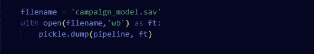
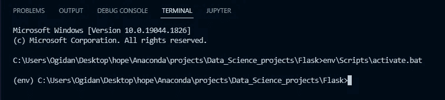
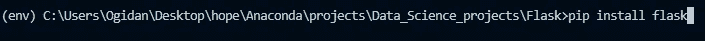
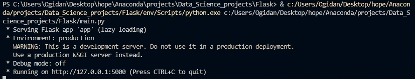
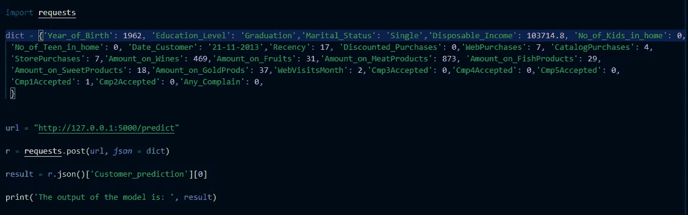
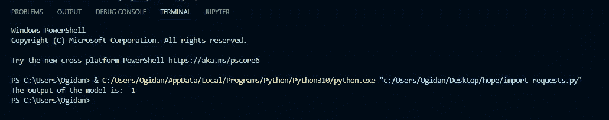

# 超越朱庇特笔记本

> 原文：<https://pub.towardsai.net/beyond-the-jupyter-notebooks-24b6732a1a7b?source=collection_archive---------0----------------------->

## 使用烧瓶在 swift 中部署您的模型

作为一名数据科学家，如果你经常发现自己在寻找关于 ***“木星笔记本之后的下一步是什么？”*** *，*你来对地方了，因为这正是本文要回答的问题。

照片由[亚历山德罗·埃尔贝塔](https://unsplash.com/@alessandroerbetta?utm_source=medium&utm_medium=referral)在 [Unsplash](https://unsplash.com?utm_source=medium&utm_medium=referral) 上拍摄

我会假设任何阅读这篇文章的人都曾经对数据进行过一些基本分析，并建立了机器学习模型。我们永远不能忘记的一件事是:

> 数据科学的作用是从我们的数据中获得洞察力，并根据数据做出未来预测，以增加商业价值。

为了实现这一目标，我们的 Jupyter 笔记本中构建的模型必须提供给相关的利益相关方进行决策。您的模型不仅仅意味着在您的 PC 中结束它们的生命周期。

现在，你可能会问， ***“我们如何让他们使用它？”，*** 这就是模型部署的由来。

> 模型部署是将最终的机器学习模型发布到真实环境中的过程，在真实环境中，机器学习模型可以被充分利用以达到其预期目的

机器学习模型可以通过各种环境部署，并以应用程序编程接口(API)的形式可访问，该应用程序编程接口可以由诸如 web、android 等应用程序使用。

*旁注:API 是一组代码，它使两个软件组件能够相互交流*

在本文中，我将向您展示如何使用 Flask 框架将简单的机器学习模型部署为 API。到本文结束时，您将有足够的信息开始将您自己的模型部署到云中。

喝杯咖啡，你会喜欢这篇文章的！

## 什么是烧瓶

Flask 是一个用 python 编写的轻量级框架，允许你开发 web 应用和 API。它使用起来非常直观，初学者也很容易上手。

## **项目策略**

以下是我通过 flask 应用程序部署我的机器学习模型所遵循的步骤:

*   机器学习模型的保存
*   虚拟环境的创建
*   开发烧瓶路线及其相关功能
*   完成并测试路线

## 模型保存

要开始，首先要保存您的模型。我们将使用***【pickle】***python 库来实现。出于演示的目的，我将使用我构建的模型来预测客户对电子商务公司营销活动的反应。这个项目的完整代码和实现可以在[这里](https://github.com/hope205/Customers_Campaign_Response/blob/master/Final_Customer_Campaign.ipynb)找到。

使用这几行代码来保存您的模型。*泡菜的第一个参数。dump* 根据您为模型指定的名称接收模型名称。

## 虚拟环境创建

> 虚拟环境是包含应用程序所依赖的软件的目录

它有助于将我们的应用程序及其包包含在一个目录中，最重要的是，它防止我们的包版本与系统中的其他包冲突。我们可以使用`virtualenv`包创建一个虚拟环境。你可以在这里阅读关于这个包[的更多信息](https://virtualenv.pypa.io/en/latest/)

使用 pip 在您的系统上安装 virtualenv

`pip install virtualenv`

在项目目录中创建一个虚拟环境

`virtualenv env`

该命令将创建一个名为***“env”***的虚拟环境。你可以使用任何你选择的名字，但是“env”是最常用的

下一步是激活您使用该命令创建的虚拟环境

`env\Scripts\activate.bat`

*注意:这个命令只对 windows 机器有效，如果你在 mac 上，使用这个命令*

`source env/bin/activate`

下一步是安装 python flask 库和我们在这个新的虚拟环境中可能需要的其他库。我们将使用 pip 来安装它，方法是在我们的终端中输入以下命令

pip 命令将把 flask 和其他包安装到虚拟环境中，然后您可以在您的项目中使用它们。

## 烧瓶体

Haven 安装了 flask，打开了一个空白的 python 文件，让我们设置它工作。

这是一个基本的 flask 应用程序的样子。首先要做的是实例化 flask 对象，并将其赋给你选择的任何变量，但我们通常使用***【app】***作为变量名。 ***"__name__"*** 表示应用程序包的名称，Flask 用它来标识模板、静态资产和实例文件夹等资源。

下一步我们要做的是确定路线。为了在烧瓶中定义路线，我们使用了***【app . route】***装饰器，如下所示:

`@app.route`

> flask 中的 Routes 用于将旨在执行任务的特定功能映射到可从网页访问的 url。

简而言之，路由用于将您希望的一些操作连接到 URL，这样无论用户何时通过 URL 访问该路由，输出都是函数的结果。

例如:

这里发生的事情是，测试函数被映射到 ***"/test"*** 路由，这样每当用户访问“/test”端点， ***"Ping 模型 A 应用程序！!"屏幕上显示*** 。***【methods】***参数接受所允许的 HTTP 请求类型列表。

我们的下一步行动将是开发"*预测*"我们分配给"/predict "路线的功能。为了避免混乱并保证代码的可读性，我将在我的目录下创建一个名为 ***【模型文件】*** 的新文件夹。

该文件夹将包含:

*   保存的模型
*   ****【ml _ model . py】***文件*
*   ****【init _ _】。py"*** 文件*

**"ml_model.py"* 文件将包含预处理函数和预测函数。稍后，我将导入这些文件以在我的主 flask 应用程序中使用。*

*这是我的文件的样子:*

*这背后的想法是把这个文件变成一个包，可以导入到我们的主 flask 应用程序。要将此文件夹打包，请创建一个新文件名***" _ _ init . py _ _ "***，并将其留空。*

## *结束*

**

*照片由[麦迪森·柳文欢](https://unsplash.com/@artbyhybrid?utm_source=medium&utm_medium=referral)在 [Unsplash](https://unsplash.com?utm_source=medium&utm_medium=referral) 上拍摄*

*在这个阶段，我们已经建立了两条路线，它们是*【测试】*和“预测”。 *"test"* 路由允许的 HTTP 请求方法是 get 请求，而 *"predict"* 路由允许的 HTTP 请求方法是 post 请求。*

*现在的最后一步是开发我们在“predict”路径中定义的预测函数，使用***“model _ file”***包接受数据、处理数据并返回预测。*

*这是主文件的样子。我利用了我们通过导入包并调用它们而创建的函数。接下来要做的是启动 flask 服务器并在本地测试它。*

**

*让我们现在尝试使用模型来进行预测*

**

*我们在预测的路线上发出 post 请求，并传入我们的数据。*

**

*该模型返回的输出为 1，这意味着该客户将对公司的营销活动做出回应。*

# *结论*

*唷！您已经使用 Flask 成功部署了您的机器学习模型。在这个阶段，它仍然是本地的，只能在您的计算机上访问。在我的下一篇文章中，我将向您展示如何将 flask 应用程序部署到 Heroku 云平台，以便可以通过互联网访问它。*

*这个项目的文件可以从我的 GitHub repo [这里](https://github.com/hope205/Customers_Campaign_Response/tree/master/Flask)获得*

*感谢所有激励我这样做的人。在 [LinkedIn](https://www.linkedin.com/in/hope-ogidan-82a6b31bb/) 和 [Twitter](https://twitter.com/HopeOgidan) 上与我联系，看看我们能有多好的结合。*