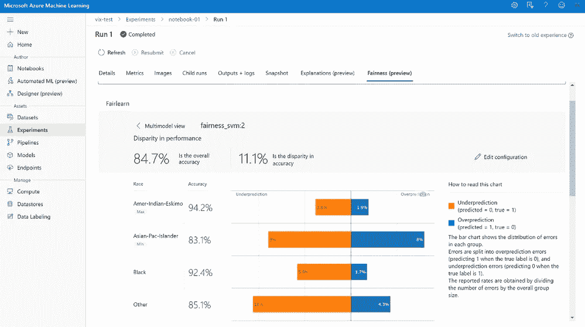
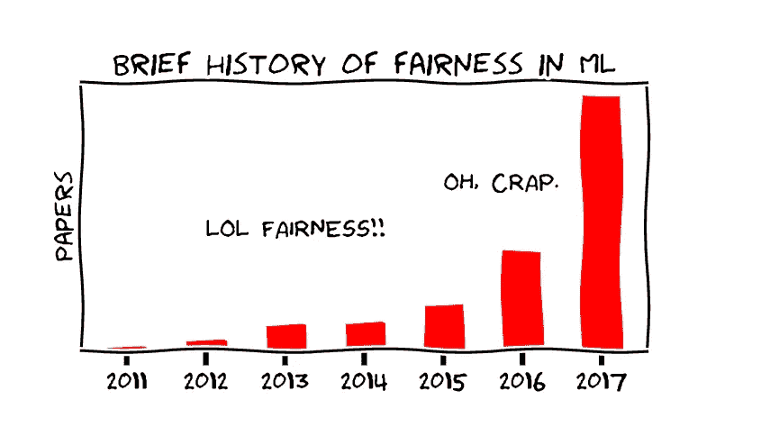

# 偏见很重要！什么是 Fairlearn，我为什么要关心？

> 原文：<https://pub.towardsai.net/bias-matters-whats-fairlearn-and-why-should-i-care-76db53ab45cc?source=collection_archive---------4----------------------->

## [数据科学](https://towardsai.net/p/category/data-science)，[机器学习](https://towardsai.net/p/category/machine-learning)

## 提高机器学习模型的公平性。

多元文化矢量作者 [Vecteezy](https://www.vecteezy.com/free-vector/multicultural)

在过去的几年里，我们见证了机器学习的快速发展。新技术在技术性能方面表现出了巨大的进步，越来越多的公司在决策过程中依赖人工智能，或者将其作为产品的一部分。

然而，随着这些进步，不公平和歧视性的结果也以同样的速度增加。在本文中，我们将讨论其中的一些问题以及减少这些问题的可能解决方案。

在本文中，您将了解到:

*   偏见的麻烦在于
*   什么是负责任的 ML？
*   什么是 Fairlearn？
*   定义人工智能中的公平。
*   有哪些用例？

# 偏见的麻烦在于

对人工智能偏见的担忧并不新鲜。凯特·克劳福德在 2017 年 NIPS 2017 主题演讲中提出了她的担忧。如果想看完整视频，可以访问[带偏的麻烦](https://www.youtube.com/watch?v=fMym_BKWQzk)。

> 部分问题在于，那些被培养成数据科学家、建立模型和处理数据的人，很多时候并没有与民权倡导者很好地联系在一起。
> ——亚伦·里克

机器学习工程师在开发模型时必须注意避免复制人类过程，这在历史上是偏差的来源。

2012 年的一篇论文研究了人口统计对人脸识别算法性能的影响，发现它们在识别黑人、女性和 30 岁以下成年人的人脸时准确性较低。

避免偏见需要理解非常复杂的技术和非常复杂的社会问题，从而理解**技术-社会系统**。

> **技术-社会系统**指的是不联系人类社会领域就无法定义网络的情况。
> ——塞利纳·拉夫尔

# 什么是负责任的 ML？

负责任的机器学习是将负责任的人工智能原则付诸实践，以确保这些系统的公平性、可解释性、隐私性和安全性。

这里有一些公司通过与 ML 社区分享最佳实践和工具，帮助在负责任的 AI 开发方面取得进展。

微软:[https://www.microsoft.com/en-us/ai/responsible-ai](https://www.microsoft.com/en-us/ai/responsible-ai)

谷歌:[https://ai . Google/responsible/responsible-ai-practices/](https://ai.google/responsibilities/responsible-ai-practices/)

https://www.h2o.ai/responsible-ai/[H2O](https://www.h2o.ai/responsible-ai/)

# 什么是 Fairlearn？

Fairlearn 是微软创建的一个开源工具包，旨在让数据科学家和机器学习工程师能够评估和改善他们的人工智能系统的公平性。

它提供了度量标准和一个交互式仪表板，以帮助评估哪些人群可能受到模型的不公平对待。此外，Fairlearn 还提供算法，可以帮助减轻分类和回归模型中的不公平性。

图片由[https://techcommunity.microsoft.com/](https://techcommunity.microsoft.com/)

如果你有兴趣开始使用 Fairlearn，你可以访问官方网站[https://fairlearn.github.io/](https://fairlearn.github.io/)。

# 定义人工智能中的公平。

图片由[https://fairmlclass.github.io/](https://fairmlclass.github.io/)

当机器学习算法的结果没有显示出与被认为敏感的变量(如性别、种族、性取向、残疾、年龄和其他人口统计因素)的相关性时，它被认为具有**公平性**。

现在我们已经定义了公平的概念，我们如何识别一个人工智能系统是否表现不公平？

在 Fairlearn 中，当有人受到伤害时，就会出现不公平行为。它关注两种类型的伤害:

*   ***分配危害:*** 当机会或资源因算法干预而被不公平分配时发生。工作申请、学校录取和贷款都可能发生这种情况。
*   ***服务质量危害:*** 当机会、资源或信息同样可用，但对一个人的效果不如对另一个人时，就会出现这种情况。

Fairlearn 使用**群体公平**的概念，试图识别 ***有遭受伤害风险的个体群体。***

# 有哪些用例？

人工智能的发展为改善全球人民的生活创造了新的机会，然而，过去的几年表明，我们在确保公平方面还有很长的路要走。一些由人工智能驱动且易受歧视行为影响的系统有:

*   **自动资格系统:**当租赁和销售市场存在对少数种族和少数民族的歧视时。
*   **排名算法:**当结果排名较高时，即使它们不是最相关的。
*   **贷款的预测风险模型:**当来自某些社区的贷款申请人没有资格获得贷款时。
*   **欺诈系统的风险评分模型:**当欺诈防范系统标记或拒绝来自贫困或少数族裔社区的持卡人的合法交易，而不是来自富裕的白人社区的持卡人。
*   学校招生:当招生显示出对女性申请者有偏见的误导模式时。

# 最后的想法

将人工智能创新与人权和伦理联系起来需要参与性，从数据科学家和机器学习工程师开始，接受对每个人都公平和包容的实践，以实现以人为中心的机器学习方法。

如果你喜欢这篇文章，请分享给你的队友和同事。让我们通过传播知识来帮助建立一个更加公平的世界。

# 参考

*   **偏见的麻烦** [ [链接](https://www.youtube.com/watch?v=fMym_BKWQzk) ]
    克劳福德，k，2017。神经信息处理系统会议，特邀演讲人。
*   **作为技术-社会系统的网络:网络 3.0 的出现**【[链接](http://fuchs.uti.at/wp-content/uploads/web3.pdf)】塞利纳·拉夫尔等人，2008。萨尔茨堡大学。
*   **Fairlearn:一个用于评估和提高人工智能公平性的工具包**【[链接](https://www.microsoft.com/en-us/research/uploads/prod/2020/05/Fairlearn_whitepaper.pdf)】莎拉伯德等人，2020。微软。
*   **人脸识别绩效:人口统计学信息的作用**【链接】Brendan F. Klare 等人，2012。
*   研究生入学中的性别偏见:来自伯克利的数据，P. J .比克尔等人，1975 年。科学。