# 偏差-方差分解 101:逐步计算。

> 原文：<https://pub.towardsai.net/bias-variance-decomposition-101-a-step-by-step-computation-9d5f3694877?source=collection_archive---------0----------------------->

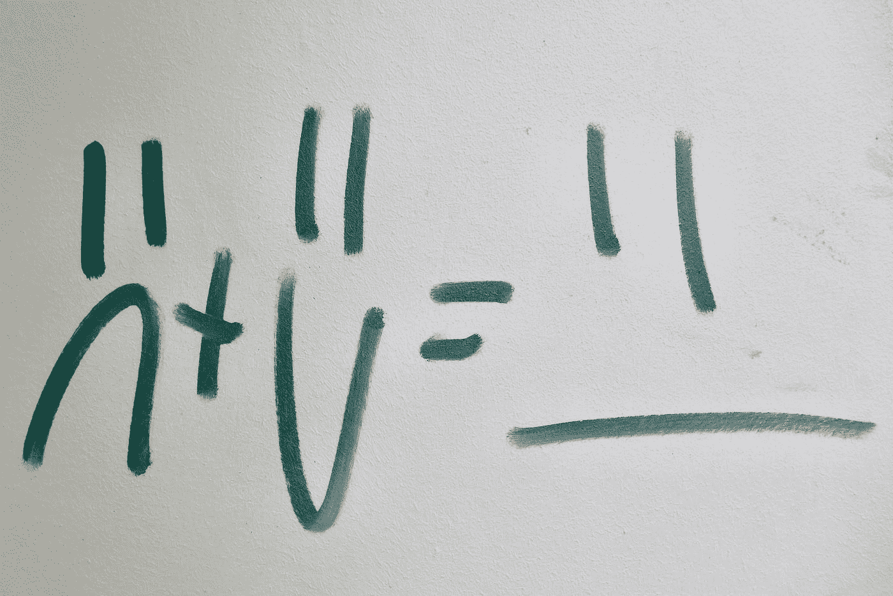

在 [Unsplash](https://unsplash.com?utm_source=medium&utm_medium=referral) 上由 [Bekky Bekks](https://unsplash.com/@bekkybekks?utm_source=medium&utm_medium=referral) 拍摄的照片

你听说过 ML 中的“**偏差-方差困境”**吗？我敢肯定你的答案是*是的*如果你正在这里阅读这篇文章:)，而且我还能肯定一点:你在这里是因为你希望最终找到达到著名的**最佳权衡的终极方法。**

嗯，我仍然没有这个神奇的子弹，但我今天在这篇文章中可以提供给你的是一种分析你的 ML 算法的错误的方法，把它分成三个部分，因此得到一个**理解和具体解决偏差-方差困境的直接方法**。

我们还将以最简单的方式一步一步地执行所有推导，因为 ***没有数学，就不可能完全理解偏差和方差分量之间的关系，从而采取行动建立我们的最佳模型！***

# 目录

1.  介绍和注释
2.  逐步计算
3.  图形视图和著名的权衡
4.  过拟合、欠拟合、合奏和具体应用
5.  结论
6.  参考

# 1.介绍和注释

在本文中，我们将分析训练数据变化时 ML 算法的错误行为，并且我们将理解**偏差和方差分量如何成为在我们的假设空间中选择最佳模型的关键点。**

当我们改变数据集时，给定的模型会发生什么？错误是如何表现的？想象拥有并维护相同的模型架构(例如，一个简单的 MLP)，并假设训练集的一些**变化。我们的目的是识别和分析模型在学习和复杂性方面发生了什么。**

这种方法提供了一种替代方法(通用经验风险方法)来估计测试误差。

## 我们在这篇文章中要做的。

给定训练集的变化，我们**将测试集**的某个点 *x* 的预期误差分解为三个元素:

*   **偏差**，它量化了(未知)真函数 *f(x)* 和我们的假设(模型) *h(x)* 之间的**差异**，对数据进行平均。它相当于一个系统误差。
*   **方差**，针对训练数据的不同实现，量化模型 *h* 的响应的**可变性(训练集的变化导致非常不同的解决方案)。**
*   **噪声**因为标签 *d* 包含随机误差:对于一个给定点 *x* 有不止一个可能的 *d* (即，即使对输入中的同一点 *x* 进行采样，也不会获得相同的目标 *d* )。这意味着即使是最优解也可能是错误的！

> **注意:**不要将本上下文中使用的“偏差”术语与同一单词的其他用法混淆，以表示 ML 中完全不同的概念(例如，感应偏差、神经单元的偏差)。

## 背景和情景

我们在一个**监督的**学习集中，特别地，我们假设一个**回归**任务场景，目标 *y* 和**平方误差损失**。

我们假设数据点是从一个唯一(且未知)的潜在概率分布 ***P*** 中抽取 *i.i.d.* (独立且同分布)。

假设我们有例子< **x** ， *y* >其中真(未知)函数为

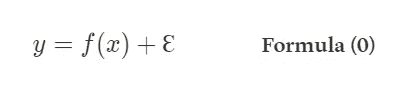

指标函数

其中ɛ是具有零均值和标准差 *σ的高斯噪声。*

在线性回归中，给定一组例子< **x_i** ， *y_i* >(其中 *i = 1，…，l)* 我们拟合一个线性假设*h(****)x***【T52)=***wx****+w _ 0*等以使误差平方和最小

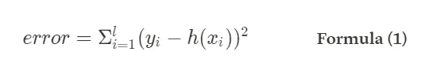

训练数据的平方和误差(误差函数)

对于错误函数，我们还提供了一个 Python 代码片段。

作者的平方误差损失公式的代码片段

值得指出两个有用的观察结果:

*   由于我们为某个函数 *f* 选择的假设类别(线性的),我们将会有一个系统的预测误差(即偏差)。
*   根据我们拥有的数据集，找到的参数*和*会有所不同。

## 完整概述我们场景的图形示例:

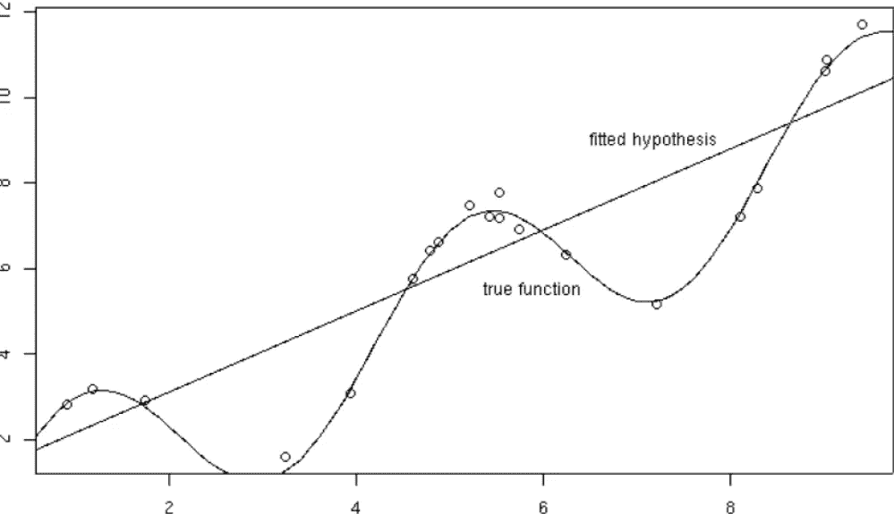

图 1(图片来自作者)

在**图 1** 中，很容易看到在真实函数(曲线) ***y = f(x) + ε*** 上采样的 20 个点。所以我们只知道原始分布的 20 个点。我们的假设是试图逼近数据的线性假设。

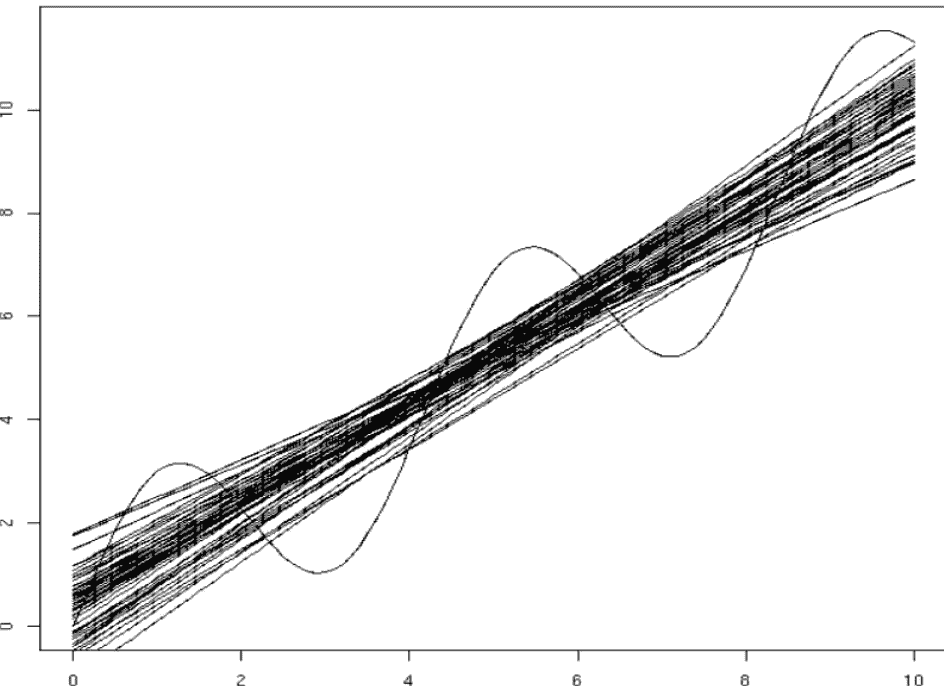

图 2(图片来自作者)

在**图 2** 中，我们使用不同的数据样本进行了 50 次拟合，每次拟合 20 个点(即改变训练集)。**根据不同的训练数据得到不同的模型(线)。**不同的数据集导致不同的假设，即不同的(线性)模型。

*我们的观点:了解* ***模型的误差如何根据不同的训练集变化*** *？*

## 我们的目标

给定一个新的数据点 *x* ，预期的预测误差是多少？我们分析的**目标是计算任意新点 *x* ，**

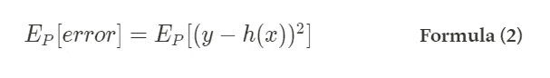

根据误差的概率分布 P 的期望误差

其中期望是根据 ***P*** 绘制的整体训练集。

请注意，每个不同的“提取”训练集都有不同的 *h* (和 *y* )。

*我们将把这种期望分解为上述三个部分，分析它们如何影响误差，以及如何利用这种 p.o.v .来建立和改进有效的 ML 模型。*

# 2.逐步计算

## 2.1 召回基础统计

设 Z 是一个**离散随机变量**，有可能值 *z_i* ，其中 *i = 1，…，l* ，概率分布 P(Z)。

*   **期望值**或**是指 **Z** 的**

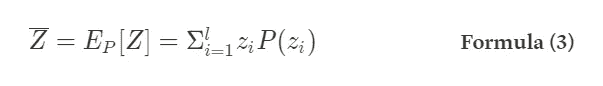

已知概率分布 P，平均值计算为每个 i ( *z_i* 项 *)* 的随机变量的值乘以拥有它的概率(P( *z_i* )

*   Z 的**方差**

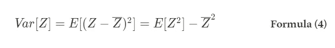

方差引理

为了更清楚，我们现在将证明后一个公式。

## 2.2 方差证明引理

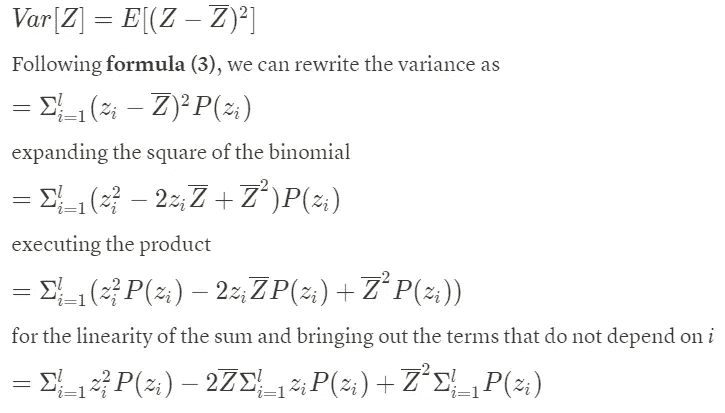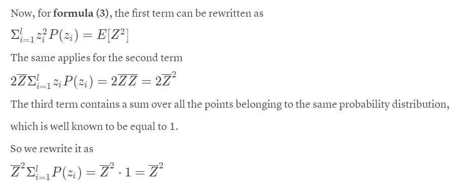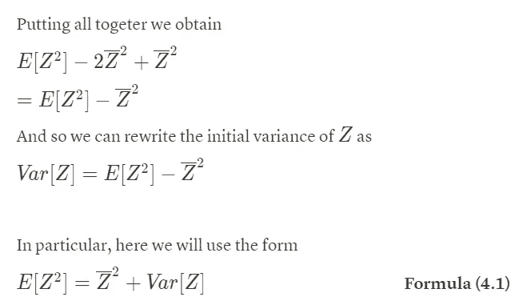

## 2.3 偏差-方差分解

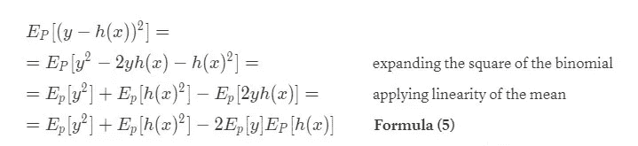

注意:可以将 *y* 和 *h(x)* 之间的乘积的平均值视为平均值的乘积，因为它们是**独立变量**，因为一旦固定了测试集上的点 *x* ，我们建立的假设(模型) *h(x)* 就不依赖于目标 *y* (也不依赖于*x*

*让*

*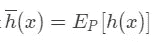*

*当使用从 *P* 中提取的数据对 *h* 进行训练时，在 *x* 处的假设上标注**均值预测**(即在训练集的所有不同变量上训练的模型的均值)。所以是我们用不同的训练数据对模型进行不同的训练所能得到的结果的期望值，估计在 *x* 。现在我们分别考虑**公式(5)** 的各项。*

*使用方差引理**(公式 4.1)** ，我们有:*

*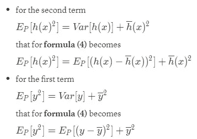*

*注意，对于**公式(0)** ，对目标值的期望等于在 *x* 上评估的目标函数:*

*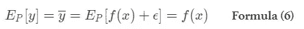*

*因为根据定义，噪声ɛ具有零均值，并且因为真实函数 *f(x)* 被假设为已知，所以对它的期望仅仅是它本身。为此，我们可以写:*

*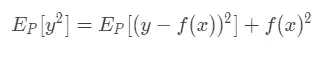*

*关于剩下的(第三)项，因为分别是**【公式(6)****【公式(3)** 。我们可以简单地把它改写成*

*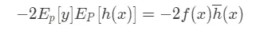*

*把所有东西放在一起，重新排序，我们可以写出初始方程，即**式(2)** :*

*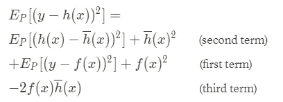*

*简单来说就是:*

*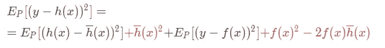*

*很容易看出，红色的项构成了二项式的一个正方形。为了进一步简化，再次对术语进行重新排序，并以紧凑的方式重写二项式的平方:*

*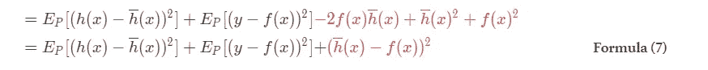*

*公式(7)的树项正是我们正在寻找的三个组成部分:*

*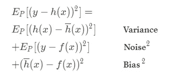*

*预期预测误差现在最终分解为*

*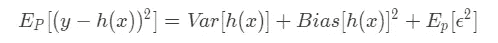*

*并且，由于噪声根据定义(公式(0))具有零均值，我们可以写出**公式(8):偏差-方差分解结果。***

*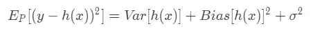*

*偏差-方差分解结果*

> **或者，继* [*之后*](https://medium.com/u/bfdc14624165?source=post_page-----9d5f3694877--------------------------------) *批注:**
> 
> ***Err(x)*=偏差+方差+不可约误差****

*注意，**噪声**通常被称为**不可约误差**，因为它依赖于数据，所以无论使用什么算法都不可能消除它(任何模型都无法从根本上减少)。*

*相反，**偏差和方差**是**可减少的误差，因为**我们可以尝试尽可能地最小化它们。*

*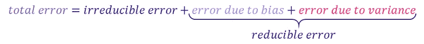*

*图片来自 [Opex 分析](https://medium.com/u/370952daf49?source=post_page-----9d5f3694877--------------------------------)*

## *2.4 每个术语的含义*

*   ***方差项**被定义为每个单一假设(模型)和所有不同假设(从不同训练集获得的不同模型)的平均值之间差异的期望值。*
*   ***偏差项**定义为所有假设的平均值(即从不同训练集获得的所有可能模型的平均值)与点 *x.* 上的目标值之间的差异*
*   ***噪声项**定义为在 *x* 上计算的目标值和目标函数之差的期望值(即该分量实际上对应于噪声的方差)。*

**现在你已经具备了所有的要素，可以再次阅读第 1 节(简介)中给出的这三个组成部分的定义，并完全理解和欣赏它们了！**

# *3.图形视图和著名的权衡*

*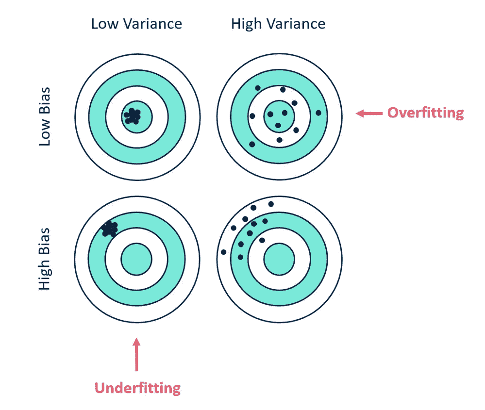*

*图 3 描述了通过击中目标上的点的偏差和变化。目标上的每个点代表模型的不同迭代，适合不同的训练数据集。([来源](https://community.alteryx.com/t5/Data-Science/Bias-Versus-Variance/ba-p/351862?lightbox-message-images-351862=52874iE986B6E19F3248CF))*

*理想情况下，你希望看到既有**低方差又有**低偏差的情况，如图**图 3** (任何有监督机器学习算法的目标)。然而，在最优偏差和最优方差之间通常存在一个**权衡**。机器学习算法的参数化通常是一场平衡两者的战斗，因为**偏差和方差之间的关系是不可避免的:增加偏差会减少方差，反之亦然。***

*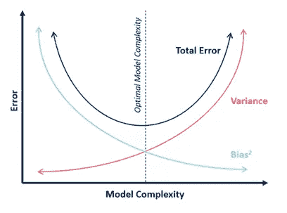*

*偏差、方差和模型复杂度之间的关系。([来源](https://community.alteryx.com/t5/image/serverpage/image-id/52875iEF64CA7B6C0D4F43/image-size/large?v=v2&px=999))*

*[处理偏差和方差实际上就是处理过度拟合和欠拟合](https://medium.com/p/9a60f697239)。与模型复杂性相关的偏差减少，方差增加(见**图 4** )。随着越来越多的参数被添加到模型中，模型的复杂性增加，方差成为我们主要关注的问题，而偏差稳步下降。换句话说，偏差有一个负的一阶导数来响应模型的复杂性，而方差有一个正斜率。*

*理解偏差和方差对于理解预测模型的行为至关重要，但是一般来说**你真正关心的是总体误差**，而不是具体的分解。任何模型的最佳点都是复杂程度，在这个复杂程度上，偏差的增加相当于方差的减少。*

*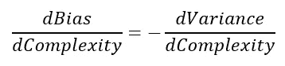*

*公式 9:偏差和方差的关系。([来源](http://scott.fortmann-roe.com/docs/BiasVariance.html))*

*这就是我们谈论取舍的原因！**一个增加，另一个减少，**反之亦然。这正是它们之间的关系，我们的推导有助于把我们带到这里。**没有数学表达式，就不可能理解这些组件之间的联系，从而采取行动构建我们的最佳模型！***

*作为最后一步，我们来介绍三个误差分量的图形表示。*

**

*误差分解为偏差、方差和噪声:图形视图(图片由作者提供)。*

*很容易识别:*

*   ***偏差**是我们获得的解(红色)和数据平均真实解(白色)之间的差异(箭头)。*
*   ***方差**(深蓝色圆圈)如果使用不同的训练数据，目标函数将改变多少，即，对数据集中的小方差的敏感度(如果使用不同的数据集，给定数据点的估计将改变多少)。*

*如前所述，如果偏差增加，方差减少，反之亦然。*

*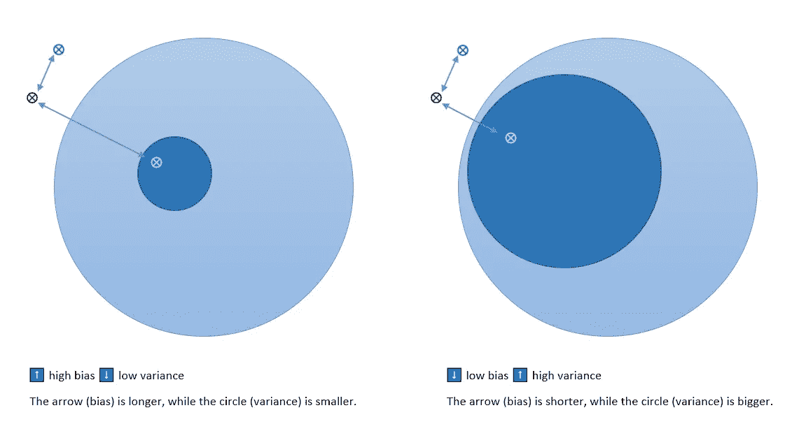*

*偏倚和方差的反比关系(图片由作者提供)。*

*很容易用图形验证我们之前所说的关于**噪声**的内容:由于它依赖于数据，所以没有办法修改它(这就是为什么它被称为**不可约误差**)。*

*然而，如果偏差和方差都会导致误差，请记住**您想要最小化的是(整体)预测误差**，而不是偏差或方差。*

# *4.过拟合、欠拟合、合奏和具体应用*

*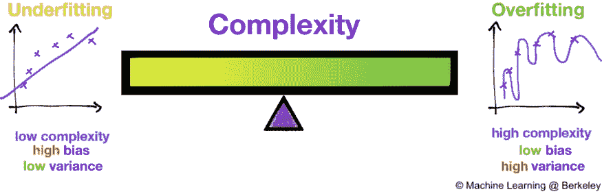*

*图片来自 [Juhi Ramzai](https://medium.com/u/dc327e50cf35?source=post_page-----9d5f3694877--------------------------------)*

*由于我们的最终目的是建立最好的可能的 ML 模型，如果不与这些相关的含义和相关的主题联系起来，这种推导几乎是无用的:*

1.  *[**模型复杂度和正则化中的偏差和方差。**](https://medium.com/p/9a60f697239)ML+中偏差方差和*λ*项的相互作用及其对欠拟合和过拟合的影响。*
2.  *[**更多关于著名的偏差-方差权衡**](https://medium.com/p/8d4b985fb011)*
3.  ***一个处理偏差和方差的实用实现:** [**集成方法。**](https://medium.com/p/7aabb44a97ee)*

> *我已经在最近的文章中谈到了这些话题，所以如果你感兴趣，请点击这里的链接查看 below⬇*

*   *[*不费吹灰之力就明白过拟合和欠拟合*](https://medium.com/p/9a60f697239)*
*   *[*全面总结你能找到的关于 ML 中偏差和方差的一切*](https://medium.com/p/8d4b985fb011)*
*   *[*集成学习:利用多样性。*](https://medium.com/p/7aabb44a97ee)*

# *5.结论*

*我们今天看到的是一种**纯理论方法**:对其进行推理以充分理解每个误差分量的含义，并有一种具体的方法来接近您的 ML 算法的模型选择阶段，这非常有趣。但是为了进行计算，人们应该知道真实函数 *f(x)* 和概率分布 *P.**

> *事实上，我们无法计算真正的偏差和方差误差项，因为我们不知道实际的潜在目标函数。然而，作为一个框架，偏差和方差提供了理解机器学习算法在追求预测性能时的行为的工具。 *(* [*来源*](https://machinelearningmastery.com/gentle-introduction-to-the-bias-variance-trade-off-in-machine-learning/) *)**

*我希望这篇文章和相关的文章能帮助你理解偏倚-方差困境，特别是提供一种快速简单的方法来处理 ML 模型的选择和优化。我希望您现在将有额外的工具来通过偏差和方差成分来处理和修复您的模型复杂性、灵活性和泛化能力。*

## *如果你喜欢这篇文章，请留下👏🏻。谢谢你。*

# *6.参考*

## *主要:*

*   *比萨大学 [A. Micheli](http://pages.di.unipi.it/micheli/) 、[计算机科学硕士课程(人工智能课程)教授的机器学习讲座](https://didattica.di.unipi.it/en/master-programme-in-computer-science/curricula-2/curriculum-%c2%93artificial-intelligence%c2%94-2/)*
*   *有关介质参考的完整列表，请查看 [**此链接**](https://medium.com/@d.goglia/list/bias-var-66b0dcb8a389) **。***

## *其他:*

*   *[葛曼，司徒](https://en.wikipedia.org/wiki/Stuart_Geman)；比恩斯托克，lie 勒内·杜尔萨特(1992 年)。[*神经网络与偏差/方差困境*](http://web.mit.edu/6.435/www/Geman92.pdf)(PDF)。*神经计算*。**4**:1–58。[doi](https://en.wikipedia.org/wiki/Doi_(identifier)):[10.1162/neco . 1992 . 4 . 1 . 1](https://doi.org/10.1162%2Fneco.1992.4.1.1)。*
*   *弗拉基米尔·瓦普尼克(2000 年)。 [*统计学习理论的本质*](https://dx.doi.org/10.1007/978-1-4757-3264-1) 。纽约:施普林格出版社。*
*   *格雷格·沙赫纳罗维奇(2011 年)。[*线性回归中偏差-方差分解推导的注记*](https://web.archive.org/web/20140821063842/http://ttic.uchicago.edu/~gregory/courses/wis-ml2012/lectures/biasVarDecom.pdf)*
*   *詹姆斯，加雷斯；[威滕，丹妮拉](https://en.wikipedia.org/wiki/Daniela_Witten)；[哈斯蒂，特雷弗](https://en.wikipedia.org/wiki/Trevor_Hastie)；罗伯特·蒂布拉尼(2013 年)。 [*统计学习入门*](http://www-bcf.usc.edu/~gareth/ISL/) 。斯普林格。*
*   *机器学习中的偏差和方差——初学者的绝佳指南！ ，analyticsvidhya.com*
*   *[*偏差对方差*](https://community.alteryx.com/t5/Data-Science/Bias-Versus-Variance/ba-p/351862) ，在[community.alteryx.com](https://community.alteryx.com/?category.id=external)*
*   *[*理解偏差-方差权衡*](http://scott.fortmann-roe.com/docs/BiasVariance.html) ，作者[斯科特·福特曼-罗](https://medium.com/u/bfdc14624165?source=post_page-----9d5f3694877--------------------------------)*
*   *[*温和介绍机器学习中的偏差-方差权衡*](https://machinelearningmastery.com/gentle-introduction-to-the-bias-variance-trade-off-in-machine-learning/) ，machinelearningmastery.com*
*   *[*偏差–方差权衡*](https://en.wikipedia.org/wiki/Bias%E2%80%93variance_tradeoff) ，在维基百科中*

## *更多有用的来源*

*用 [**mlxtend** Python 库](http://rasbt.github.io/mlxtend/)进行偏差方差分解计算:*

*   *[*用*](https://medium.com/analytics-vidhya/calculation-of-bias-variance-in-python-8f96463c8942) *[Nallaperumal](https://medium.com/u/99cf6a63c6f0?source=post_page-----9d5f3694877--------------------------------) 计算 python* 中的偏差&方差*
*   *[*偏差方差分解*](https://towardsdatascience.com/bias-variance-decomposition-d0e22d1506b1) *乘*[*vid hi Chugh*](https://medium.com/u/f3231bce2410?source=post_page-----9d5f3694877--------------------------------)*

*关于偏倚-方差权衡理论的更多内容可以在前面提到的 [**列表**](https://medium.com/@d.goglia/list/bias-var-66b0dcb8a389) 中找到。*