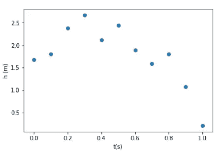

# 使用 Pylab 的偏差-方差权衡图

> 原文：<https://pub.towardsai.net/bias-variance-tradeoff-illustration-using-pylab-202943bf4c78?source=collection_archive---------0----------------------->

## 解决偏差-方差问题| [走向人工智能](https://towardsai.net)

在统计学和机器学习中，偏差-方差权衡是一组预测模型的属性，其中在参数估计中具有较低偏差的模型在样本间具有较高的参数估计方差，反之亦然。偏差-方差困境或问题是试图同时最小化这两个误差源的冲突，这两个误差源阻止监督学习算法推广到它们的训练集之外:

*   *偏差*是学习算法中错误假设产生的误差。高偏差会导致算法错过特征和目标输出之间的相关关系(欠拟合)。
*   *方差*是对训练集中的小波动的敏感性的误差。高方差会导致算法模拟训练数据中的随机噪声，而不是预期的输出(过拟合)。

在本文中，我们使用 [PyLab](https://scipy.github.io/old-wiki/pages/PyLab) 来说明偏差-方差问题。通过一个例子，我们讨论了欠拟合(偏差误差)和过拟合(方差误差)的概念。

# **举例:向上抛向空中的物体的位置**

我们考虑一个实验，其中一个物体被抛向空中，其位置作为时间的函数被测量。从这个假设实验中获得的数据如下所示:

```
**#import necessary libraries**
import pylab
import numpy as np
import matplotlib.pyplot as plt**#create the dataset**
t = np.linspace(0,1,11)
h = np.array([1.67203, 1.79792, 2.37791,2.66408,2.11245, 2.43969,1.88843, 1.59447,1.79634,1.07810,0.21066])
```



**在不同时间测量的颗粒高度。**

从我们对力学的研究中，我们知道高度应该随着时间的平方而变化，因此我们应该使用二次曲线来代替数据的线性拟合:


为了说明偏差-方差问题，让我们回到位置数据，并对数据拟合一个线性、一个二次和一个 10 次多项式:

```
plt.figure(figsize=(15,5))# fig 1
plt.subplot(131)
#**perform linear fit using pylab**
degree = 1
model=pylab.polyfit(t,h,degree)
est_h=pylab.polyval(model,t)#calculating R-squared value
R2 = 1 - ((h-est_h)**2).sum()/((h-h.mean())**2).sum()#plot of observed and modeled data
pylab.scatter(t,h, c='b', label='observed')
pylab.plot(t,est_h, c='r', label='predicted:' + ' R2' '='+ ' ' + str(round(R2,4)))
pylab.xlabel('t(s)')
pylab.ylabel('h(m)')
pylab.title('linear model is not good (underfit)')
pylab.legend()# fig 2
plt.subplot(132)
#**perform quadratic fit using pylab**
degree = 2
model=pylab.polyfit(t,h,degree)
est_h=pylab.polyval(model,t)#calculating R-squared value
R2 = 1 - ((h-est_h)**2).sum()/((h-h.mean())**2).sum()#plot of observed and modeled data
pylab.scatter(t,h, c='b', label='observed')
pylab.plot(t,est_h, c='r', label='predicted:' + ' R2' '='+ ' ' + str(round(R2,4)))
pylab.xlabel('t(s)')
pylab.ylabel('h(m)')
pylab.title('quadratic model is what we need')
pylab.legend()# fig 3
plt.subplot(133)
#**perform higher-degree fit using pylab**
degree = 10
model=pylab.polyfit(t,h,degree)
est_h=pylab.polyval(model,t)#calculating R-squared value
R2 = 1 - ((h-est_h)**2).sum()/((h-h.mean())**2).sum()#plot of observed and modeled data
pylab.scatter(t,h, c='b', label='observed')
pylab.plot(t,est_h, c='r', label='predicted:' + ' R2' '='+ ' ' + str(round(R2,4)))
pylab.xlabel('t(s)')
pylab.ylabel('h(m)')
pylab.title('degree=10 captures random error (overfit)')
pylab.legend()pylab.show()
```


**偏差误差(欠拟合)和方差误差(过拟合)的图示。**

对于线性拟合，R2 (R 平方)参数为 0.3953，非常低。如果我们有一个很好的拟合，我们会期望 R2 值更接近 1.0。对于二次拟合，R2 值为 0.8895。因此，二次拟合比线性拟合有了相当大的改进。使用次数= 10 的多项式，我们发现 R2 值等于 1.0。我们看到高次多项式捕捉到了真实的和随机的效果。在这个问题中，我们的力学知识表明，在二次模型之外进行高阶近似是没有好处的。

总之，我们用一个非常简单的例子讨论了偏差-方差问题。我们已经看到，决定一个好的拟合的主要因素是你要拟合的函数形式的有效性。当然，只要有可能，关于物理问题的理论或分析信息都应该整合到模型中。通常，与过于复杂的模型相比，模型参数较少的简单模型总是更容易解释。

# 参考

1.  维基百科上的偏差-方差权衡。
2.  《计算物理学的第一课》,作者:Paul L. DeVries，John Wiley & Sons，1994 年。