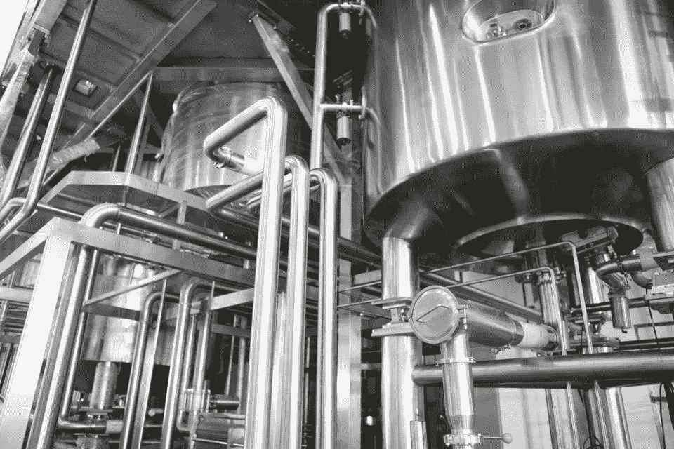

# 大数据、人工智能和物联网第二部分:一步一个脚印地推动工业 4.0

> 原文：<https://pub.towardsai.net/big-data-ai-iot-part-two-driving-industry-4-0-one-step-at-a-time-5f76b1ad6df6?source=collection_archive---------1----------------------->

## 展望人工智能、大数据和物联网的未来| [走向人工智能](https://towardsai.net/?source=post_page---------------------------)

工厂、炼油厂、公用事业和各种工业环境都将受益于人工智能、大数据和物联网，但实现这一目标需要什么？不溅

当你想到工厂时，你会想到什么？黑暗的维多利亚磨坊？查理·卓别林的小品？还是自动化生产线？工业制造一直是进步的标志，是时代的标志，因为每一代人都在开发越来越先进的技术。

> 但是，尽管工业公司多年来一直使用数字技术来改善他们的流程，但在运营的所有阶段，互联传感器、数据和人工智能(AI)的力量尚未大规模实现。

本文将关注工业环境中大数据、人工智能和物联网设备的**交集**，继续这些技术及其支持的生态系统系列。

# **处理能力**

工业部门是自动化和优化的理想试验场，因为在任何操作中都有大量的特定过程。这些组织往往分布在不同的地方，有一个庞大的供应商、分销商和用户链，他们的产品或服务可能会接触到他们。这意味着，无论是生产、维护还是分销，每个阶段遵循的流程最终都可能会在操作之间支离破碎。因此，技术在工业环境中发挥着巨大的作用，有助于记录材料使用情况，测量公用事业和石油管道中的流量，并将操作集中在一个系统下。

> 工业 4.0 是指工业技术的下一步，机器人、计算机和设备与物联网(IoT)相连，并通过机器学习算法得到增强。

[*传感器技术*](https://www.asme.org/engineering-topics/articles/technology-and-society/making-sense-of-sensors) 和连接模块的进步使得更多的设备可以在不同地点之间进行测量、监控和跟踪，并从一个中央远程位置进行协调。有了这种可访问性，经理、高管和 [*甚至数据科学家*](https://towardsdatascience.com/why-data-scientists-will-turn-to-industrial-and-manufacturing-industries-in-the-near-future-6f690e02dfd3) 都可以利用这种洞察力来提高整个运营的效率和生产力。由于云计算的兴起和随之而来的数据存储成本的下降，大量的数据现在也可以被存储并输入到机器学习算法中，以帮助实现组织内特定流程的自动化。

# **整体观点**

然而，将人工智能引入工业过程并不像购买一台新设备那么简单。由于工业过程的复杂和相互联系的性质，**公司必须首先对他们想要从人工智能那里得到什么有一个坚实的理解**。 [*千里眼*](http://clairvoyantsoft.com) 的首席技术官谢卡尔·维莫里说，不管是来自生产车间的传感器还是野外的联网设备，如果没有一个结构化的思维过程，你最终都无法对这些数据做任何事情。有了“强大的基础数据战略”，只要数据本身是焦点，公司就可以在数据流经企业时端到端地看待整个系统。维莫里说，如果你仍然认为数据是运营的副产品，那么你的组织将继续挣扎，数据作为主要资产，它将成为你业务流程的一部分，你可以看到每个数据点是如何相互关联的

有了生产线的整体视图，**公司可以使用人工智能从数据中获得更多价值，或者更深入地了解设备**。“人们现在正在考虑如何利用工业物联网传感器数据来预测可能发生的事情——无论是预测性维护、生产线管理还是质量控制，”维莫里说，“在未来 12-18 个月内，事情将开始滚雪球式增长，因为有越来越多的知识来实现它。”然而，维莫里明确指出，技术并不是一切:“虽然我很想说这纯粹是一个技术问题，但也是一个人和组织的问题”，因此，尽管设定一个你想要实现的坚实目标很重要，“你必须**想得大，但行动要小**，因为否则就太抽象了，无法理解价值——设定你的目标，但要一步一步地朝着它前进。'

# **连接圆点**

然而，收集所有这些数据完全依赖于可靠的连接。存在各种连接标准来迎合工业环境，优化用于长距离发送数据包([*lpwan*](https://www.iotforall.com/what-is-lpwan/)，或低功率广域网)，尽可能长时间地保持设备在现场(嵌入式 sim 或 [eUICC](https://blog.jtiotsims.com/what-is-euicc-and-how-does-it-impact-the-future-of-connectivity) ，或最大化现有网络基础设施的潜力( [*使用 LTE 频谱的蜂窝 lpwan*](https://www.iotforall.com/cellular-iot-explained-nb-iot-vs-lte-m/))。以太网或有线互联网连接也广泛用于本地、固定的物联网应用，但不适合许多需要无线连接的情况。所有这些连接类型都有其优点和缺点，但许多工业公司都在运行“根本不是为新世界构建的传统技术”，Venkat Viswanathan，[*latent view Analytics*](https://www.latentview.com/)的联合创始人说。正因为如此，在许多情况下，让一个组织采取一种新的连接标准是完全不可行的。

工业公司可能会选择蜂窝多网络连接，并在下一代网络技术可用之前努力实现更多流程的自动化。 [*边缘计算*](https://thenewstack.io/the-internet-of-things-on-the-edge/) 以及机器学习可以提供部分解决方案，因为这允许**更多的数据在传输到云进行分析之前，在源处**被鉴定并分配更多的自动化任务，从而减少通过无线电波传输的数据量。虽然在某些情况下，这从通信角度复制了传统设备，**边缘计算改善了真正自动化所需的延迟和效率**，并将与传统系统已经过时的新系统保持兼容。这也允许公司使用蜂窝连接的可靠性来评估其现有系统和流程，并带来实现完全自动化所需的增量变化。

# **一块一块的**

渐进式变革是游戏的名称，因为许多工业组织过于分散和分散，无法进行彻底的改革并立即从尖端技术中受益。维斯瓦纳坦说，事实上，“这些过程中有许多仍然是完全手工的”。如果你能想象一个炼油厂和那里的各种设备，他们实际上会让人盯着设备，寻找问题，并用纸和笔做记录。虽然这当然是一个极端的例子，但维斯瓦纳桑和维莫里都同意，“公司需要关注的第一件事是来自高层管理人员的赞助。”

> 用人工智能、大数据和物联网带来新一轮的产业进步不会一蹴而就。要利用这些技术带来的机会，需要整体战略、强有力的领导以及对数据如何在组织中流动的理解。

许多工业公司依赖功能完善但不适合新技术的设备，一些高层管理人员也是如此——他们对现状非常满意，但如果不改变思维方式，他们将无法采用新技术。越来越多的领导者确实意识到工业 4.0 的好处，但是，他们需要记住，如此大规模的有意义的变化只能一步步来。

*原载于*[*https://www.forbes.com*](https://www.forbes.com/sites/charlestowersclark/2019/02/20/big-data-ai-iot-part-two-driving-industry-4-0-one-step-at-a-time/)*。*