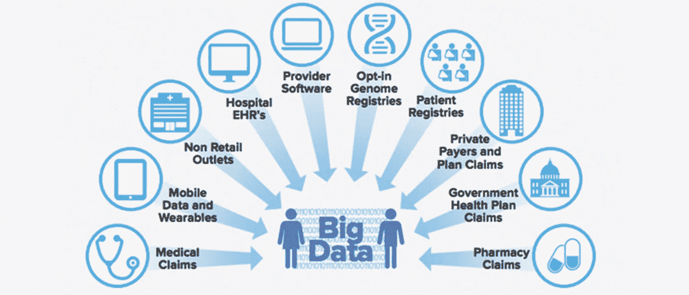

# 大数据分析:所有医疗保健问题的可行解决方案

> 原文：<https://pub.towardsai.net/big-data-analytics-a-viable-solution-to-all-healthcare-problems-4230cf41b4d1?source=collection_archive---------1----------------------->

## [数据分析](https://towardsai.net/p/category/data-analytics)

图片由 [Cogito Tech LLC](https://www.cogitotech.com/) 提供

“大数据”一词在全球非常流行。它是医疗保健行业新的关键原材料，有助于人工智能(AI)和机器学习算法正确利用重要信息，并逐步改善整体服务。

*在这篇独家文章中，我们将向您介绍大数据和大数据分析，为什么您真正需要它们，以及它们如何正确解决您的潜在问题。*

**什么是大数据&大数据分析？**

大数据是通过电子健康记录(ECR)、药物研究、数字平台、医学成像分析等各种来源仔细收集的大量数据。为了维护、管理和分析数据，需要一种称为“大数据分析”的特殊处理方法。

简而言之，这是一个将高级分析技术用于庞大而复杂的数据集的过程。这些数据集的大小从万亿字节到万亿字节不等，可以是有组织的、半结构化的或非结构化的。

*几种有效的工具自然可以归入大数据分析，以增强整体流程:数据存储、数据清理、数据挖掘、数据分析、数据可视化、数据收集等。*

医疗行业的组成要素包括:

1.包括医生或护士在内的卫生专业人员。

2.卫生设施，包括诊所、医院、药房。

3.财务编制，支持前两者。

但这些专业人士并不知道医疗行业大数据分析的好处。根据一份公布的报告，预计到 2025 年，大数据量将达到 175 Zettabytes。

**为什么需要大数据分析？**

大数据分析凭借其处理海量数据的独特性，正在推进医疗保健行业的未来。除此之外，还有其他几个因素会增加需求，例如:

1.性价比很高。

2.它有助于快速决策。

3.根据需要鼓励创新产品和服务。

4.提供无误的结果。

5.最大限度减少人为干预。

**大数据分析如何解决医疗问题？**

*健康跟踪*

大数据分析将有助于跟踪患者的健康状况。人们可以跟踪睡眠、心率、脉率、锻炼模式和其他与生活方式相关的重要事情。通过识别这些见解，医疗专业人员可以在情况恶化之前准确预测并正确治疗患者。

*救治高危患者*

经常到医疗机构就诊并患有严重疾病的患者可以从中受益。处理患者的医疗专业人员可以快速分析和研究这些见解，并可以提出快速的解决方案。

*个性化通信*

与患者的个性化交流是大数据分析的另一大优势。利用健康记录和大量的信息，专家们可以想出一个训练有素的交流系统来快速互动。这可以通过聊天机器人和虚拟援助来完成。

*随时随地获取重要信息*

随着基于云的存储服务日益完善，患者的信息可以随时随地被访问，从而增强了患者护理。

*可能有助于治愈癌症*

医学专家可以使用庞大的数据集来分析治愈率最高的患者的治疗计划和治愈率。之后，该数据可用于治疗处于发育阶段的癌症。

*设备维护*

医院和其他医疗保健机构通过物理和技术基础设施运行。为了有一个无故障的设施，所有类型的设备和机器必须以准确的方式工作。大数据让我们能够获得关于设备性能的实时信息，并修复技术故障。

**这项技术的未来**

随着世界变得由数据驱动，对大数据和大数据分析的需求也在快速增长。一些行业和部门已经采用了这种创新技术。

在[医疗保健领域](https://medium.com/cogitotech/how-will-artificial-intelligence-change-healthcare-dcf63987d4e1)，大数据和大数据分析仍在行业中占据一席之地。未来，随着人工智能和机器学习等快速发展的技术提出更多需求，他们的作用将变得更加重要。

这将微妙地改变人们改过自新的方式。此外，高质量保健培训数据的可用性将额外提供更准确和精确的信息。