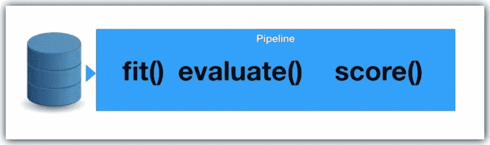
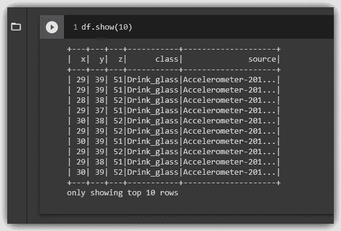

# 使用 SparkML 的大数据管道

> 原文：<https://pub.towardsai.net/big-data-pipelines-with-sparkml-8207c86fc995?source=collection_archive---------2----------------------->

## [数据分析](https://towardsai.net/p/category/data-analysis)、[数据科学](https://towardsai.net/p/category/data-science)、[机器学习](https://towardsai.net/p/category/machine-learning)

## 为大数据分析创建 Apache Spark ML 管道


照片由 [Rodion Kutsaev](https://unsplash.com/@frostroomhead?utm_source=unsplash&utm_medium=referral&utm_content=creditCopyText) 在 [Unsplash](https://unsplash.com/s/photos/pipelines?utm_source=unsplash&utm_medium=referral&utm_content=creditCopyText) 上拍摄

**管道**是一种保持数据预处理和建模代码有组织的简单方法。具体来说，管道捆绑了预处理和建模步骤，因此您可以像使用单个步骤一样使用整个捆绑包。

> 许多数据科学家在没有管道的情况下拼凑模型… ( [Kaggle](https://www.kaggle.com/alexisbcook/pipelines) )

Kaggle 还说管道有一些重要的好处，例如:

1.  **更清晰的代码:**在预处理的每一步对数据进行统计都会变得混乱。有了管道，您就不需要手动跟踪每一步的培训和验证数据。
2.  **更少的错误:**错误应用某个步骤或忘记某个预处理步骤的机会更少。
3.  更容易生产:将一个模型从原型转变成可大规模部署的东西可能会出人意料地困难，但管道可以提供帮助。
4.  **模型验证的更多选项:**我们可以轻松地将交叉验证和其他技术应用到我们的管道中。

因此，流水线是设计我们的数据预处理和机器学习流程的便利过程。在真正的 ML 开始之前，我们必须完成某些步骤。这些步骤被称为*数据预处理*和/或*特征工程。*

## 一些流水线步骤包括:

*   将分类值转换为名义值和数值
*   标准化每个维度的值的范围
*   一次性编码分类值和…
*   建模…我们在那里训练我们的 ML 算法。

管道的总体思想是，我们可以将完整的数据处理流程融合到一个单独的管道中，并且可以在下游进一步使用这个单独的管道。

## 一些管道方法:



图片来自 IBM [使用 apache-spark 的大数据可扩展机器学习](https://www.coursera.org/learn/machine-learning-big-data-apache-spark/home/welcome)

流水线作为机器学习算法有以下方法…

*   **飞度**:飞度基本开始训练
*   **评分**:评分反馈预测值。
*   **评估**:评估验证数据的模型性能。

管道的一个额外优势是我们可以*交叉验证*，也就是说，使用完全相同的管道尝试很多很多的参数。而这确实加速了算法的优化。

因此，总而言之，管道正在促进我们在机器学习方面的日常工作，因为我们可以从预定义的数据处理步骤中提取数据，我们确保一切都是一致的，我们可以根据需要切换和交换我们的算法。

> 虽然有大量的材料涵盖了机器学习的管道，但今天我们将使用***Apache SparkML***来关注大数据上的机器学习管道。

# 1.简介:

在这个练习中，我们将使用 [**HMP** 数据集](https://github.com/wchill/HMP_Dataset.git)。它基本上是附着在人体上的加速度计传感器的加速度计记录。这些数据记录了人类进行活动时的传感器，如刷牙、梳头、T21、喝汤、等等。

因此，我们应该为机器学习任务预处理这个数据集。首先，手动，然后我们将建立一个 SparkML 管道，为我们自动预处理数据集。这个管道可以应用于未来的数据集。

我使用 Colab 进行数据探索。如果你需要帮助在 Colab 中启动 Pyspark，请看这个 [*链接*](https://colab.research.google.com/github/Lawrence-Krukrubo/Advanced-Data-Science/blob/master/Spark_on_Colaboratory.ipynb) 。

所以首先，我们在 Colab 建立了 Pyspark

# 2.数据析取

请注意，数据采用的是拼花文件格式。Parquet 使用压缩和列存储，将数据布局映射到 Apache Spark 钨内存布局。

因此，我们可以看到在这个 HMP 数据集中有不同的文件夹。代表不同活动的文件夹，如*刷牙*、*喝水*、*起床睡觉*、*倒水*、*使用电话*。

例如，查看*Brush _ tooths*文件夹中的文本文件，我们可以看到用三个数字列表示的加速度计数据，我们可以称之为 *X、Y、Z* 。

```
**!head HMP_Dataset/Brush_teeth/Accelerometer-2011-04-11-13-28-18-brush_teeth-f1.txt**>>
**22 49 35 
22 49 35 
22 52 35 
22 52 35 
21 52 34**
```

让我们递归遍历 HMP 数据集中的这些文件夹，并从这些文本文件创建一个 Apache spark 数据帧。然后，我们将所有数据帧< *df.union(df2) >* 合并成一个包含所有数据的整体数据帧。

首先，让我们定义下面的数据框的模式。

*struct type 构造函数定义 Spark 数据帧的模式，指定 StructField 和 DataType。*

现在让我们使用操作系统库遍历数据。

让我们从文件列表中删除非活动文件夹。这些文件夹通常名称中没有下划线。

好的，我们将所有包含数据的文件夹放在一个数组中。现在我们可以迭代这个数组。

因此，根据上面的要点，首先，我们定义一个空的数据帧，并为进度条导入 [tqdm](https://github.com/tqdm/tqdm) 。接下来，我们导入 lit 库，它帮助我们将字符串列写入 Apache Spark 数据帧。

此时，我们所做的就是使用操作系统库遍历每个文件，将三个数字列添加到我们之前定义的 *X，Y，Z* 模式中，将它们添加到 DataFrame 中，并添加两个字符串列，一个用于加速度计读数的类别，另一个用于读数的源文件。

让我们看看数据框架的模式…

```
**df.printSchema()**>>
**root  
|-- x: integer (nullable = true)  
|-- y: integer (nullable = true)  
|-- z: integer (nullable = true)  
|-- class: string (nullable = false)  
|-- source: string (nullable = false)**
```

让我们看看数据帧的前 10 行。这需要一点时间来运行，因为正如我们所知，Apache Spark 中的数据帧总是很懒…



# 3.数据转换

现在我们需要转换数据并创建类列的整数表示，因为 ML 算法不能处理字符串。因此，我们将使用 *StringIndexer* 模块将该类转换成多个整数。

*StringIndexer* 是一个同时具有拟合和变换方法的估计器。所以我们创建一个 *StringIndexer* 对象(*索引器*)，将“ *class* 列作为 *inputCol* 传递，将“ *classIndex* 作为 *outputCol* 。然后，我们将数据帧适配到*索引器*，并转换数据帧。这创建了一个全新的 DataFrame ( ***索引*** )，我们可以在上面看到，它包含了 *classIndex* 附加列。

# 4.一键编码:

有了类索引列，我们现在可以在 Pyspark 中进行 [**一次热编码**](https://www.kaggle.com/dansbecker/using-categorical-data-with-one-hot-encoding)…

与 *StringIndexer* 不同， *OneHotEncoder* 是一个纯粹的 transformer，只有 transform 方法。它使用了与我们在 StringIndexer 中看到的' *inputCol* 和' *outputCol* 相同的语法。我们分别传递' *classIndex* '和' *categoryVec* '值。 *OneHotEncoder* 还创建了一个全新的 DataFrame ( ***编码*** )，将*'****category _ vec***列添加到之前的 DataFrame( *索引*)。

> 还有一点需要注意的是，在上面的 Git gist 中调用 **encoded.show(10，False)** ，保证显示 10 行， **False** 保证每个列元素都是完全展开的，cos 正常情况下 SparkML 压缩列单元格。

最后，众所周知，SparkML 中的 *OneHotEncoder* 不会返回几个只包含 0 和 1 的列...相反，它返回一个稀疏向量，如 *categoryVec* 列所示。因此，对于上面的' *Drink_glass* '类，SparkML 返回一个稀疏向量，基本上表示有 13 个元素，在位置 2，类值存在(1.0)。

# 5.向量汇编器:

我们需要做的下一件事是将数字列 X，Y，Z 转换成向量，因为 sparkML 只能处理向量对象。所以让我们导入*向量*和*向量汇编器*库

使用我们在 *StringIndexer* 和 *OneHotEncoder* 中使用的相同语法来初始化 *VectorAssembler* 对象。我们将列表 **['x '，' y '，' z']** 传递给 *inputCols，*并指定 *outputCol = 'features '。*这也是和 *OneHotEncoder* 一样的纯变压器。因此，我们将上一步的数据帧(*编码*)转换为新的数据帧 *(* ***特征 _ 矢量化*** *)* ，并添加了*特征*列。

> SparkML 语法的一致性令人印象深刻，它缩短了大数据爱好者的学习曲线…

# 5.标准化数据集:

因此，下一步是标准化数据集。这使得数据集中所有数值列的值范围介于 0 和 1 之间或-1 和 1 之间。这个想法是让所有的特征数据都在同一范围内，这样就不会互相影响。

我们现在肯定已经习惯了， *StringIndexer* ， *OneHotEncoder* ， *VectorAssembler，*和*规格化器*都有一致的语法。再看*规格化器*对象，它包含参数[***p = 1.0***](https://spark.apache.org/docs/1.4.1/ml-features.html)。注意 Pyspark *规格化器*的缺省范数值是[***p = 2.0***](https://spark.apache.org/docs/1.4.1/ml-features.html)。

> **p=1.0** 表示基于 [**曼哈顿距离**](https://www.sciencedirect.com/topics/mathematics/manhattan-distance#:~:text=The%20Manhattan%20distance%20between%20two,the%20%E2%80%9Ctaxi%20cab%E2%80%9D%20metric.) 对特征进行归一化。两点之间的曼哈顿距离或 **taxi-cab** 距离是这两点在特征向量中对应坐标的绝对差之和。因此，这些特征基于该度量被标准化。

当……

> **p=2.0** 表示基于 [**欧氏距离**](https://en.wikipedia.org/wiki/Euclidean_distance) 对特征进行归一化。两点之间的欧几里得距离与计算连接这两点的向量的大小完全相同。

注意，这些是聚类算法使用的相同方法，例如 *KNN* 和 *K-means，*。

> **这是中级线性代数的基础，我对初露头角的数据科学家的建议是……不要追逐你听说过的每一个花哨、闪亮的算法，而是花时间为数据科学建立一个坚实的基础，基于线性代数、统计学、概率和微积分……**

# 6.创建管道:

下面的管道构造函数接受我们传递给它的管道阶段数组。在这里，我们按照正确的顺序，一个接一个地通过了上面的 4 个阶段。

> 就是这样！在 Apache SparkML 中创建管道就像直尺一样简单…

我们定义步骤或阶段，并按逻辑顺序将它们传递给管道构造器。

现在，让我们将管道对象与原始数据框相匹配…

```
**data_model = pipeline.fit(df)**
```

最后，让我们使用 Pipeline 对象来转换我们的数据框架。

```
**pipelined_data = data_model.transform(df)**
```

让我们看看前十排…

因此，我们可以看到，已经使用管道功能创建了与之前从各个阶段创建的数据帧完全相同的数据帧。现在，我们可以一次性适应和转换我们的数据。这是一个非常方便的功能。

因此，在这一点上，我们只需删除我们不需要的其他列…

我们使用列表理解来选择我们需要的列( *categoryVec* 和 *features_norm* )，并简单地用这些列创建一个新的数据框架。

最后，我们有我们的 *categoryVec* 列，这是目标变量，还有我们的 *features_norm* 列，这是我们一直准备训练的机器学习算法的特征集...

# 总结…


照片由[卢卡·布拉沃](https://unsplash.com/@lucabravo?utm_source=unsplash&utm_medium=referral&utm_content=creditCopyText)在 [Unsplash](https://unsplash.com/s/photos/data-pipelines?utm_source=unsplash&utm_medium=referral&utm_content=creditCopyText) 上拍摄

我们已经看到了如何从数据集创建 Apache spark ML 管道。走出去，使用这些知识来构建更强大的数据和机器学习解决方案。

完整的笔记本可以在 Github 上找到[。](https://github.com/Lawrence-Krukrubo/Advanced-Data-Science/blob/master/spark_ml_pipelines.ipynb)

*Coursera 的 IBM 高级数据科学团队功不可没……*

**干杯！！**

# 关于我:

劳伦斯是技术层的数据专家，对公平和可解释的人工智能和数据科学充满热情。我相信分享知识和经验是最好的学习方式。我同时持有 IBM 的 ***数据科学专业*** *和* ***高级数据科学专业*** *证书和来自 Udacity 的****IBM*******数据科学讲解徽章、*** *以及* ***人工智能纳米学位**我已经使用 ML 和 DL 库进行了几个项目。我喜欢尽可能多地编写我的函数。最后，我从未停止学习和探索，是的，我写过几篇强烈推荐的文章。******

*请随时在以下网址找到我*

*[Github](https://github.com/Lawrence-Krukrubo)*

*[**领英**](https://www.linkedin.com/in/lawrencekrukrubo/)*

*[**推特**](https://twitter.com/LKrukrubo)*