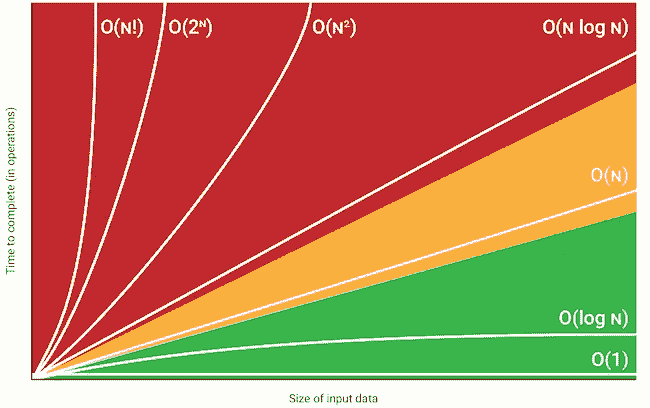

# 大 O 批注:是什么？

> 原文：<https://pub.towardsai.net/big-o-notation-what-is-it-69cfd9d5f6b8?source=collection_archive---------2----------------------->

## [编程](https://towardsai.net/p/category/programming)

Note that when evaluating the complexity of the algorithm, constants are not considered because they do not significantly affect the number of operations (when \ (n \) becomes very large). For example, if the algorithm runs in n2 order, replace n with cn to indicate that the algorithm runs in c2n2 order, and the big O notation ignores the constant c2\. For example, if the execution time of an algorithm is O (n) when measured by the number of digits n of the input number x, then when measured as a function of the input number, its execution time is O (log x). x because n = O ( log x).

Or (1) means that the algorithm needs constant time to execute regardless of the size of the input. O (1) describes an algorithm that will always be executed at the same time (or space) regardless of the size of the input data set. Big-O notation can express the best, worst, and average execution time of an algorithm. Big-O notation is the language we use to talk about the time required for an algorithm to execute (time complexity) or how much memory the algorithm uses (space complexity).

In computation, big O notation is used to classify algorithms based on how their execution time or space requirements grow as the size of the input increases. Big O notation is a mathematical notation used to classify algorithms based on how their execution time or space requirements grow as the size of the input increases. Big O notation is also used to denote the complexity of space, which works the same way: how much space the algorithm uses as n increases the relationship between increasing the input size and increasing the required space.

Since Big-O notation tells you the complexity of an algorithm in terms of the size of its input, it is important to understand Big-O if you want to know how the algorithms will scale. Knowledge of Big O is an essential tool when working with algorithms that must operate at a large scale, allowing you to make the right choices and recognize trade-offs when working with different datasets. Big-O Nation offers you a quick and easy way to communicate how performing an algorithm is. A big-O notation will allow you to measure different algorithms based on the number of steps required to complete and compare the performance of the algorithms objectively.

The diagram below shows the Big-O complexities mentioned above and the number of items in the input depending on the number of operations. The complexity is directly related to the size of the input data: the algorithm takes an extra step for each additional data item. These algorithms greatly affect the performance of each additional input element.

An algorithm with quadratic time complexity has poor scalability: if you increase the size of the input by 10 times, the time increases by 100 times. In fact, the time complexity of Th (n log n) is very close to linear: It takes about twice as long to solve a problem of twice the size. Instead, we can think of time as the number of operations or steps required to solve a problem of dimension n. In other words, Big-O notation is a way to keep track of how quickly the execution time grows relative to the size of the input. Thus, we can say that the execution time grows “by an order of the size of the input” (O (n)) or by “the order of the square of the size of the input” (O (n2)).

For big O parsing, we worry more about things growing faster as the input grows because everything else is quickly dwarfed when n gets very large. For any algorithm, Big-O analysis should be simple if we correctly define operations that depend on n — the size of the input data. In general, we have mainly used it to measure and compare the theoretical run-time complexities of algorithms for worst-case performance analysis.

This is often referred to as “constant time”. If you can create an algorithm to solve the problem in O (1), you are probably on your way. Some algorithms, such as basket sort, have a spatial complexity of O (n) but can reduce the time complexity to O (1). For example, selection sort has a spatial complexity of O (1) because it only stores the minimum value and its index for comparison, the maximum used space does not increase with the size of the input.

For example, the time complexity for an optional sort can be determined by the function f (n) = n2 / 2-n / 2, as discussed in the previous section. We can simplify the equation by eliminating the constants and all non-dominant terms. When you are calculating the great complexity of something, you are simply eliminating the constants.

Generally speaking, the constant value of 1 is rather negligible next to the value of the variable n. Then we just shorten the above expression to O (n) and there we have the Big-O print_values ​​runtime. Unlike O (N), which requires an extra step for each data item, O (log N) means that the algorithm takes an extra step every time the data is doubled.

This quick snapshot shows how the performance of the first algorithm relates to the value of n. The larger the number, the more steps the algorithm will have to perform. Generally, when you are interested in Big-O algorithm notation, you are more interested in overall performance rather than accurate step counts analysis. To simplify the notation, we can only indicate the efficiency value.

This record will allow you to measure the growth rate of your algorithm in relation to the input data. It describes the worst case for the performance of your code. Below is a cheat sheet on the temporal and spatial complexity of typical algorithms.

As you study algorithms, a number of very common order-of-magnitude functions will continually appear. If we are doing something very complex, like with a recursive function or a divide and conquer algorithm, you can use the main theorem (usually works) or, in ridiculous cases, the Acra-Bazzi theorem (almost always works) look for the execution time of your algorithm on Wikipedia. You can speed up some algorithms significantly by using caching, making them ignore the cache, avoiding bottlenecks, working from RAM instead of disk, using parallelization, or doing work ahead of time — these methods are often growth order independent. Big O notation, although you will often see the number of cores in big O notation for parallel algorithms. As a software engineer, you will find that most of the discussion on Big-O focuses on the “upper bound” on the execution time of an algorithm, which is often referred to as the worst case.

Big O specifically describes the worst-case scenario and can be used to describe the required runtime or space used (for example, Big O can also be used to describe the error term in approximating a mathematical function. Big-O notation (also called “asymptotic” growth “) is how the functions “look” when you ignore constant factors and things close to the origin. The letter “n” here represents the size of the input, and the function “g (n) = n2” inside “O ()” gives us an idea about how complex the algorithm is given the size of the input data.