# Big QueryML:数据科学家在谷歌云平台上使用 SQL 的机器学习快速入门指南

> 原文：<https://pub.towardsai.net/big-queryml-machine-learning-for-data-scientists-using-sql-on-google-cloud-platform-quick-start-d9eec7b8641?source=collection_archive---------2----------------------->

## [云计算](https://towardsai.net/p/category/cloud-computing)

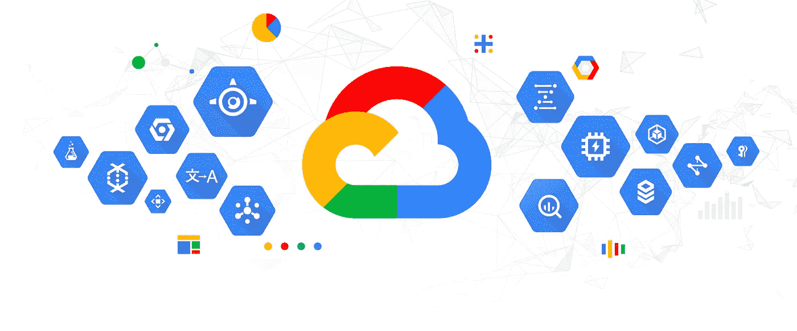

来源:[谷歌](https://blog.google/products/google-cloud/cloud-covered-what-was-new-with-google-cloud-in-october-2019/)

我希望你一切都好。这是一个迟到的帖子，因为我一直在努力保持健康。我已经通过学习新的技术和平台提升了自己的技能，并渴望与大家分享我的知识。别再浪费时间了，今天让我们学点新东西。

云计算已经存在了一段时间，但由于疫情和 IT 公司意识到了好处和权衡，采用的速度如今已经呈指数级增长。有 3 个主要的云服务提供商:AWS、微软和 GCP。

谷歌云计算服务已经存在了一段时间，但由于多种原因，比如提供的服务数量有限，其采用率一直很低。虽然谷歌已经率先在云上进行创新，例如，大数据的大表，无服务器编排的 Kubernetes，等等，但它在营销自己方面一直很慢(GCP 服务)。

也就是说，如果你是云计算的新手，不知道该学习哪个平台，你可能不会意识到其中的区别，但是在使用了所有的云服务(AWS、GCP、Azure)之后，我已经意识到了每个平台的优缺点。如果你问我，我会说 AWS 有一个优秀的云服务营销战略和技术，可以在接触客户时领先一步，而且很容易使用。谷歌云平台是一个同样成熟的生态系统，确实提供了比其他平台更快部署和创建的服务，尽管与 AWS 相比，该平台更适合极客群体，AWS 在每个步骤上都有更好的指南和文档资源。

现在，有数据背景的人会认识到数据仓库对于改进商业决策的重要性。GCP 提供了一个引人注目的数据仓库服务 BigQuery。BigQuery 允许在几秒钟内存储和查询数 Pb 的数据进行分析。

作为一名数据科学家，您现在可以使用 BigQuery 上的 SQL 直接创建和运行您的模型来回答业务问题。今天的教程就是关于这些的，所以让我们开始吧。

**先决条件:**

您需要访问 BigQuery 服务。你可以免费试用。看看这个[链接。](https://cloud.google.com/bigquery)

您还需要访问我们将创建的数据集。请注意，当您运行 SQL 查询时，big-query 会对处理的数据量收费，因此要对您查询的内容保持谨慎。

您还需要对 SQL 有所了解，才能理解查询的是什么数据。

**步骤:**

1.  打开谷歌平台控制台，导航至 BigQuery 服务:[链接](https://console.cloud.google.com/bigquery)

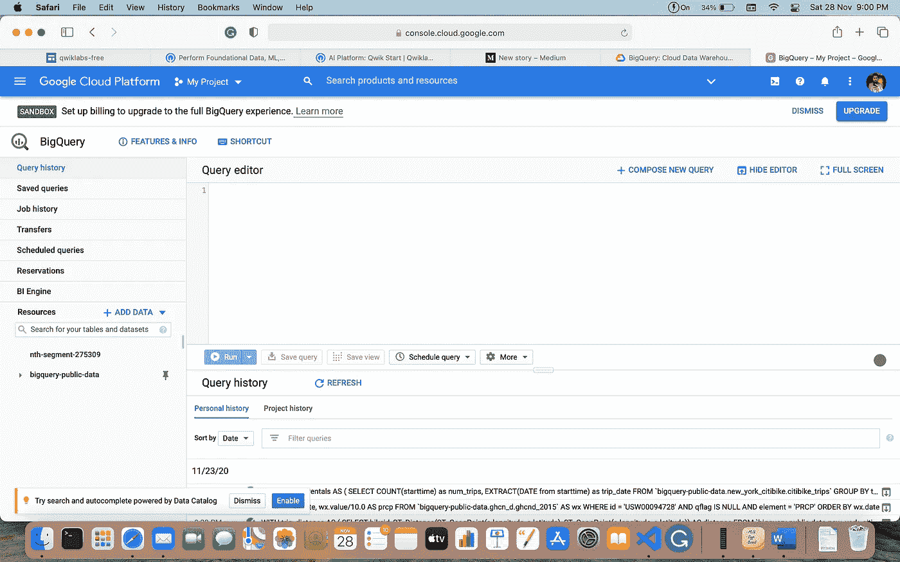

截图 1

2.点击此[链接](https://console.cloud.google.com/bigquery?p=data-to-insights&d=ecommerce&t=web_analytics&page=table)，添加数据到洞察数据集。

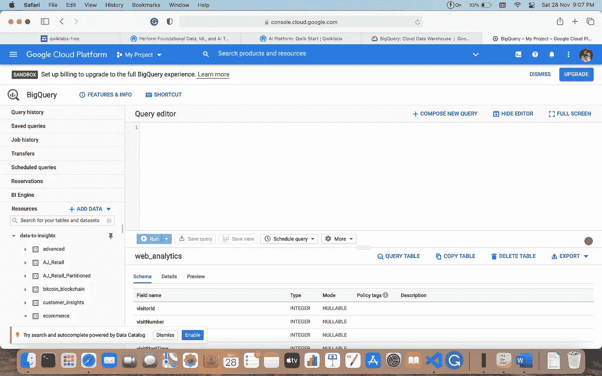

截图 2

**3。我们来做一些数据探索:**

让我们试着找出访问我们网站的所有访问者中，有百分之多少进行了购买？

在查询编辑器中粘贴以下 SQL 查询:

```
WITH visitors AS( SELECTCOUNT(DISTINCT fullVisitorId) AS total_visitorsFROM `data-to-insights.ecommerce.web_analytics`),purchasers AS(SELECTCOUNT(DISTINCT fullVisitorId) AS total_purchasersFROM `data-to-insights.ecommerce.web_analytics`WHERE totals.transactions IS NOT NULL)SELECTtotal_visitors,total_purchasers,total_purchasers / total_visitors AS conversion_rateFROM visitors, purchasers
```

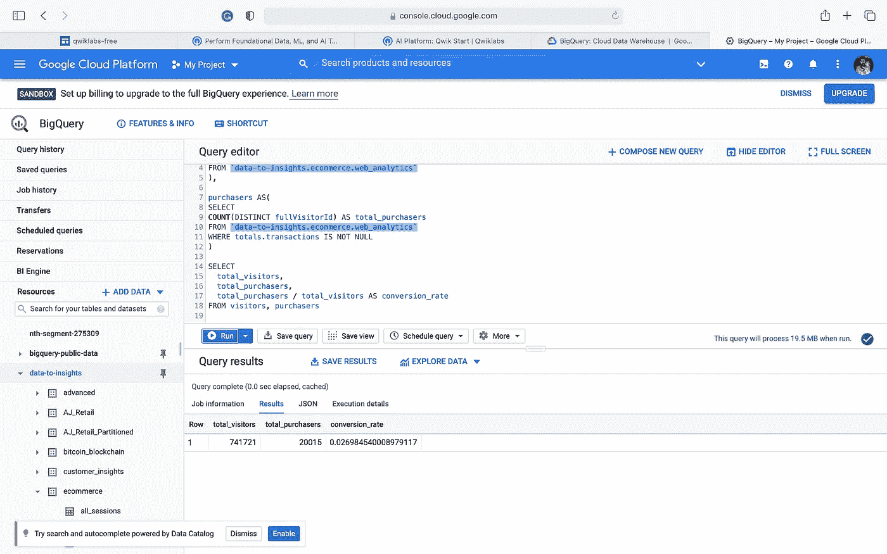

截图三

让我们试着用电子商务数据算出市场上最畅销的 5 种产品。

```
SELECTp.v2ProductName,p.v2ProductCategory,SUM(p.productQuantity) AS units_sold,ROUND(SUM(p.localProductRevenue/1000000),2) AS revenueFROM `data-to-insights.ecommerce.web_analytics`,UNNEST(hits) AS h,UNNEST(h.product) AS pGROUP BY 1, 2ORDER BY revenue DESCLIMIT 5;
```

我们不会讨论 SQL 的每一种语法，但是如果你了解 SQL，你会发现它很容易理解。UNNEST 关键字展平数组以分隔表中的记录。


截图 4

我们能回答有多少访问者在下次访问网站时购买了产品吗？

```
WITH all_visitor_stats AS (SELECTfullvisitorid, IF(COUNTIF(totals.transactions > 0 AND totals.newVisits IS NULL) > 0, 1, 0) AS will_buy_on_return_visitFROM `data-to-insights.ecommerce.web_analytics`GROUP BY fullvisitorid)SELECTCOUNT(DISTINCT fullvisitorid) AS total_visitors,will_buy_on_return_visitFROM all_visitor_statsGROUP BY will_buy_on_return_visitcontent
```

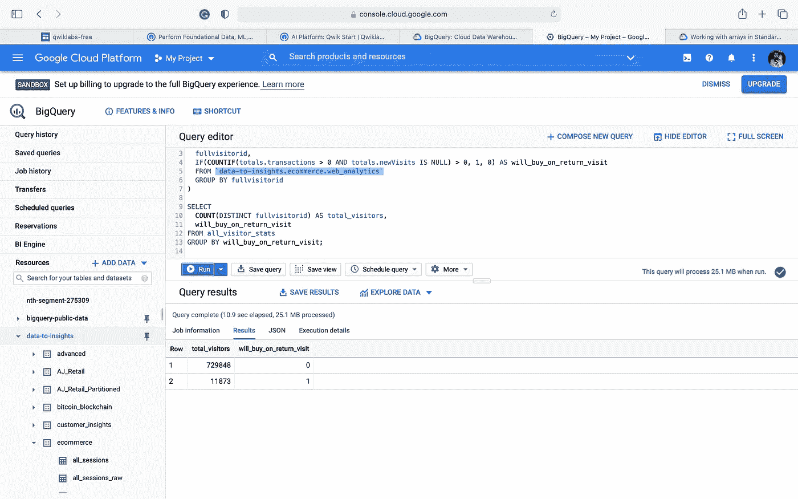

截图 5

只有一小部分访问者会再次访问来购买产品，当我们联系到现实世界的场景时，这是有意义的:你可能会访问一个网站来浏览或比较产品，但可能不会购买它们。

**4。我们来做一个特征选择来回答一个机器学习的问题:**

预测用户将来是否有可能购买。

让我们使用 big-query 中的一些特性创建一个基线模型。对于这个领域，需要专业知识或与谷歌分析电子商务数据的前期工作。假设我们现在选择两个与购买决策相关的特性，反弹和现场时间。现在，您可以添加更多功能，但这超出了我们的基础知识范围。对于我们的情况，我们需要一个逻辑回归模型。

我们将创建一个数据集，在其中保存模型。

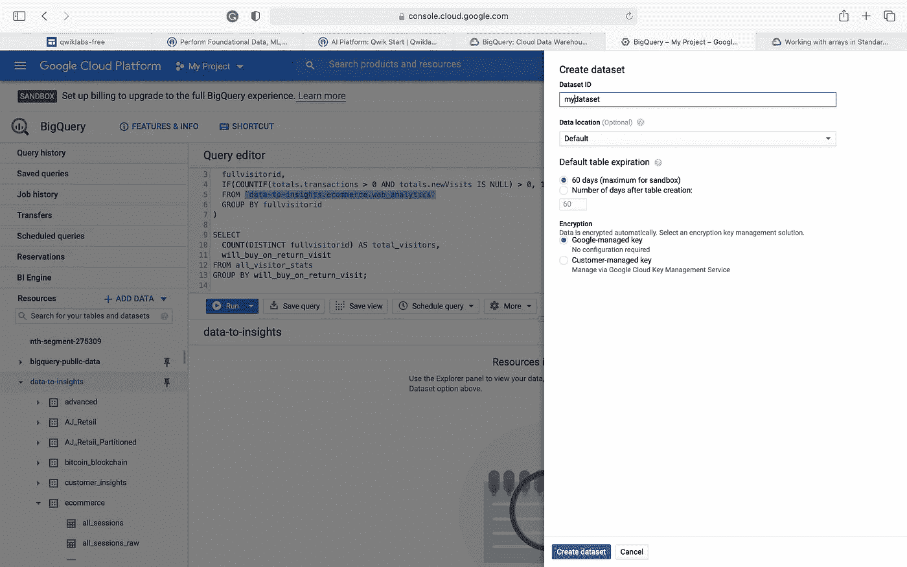

截图 6

创建数据集后，我们将创建一个逻辑回归模型。

```
CREATE OR REPLACE MODEL `mydataset.classification_model`
OPTIONS
(
model_type=’logistic_reg’,
labels = [‘will_buy_on_return_visit’]
)
AS#standardSQL
SELECT
 * EXCEPT(fullVisitorId)
FROM# features
 (SELECT
 fullVisitorId,
 IFNULL(totals.bounces, 0) AS bounces,
 IFNULL(totals.timeOnSite, 0) AS time_on_site
 FROM
 `data-to-insights.ecommerce.web_analytics`
 WHERE
 totals.newVisits = 1
 AND date BETWEEN ‘20160801’ AND ‘20170430’) # train on first 9 months
 JOIN
 (SELECT
 fullvisitorid,
 IF(COUNTIF(totals.transactions > 0 AND totals.newVisits IS NULL) > 0, 1, 0) AS will_buy_on_return_visit
 FROM
 `data-to-insights.ecommerce.web_analytics`
 GROUP BY fullvisitorid)
 USING (fullVisitorId);
```

一旦创建了模型，您就可以探索这个模型了。

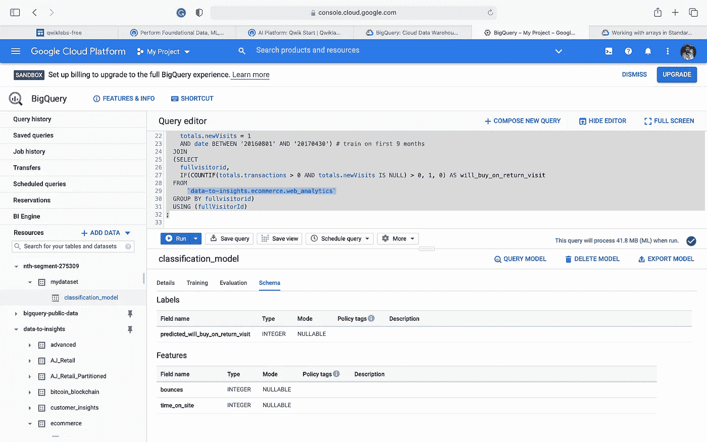

截图 7

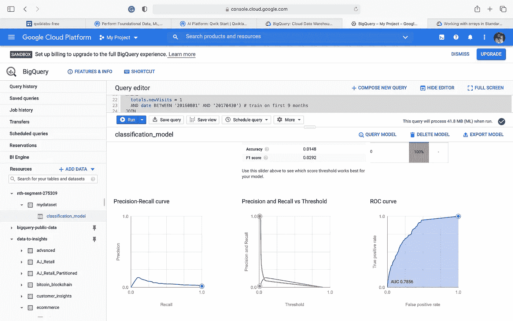

截图 8

**5。模型评估:**

您可以使用以下查询并检查 roc_auc 来评估模型。

```
SELECT
 roc_auc,
 CASE
 WHEN roc_auc > .9 THEN ‘good’
 WHEN roc_auc > .8 THEN ‘fair’
 WHEN roc_auc > .7 THEN ‘not great’
 ELSE ‘poor’ END AS model_quality
FROM
 ML.EVALUATE(MODEL mydataset.classification_model, (SELECT
 * EXCEPT(fullVisitorId)
FROM# features
 (SELECT
 fullVisitorId,
 IFNULL(totals.bounces, 0) AS bounces,
 IFNULL(totals.timeOnSite, 0) AS time_on_site
 FROM
 `data-to-insights.ecommerce.web_analytics`
 WHERE
 totals.newVisits = 1
 AND date BETWEEN ‘20170501’ AND ‘20170630’) # eval on 2 months
 JOIN
 (SELECT
 fullvisitorid,
 IF(COUNTIF(totals.transactions > 0 AND totals.newVisits IS NULL) > 0, 1, 0) AS will_buy_on_return_visit
 FROM
 `data-to-insights.ecommerce.web_analytics`
 GROUP BY fullvisitorid)
 USING (fullVisitorId)));
```

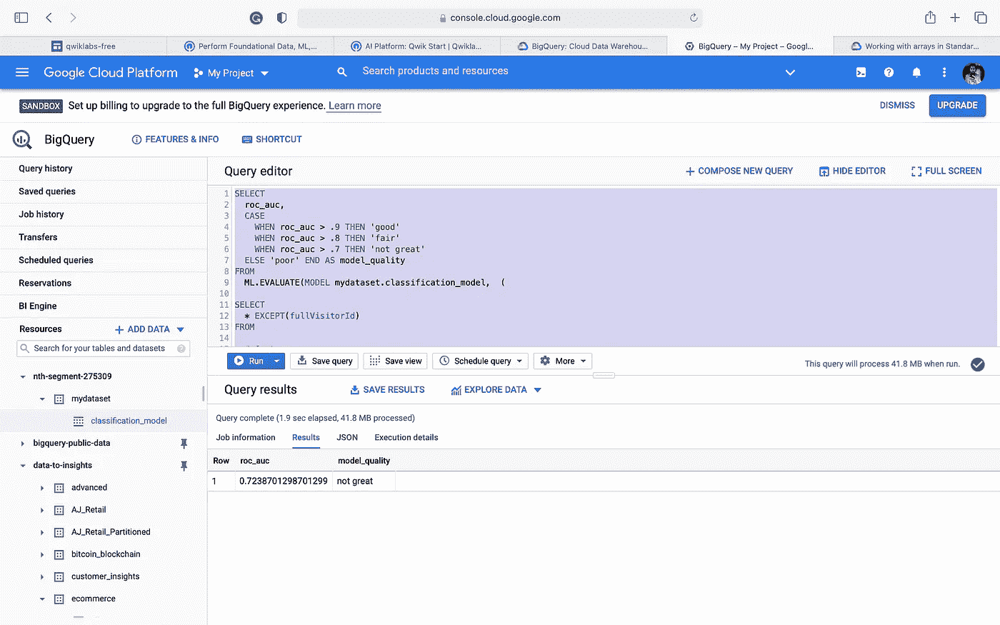

截图 9

**6。特征工程:**

现在，我们可以尝试通过添加更多的功能来改进该模型。

```
CREATE OR REPLACE MODEL `mydataset.classification_model_2`
OPTIONS
 (model_type=’logistic_reg’, labels = [‘will_buy_on_return_visit’]) ASWITH all_visitor_stats AS (
SELECT
 fullvisitorid,
 IF(COUNTIF(totals.transactions > 0 AND totals.newVisits IS NULL) > 0, 1, 0) AS will_buy_on_return_visit
 FROM `data-to-insights.ecommerce.web_analytics`
 GROUP BY fullvisitorid
)# add in new features
SELECT * EXCEPT(unique_session_id) FROM (SELECT
 CONCAT(fullvisitorid, CAST(visitId AS STRING)) AS unique_session_id,# labels
 will_buy_on_return_visit,MAX(CAST(h.eCommerceAction.action_type AS INT64)) AS latest_ecommerce_progress,# behavior on the site
 IFNULL(totals.bounces, 0) AS bounces,
 IFNULL(totals.timeOnSite, 0) AS time_on_site,
 totals.pageviews,# where the visitor came from
 trafficSource.source,
 trafficSource.medium,
 channelGrouping,# mobile or desktop
 device.deviceCategory,# geographic
 IFNULL(geoNetwork.country, “”) AS countryFROM `data-to-insights.ecommerce.web_analytics`,
 UNNEST(hits) AS hJOIN all_visitor_stats USING(fullvisitorid)WHERE 1=1
 # only predict for new visits
 AND totals.newVisits = 1
 AND date BETWEEN ‘20160801’ AND ‘20170430’ # train 9 monthsGROUP BY
 unique_session_id,
 will_buy_on_return_visit,
 bounces,
 time_on_site,
 totals.pageviews,
 trafficSource.source,
 trafficSource.medium,
 channelGrouping,
 device.deviceCategory,
 country
);
```

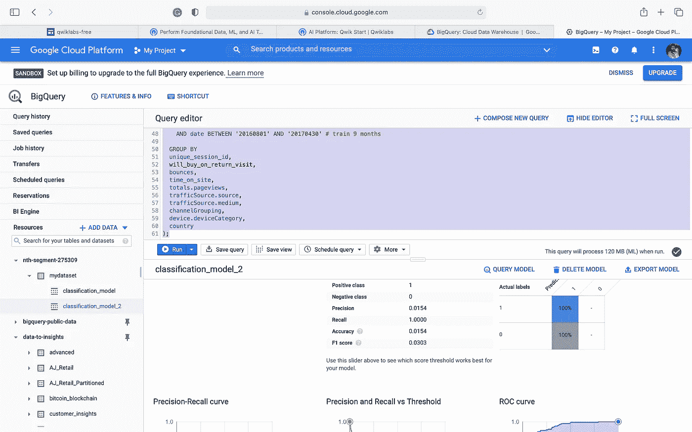

截图 10

我们来评价一下模型。

```
SELECT
 roc_auc,
 CASE
 WHEN roc_auc > .9 THEN ‘good’
 WHEN roc_auc > .8 THEN ‘fair’
 WHEN roc_auc > .7 THEN ‘not great’
 ELSE ‘poor’ END AS model_quality
FROM
 ML.EVALUATE(MODEL mydataset.classification_model_2, (WITH all_visitor_stats AS (
SELECT
 fullvisitorid,
 IF(COUNTIF(totals.transactions > 0 AND totals.newVisits IS NULL) > 0, 1, 0) AS will_buy_on_return_visit
 FROM `data-to-insights.ecommerce.web_analytics`
 GROUP BY fullvisitorid
)# add in new features
SELECT * EXCEPT(unique_session_id) FROM (SELECT
 CONCAT(fullvisitorid, CAST(visitId AS STRING)) AS unique_session_id,# labels
 will_buy_on_return_visit,MAX(CAST(h.eCommerceAction.action_type AS INT64)) AS latest_ecommerce_progress,# behavior on the site
 IFNULL(totals.bounces, 0) AS bounces,
 IFNULL(totals.timeOnSite, 0) AS time_on_site,
 totals.pageviews,# where the visitor came from
 trafficSource.source,
 trafficSource.medium,
 channelGrouping,# mobile or desktop
 device.deviceCategory,# geographic
 IFNULL(geoNetwork.country, “”) AS countryFROM `data-to-insights.ecommerce.web_analytics`,
 UNNEST(hits) AS hJOIN all_visitor_stats USING(fullvisitorid)WHERE 1=1
 # only predict for new visits
 AND totals.newVisits = 1
 AND date BETWEEN ‘20170501’ AND ‘20170630’ # eval 2 monthsGROUP BY
 unique_session_id,
 will_buy_on_return_visit,
 bounces,
 time_on_site,
 totals.pageviews,
 trafficSource.source,
 trafficSource.medium,
 channelGrouping,
 device.deviceCategory,
 country
)
));
```

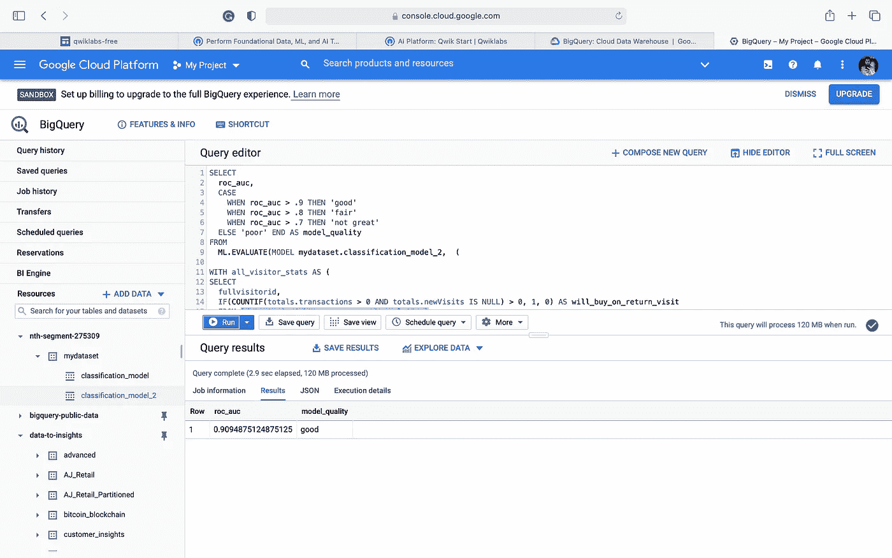

截图 11

模型改进了很多。

**7。预测:**

现在我们来预测一下所有会成为顾客的新访客。

```
SELECT*FROMml.PREDICT(MODEL `ecommerce.classification_model_2`,(WITH all_visitor_stats AS (SELECTfullvisitorid,IF(COUNTIF(totals.transactions > 0 AND totals.newVisits IS NULL) > 0, 1, 0) AS will_buy_on_return_visitFROM `data-to-insights.ecommerce.web_analytics`GROUP BY fullvisitorid)SELECTCONCAT(fullvisitorid, ‘-’,CAST(visitId AS STRING)) AS unique_session_id,*# labels*will_buy_on_return_visit,MAX(CAST(h.eCommerceAction.action_type AS INT64)) AS latest_ecommerce_progress,*# behavior on the site*IFNULL(totals.bounces, 0) AS bounces,IFNULL(totals.timeOnSite, 0) AS time_on_site,totals.pageviews,*# where the visitor came from*trafficSource.source,trafficSource.medium,channelGrouping,*# mobile or desktop*device.deviceCategory,*# geographic*IFNULL(geoNetwork.country, “”) AS countryFROM `data-to-insights.ecommerce.web_analytics`,UNNEST(hits) AS hJOIN all_visitor_stats USING(fullvisitorid)WHERE*# only predict for new visits*totals.newVisits = 1AND date BETWEEN ‘20170701’ AND ‘20170801’ *# test 1 month*GROUP BYunique_session_id,will_buy_on_return_visit,bounces,time_on_site,totals.pageviews,trafficSource.source,trafficSource.medium,channelGrouping,device.deviceCategory,country))ORDER BYpredicted_will_buy_on_return_visit DESC;
```

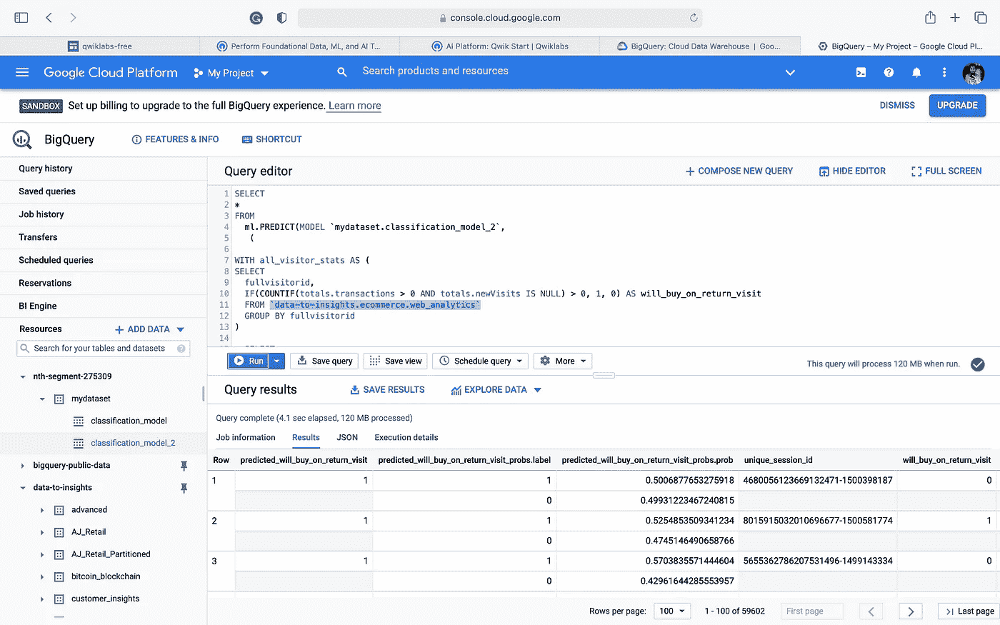

截图 12

是不是很轻松很好玩？

我希望你喜欢这篇文章。如果您有任何疑问或建议，请让我知道您的想法，我们希望听到更多您的意见。敬请关注未来的帖子。

你可以关注我关于人工智能/机器学习、数据分析和商业智能的教程。你可以在 [LinkedIn](https://www.linkedin.com/in/anurag-bisht-39935a59/) 上联系我。